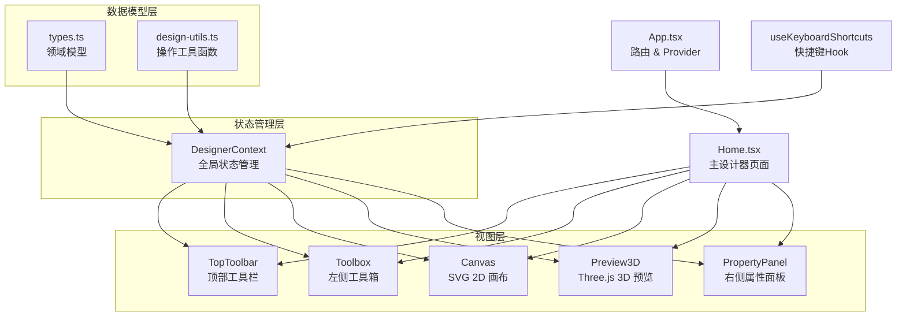

# 架构文档 — 画门窗设计器 (windoor-designer)

> 本文档由 Manus 自动生成和维护。最后更新于：2026-03-02

## 1. 项目概述

**画门窗设计器**是一款面向门窗行业的专业 CAD 级 Web 应用，用于在浏览器中完成门窗的 2D 绘图设计与 3D 实时预览。用户可以通过可视化画布创建外框、添加中梃（竖向/横向分隔条）、设置开启扇类型、选择型材颜色，并实时查看尺寸标注和 3D 渲染效果。

项目采用纯前端静态架构（web-static），无后端服务，所有设计数据在浏览器端通过 React Context + useReducer 管理，支持撤销/恢复操作历史。部署为静态站点，通过 Nginx 在 `http://8.140.238.44/windows/` 路径提供服务。

**核心能力：**

- 2D SVG 画布绘图（工业蓝图风格，含网格背景、3D 立体型材效果、尺寸标注）
- 3D 实时预览（基于 Three.js / React Three Fiber，支持旋转、缩放、平移）
- 5 种预设窗型模板（单扇、两等分、三等分、上下分、田字格）
- 10 种开启方式（固定、左/右内开、上/下悬、左/右内开内倒、左/右推拉、折叠）
- 8 种型材颜色预设
- 中梃拖拽调整位置
- 完整的撤销/恢复历史
- 键盘快捷键支持

## 2. 技术栈

| 分类 | 技术 | 版本/说明 |
| :--- | :--- | :--- |
| **前端框架** | React | 19.1.1 |
| **构建工具** | Vite | 7.x |
| **CSS 框架** | Tailwind CSS | 4.x（通过 @tailwindcss/vite 插件） |
| **UI 组件库** | shadcn/ui (Radix UI) | 基于 Radix 原语的定制组件 |
| **路由** | Wouter | 轻量级 React 路由 |
| **3D 渲染** | Three.js + @react-three/fiber + @react-three/drei | 3D 预览引擎 |
| **编程语言** | TypeScript | 5.x |
| **包管理器** | pnpm | — |
| **字体** | JetBrains Mono + Noto Sans SC | Google Fonts CDN |
| **图标** | Lucide React | — |
| **通知** | Sonner | Toast 通知 |
| **部署环境** | Nginx (静态站点) | 服务器 8.140.238.44，路径 /windows/ |

## 3. 目录结构

```
windoor-designer/
├── client/
│   ├── index.html                    # HTML 入口（引入 Google Fonts）
│   ├── public/                       # 静态配置文件（favicon 等）
│   └── src/
│       ├── main.tsx                  # React 入口点
│       ├── App.tsx                   # 路由配置 & 全局 Provider
│       ├── index.css                 # 全局样式 & Tailwind 主题变量
│       ├── const.ts                  # 共享常量
│       ├── pages/
│       │   ├── Home.tsx              # 主设计器页面（集成所有面板）
│       │   └── NotFound.tsx          # 404 页面
│       ├── components/
│       │   ├── Canvas.tsx            # SVG 2D 画布渲染引擎（核心）
│       │   ├── Preview3D.tsx         # Three.js 3D 预览组件
│       │   ├── TopToolbar.tsx        # 顶部工具栏（模板选择、视图切换）
│       │   ├── Toolbox.tsx           # 左侧工具箱（绘图工具、扇类型）
│       │   ├── PropertyPanel.tsx     # 右侧属性面板（尺寸、颜色、扇设置）
│       │   ├── ErrorBoundary.tsx     # 错误边界组件
│       │   └── ui/                   # shadcn/ui 基础组件（40+ 个）
│       ├── contexts/
│       │   ├── DesignerContext.tsx    # 设计器全局状态（核心状态管理）
│       │   └── ThemeContext.tsx       # 主题上下文（亮/暗模式）
│       ├── hooks/
│       │   ├── useKeyboardShortcuts.ts  # 键盘快捷键
│       │   ├── useComposition.ts     # 输入法组合状态
│       │   ├── useMobile.tsx         # 移动端检测
│       │   └── usePersistFn.ts       # 持久化函数引用
│       └── lib/
│           ├── types.ts              # 核心数据模型类型定义
│           ├── design-utils.ts       # 设计数据操作工具函数
│           └── utils.ts              # 通用工具（cn 等）
├── server/                           # 占位目录（纯前端项目，无后端）
├── shared/                           # 占位目录（共享常量）
├── dist/public/                      # 构建产物输出目录
├── package.json
├── vite.config.ts
├── tsconfig.json
└── ARCHITECTURE.md                   # 本文档
```

### 关键目录说明

| 目录/文件 | 主要功能 |
| :--- | :--- |
| `client/src/pages/Home.tsx` | 主设计器页面，组装画布、工具箱、属性面板、3D 预览 |
| `client/src/components/Canvas.tsx` | SVG 2D 画布渲染引擎，含网格、外框、中梃、玻璃、尺寸标注 |
| `client/src/components/Preview3D.tsx` | Three.js 3D 实时预览，将 2D 设计数据转换为 3D 几何体 |
| `client/src/contexts/DesignerContext.tsx` | 全局状态管理中枢（useReducer 模式，20+ 种 Action） |
| `client/src/lib/types.ts` | 核心领域模型定义（Frame、Cell、Mullion、Sash 等） |
| `client/src/lib/design-utils.ts` | 设计数据操作函数（创建框架、添加中梃、设置扇等） |
| `client/src/hooks/useKeyboardShortcuts.ts` | 键盘快捷键绑定（V/F/M/H/S/G/D 切换工具，Ctrl+Z/Y 撤销恢复） |

## 4. 核心模块与数据流

### 4.1. 模块关系图 (Mermaid)



### 4.2. 主要数据流

**核心数据模型（树形结构）：**

```
DesignData
├── id, windowCode, quantity, remark
├── color: ColorConfig
└── frame: Frame
    ├── width, height, frameWidth, shape
    └── rootCell: Cell (递归树)
        ├── rect: { x, y, width, height }
        ├── sash?: Sash (开启方式)
        ├── filling: Filling (填充物)
        ├── glazingBar?: GlazingBar (格条)
        ├── mullions: Mullion[] (中梃列表)
        └── children: Cell[] (子区域)
```

**状态管理流程：**

1. **用户操作** → 触发 `dispatch(action)` 到 `DesignerContext`
2. **Reducer 处理** → 根据 Action 类型更新 `DesignerState`（含 `design` + `canvas` + `history`）
3. **历史快照** → 每次修改设计数据前，自动推入 `history` 栈（支持撤销/恢复）
4. **视图更新** → React 自动重新渲染受影响的组件（Canvas / Preview3D / PropertyPanel）

**Action 类型一览（20 种）：**

| Action | 说明 | 是否记录历史 |
| :--- | :--- | :--- |
| `SET_TOOL` | 切换当前工具 | 否 |
| `SELECT_CELL` | 选中/取消选中 Cell | 否 |
| `SET_ZOOM` / `SET_PAN` | 画布缩放/平移 | 否 |
| `CREATE_FRAME` | 创建新外框 | 是 |
| `ADD_MULLION` | 添加中梃 | 是 |
| `SET_SASH` | 设置开启方式 | 是 |
| `UPDATE_MULLION_POSITION` | 拖拽中梃位置 | 否（拖拽结束时记录） |
| `SET_FRAME_SIZE` | 修改外框尺寸（等比缩放内部） | 是 |
| `SET_COLOR` | 设置型材颜色 | 是 |
| `APPLY_TEMPLATE` | 应用预设模板 | 是 |
| `CLEAR_CANVAS` | 清除画布 | 是 |
| `UNDO` / `REDO` | 撤销/恢复 | — |

### 4.3. 2D 渲染流程

Canvas 组件采用 SVG 渲染，分层结构如下（从底到顶）：

1. **GridBackground** — 20px 小网格 + 100px 大网格
2. **CellRenderer** — 玻璃区域填充 + 扇标记（X 形对角线 + 方向箭头）+ 选中高亮
3. **MullionRenderer** — 中梃型材（含 3D 光影效果）+ 拖拽热区
4. **FrameRenderer** — 外框四条型材（含高光/暗部模拟 3D 效果）
5. **DimensionAnnotations** — 红色尺寸标注（总尺寸 + 分段尺寸）

### 4.4. 3D 预览流程

Preview3D 组件使用 React Three Fiber 将 2D 设计数据转换为 3D 几何体：

- `FrameMesh` — 外框四条 boxGeometry（金属材质，roughness=0.3, metalness=0.6）
- `GlassMesh` — 玻璃 boxGeometry（物理材质，transmission=0.8, ior=1.5）
- `MullionMesh` — 中梃递归渲染
- `SashMesh` — 扇框四条 boxGeometry
- 场景包含 OrbitControls、ContactShadows、Environment(studio) 等

## 5. API 端点 (Endpoints)

本项目为纯前端静态应用，**无后端 API 端点**。所有数据操作在浏览器端完成。

## 6. 外部依赖与集成

| 服务/库 | 用途 | 集成方式 |
| :--- | :--- | :--- |
| Google Fonts | 字体加载（JetBrains Mono + Noto Sans SC） | CDN link 标签 |
| Three.js | 3D 渲染引擎 | npm 包 |
| @react-three/fiber | React 绑定 Three.js | npm 包 |
| @react-three/drei | Three.js 辅助组件（OrbitControls 等） | npm 包 |
| Radix UI | 无障碍 UI 原语 | npm 包（通过 shadcn/ui） |
| Lucide | 图标库 | npm 包 |

## 7. 环境变量

本项目为纯前端静态应用，核心功能不依赖环境变量。以下为构建/部署相关变量：

| 变量名 | 描述 | 示例值 |
| :--- | :--- | :--- |
| `BASE_URL` | Vite 构建 base 路径 | `/windows/`（部署时通过 `--base` 参数设置） |
| `VITE_APP_TITLE` | 应用标题 | `画门窗设计器` |

## 8. 项目进度

> 记录项目从开始到现在已经完成的所有工作，每次新增追加到末尾。

| 完成日期 | 完成的功能/工作 | 说明 |
| :--- | :--- | :--- |
| 2026-03-01 | 项目初始化与设计方案 | 确定工业蓝图设计风格，完成 ideas.md 设计方案 |
| 2026-03-01 | 核心数据模型定义 | 定义 Frame、Cell、Mullion、Sash 等完整类型体系（types.ts） |
| 2026-03-01 | 设计数据操作工具函数 | 实现 createDefaultFrame、addMullionToCell、setSashOnCell 等（design-utils.ts） |
| 2026-03-01 | 全局状态管理 | 基于 useReducer 实现 DesignerContext，支持 20 种 Action + 撤销/恢复历史 |
| 2026-03-01 | SVG 2D 画布渲染引擎 | 实现 Canvas 组件：网格背景、外框型材 3D 效果、玻璃区域、中梃渲染、尺寸标注 |
| 2026-03-01 | 3D 实时预览 | 基于 Three.js / React Three Fiber 实现 Preview3D，支持旋转/缩放/平移 |
| 2026-03-01 | 顶部工具栏 | 实现 TopToolbar：5 种预设模板（单扇/两等分/三等分/上下分/田字格）、2D/3D 切换、缩放控制 |
| 2026-03-01 | 左侧工具箱 | 实现 Toolbox：8 种绘图工具、7 种扇类型选择弹出面板、撤销/恢复/清除按钮 |
| 2026-03-01 | 右侧属性面板 | 实现 PropertyPanel：基本信息编辑、外框尺寸修改、8 色预设、选中区域属性、开启方式下拉 |
| 2026-03-01 | 键盘快捷键 | 实现 useKeyboardShortcuts：V/F/M/H/S/G/D 工具切换、Ctrl+Z/Y 撤销恢复、Escape 取消 |
| 2026-03-01 | 中梃拖拽功能 | 支持鼠标拖拽调整中梃位置，实时更新画布 |
| 2026-03-01 | 玻璃区域点击选中 | 修复 select 工具模式下的点击选中逻辑，支持蓝色高亮反馈 |
| 2026-03-01 | 画布缩放与平移 | 滚轮缩放 + 中键拖拽平移，画布自适应容器大小 |
| 2026-03-01 | 部署到服务器 | 构建产物部署到 Nginx 服务器 http://8.140.238.44/windows/，修复 base 路径和路由问题 |
| 2026-03-02 | 产品文档体系优化 | 归档冗余文档，建立统一索引，确立 PRD_V3 为单一事实来源 |
| 2026-03-02 | PRD V4.0 深度补齐 | 修复 36 项缺失：新增多租户隔离、算料引擎 DSL、下料优化算法、订单变更/退款/安装/售后流程、AI炫图/阳光房/AR/设备对接模块、数据模型修正、通知系统、API规范、UX设计规格 |
| 2026-03-02 | PRD V5.0 结构性重构 | 第二轮深度审查发现 23 项新短板后，将所有补充文档深度整合为统一的 PRD_V5.md（21 章、14 模块），新增组合窗设计、完整权限矩阵、采购/BOM/质量/排程模块、报表中心、报价折扣体系、数据迁移方案等 |

## 9. 更新日志

| 日期 | 变更类型 | 描述 |
| :--- | :--- | :--- |
| 2026-03-01 | 初始化 | 创建项目架构文档 |
| 2026-03-01 | 新增功能 | 完成画门窗设计器核心功能：2D 画布、3D 预览、工具箱、属性面板、模板系统 |
| 2026-03-01 | 修复缺陷 | 修复玻璃区域点击选中逻辑、Nginx 重复 location 配置、Vite base 路径问题 |
| 2026-03-01 | 配置变更 | 部署到服务器 8.140.238.44/windows/，配置 Wouter 路由 base 适配子路径 |
| 2026-03-02 | 文档更新 | 归档冗余产品文档，建立 docs/README.md 索引，确立单一事实来源 |
| 2026-03-02 | 文档更新 | PRD 升级至 V4.0，新增 5 份补充规格书（docs/supplements/），覆盖 36 项缺失 |
| 2026-03-02 | 文档更新 | PRD 升级至 V5.0，完成结构性重构，将所有补充内容深度整合为统一文档，新增 7 个业务模块定义 |

*变更类型：`新增功能` / `优化重构` / `修复缺陷` / `配置变更` / `文档更新` / `依赖升级` / `初始化`*

## 10. 快速开发规划（团队视角）

> 以下为软件负责人视角的团队开发规划，假设有一个 3-5 人小团队。

### 10.1. 当前状态评估

项目已完成 **MVP 阶段**（最小可行产品），核心的画图功能已可用。但距离生产级产品仍有较大差距，主要缺口集中在以下方面：

| 维度 | 当前状态 | 目标状态 |
| :--- | :--- | :--- |
| 数据持久化 | 无（刷新即丢失） | 本地存储 + 云端同步 |
| 算料功能 | 无 | 自动计算型材/玻璃/五金用量 |
| 导出能力 | 无 | PDF/图片/DXF 导出 |
| 型材系统 | 硬编码 60mm | 可配置型材库 |
| 五金配件 | 无 | 把手、铰链、锁点等配件系统 |
| 报价功能 | 无 | 基于算料结果自动报价 |
| 多窗管理 | 单窗设计 | 项目级多窗管理 |

### 10.2. Sprint 规划（按优先级排序）

**Sprint 1（1-2 周）— 数据持久化 + 导出**

| 任务 | 负责人 | 工时 |
| :--- | :--- | :--- |
| localStorage 自动保存/恢复设计数据 | 前端 A | 1d |
| 导出为 PNG/SVG 图片 | 前端 A | 2d |
| 导出为 PDF（含尺寸标注） | 前端 B | 2d |
| 多窗设计列表管理（新建/复制/删除） | 前端 B | 2d |

**Sprint 2（2-3 周）— 算料引擎**

| 任务 | 负责人 | 工时 |
| :--- | :--- | :--- |
| 型材库数据结构设计（系列/规格/截面） | 全栈 | 2d |
| 算料引擎核心（遍历 Cell 树计算型材切割长度） | 全栈 | 3d |
| 玻璃面积计算（考虑扇框扣减） | 前端 A | 1d |
| 五金配件自动匹配（基于扇类型和尺寸） | 前端 B | 2d |
| 材料清单 UI（表格展示 + 汇总） | 前端 A | 2d |

**Sprint 3（2 周）— 型材系统 + 五金配件**

| 任务 | 负责人 | 工时 |
| :--- | :--- | :--- |
| 型材系列管理 UI（50/55/60/65/70 系列） | 前端 A | 2d |
| 型材截面参数配置 | 全栈 | 2d |
| 五金配件库（把手、铰链、锁点、滑轮等） | 前端 B | 3d |
| 配件在 2D/3D 中的可视化标记 | 前端 A | 2d |

**Sprint 4（2 周）— 报价 + 后端**

| 任务 | 负责人 | 工时 |
| :--- | :--- | :--- |
| 升级为全栈项目（web-db-user） | 全栈 | 1d |
| 用户认证（登录/注册） | 全栈 | 2d |
| 设计数据云端存储 | 全栈 | 2d |
| 报价模块（单价配置 + 自动计算） | 前端 B | 3d |
| 报价单 PDF 导出 | 前端 A | 2d |

### 10.3. 技术债务清单

| 优先级 | 问题 | 建议方案 |
| :--- | :--- | :--- |
| 高 | 构建产物 1.7MB 单 chunk | 使用 dynamic import 拆分 Three.js 相关代码 |
| 高 | 缩放快捷键 +/- 未正确实现 | 修复 useKeyboardShortcuts 中的 SET_ZOOM 逻辑 |
| 中 | Delete/Backspace 删除功能未实现 | 实现删除选中中梃/扇的 Action |
| 中 | 格条(glazing_bar)和填充物(filling)工具未实现 | 补充对应的 UI 和 Action |
| 中 | 标线(dimension)工具未实现 | 补充自定义标注线功能 |
| 低 | 3D 预览中扇的开启动画 | 添加扇旋转动画效果 |
| 低 | 移动端适配 | 触摸事件支持 + 响应式布局 |

---

*此文档旨在提供项目架构的快照，具体实现细节请参考源代码。*
