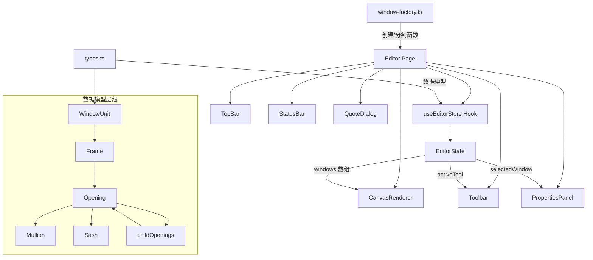

# WindoorDesigner 项目架构文档

> **最后更新于**: 2026-03-01

## 1. 项目概述

WindoorDesigner 是一款基于 Web 的门窗设计软件，提供 2D 绘图编辑器，支持门窗外框绘制、中梃/横档分割、扇类型配置、预设窗型模板、尺寸标注、报价单生成等核心功能。产品定位为门窗行业的设计与报价一体化工具。

## 2. 技术栈

| 类别 | 技术 | 版本 | 说明 |
|------|------|------|------|
| 前端框架 | React | 19.x | 核心 UI 框架 |
| 路由 | Wouter | 3.x | 轻量级客户端路由 |
| 样式 | Tailwind CSS | 4.x | 原子化 CSS 框架 |
| UI 组件库 | shadcn/ui + Radix UI | - | 基础 UI 组件 |
| 动画 | Framer Motion | 12.x | 交互动画 |
| 图表 | Recharts | 2.x | 数据可视化（备用） |
| 构建工具 | Vite | 7.x | 开发服务器与构建 |
| 语言 | TypeScript | 5.6 | 类型安全 |
| ID 生成 | nanoid | 5.x | 唯一标识符生成 |
| 通知 | Sonner | 2.x | Toast 通知 |
| 字体 | JetBrains Mono + Inter | - | 等宽数值 + UI 标签 |

## 3. 目录结构

```
windoor-designer/
├── client/
│   ├── index.html                    # HTML 入口
│   ├── public/                       # 静态配置文件
│   └── src/
│       ├── main.tsx                  # React 入口
│       ├── App.tsx                   # 路由与全局 Provider
│       ├── index.css                 # 全局样式与设计令牌
│       ├── components/
│       │   ├── CanvasRenderer.tsx     # Canvas 2D 渲染引擎
│       │   ├── Toolbar.tsx           # 左侧工具栏
│       │   ├── PropertiesPanel.tsx   # 右侧属性面板
│       │   ├── TopBar.tsx            # 顶部菜单栏
│       │   ├── StatusBar.tsx         # 底部状态栏
│       │   ├── QuoteDialog.tsx       # 报价单对话框
│       │   ├── MobileToolbar.tsx     # 移动端底部工具栏
│       │   ├── MobilePropertiesDrawer.tsx # 移动端属性抽屉面板
│       │   ├── ErrorBoundary.tsx     # 错误边界
│       │   └── ui/                   # shadcn/ui 基础组件
│       ├── contexts/
│       │   └── ThemeContext.tsx       # 主题上下文
│       ├── hooks/
│       │   ├── useEditorStore.ts     # 编辑器状态管理
│       │   ├── useIsMobile.ts       # 响应式设备检测
│       │   └── useTouch.ts          # 触摸事件处理
│       ├── lib/
│       │   ├── types.ts              # 核心数据模型与类型定义
│       │   ├── window-factory.ts     # 窗口工厂函数与预设模板
│       │   └── utils.ts             # 通用工具函数
│       └── pages/
│           ├── Editor.tsx            # 主编辑器页面
│           ├── Home.tsx              # 首页（未使用）
│           └── NotFound.tsx          # 404 页面
├── server/
│   └── index.ts                      # 静态文件服务（生产模式）
├── shared/
│   └── const.ts                      # 共享常量
├── package.json
├── tsconfig.json
└── ARCHITECTURE.md
```

## 4. 核心模块与数据流



### 4.1 数据模型层级

门窗数据采用树形嵌套结构：

| 层级 | 对象 | 说明 |
|------|------|------|
| 1 | `WindowUnit` | 顶层窗口对象，包含尺寸、位置、型材系列 |
| 2 | `Frame` | 外框，定义形状和型材宽度 |
| 3 | `Opening` | 分格区域，可递归分割 |
| 4 | `Mullion` | 中梃/横档，定义分割位置和方向 |
| 4 | `Sash` | 扇，定义开启类型（固定/平开/推拉/上悬） |
| 4 | `Glass` | 玻璃，定义类型和厚度 |

### 4.2 状态管理

`useEditorStore` 是核心状态管理 Hook，采用 `useState` + `useCallback` 模式：

- **EditorState**: 包含 windows 数组、选中状态、工具状态、视口参数
- **历史记录**: 使用 `useRef` 维护 undo/redo 栈（最多 50 步）
- **不可变更新**: 所有状态修改通过浅拷贝实现，深层嵌套对象使用 `JSON.parse(JSON.stringify())` 深拷贝

### 4.3 渲染引擎

`CanvasRenderer` 使用 HTML5 Canvas 2D API 进行渲染：

- **坐标系**: 1mm = 0.5px（zoom=1 时），支持平移和缩放
- **渲染顺序**: 网格 → 原点十字 → 外框 → 中梃/横档 → 玻璃/扇 → 尺寸标注 → 标签
- **工程制图风格**: 框架斜线填充、玻璃交叉线、扇开启方向线、铰链点标记
- **DPR 适配**: 自动检测设备像素比，确保高清屏清晰渲染

## 5. 核心交互流程

### 5.1 绘制外框

1. 用户按 `R` 切换到绘制工具
2. 鼠标按下记录起点坐标（世界坐标系）
3. 拖拽过程中实时显示虚线预览框和尺寸标注
4. 鼠标释放时，若宽高均 > 100mm，创建 `WindowUnit` 对象
5. 自动创建 `Frame` → `Opening` 层级结构

### 5.2 分割分格（添加中梃/横档）

1. 用户按 `M`（中梃）或 `T`（横档）切换工具
2. 点击窗口内的未分割 Opening 区域
3. 调用 `splitOpening()` 函数，在点击位置创建 Mullion
4. 原 Opening 标记为 `isSplit=true`，生成两个 `childOpenings`
5. 子 Opening 可继续递归分割

### 5.3 添加扇

1. 用户按 `S` 切换到添加扇工具
2. 在右侧面板选择扇类型（固定/左开/右开/上悬/推拉）
3. 点击未分割的 Opening 区域
4. 创建 `Sash` 对象并关联到该 Opening

### 5.4 报价生成

1. 点击顶部「报价」按钮打开 `QuoteDialog`
2. 遍历所有 `WindowUnit`，按型材系列单价 × 面积计算金额
3. 支持导出 CSV 和打印报价单（生成独立 HTML 页面）

## 6. 设计系统

### 6.1 设计理念

采用 **工业蓝图美学 (Industrial Blueprint)** 风格：

- **主色调**: 深蓝灰背景（oklch 0.16 0.03 260）
- **强调色**: 琥珀色（oklch 0.78 0.16 75）用于选中、标注、交互反馈
- **画布**: 浅灰白底 + 工程网格
- **字体**: JetBrains Mono（数值/尺寸）+ Inter（UI 标签）

### 6.2 布局结构

**桌面端布局 (>= 1024px)**:
```
┌──────────────────────────────────────────────┐
│  TopBar (h-10): Logo + 菜单 + 快捷键帮助     │
├──┬───────────────────────────────────┬───────┤
│  │                                   │       │
│T │       Canvas 画布区域              │ Props │
│o │       (ResizeObserver 自适应)      │ Panel │
│o │                                   │ (w-64)│
│l │                                   │       │
│(w│                                   │       │
│12│                                   │       │
│) │                                   │       │
├──┴───────────────────────────────────┴───────┤
│  StatusBar (h-7): 工具 | 坐标 | 窗口数 | 缩放 │
└──────────────────────────────────────────────┘
```

**移动端/平板布局 (< 1024px)**:
```
┌──────────────────────────────┐
│  MobileTopBar: Logo + 菜单按钮│
├──────────────────────────────┤
│                              │
│     Canvas 画布区域     [+]  │
│     (全屏, 触摸手势)    [-]  │
│                        [%]   │
│                              │
├──────────────────────────────┤
│  MobileToolbar (h-16):       │
│  选择|画框|中梃|横档|加扇|平移|更多│
└──────────────────────────────┘
```

### 6.3 移动端触摸适配

| 手势 | 功能 | 实现方式 |
|------|------|----------|
| 单指拖拽 | 绘制/移动/操作（取决于当前工具） | `touchstart/move/end` 映射到统一 pointer handler |
| 双指捏合 | 缩放画布（以捏合中心为焦点） | 计算双指距离比例，实时更新 zoom + pan |
| 双指平移 | 同时平移画布 | 跟踪双指中点位移 |
| 单指点击 | 选择/添加组件 | 无移动的 touch 序列识别为 tap |

**响应式策略**:
- `useScreenSize()` Hook 检测 mobile/tablet/desktop 三档
- `useIsTouch()` Hook 检测触摸设备，避免 mouse/touch 事件重复处理
- 移动端隐藏左侧 Toolbar 和右侧 PropertiesPanel，改用底部 MobileToolbar 和抽屉式 MobilePropertiesDrawer
- 画布添加浮动缩放控件（右上角 +/-/% 按钮）
- 所有触摸按钮最小尺寸 48x48px，符合移动端可访问性标准
- viewport-fit=cover + safe-area-inset-bottom 适配 iPhone 刘海/底部横条

## 7. 预设窗型模板

| 模板 ID | 名称 | 默认尺寸 | 结构描述 |
|---------|------|----------|----------|
| `fixed` | 固定窗 | 1200×1500 | 单分格 + 固定扇 |
| `single-casement` | 单开窗 | 800×1400 | 单分格 + 左开扇 |
| `double-casement` | 双开窗 | 1600×1500 | 竖向中梃分割 + 左开/右开扇 |
| `three-panel` | 三等分窗 | 2400×1500 | 两道竖向中梃 + 左开/固定/右开 |
| `sliding` | 推拉窗 | 2000×1500 | 竖向中梃分割 + 左推/右推扇 |
| `top-hung` | 上悬窗 | 1000×800 | 单分格 + 上悬扇 |

## 8. 快捷键

| 快捷键 | 功能 |
|--------|------|
| `V` | 选择工具 |
| `R` | 绘制外框 |
| `M` | 添加中梃（竖向分割） |
| `T` | 添加横档（横向分割） |
| `S` | 添加扇 |
| `H` | 平移画布 |
| `Delete` / `Backspace` | 删除选中窗口 |
| `Ctrl+Z` | 撤销 |
| `Ctrl+Shift+Z` | 重做 |
| 鼠标滚轮 | 缩放（以鼠标位置为中心） |
| 鼠标中键拖拽 | 平移画布 |
| 双指捏合 (触摸) | 缩放画布 |
| 双指拖动 (触摸) | 平移画布 |
| 单指拖拽 (触摸) | 绘制/移动（取决于工具） |

## 9. 环境变量

本项目为纯前端静态项目，运行时不依赖自定义环境变量。以下为构建系统自动注入的变量：

| 变量名 | 说明 |
|--------|------|
| `VITE_ANALYTICS_ENDPOINT` | 分析服务端点 |
| `VITE_ANALYTICS_WEBSITE_ID` | 分析网站 ID |
| `VITE_APP_TITLE` | 应用标题 |

## 10. 未来扩展方向

- **后端集成**: 升级为 `web-db-user` 全栈项目，支持用户登录、项目云端存储
- **BOM 算料**: 根据窗型结构自动计算型材用量、玻璃面积、五金件清单
- **型材优化**: 实现一维下料优化算法，最小化型材浪费
- **3D 预览**: 集成 Three.js 实现窗户 3D 实时预览
- **PDF 导出**: 生成包含设计图纸和报价的完整 PDF 文档
- **设备对接**: 支持导出 CNC 加工数据
