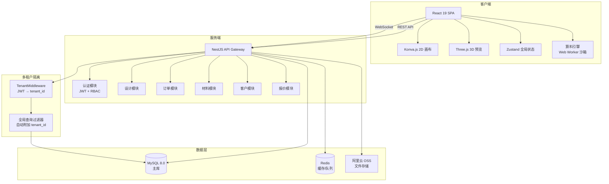
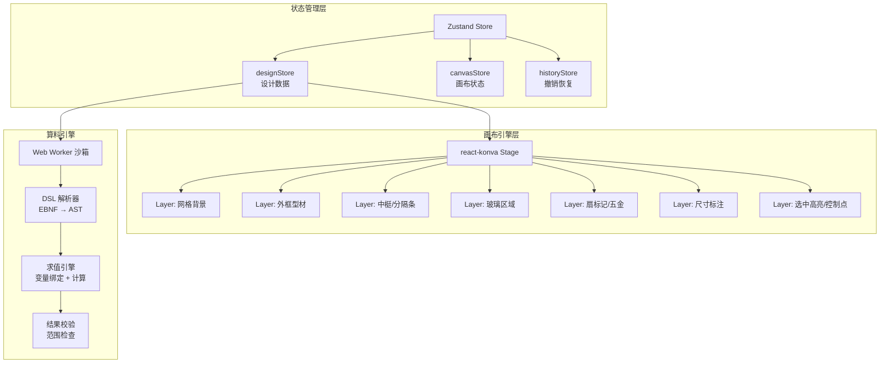
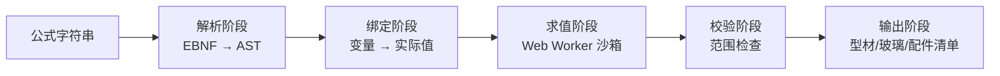

# 架构文档 — 画门窗设计器 (WindoorDesigner)

> **文档版本：** V3.3 | **最后更新：** 2026-03-07 | **对齐 PRD 版本：** V5.5 Complete
>
> 本文档是项目的技术架构单一事实来源，与 `docs/PRD_V5_Complete.md` 保持同步。

---

## 1. 项目概述

**画门窗设计器 (WindoorDesigner)** 是一款面向门窗行业的 SaaS 级 Web 应用，覆盖从设计画图、算料报价到订单管理的完整业务闭环。产品定位为"门窗行业的 Figma"——让门窗门店和中小工厂用浏览器就能完成专业级的门窗设计、自动算料和快速报价。

### 1.1 产品定位与目标用户

| 维度 | 描述 |
| :--- | :--- |
| **产品愿景** | 成为门窗行业数字化转型的一站式平台 |
| **核心用户画像** | "张老板"——年产值 200-800 万的门窗门店/小型工厂老板，同时承担设计、报价、管理职责 |
| **北极星指标** | 有效订单创建数 |
| **差异化定位** | 相比画门窗Pro（功能全但学习曲线陡）和酷家乐门窗版（3D强但算料弱），聚焦"画图→算料→报价"核心链路的极致效率 |

### 1.2 MVP V1.0 范围

| 包含 (MVP V1.0) | 排除 (后续版本) |
| :--- | :--- |
| 2D 画图核心（模板+拖拽） | 复杂组合窗（转角/飘窗 → V1.1） |
| 算料引擎（支持基础公式） | 下料优化算法（→ V1.1） |
| 订单管理（创建/查看/改价） | 完整的订单变更/退款流程（→ V1.1） |
| 客户管理（基础信息录入） | 销售漏斗/跟进记录（→ V1.2） |
| 基础的型材/玻璃/五金库 | 完整的采购/供应商管理（→ V2.0） |
| 用户认证与数据隔离 | 完整的 RBAC 权限矩阵（→ V1.1） |
| 基础的系统设置 | 3D 渲染与 AI 效果图（→ V2.0） |

### 1.3 订阅计划

| 计划 | 价格 | 目标用户 | 核心功能 |
| :--- | :--- | :--- | :--- |
| **免费版** | 0元 | 个人、体验用户 | 设计画图、算料报价（限10单/月） |
| **专业版** | ¥399/用户/年 | 门店、小型工厂 | 全部免费版功能（无限制）+ 客户管理 + 3D渲染 |
| **企业版** | ¥999/用户/年 | 中型工厂、连锁门店 | 全部专业版功能 + 生产管理 + 财务管理 |

---

## 2. 技术栈

### 2.1 目标技术栈（PRD V5.5 定义）

| 层级 | 技术选型 | 选型依据 |
| :--- | :--- | :--- |
| **前端框架** | React 19 + TypeScript + Vite + Tailwind CSS 4 | 与现有代码一致 |
| **状态管理** | Zustand（全局状态）+ useReducer（画布局部状态） | Zustand 轻量且与 React 19 兼容性佳 |
| **2D 画布引擎** | **Konva.js + react-konva** | 场景图架构与 Cell 递归树天然对齐，官方有 Window Frame Designer 示例（详见 `docs/CANVAS-ENGINE-SELECTION.md`） |
| **3D 渲染引擎** | Three.js + @react-three/fiber + @react-three/drei | Web 3D 行业标准 |
| **后端框架** | Node.js + NestJS + TypeScript + Prisma (ORM) | NestJS 模块化架构适合多模块 SaaS |
| **数据库** | MySQL 8.0（主库）+ Redis（缓存/队列） | 成熟稳定，生态完善 |
| **对象存储** | 阿里云 OSS / AWS S3 | 图片、设计图、合同文件存储 |
| **实时通信** | WebSocket（Socket.io） | 通知推送、生产状态变更 |
| **AI 服务** | ControlNet + Stable Diffusion（V2.0+） | GPU 服务器 / 云 API |
| **部署** | Docker + Kubernetes | 容器化标准部署 |

### 2.2 当前实现技术栈（原型阶段）

| 分类 | 技术 | 版本/说明 | 与目标差异 |
| :--- | :--- | :--- | :--- |
| 前端框架 | React | 19.1.1 | 一致 |
| 构建工具 | Vite | 7.x | 一致 |
| CSS 框架 | Tailwind CSS | 4.x | 一致 |
| UI 组件库 | shadcn/ui (Radix UI) | — | 一致 |
| 路由 | Wouter | 轻量级 | 一致 |
| 2D 画布 | **Konva.js + react-konva** | — | **已完成迁移** |
| 状态管理 | **Zustand** (designStore/canvasStore/historyStore) | — | **已完成迁移** |
| 3D 渲染 | Three.js + R3F + **ThreePreviewV2**（颜色/木纹/爆炸视图） | — | **已增强** |
| 实景融合 | **ScenePreview V2**（AI门洞检测 + 透视变换 + 多层合成） | — | **已完成** |
| 导出引擎 | **jspdf + dxf-writer + jszip + file-saver** | — | **已完成** |
| 算料引擎 | **WindoorFormula DSL**（Tokenizer/Parser/Evaluator + Web Worker） | — | **已完成** |
| 后端 | 无（纯前端静态） | — | **需升级为全栈** |
| 数据库 | 无 | — | **需引入 MySQL + Redis** |
| 部署 | Nginx 静态站点 | 8.140.238.44/windows/ | 需迁移到容器化 |

### 2.3 技术选型决策记录

> **2D 画布引擎选型（2026-03-02）：** 经过 Konva.js / Fabric.js / 手写 SVG 三方对比评估（详见 `docs/CANVAS-ENGINE-SELECTION.md`），Konva.js 以加权总分 9.0/10 胜出。核心理由：① 场景图架构与 Cell 递归树天然对齐；② 官方维护 Window Frame Designer 示例；③ AVADA MEDIA 行业验证；④ 多层渲染 + 脏区域检测保证性能扩展性。迁移策略采用渐进式：Sprint 1 替换渲染层，Sprint 2 起在 Konva.js 基础上开发新功能。

---

## 3. 系统架构

### 3.1 整体架构图



### 3.2 核心业务流程


### 3.3 14 个业务模块

| 编号 | 模块 | MVP V1.0 | V1.1 | V2.0 | 说明 |
| :--- | :--- | :--- | :--- | :--- | :--- |
| 1 | 用户认证与权限 | ✅ 基础 | RBAC | — | 多租户行级隔离 |
| 2 | 画图核心 | ✅ | 组合窗 | AI渲染 | 2D+3D 设计器 |
| 3 | 算料引擎 | ✅ 基础公式 | DSL完整 | — | WindoorFormula DSL |
| 4 | 订单管理 | ✅ | 变更/退款 | — | 全生命周期 |
| 5 | 客户管理 | ✅ 基础 | 销售漏斗 | — | CRM |
| 6 | 材料管理 | ✅ 基础库 | — | — | 型材/玻璃/五金 |
| 7 | 报价管理 | ✅ | — | — | 自动报价 |
| 8 | 系统设置 | ✅ | — | — | 基础配置 |
| 9 | 生产管理 | — | — | ✅ | 排程/BOM/下料 |
| 10 | 采购管理 | — | — | ✅ | 供应商/采购单 |
| 11 | 仓库管理 | — | — | ✅ | 出入库/盘点 |
| 12 | 质量管理 | — | — | ✅ | IQC/IPQC/FQC |
| 13 | 财务管理 | — | — | ✅ | 应收应付/成本 |
| 14 | 安装售后 | — | ✅ | — | 安装/维修/回访 |

---

## 4. 数据模型

### 4.1 双层数据模型架构

PRD V5.4 明确了前后端数据模型的分层策略：

| 层级 | 模型 | 用途 | 定义位置 |
| :--- | :--- | :--- | :--- |
| **API 契约层** | 扁平数组结构 (`design_data_json`) | 前后端数据交换、数据库存储 | PRD 第 4 章 |
| **前端渲染层** | 递归树形结构 (`WindowUnit → Frame → Opening`) | 前端画布渲染和交互 | `docs/画图模块_可执行规格书.md` |

前端在 API 层（save/load）实现"递归树 ↔ 扁平数组"的双向转换。

### 4.2 前端渲染层数据模型（当前实现）

```
DesignData
├── id, windowCode, quantity, remark
├── color: ColorConfig
└── frame: Frame
    ├── width, height, frameWidth, shape
    └── rootCell: Cell (递归树)
        ├── rect: { x, y, width, height }
        ├── sash?: Sash (开启方式)
        ├── filling: Filling (填充物)
        ├── glazingBar?: GlazingBar (格条)
        ├── mullions: Mullion[] (中梃列表)
        └── children: Cell[] (子区域)
```

### 4.3 API 契约层数据模型（目标）

```json
{
  "frame": { "width": 2400, "height": 1800, "profileWidth": 60, "shape": "rectangle" },
  "mullions": [
    { "id": "m1", "direction": "vertical", "position": 1200, "parentCellId": "root" }
  ],
  "sashes": [
    { "id": "s1", "cellId": "c1", "openDirection": "左开", "handlePosition": "right" }
  ],
  "glasses": [
    { "id": "g1", "cellId": "c1", "type": "5+12A+5", "thickness": 22 }
  ]
}
```

### 4.4 核心数据库表（40+ 张）

| 表名 | 说明 | MVP |
| :--- | :--- | :--- |
| `tenant` | 租户表（多租户隔离根节点） | ✅ |
| `user` | 用户表（手机号登录） | ✅ |
| `role` | 角色表（8 种预置角色） | ✅ |
| `customer` | 客户表（销售漏斗 6 阶段） | ✅ |
| `order` | 订单表（10 种状态 + 双状态字段） | ✅ |
| `order_item` | 订单项表（关联设计数据 JSONB） | ✅ |
| `design_version` | 设计版本表（最近 10 个快照） | ✅ |
| `profile_series` | 型材系列表（50/55/60/65/70） | ✅ |
| `material` | 材料表（型材/玻璃/五金/配件） | ✅ |
| `formula` | 算料公式表（WindoorFormula DSL） | ✅ |
| `quote` | 报价表 | ✅ |
| `production_task` | 生产任务表 | V2.0 |
| `bom` | BOM 物料清单表 | V2.0 |
| `purchase_order` | 采购订单表 | V2.0 |
| `inventory` | 库存表 | V2.0 |
| `qc_inspection` | 质检记录表 | V2.0 |

### 4.5 多租户隔离方案

采用**共享数据库 + 行级隔离**（Row-Level Security）：

1. **中间件层**：所有 API 请求经过 `TenantMiddleware`，从 JWT Token 中提取 `tenant_id`
2. **ORM 层**：全局查询过滤器自动附加 `tenant_id` 条件
3. **INSERT 层**：新增记录自动填充当前 `tenant_id`，禁止前端传入
4. **管理后台**：超级管理员使用独立路径 `/admin/api/` 可跨租户查询

---

## 5. 画图模块架构

### 5.1 当前实现（V3.1 - 修复测试报告 Bug）

```
EditorPage.tsx (主设计器页面 - 三栏布局)
├── TopBar (顶部栏：新建/导出/报价/视图切换)
├── Toolbar (左侧工具栏：选择/绘制/中梃/扇/平移)
├── KonvaCanvas (Konva.js 2D画布：多层渲染架构)
│   ├── GridLayer (L0 网格背景层)
│   ├── FrameRenderer (L1 外框型材渲染)
│   ├── OpeningRenderer (L2 递归渲染 Opening)
│   ├── DimensionRenderer (L3 尺寸标注 - 仅选中)
│   └── SelectionOverlay (L4 选中高亮+控制点)
├── PropertiesPanel (右侧属性面板：尺寸/位置/型材)
├── QuoteDialog (报价对话框 - 过滤无效项/单价可编辑)
├── ExportDialog (导出对话框 - PNG/SVG/PDF/DXF)
├── ScenePreview V2 (实景融合预览 - AI检测/手动框选/透视变换/多层合成)
└── ShortcutsDialog (快捷键帮助面板)

实景融合引擎
├── sceneFusion.ts (核心引擎：AI门洞检测 + 透视变换 + 图像合成)
├── ScenePreview.tsx (前端组件：双模式交互 + 参数调节 + 效果图导出)
└── 合成管线：原始照片 → 内阴影 → 透视变换叠加 → 边缘羽化 → 色温匹配 → 玻璃反射 → 亮度匹配

Zustand Stores (状态管理)
├── designStore: 设计数据 + CRUD (BUG-007 修复)
├── canvasStore: 画布视口 + 工具 + 交互状态 (BUG-008 修复)
└── historyStore: 撤销/重做快照栈 (BUG-008 修复)

支撑模块
├── useKeyboardShortcuts: 全局快捷键 (? 键帮助)
├── useAutoSave: 自动保存到 localStorage
├── storageAdapter: 数据持久化适配器 (BUG-002 数据校验修复)
├── validators: 边界校验
└── geometry: 几何计算 (BUG-005 智能放置修复)
```

### 5.2 目标架构（Konva.js 迁移后）



### 5.3 2D 渲染规格

| 元素 | 渲染效果 | 颜色/样式 |
| :--- | :--- | :--- |
| 外框 | 4条型材矩形，含3D光影效果 | 根据颜色配置 |
| 中梃 | 矩形条，含拖拽热区 | 同外框颜色 |
| 玻璃区域 | 半透明填充 + 对角线标记 | `rgba(173,216,230,0.3)` |
| 扇标记 | X形对角线 + 方向箭头 + 把手图标 | 黑色线条 |
| 选中框 | 2px实线边框 | `#007AFF` 蓝色 |
| 控制点 | 8x8px 白色方块 | 白底蓝边 |
| 尺寸标注 | 红色标注线 + 14px数值 | `#FF0000` |
| 吸附对齐线 | 1px虚线 | `#FF3B30` 红色 |

### 5.4 3D 渲染规格

| 元素 | 材质参数 | 映射规则 |
| :--- | :--- | :--- |
| 外框/中梃 | `MeshStandardMaterial` metalness=0.6, roughness=0.3 | `frame.profileWidth/Height` → `ExtrudeGeometry` |
| 玻璃 | `MeshPhysicalMaterial` transmission=0.8, ior=1.5 | `glass.spec` → 计算总厚度 |
| 颜色/木纹 | 纯色设 `color`，木纹加载 `map` 贴图 | `metadata.colorExternal/Internal` |
| 扇开启 | 枢轴点设在 `hingeSide` 对应边缘 | `sash.openDirection` → 旋转动画 |
| 光源 | AmbientLight=0.6, DirectionalLight=0.8 位置(-5,10,7.5) | 模拟自然光照 |

### 5.5 性能指标

| 场景 | 指标 | 目标值 |
| :--- | :--- | :--- |
| 画布加载（50组件） | FCP | < 1.5s |
| 拖拽交互（200组件） | FPS | > 45 |
| 缩放/平移 | FPS | > 50 |
| 导出PNG（3000x3000） | 耗时 | < 2s |
| 内存占用（500组件） | — | < 500MB |

---

## 6. 算料引擎架构

### 6.1 WindoorFormula DSL

算料引擎使用自定义 DSL（领域特定语言），支持用户自定义公式计算型材下料尺寸、玻璃面积、配件数量和报价。

**数据类型：** Number（DECIMAL(10,2)）、String、Boolean、List

**系统变量（30+）：** W（总宽）、H（总高）、FW（框面宽）、FH（框截面高）、SW（扇面宽）、MW（中梃面宽）、GW（玻璃宽）、GH（玻璃高）、N（扇数量）、AREA（面积）、REGION_W/H（区域宽高）等

**内置函数（12个）：** ROUND、CEIL、FLOOR、MAX、MIN、ABS、IF、SUM、COUNT、LOOKUP、SQRT、PI

### 6.2 执行流程



### 6.3 安全沙箱

所有公式在 Web Worker 中执行，与主线程隔离：

- **禁用全局对象：** `window`、`document`、`fetch` 等全部禁止
- **严禁危险操作：** `eval`、`new Function()`、`setTimeout` 等
- **超时限制：** 单个公式执行 ≤ 50ms
- **结果缓存：** 相同输入的公式结果 memoization

### 6.4 错误处理

| 错误码 | 类型 | 描述 |
| :--- | :--- | :--- |
| 1001 | SyntaxError | 括号不匹配、缺少操作符 |
| 1002 | SyntaxError | 非法的函数名称 |
| 2001 | ReferenceError | 引用不存在的变量 |
| 2002 | TypeError | 函数参数数量/类型不匹配 |
| 3001 | EvaluationError | 除以零 |
| 3002 | EvaluationError | 递归深度超限 |
| 3003 | TimeoutError | 执行超时（>50ms） |

---

## 7. 当前项目目录结构

```
windoor-designer/
├── packages/
│   ├── client/                        # 前端应用
│   │   ├── index.html                 # HTML 入口
│   │   ├── vite.config.ts             # Vite 配置（别名 @/ 和 @windoor/shared）
│   │   └── src/
│   │       ├── main.tsx               # React 入口
│   │       ├── App.tsx                # 路由 & Provider
│   │       ├── index.css              # 全局样式 & Tailwind 主题
│   │       ├── pages/
│   │       │   ├── PhotoPage.tsx       # ★ 拍照识别页面（AI窗型识别+3D框架生成）
│   │       │   ├── EditorPage.tsx      # 主设计器页面（三栏布局）
│   │       │   ├── Editor.tsx          # 旧版编辑器（保留）
│   │       │   └── NotFound.tsx        # 404 页面
│   │       ├── components/
│   │       │   ├── canvas/             # ★ Konva.js 画布组件（新增）
│   │       │   │   ├── KonvaCanvas.tsx # 主画布容器（Stage + 交互逻辑）
│   │       │   │   ├── GridLayer.tsx   # L0 网格背景层
│   │       │   │   ├── FrameRenderer.tsx   # L1 外框渲染
│   │       │   │   ├── GlassRenderer.tsx   # L2 玻璃区域渲染
│   │       │   │   ├── MullionRenderer.tsx # L1 中梃渲染
│   │       │   │   ├── SashRenderer.tsx    # L3 扇标记渲染（13种扇类型）
│   │       │   │   ├── DimensionRenderer.tsx # L4 尺寸标注
│   │       │   │   ├── SelectionOverlay.tsx  # L5 选中高亮+控制点
│   │   │       │   ├── OpeningRenderer.tsx   # Opening 递归渲染
│   │       │   └── AdvancedShapes.tsx   # ★ 异形框+格条渲染（Phase 5）
│   │       │   ├── three/              # ★ 3D 增强组件（Phase 2）
│   │       │   │   └── ThreePreviewV2.tsx # 增强版3D预览（颜色/木纹/爆炸视图）
│   │       │   ├── Toolbox.tsx         # 左侧工具面板（新版 Zustand）
│   │       │   ├── PropertyPanel.tsx   # 右侧属性面板（新版 Zustand）
│   │       │   ├── TopToolbar.tsx      # 顶部工具栏（新版 Zustand）
│   │       │   ├── ContextMenu.tsx     # 右键菜单（新增）
│   │       │   ├── BOMPanel.tsx        # ★ 材料清单面板（Phase 4）
│   │       │   ├── ExportDialog.tsx    # ★ 多格式导出对话框（Phase 3）
│   │       │   ├── VersionManager.tsx  # ★ 版本管理面板（Phase 5）
│   │       │   ├── CanvasRenderer.tsx  # 旧版 SVG 画布（保留）
│   │       │   ├── Preview3D.tsx       # Three.js 3D 预览
│   │       │   ├── PhotoFramePreview.tsx # ★ 拍照识别3D框架预览组件（Three.js）
│   │       │   ├── ErrorBoundary.tsx   # 错误边界
│   │       │   └── ui/                # shadcn/ui 组件
│   │       ├── stores/                # ★ Zustand 状态管理（新增）
│   │       │   ├── designStore.ts     # 设计数据 Store
│   │       │   ├── canvasStore.ts     # 画布状态 Store
│   │       │   └── historyStore.ts    # 撤销/重做 Store
│   │       ├── hooks/
│   │       │   ├── useKeyboardShortcuts.ts  # 键盘快捷键（新版）
│   │       │   ├── useAutoSave.ts     # 自动保存 Hook（新增）
│   │       │   └── useEditorStore.ts   # 旧版 Store（保留）
│   │       ├── lib/
│   │       │   ├── constants.ts       # 渲染常量和颜色配置（新增）
│   │       │   ├── geometry.ts        # 几何计算工具函数（新增）
│   │       │   ├── validators.ts      # 边界校验工具函数（新增）
│   │       │   ├── storageAdapter.ts   # localStorage 持久化适配器（新增）
│   │       │   ├── textures.ts        # ★ 程序化木纹纹理生成器（Phase 2）
│   │       │   ├── three-utils.ts     # ★ 3D 工具函数（爆炸视图/材质）（Phase 2）
│   │       │   ├── window3d-v2.ts     # ★ 重构3D模型生成（Phase 2）
│   │       │   ├── export/            # ★ 多格式导出模块（Phase 3）
│   │       │   │   ├── index.ts       # 统一导出入口
│   │       │   │   ├── export-png.ts  # PNG 导出（300 DPI）
│   │       │   │   ├── export-svg.ts  # SVG 矢量导出
│   │       │   │   ├── export-pdf.ts  # PDF A4 打印模板
│   │       │   │   ├── export-dxf.ts  # DXF AutoCAD 导出
│   │       │   │   └── export-batch.ts # 批量 ZIP 导出
│   │       │   ├── calc-engine/       # ★ 算料引擎（Phase 4）
│   │       │   │   ├── index.ts       # 算料引擎入口
│   │       │   │   ├── tokenizer.ts   # 词法分析器
│   │       │   │   ├── parser.ts      # AST 解析器
│   │       │   │   ├── evaluator.ts   # 表达式求值器
│   │       │   │   ├── calc-module.ts # 门窗算料模块
│   │       │   │   └── calc-worker.ts # Web Worker 异步计算
│   │       │   ├── window-factory.ts   # 窗户工厂函数+预设模板
│   │       │   ├── photoRecognition.ts # ★ AI拍照识别服务（OpenAI Vision + 演示模式）
│   │       │   ├── photoWindowFactory.ts # ★ 拍照识别→3D框架工厂函数
│   │       │   ├── types.ts           # 前端类型定义
│   │       │   └── utils.ts           # 通用工具
│   │       └── contexts/
│   │           └── ThemeContext.tsx    # 主题上下文
│   ├── shared/                        # 前后端共享包
│   │   └── src/
│   │       ├── types/                 # 共享类型定义
│   │       │   ├── design.ts          # 核心领域模型
│   │       │   ├── editor.ts          # 编辑器类型
│   │       │   └── ...
│   │       └── constants/             # 共享常量
│   │           ├── profiles.ts        # 型材系列（50/55/60/65/70）
│   │           └── constraints.ts     # 边界约束
│   └── server/                        # 后端（待开发）
├── docs/                              # 产品文档
├── ARCHITECTURE.md                    # 本文档
└── PRD_README.md                      # 文档入口索引
```

---

## 8. API 设计

### 8.1 API 规范

| 规范项 | 标准 |
| :--- | :--- |
| 路径前缀 | `/api/v1/` |
| 认证方式 | Bearer JWT Token |
| 响应格式 | `{ code: number, data: T, message: string }` |
| 分页 | `?page=1&pageSize=20` → `{ list: T[], total: number }` |
| 限流 | 匿名 30 req/min，认证 120 req/min，写操作 30 req/min |
| 版本控制 | URL 路径版本 `/api/v1/`，大版本变更时新增 `/api/v2/` |

### 8.2 核心 API 端点（MVP V1.0）

| 模块 | 方法 | 路径 | 说明 |
| :--- | :--- | :--- | :--- |
| **认证** | POST | `/api/v1/auth/login` | 手机号+密码登录 |
| | POST | `/api/v1/auth/register` | 注册（自动创建租户） |
| | POST | `/api/v1/auth/refresh` | 刷新 Token |
| **设计** | GET | `/api/v1/designs` | 获取设计列表 |
| | POST | `/api/v1/designs` | 创建新设计 |
| | PUT | `/api/v1/designs/:id` | 保存设计（整体覆盖） |
| | GET | `/api/v1/designs/:id/versions` | 获取设计版本历史 |
| **订单** | GET | `/api/v1/orders` | 获取订单列表 |
| | POST | `/api/v1/orders` | 创建订单 |
| | PUT | `/api/v1/orders/:id` | 更新订单 |
| | POST | `/api/v1/orders/:id/calc` | 触发算料计算 |
| **材料** | GET | `/api/v1/profile-series` | 获取型材系列 |
| | GET | `/api/v1/materials` | 获取材料列表 |
| | GET | `/api/v1/formulas` | 获取算料公式 |
| **客户** | GET | `/api/v1/customers` | 获取客户列表 |
| | POST | `/api/v1/customers` | 创建客户 |
| **报价** | POST | `/api/v1/quotes/generate` | 生成报价单 |
| | GET | `/api/v1/quotes/:id` | 获取报价详情 |

### 8.3 WebSocket 事件

| 事件 | 方向 | 说明 |
| :--- | :--- | :--- |
| `order:statusChanged` | Server→Client | 订单状态变更通知 |
| `design:saved` | Server→Client | 设计保存确认 |
| `inventory:alert` | Server→Client | 库存预警通知 |
| `production:progress` | Server→Client | 生产进度更新 |

---

## 9. 项目进度

### 9.1 已完成工作

| 日期 | 工作项 | 说明 |
| :--- | :--- | :--- |
| 2026-03-01 | 项目初始化 | 确定工业蓝图设计风格 |
| 2026-03-01 | 核心数据模型 | Frame、Cell、Mullion、Sash 类型体系 |
| 2026-03-01 | 设计操作函数 | createDefaultFrame、addMullionToCell、setSashOnCell 等 |
| 2026-03-01 | 全局状态管理 | DesignerContext + 20种Action + 撤销恢复 |
| 2026-03-01 | SVG 2D 画布 | 网格、外框3D效果、玻璃、中梃、尺寸标注 |
| 2026-03-01 | 3D 实时预览 | Three.js 渲染，旋转/缩放/平移 |
| 2026-03-01 | 工具栏/工具箱/属性面板 | 5种模板、8种工具、8色预设、开启方式 |
| 2026-03-01 | 键盘快捷键 | V/F/M/H/S/G/D 工具切换，Ctrl+Z/Y 撤销恢复 |
| 2026-03-01 | 部署 | Nginx 静态站点 http://8.140.238.44/windows/ |
| 2026-03-02 | PRD 文档体系 | 从 V3 迭代至 V5.5 Complete（4819行，14模块） |
| 2026-03-02 | 画布引擎选型 | Konva.js 选型报告（综合评分 9.0/10） |
| 2026-03-02 | 团队规范 | TEAM-SPEC.md + DEVELOPMENT-PLAN.md |
| 2026-03-02 | Konva.js 画布迁移 | 完成从 SVG 到 Konva.js 的 2D 画布引擎迁移，实现多层渲染架构 |
| 2026-03-02 | Zustand 状态管理迁移 | 完成从 useReducer 到 Zustand 的状态管理迁移（designStore/canvasStore/historyStore） |
| 2026-03-02 | 画布交互功能 | 实现绘制外框、添加中梃/扇、拖拽中梃、选中高亮、缩放平移 |
| 2026-03-02 | UI 面板重构 | 重构 Toolbox/PropertyPanel/TopToolbar，集成 Zustand |
| 2026-03-02 | 数据持久化 | 实现 localStorage 自动保存/恢复 + JSON 导入/导出 |
| 2026-03-02 | 键盘快捷键 | 重构快捷键系统，支持 V/R/M/H/S/G/D/Ctrl+Z/Y/S |
| 2026-03-02 | 右键菜单 | 新增右键上下文菜单，支持快捷删除和工具切换 |
| 2026-03-02 | 边界校验 | 实现窗户尺寸、中梃位置、扇互斥等校验规则 |
| 2026-03-02 | 3D 预览增强 (Phase 2) | ThreePreviewV2 组件：颜色/木纹同步切换（23种木纹+20+纯色）、爆炸视图动画、增强光照和玻璃材质 |
| 2026-03-02 | 程序化纹理生成 | textures.ts：23种木纹纹理程序化生成（橡木/胡桃木/樱桃木等），无需外部贴图文件 |
| 2026-03-02 | 3D 模型重构 | window3d-v2.ts：重构3D模型生成逻辑，支持颜色配置同步和爆炸视图分解 |
| 2026-03-02 | PNG 导出 (Phase 3) | 300 DPI 高清 PNG 导出，支持透明背景 |
| 2026-03-02 | SVG 导出 | 矢量 SVG 导出，图层分离（框/中梃/玻璃/标注） |
| 2026-03-02 | PDF 导出 | A4 打印模板 PDF 导出，含标题栏和尺寸标注 |
| 2026-03-02 | DXF 导出 | AutoCAD 兼容 DXF 导出，图层分离，1:1 比例 |
| 2026-03-02 | 批量导出 | ZIP 打包批量导出所有窗户（PNG+SVG+PDF+DXF） |
| 2026-03-02 | 导出对话框 UI | ExportDialog 组件：格式选择、参数配置、批量导出 |
| 2026-03-02 | WindoorFormula DSL 引擎 (Phase 4) | 完整的词法分析器+AST解析器+求值器，支持30+系统变量和12个内置函数 |
| 2026-03-02 | 算料模块 | 门窗算料模块：框料/中梃/扇料/玻璃/五金/密封条 6 大类自动计算 |
| 2026-03-02 | Web Worker 算料 | 算料引擎在 Web Worker 中异步执行，不阻塞主线程 |
| 2026-03-02 | 材料清单 UI | BOMPanel 组件：按窗户/类别分组显示、CSV 导出、成本汇总 |
| 2026-03-02 | 异形框渲染 (Phase 5) | AdvancedShapes 组件：5种弧顶异形框（圆弧/尖拱/三角/梯形/半圆） |
| 2026-03-02 | 格条渲染 | 4种格条样式（十字/田字/菱形/自定义网格） |
| 2026-03-02 | 版本管理 | VersionManager 组件：保存/恢复/删除版本快照，localStorage 持久化 |
| 2026-03-02 | TopBar 增强 | 新增算料/导出/版本管理按钮到顶部工具栏 |
| 2026-03-06 | 拍照识别页面 (PhotoPage) | 完整的拍照识别页面：图片上传/拍照、AI窗型识别、3D框架预览、尺寸编辑、导入编辑器 |
| 2026-03-06 | AI窗型识别服务 | photoRecognition.ts：支持OpenAI Vision API识别 + 内置演示模式（无需API Key即可体验） |
| 2026-03-06 | 拍照→3D框架工厂 | photoWindowFactory.ts：将AI识别结果转换为矩形窗/L形窗/U形窗/凸窗的3D框架数据 |
| 2026-03-06 | 3D框架预览组件 | PhotoFramePreview.tsx：Three.js渲染窗型3D线框，支持正视图/透视图/俯视图/网格切换 |
| 2026-03-06 | TopBar/移动端入口 | 在TopBar和移动端头部添加「拍照识别」入口按钮（紫色Camera图标） |
| 2026-03-07 | 实景融合引擎 (sceneFusion.ts) | AI门洞检测（OpenAI Vision API）+ 透视变换引擎（网格细分+三角形纹理映射）+ 7层图像合成管线 |
| 2026-03-07 | ScenePreview V2 组件 | 重写实景融合预览组件：AI自动检测/手动框选双模式、四角透视校正、阴影融合、边缘羽化、色温匹配、玻璃反射、高级参数面板 |
| 2026-03-07 | 3D门窗截图服务 | captureWindow3DSnapshot：离屏Three.js渲染器，正交相机透明背景截图，支持材质配置 |

### 9.2 当前状态评估

| 维度 | 当前状态 | MVP 目标 | 差距 |
| :--- | :--- | :--- | :--- |
| 2D 画布 | **Konva.js 已完成** | Konva.js 专业画布 | ✅ 已完成 |
| 3D 预览 | **ThreePreviewV2 已完成** | 颜色/木纹/爆炸视图 | ✅ 已完成 |
| 数据持久化 | **localStorage 已完成** | 本地存储 + 云端同步 | 需全栈升级（云端同步） |
| 算料功能 | **WindoorFormula DSL 已完成** | DSL 公式引擎 | ✅ 已完成 |
| 导出能力 | **PNG/SVG/PDF/DXF 已完成** | 多格式导出 | ✅ 已完成 |
| 版本管理 | **localStorage 版本快照已完成** | 版本历史 | ✅ 已完成（需升级为云端） |
| 型材系统 | 硬编码 60mm | 可配置型材库 | 需开发 |
| 报价功能 | 无 | 自动报价 | 需开发 |
| 用户认证 | 无 | JWT + 多租户 | 需全栈升级 |
| 订单管理 | 无 | 全生命周期 | 需全栈升级 |

---

## 10. 技术债务与迁移计划

### 10.1 技术债务清单

| 优先级 | 问题 | 建议方案 | 预估工时 |
| :--- | :--- | :--- | :--- |
| ~~**P0**~~ | ~~2D 画布引擎需从 SVG 迁移到 Konva.js~~ | ✅ **已完成** - Konva.js 多层渲染架构 | — |
| ~~**P0**~~ | ~~状态管理需从 useReducer 迁移到 Zustand~~ | ✅ **已完成** - designStore/canvasStore/historyStore | — |
| ~~**P0**~~ | ~~无数据持久化~~ | ✅ **已完成** - localStorage 自动保存 + JSON 导入/导出 | — |
| ~~**P0**~~ | ~~算料功能缺失~~ | ✅ **已完成** - WindoorFormula DSL 引擎 + Web Worker | — |
| ~~**P0**~~ | ~~导出功能缺失~~ | ✅ **已完成** - PNG/SVG/PDF/DXF + 批量 ZIP 导出 | — |
| ~~**P0**~~ | ~~3D 预览功能单一~~ | ✅ **已完成** - ThreePreviewV2（颜色/木纹/爆炸视图） | — |
| ~~**中**~~ | ~~格条(glazing_bar)未实现~~ | ✅ **已完成** - AdvancedShapes（4种格条样式） | — |
| **高** | 构建产物 2.3MB 单 chunk | dynamic import 拆分 Three.js + 算料引擎 | 1d |
| **中** | 异形框仅前端渲染，未集成到数据模型 | 扩展 Frame.shape 类型 | 1d |
| **中** | 算料公式库为空 | 需要配置实际的门窗行业公式 | 2d |
| **低** | 版本管理仅 localStorage | 升级为云端版本管理 | 1d |

### 10.2 Konva.js 迁移策略

```
第1周：实验页面 PoC
├── 安装 konva + react-konva
├── 创建 /experiment 路由
├── 复现基础画布：网格 + 外框 + 玻璃区域
└── 验证性能和交互体验

第2周：替换主页面渲染层
├── 新建 KonvaCanvas.tsx 替换 Canvas.tsx
├── DesignerContext 保持不变（数据层不动）
├── 逐个迁移：网格 → 外框 → 中梃 → 玻璃 → 标注
└── 保留 SVG 版本作为降级方案

第3周起：在 Konva.js 基础上开发新功能
├── 控制点交互（8点拖拽缩放）
├── 中梃拖拽状态机（幽灵预览）
├── 多选框选 + 批量操作
└── 导出 PNG/SVG
```

---

## 11. 开发路线图

### 11.1 Sprint 规划概览

| Sprint | 周期 | 核心目标 | 关键交付物 |
| :--- | :--- | :--- | :--- |
| **S1** | 第1-2周 | 画布引擎迁移 + 数据持久化 | Konva.js 画布 + localStorage |
| **S2** | 第3-4周 | 算料引擎 MVP | DSL 解析器 + 基础公式计算 |
| **S3** | 第5-6周 | 全栈升级 + 用户认证 | NestJS 后端 + JWT + MySQL |
| **S4** | 第7-8周 | 订单管理 + 报价 | 订单 CRUD + 自动报价 |
| **S5** | 第9-10周 | 材料管理 + 导出 | 型材库 + PDF/PNG 导出 |
| **S6** | 第11-12周 | 客户管理 + 系统设置 | CRM + 配置中心 |

### 11.2 V1.0 后续版本规划

| 版本 | 周期 | 核心功能 |
| :--- | :--- | :--- |
| **V1.1** | 第13-20周 | 组合窗设计、下料优化、安装售后、RBAC权限 |
| **V1.2** | 第21-24周 | 销售漏斗、报表中心、微信小程序 |
| **V2.0** | 第25-32周 | 生产管理、采购/仓库/质量/财务、AI渲染、AR拍照 |

---

## 12. 文档索引

| 文档 | 路径 | 说明 |
| :--- | :--- | :--- |
| **PRD_README** | `./PRD_README.md` | 文档体系入口索引 |
| **PRD V5.5 Complete** | `docs/PRD_V5_Complete.md` | 产品需求金标准（4819行） |
| **画图模块可执行规格书** | `docs/画图模块_可执行规格书.md` | 前端渲染层技术规格 |
| **画布引擎选型报告** | `docs/CANVAS-ENGINE-SELECTION.md` | Konva.js 选型分析 |
| **团队分工规范** | `docs/TEAM-SPEC.md` | 角色分工 + API 契约 + Git 工作流 |
| **开发计划** | `docs/DEVELOPMENT-PLAN.md` | 缺失项补齐 + Sprint 排期 |
| **产品文档审计** | `docs/PRODUCT-DOC-ANALYSIS-V5.md` | 最新一轮文档审计报告 |
| **变更日志** | `./CHANGELOG.md` | 项目变更记录 |

---

## 13. 已知问题与风险

### 13.1 PRD 文档结构问题

> **重要提示：** PRD_V5_Complete.md 存在结构腐化问题（详见 `docs/PRODUCT-DOC-ANALYSIS-V5.md`）。第 4228 行的"V5.4 Complete"结束标记之后仍有约 600 行追加内容（3.44节、9.3节重复、19.24-28节、V5.5新增的7.17/11.1.2/12.4/14.1.4/8.5节），这些内容未归位到正确的章节位置。开发人员在查阅 PRD 时需注意阅读完整文档，不要在结束标记处停止。

### 13.2 技术风险

| 风险 | 影响 | 缓解措施 |
| :--- | :--- | :--- |
| Konva.js 迁移复杂度超预期 | 延期 1-2 周 | 保留 SVG 降级方案 |
| 算料 DSL 解析器开发难度 | 延期 1 周 | 考虑使用 PEG.js 等解析器生成器 |
| 全栈升级数据迁移 | 数据丢失风险 | localStorage → API 双写过渡期 |
| 单人前端开发瓶颈 | 进度受限 | 优先 MVP 核心链路，延后非关键功能 |

---

*此文档旨在提供项目架构的全景视图，具体实现细节请参考源代码和 PRD。*
