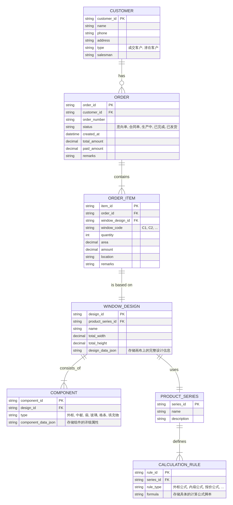

# 画门窗软件 - 产品功能规格说明书 (PRD) - V2 (开发级)

**版本：** 2.0
**日期：** 2026-03-01
**负责人：** Manus AI

## 1. 修订历史

| 版本 | 日期 | 修订人 | 修订内容 |
|---|---|---|---|
| 1.0 | 2026-03-01 | Manus AI | 初版，完成15个模块的功能地图梳理。 |
| 2.0 | 2026-03-01 | Manus AI | **升级为开发级PRD。** 新增数据模型、核心模块详细设计、业务规则、API定义。 |

## 2. 数据模型 (Data Model)

本章节定义了画门窗软件的核心业务实体及其关系，是数据库设计和后端逻辑开发的基础。

### 2.1 实体关系图 (ERD)

下图展示了系统核心实体之间的关系。

### 2.2 数据字典 (Data Dictionary)

下表对核心实体的主要字段进行详细说明。

#### 2.2.1 `ORDER` (订单表)

| 字段名 | 数据类型 | 主/外键 | 可空 | 描述 |
|---|---|---|---|---|
| order_id | VARCHAR(36) | PK | N | 唯一标识，建议使用UUID。 |
| customer_id | VARCHAR(36) | FK | Y | 关联`CUSTOMER`表，允许匿名订单。 |
| order_number | VARCHAR(50) | | N | 业务订单号，如`FG2026030101`，需建立唯一索引。 |
| status | ENUM | | N | 订单状态，枚举值：`意向单`, `合同单`, `生产中`, `已完成`, `已发货`。 |
| created_at | DATETIME | | N | 订单创建时间，默认为当前时间。 |
| total_amount | DECIMAL(12,2) | | Y | 订单总金额，由报价模块计算得出。 |
| paid_amount | DECIMAL(12,2) | | Y | 已支付金额。 |
| remarks | TEXT | | Y | 订单备注。 |

#### 2.2.2 `ORDER_ITEM` (订单明细表)

| 字段名 | 数据类型 | 主/外键 | 可空 | 描述 |
|---|---|---|---|---|
| item_id | VARCHAR(36) | PK | N | 唯一标识，建议使用UUID。 |
| order_id | VARCHAR(36) | FK | N | 关联`ORDER`表。 |
| window_design_id | VARCHAR(36) | FK | N | 关联`WINDOW_DESIGN`表。 |
| window_code | VARCHAR(20) | | Y | 窗号，如`C1`, `C2`。 |
| quantity | INT | | N | 该窗型的数量，默认为1。 |
| area | DECIMAL(10,2) | | Y | 单樘门窗的面积(㎡)。 |
| amount | DECIMAL(12,2) | | Y | 该项的总金额 (单价 × 数量)。 |
| location | VARCHAR(100) | | Y | 安装位置，如“客厅”、“主卧”。 |

#### 2.2.3 `WINDOW_DESIGN` (门窗设计表)

| 字段名 | 数据类型 | 主/外键 | 可空 | 描述 |
|---|---|---|---|---|
| design_id | VARCHAR(36) | PK | N | 唯一标识，建议使用UUID。 |
| product_series_id | VARCHAR(36) | FK | N | 关联`PRODUCT_SERIES`表。 |
| name | VARCHAR(100) | | Y | 设计名称，方便用户识别。 |
| total_width | DECIMAL(10,2) | | N | 门窗总宽度(mm)。 |
| total_height | DECIMAL(10,2) | | N | 门窗总高度(mm)。 |
| design_data_json | JSON | | N | 存储画布上所有组件、位置、属性等信息的完整JSON对象。 |

## 3. 画图核心模块详细设计 (Drawing Board)

本章节详细定义画图模块的每一个交互细节、组件属性和业务规则，是前端开发的核心依据。

### 3.1 页面布局与组件

画图模块采用经典的“左侧工具箱 + 中央画布 + 右侧属性面板”布局。

- **左侧工具箱 (`Toolbox`)**: 包含8个主要工具Tab，每个Tab下有多个模板。
- **中央画布 (`Canvas`)**: 基于HTML5 Canvas或WebGL实现，负责所有图形的渲染和交互。
- **右侧属性面板 (`Inspector`)**: 动态显示和编辑选中组件的属性。

### 3.2 画布交互流程

#### 3.2.1 创建新设计 (从零开始)

1.  **选择外框**: 用户从左侧工具箱的“框”Tab中选择一个外框模板（如矩形框）。
2.  **放置外框**: 在画布上点击，系统在点击位置放置一个默认尺寸（如2400x1600mm）的外框。
3.  **调整尺寸**: 用户可以在右侧“订单”属性面板中精确输入“总宽”和“总高”。画布上的外框和尺寸标注会实时更新。
4.  **添加中梃**: 用户从“中梃”Tab选择一个模板（如竖向等分），点击画布内的玻璃区域。系统会自动在该区域添加中梃，并将其分割成多个新的玻璃格。
5.  **添加扇**: 用户从“平开扇”或“推拉扇”Tab选择一个模板，点击目标玻璃格。系统会将该玻璃格替换为所选的扇。
6.  **设置属性**: 用户可以选中任意组件（玻璃、扇、中梃），在右侧“属性”面板中修改其参数（如玻璃类型、扇的开启方向、中梃宽度等）。
7.  **保存设计**: 用户点击顶部工具栏的“保存”按钮，系统将整个设计（包含所有组件及其属性）序列化为一个JSON对象，并存储到`WINDOW_DESIGN`表的`design_data_json`字段中。

#### 3.2.2 组件选中与高亮

- **单击**: 单击画布上的某个组件（如玻璃、扇框、中梃），该组件会被高亮显示（如绿色边框或半透明填充）。
- **右侧面板联动**: 组件被选中后，右侧属性面板会自动切换到“属性”Tab，并加载该组件的属性数据供用户编辑。
- **精确点击**: 由于是Canvas渲染，对线状组件（如扇框、中梃）的选中需要精确点击其渲染区域。

### 3.3 核心组件属性定义

#### 3.3.1 外框 (Frame)

| 属性名 | 类型 | 描述 |
|---|---|---|
| width | Number | 外框总宽度 (mm) |
| height | Number | 外框总高度 (mm) |
| series_id | String | 关联的型材系列ID |
| profile_width | Number | 型材自身的宽度 (mm) |
| color_internal | String | 内侧颜色 |
| color_external | String | 外侧颜色 |

#### 3.3.2 中梃 (Mullion)

| 属性名 | 类型 | 描述 |
|---|---|---|
| type | Enum | `vertical`, `horizontal` |
| position | Number | 相对父容器的位置 (mm或百分比) |
| profile_width | Number | 型材宽度 (mm) |

#### 3.3.3 扇 (Sash)

| 属性名 | 类型 | 描述 |
|---|---|---|
| type | Enum | `casement` (平开), `sliding` (推拉), `folding` (折叠) |
| opening_direction | Enum | `inward`, `outward`, `left`, `right`, `top`, `bottom` |
| handle_position | Enum | `left`, `right`, `center` |
| hardware_id | String | 关联的五金件ID |

#### 3.3.4 玻璃 (Glass)

| 属性名 | 类型 | 描述 |
|---|---|---|
| glass_type_id | String | 关联的玻璃类型ID (如“5+12A+5中空”) |
| is_frosted | Boolean | 是否磨砂 |
| has_blinds | Boolean | 是否内置百叶 |

## 4. 业务规则与状态机 (Business Rules & State Machines)

本章节定义了系统运行的核心业务逻辑和状态流转规则。

### 4.1 订单状态机 (Order Status State Machine)

订单是系统中最核心的业务实体，其状态流转管理着从销售到生产的全过程。下图定义了订单状态的流转路径和触发条件。

_订单状态流转图_

| 状态 | 描述 | 前置状态 | 后置状态 |
|---|---|---|---|
| 意向单 | 销售创建的初步订单，未正式确认。 | 无 | 合同单, 已取消 |
| 合同单 | 客户已确认，财务已收款或授信。 | 意向单 | 生产中, 已取消 |
| 生产中 | 订单已下达到车间进行生产。 | 合同单 | 已完成 |
| 已完成 | 订单所有产品已生产完毕。 | 生产中 | 已发货 |
| 已发货 | 订单已从仓库发出。 | 已完成 | 结束 |
| 已取消 | 订单被作废。 | 意向单, 合同单 | 结束 |

### 4.2 报价计算逻辑 (Quotation Logic)

报价是销售环节的核心，其计算逻辑直接影响公司利润。系统报价由多个部分组成，最终汇总为订单总价。

**报价公式:**

`订单总金额 = SUM(门窗明细金额) + SUM(附加费用) - SUM(优惠折扣)`

- **门窗明细金额 (`ORDER_ITEM.amount`)**: 
  - `门窗明细金额 = 单樘门窗面积 × 系列单价 + 五金价格 + 其他配件价格`
  - **系列单价**: 在“型材系列”模块中为每个系列配置，是报价的基础。
  - **五金价格**: 根据所选五金件型号，从物料库中获取价格。

- **附加费用**: 
  - 在订单详情页的“报价信息”面板中手动添加。
  - 常见附加费用包括：`安装费`, `运输费`, `税金`, `非标设计费`等。

- **优惠折扣**:
  - 同样在“报价信息”面板中添加，通常为负数。
  - 例如：`国庆特惠`, `老客户折扣`。

### 4.3 算料公式核心变量

算料公式是软件的技术核心，它将设计图纸转化为生产所需的材料清单。公式在“型材系列”模块中配置，使用系统预设的变量。

| 变量 | 含义 | 示例 |
|---|---|---|
| `W` | 当前组件的宽度 (mm) | `外框.W` |
| `H` | 当前组件的高度 (mm) | `外框.H` |
| `CW` | 画布的总宽度 (mm) | `CW` |
| `CH` | 画布的总高度 (mm) | `CH` |
| `Profile.Width` | 当前型材的宽度 | `扇框型材.Width` |
| `Glass.Thickness` | 玻璃的厚度 | `Glass.Thickness` |

**示例：外框竖料长度计算公式**

`外框竖料长度 = H`

**示例：外框横料长度计算公式**

`外框横料长度 = W - 2 * Profile.Width`  (假设为45度拼接)

## 5. API 接口定义 (API Definition)

本章节定义了前后端分离开发所需的核心RESTful API接口。所有接口均需进行用户认证。

### 5.1 认证 (Authentication)

- **登录接口**: `POST /api/auth/login`
  - **Request Body**: `{ "username": "...", "password": "..." }`
  - **Response**: `{ "token": "..." }` (返回JWT Token)

### 5.2 订单接口 (Order API)

- **获取订单列表**: `GET /api/orders`
  - **Query Params**: `page`, `limit`, `status`, `keyword`
  - **Response**: `{ "total": ..., "items": [...] }`

- **创建新订单**: `POST /api/orders`
  - **Request Body**: (包含客户信息、订单类型等)
  - **Response**: (返回新创建的订单对象)

- **获取订单详情**: `GET /api/orders/{id}`
  - **Response**: (返回包含订单明细的完整订单对象)

- **更新订单状态**: `PUT /api/orders/{id}/status`
  - **Request Body**: `{ "status": "合同单" }`
  - **Response**: (返回更新后的订单对象)

### 5.3 门窗设计接口 (Window Design API)

- **保存门窗设计**: `POST /api/designs`
  - **Request Body**: (包含`product_series_id`, `design_data_json`等)
  - **Response**: (返回新创建的设计对象，包含`design_id`)

- **获取门窗设计**: `GET /api/designs/{id}`
  - **Response**: (返回包含`design_data_json`的完整设计对象)

- **更新门窗设计**: `PUT /api/designs/{id}`
  - **Request Body**: (包含需要更新的字段，主要是`design_data_json`)
  - **Response**: (返回更新后的设计对象)

## 6. 总结与展望

本文档 (V2) 在V1功能地图的基础上，深入定义了画门窗软件的**数据模型、核心交互流程、关键业务规则和前后端API**，达到了可交付开发的级别。开发团队应严格遵循此文档进行后续的设计、开发和测试工作。

下一步，建议按以下优先级推进开发：

1.  **数据库设计与实现**: 基于第2章的数据模型完成数据库表结构设计。
2.  **后端核心API开发**: 优先实现用户认证、订单管理、门窗设计管理的核心接口。
3.  **前端画图模块开发**: 这是最核心、最复杂的模块，建议投入最资深的工程师，确保其稳定性和性能。
4.  **型材系列与算料公式模块**: 这是软件的技术壁垒，需要后端与行业专家紧密配合，确保公式的准确性。
5.  **其他业务模块**: 在核心功能稳定后，逐步完成CRM、财务、生产等外围模块的开发。

通过遵循本文档的规范，我们期望能够打造出一款功能强大、体验流畅、数据准确的门窗行业SaaS解决方案。
