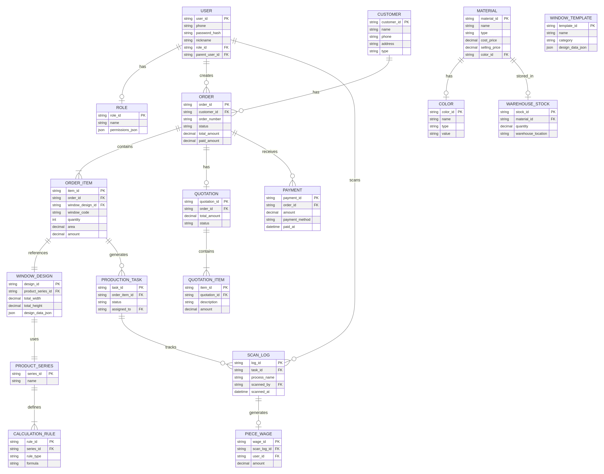
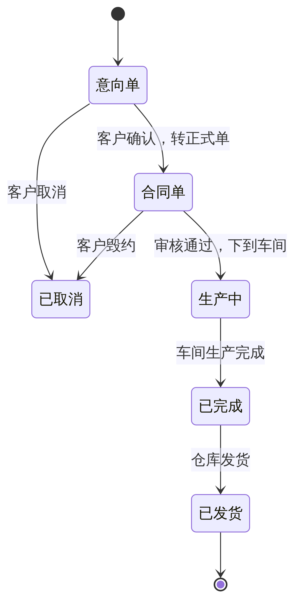

# 画门窗软件 — 产品功能规格说明书 (PRD V3)

**版本：** 3.0  
**日期：** 2026-03-01  
**负责人：** Manus AI  
**状态：** 可交付开发

---

## 目录

1. [修订历史](#1-修订历史)
2. [产品概述](#2-产品概述)
3. [数据模型](#3-数据模型)
4. [design_data_json Schema](#4-design_data_json-schema)
5. [模块一：用户认证与权限](#5-模块一用户认证与权限)
6. [模块二：首页与订单管理](#6-模块二首页与订单管理)
7. [模块三：设计门窗（画图核心模块）](#7-模块三设计门窗画图核心模块)
8. [模块四：型材系列与算料](#8-模块四型材系列与算料)
9. [模块五：客户管理](#9-模块五客户管理)
10. [模块六：财务管理](#10-模块六财务管理)
11. [模块七：车间管理](#11-模块七车间管理)
12. [模块八：仓库管理](#12-模块八仓库管理)
13. [模块九：扫码跟踪与计件工资](#13-模块九扫码跟踪与计件工资)
14. [模块十：营销展示（炫图/阳光房/拍照搭配/窗型图库）](#14-模块十营销展示)
15. [模块十一：系统设置](#15-模块十一系统设置)
16. [API 接口定义](#16-api-接口定义)
17. [非功能性需求](#17-非功能性需求)

---

## 1. 修订历史

| 版本 | 日期 | 修订人 | 修订内容 |
|---|---|---|---|
| 1.0 | 2026-03-01 | Manus AI | 初版，完成15个模块的功能地图梳理 |
| 2.0 | 2026-03-01 | Manus AI | 新增7张核心表的数据模型、订单状态机、3组API定义 |
| 3.0 | 2026-03-01 | Manus AI | **可交付开发版。** 补全至22张数据表；定义 `design_data_json` JSON Schema；15个模块逐页面交互规格；15+组API含请求/响应示例；非功能性需求 |

---

## 2. 产品概述

画门窗是一款面向门窗行业的 **SaaS 云端设计与管理平台**，覆盖从门窗设计、报价、下单到生产、发货的全流程。软件以 Web 端为主（`windoorcraft.com`），部分功能（扫码跟踪）适配移动端浏览器。

产品按功能域划分为 **15 个一级模块**，首页以图标矩阵呈现，分为三组：

| 分组 | 模块 | 核心价值 |
|---|---|---|
| **通用** | 设计门窗、订单管理、型材系列、个人中心 | 设计与订单核心流程 |
| **门店管理** | 炫图、阳光房、拍照搭配、窗型图库 | 营销展示与客户沟通 |
| **工厂管理** | 客户管理、财务管理、车间管理、仓库管理、计件工资、扫码跟踪、设备对接 | 生产运营与ERP |

---

## 3. 数据模型

### 3.1 实体关系图 (ERD)



### 3.2 数据字典

以下定义了系统全部 **22 张核心数据表**。每张表精确到字段名、数据类型、主外键关系、可空性和业务含义。

#### 3.2.1 `user` — 用户表

| 字段名 | 数据类型 | 键 | 可空 | 默认值 | 描述 |
|---|---|---|---|---|---|
| user_id | VARCHAR(36) | PK | N | UUID | 用户唯一标识 |
| phone | VARCHAR(20) | UNI | N | — | 手机号，登录凭证 |
| password_hash | VARCHAR(255) | — | N | — | bcrypt 加密后的密码 |
| nickname | VARCHAR(50) | — | Y | NULL | 昵称，如"试用账号30天" |
| avatar_url | VARCHAR(255) | — | Y | NULL | 头像 URL |
| email | VARCHAR(100) | — | Y | NULL | 邮箱 |
| wechat_openid | VARCHAR(100) | UNI | Y | NULL | 微信绑定 OpenID |
| role_id | VARCHAR(36) | FK→role | N | — | 角色 |
| parent_user_id | VARCHAR(36) | FK→user | Y | NULL | 父账号ID（子账号场景） |
| register_code | VARCHAR(20) | — | Y | NULL | 注册码，如"3497283" |
| version | ENUM('门店版','工厂版') | — | N | '门店版' | 账号版本 |
| company_info_json | JSON | — | Y | NULL | 公司信息（名称、地址、电话等） |
| created_at | DATETIME | — | N | NOW() | 创建时间 |
| updated_at | DATETIME | — | N | NOW() | 更新时间 |

#### 3.2.2 `role` — 角色表

| 字段名 | 数据类型 | 键 | 可空 | 默认值 | 描述 |
|---|---|---|---|---|---|
| role_id | VARCHAR(36) | PK | N | UUID | 角色唯一标识 |
| name | VARCHAR(50) | — | N | — | 角色名称：管理员、设计师、车间主管、财务、业务员 |
| permissions_json | JSON | — | Y | NULL | 权限列表，如 `["order:read","order:write","design:*"]` |

#### 3.2.3 `customer` — 客户表

| 字段名 | 数据类型 | 键 | 可空 | 默认值 | 描述 |
|---|---|---|---|---|---|
| customer_id | VARCHAR(36) | PK | N | UUID | 客户唯一标识 |
| name | VARCHAR(50) | — | N | — | 客户姓名，如"陈总" |
| phone | VARCHAR(20) | — | Y | NULL | 联系电话 |
| address | VARCHAR(200) | — | Y | NULL | 地址，如"佛山" |
| customer_type | ENUM('成交客户','潜在客户') | — | N | '潜在客户' | 客户类型 |
| salesman_id | VARCHAR(36) | FK→user | Y | NULL | 业务员 |
| discount | DECIMAL(3,2) | — | N | 1.00 | 折扣系数（0.01~1.00） |
| remarks | TEXT | — | Y | NULL | 备注 |
| owner_user_id | VARCHAR(36) | FK→user | N | — | 所属用户（数据隔离） |
| created_at | DATETIME | — | N | NOW() | 创建时间 |

#### 3.2.4 `order` — 订单表

| 字段名 | 数据类型 | 键 | 可空 | 默认值 | 描述 |
|---|---|---|---|---|---|
| order_id | VARCHAR(36) | PK | N | UUID | 订单唯一标识 |
| order_number | VARCHAR(30) | UNI | N | — | 订单号，格式 `FG` + `yyyyMMdd` + 2位序号，如 `FG2026030101` |
| customer_id | VARCHAR(36) | FK→customer | Y | NULL | 关联客户 |
| status | ENUM('意向单','合同单') | — | N | '意向单' | 订单状态（仅两种） |
| production_status | ENUM('待生产','生产中','已完成','已发货') | — | N | '待生产' | 生产状态（车间管理用） |
| confirmed | BOOLEAN | — | N | FALSE | 是否已确认 |
| total_count | INT | — | N | 0 | 总樘数（冗余，由 order_item 汇总） |
| total_area | DECIMAL(10,2) | — | N | 0.00 | 总面积㎡ |
| total_amount | DECIMAL(12,2) | — | N | 0.00 | 总金额元 |
| paid_amount | DECIMAL(12,2) | — | N | 0.00 | 已收款元 |
| profile_weight | DECIMAL(10,2) | — | N | 0.00 | 型材总重量 kg |
| glass_weight | DECIMAL(10,2) | — | N | 0.00 | 玻璃总重量 kg |
| remarks | TEXT | — | Y | NULL | 备注 |
| created_by | VARCHAR(36) | FK→user | N | — | 创建人 |
| ordered_at | DATE | — | N | CURDATE() | 下单日期 |
| created_at | DATETIME | — | N | NOW() | 创建时间 |
| updated_at | DATETIME | — | N | NOW() | 更新时间 |

> **订单号生成规则**：前缀 `FG` + 当天日期 `yyyyMMdd` + 当天该用户的订单序号（2位，从01开始递增，不足补零）。如当天第3个订单为 `FG2026030103`。序号按天重置。

#### 3.2.5 `order_item` — 订单明细表（单樘门窗）

| 字段名 | 数据类型 | 键 | 可空 | 默认值 | 描述 |
|---|---|---|---|---|---|
| item_id | VARCHAR(36) | PK | N | UUID | 明细唯一标识 |
| order_id | VARCHAR(36) | FK→order | N | — | 所属订单 |
| item_number | VARCHAR(40) | — | N | — | 明细编号，格式 `{order_number}-{seq}`，如 `FG2026030101-1` |
| window_code | VARCHAR(10) | — | N | 'C1' | 窗号，如 C1、C2、M1 |
| quantity | INT | — | N | 1 | 樘数 |
| design_id | VARCHAR(36) | FK→window_design | Y | NULL | 关联设计 |
| series_id | VARCHAR(36) | FK→product_series | Y | NULL | 型材系列 |
| series_name | VARCHAR(100) | — | Y | NULL | 系列名称冗余 |
| total_width | DECIMAL(10,2) | — | N | 0 | 总宽 mm |
| total_height | DECIMAL(10,2) | — | N | 0 | 总高 mm |
| area | DECIMAL(10,2) | — | N | 0 | 面积㎡ |
| unit_price | DECIMAL(10,2) | — | Y | NULL | 单价 元/㎡ |
| amount | DECIMAL(12,2) | — | N | 0 | 金额 元 |
| color_external | VARCHAR(50) | — | Y | NULL | 外色名称，如"咖啡色" |
| color_internal | VARCHAR(50) | — | Y | NULL | 内色名称，如"星空灰" |
| accessory_color | VARCHAR(20) | — | Y | NULL | 配件颜色，如"#D4D1D9" |
| glass_spec | VARCHAR(100) | — | Y | NULL | 玻璃规格，如"白玻+白玻" |
| hardware | VARCHAR(50) | — | Y | NULL | 五金品牌，如"好博" |
| screen_spec | VARCHAR(100) | — | Y | NULL | 纱网规格，如"黑色金钢网" |
| location | VARCHAR(100) | — | Y | NULL | 安装位置 |
| mullion_spec | VARCHAR(50) | — | Y | NULL | 中梃规格，如"中框" |
| frame_weight | DECIMAL(10,2) | — | N | 0 | 框型材重量 kg |
| sash_weight | DECIMAL(10,2) | — | N | 0 | 扇型材重量 kg |
| opening_count | INT | — | N | 0 | 开启数 |
| remarks | TEXT | — | Y | NULL | 备注 |
| sort_order | INT | — | N | 0 | 排序 |

#### 3.2.6 `window_design` — 门窗设计表

| 字段名 | 数据类型 | 键 | 可空 | 默认值 | 描述 |
|---|---|---|---|---|---|
| design_id | VARCHAR(36) | PK | N | UUID | 设计唯一标识 |
| design_data_json | JSON | — | N | — | **核心字段**，存储画布上所有组件的完整 JSON（详见第4章） |
| thumbnail_url | VARCHAR(255) | — | Y | NULL | 设计缩略图 URL（自动截图生成） |
| section_view_url | VARCHAR(255) | — | Y | NULL | 截面图 URL |
| created_at | DATETIME | — | N | NOW() | 创建时间 |
| updated_at | DATETIME | — | N | NOW() | 更新时间 |

#### 3.2.7 `product_series` — 型材系列表

| 字段名 | 数据类型 | 键 | 可空 | 默认值 | 描述 |
|---|---|---|---|---|---|
| series_id | VARCHAR(36) | PK | N | UUID | 系列唯一标识 |
| name | VARCHAR(100) | — | N | — | 系列名称，如"海螺90系统窗纱一体双内开窗" |
| folder_id | VARCHAR(36) | FK→series_folder | Y | NULL | 所属目录 |
| thumbnail_url | VARCHAR(255) | — | Y | NULL | 型材截面图 URL |
| owner_user_id | VARCHAR(36) | FK→user | N | — | 所属用户 |
| created_at | DATETIME | — | N | NOW() | 创建时间 |

#### 3.2.8 `series_folder` — 系列目录表

| 字段名 | 数据类型 | 键 | 可空 | 默认值 | 描述 |
|---|---|---|---|---|---|
| folder_id | VARCHAR(36) | PK | N | UUID | 目录唯一标识 |
| name | VARCHAR(50) | — | N | — | 目录名称，如"模板"、"门窗算料版" |
| parent_folder_id | VARCHAR(36) | FK→series_folder | Y | NULL | 父目录（树形结构） |
| owner_user_id | VARCHAR(36) | FK→user | N | — | 所属用户 |
| sort_order | INT | — | N | 0 | 排序 |

#### 3.2.9 `calculation_rule` — 算料公式表

| 字段名 | 数据类型 | 键 | 可空 | 默认值 | 描述 |
|---|---|---|---|---|---|
| rule_id | VARCHAR(36) | PK | N | UUID | 公式唯一标识 |
| series_id | VARCHAR(36) | FK→product_series | N | — | 所属系列 |
| rule_type | ENUM('外框公式','内扇公式','对开扇公式','推拉扇公式','折叠扇公式','产品报价','成本核算','计件工资','设计规则','打孔设置') | — | N | — | 公式类型（10种） |
| category | ENUM('型材','玻璃','配件','计算结果') | — | N | '型材' | 分组 |
| formula_json | JSON | — | N | — | 公式定义 JSON |
| variables_json | JSON | — | Y | NULL | 自定义变量定义 |

#### 3.2.10 `material` — 物料表

| 字段名 | 数据类型 | 键 | 可空 | 默认值 | 描述 |
|---|---|---|---|---|---|
| material_id | VARCHAR(36) | PK | N | UUID | 物料唯一标识 |
| code | VARCHAR(20) | — | N | — | 编号，如"001" |
| name | VARCHAR(100) | — | N | — | 名称，如"荣耀120" |
| type | ENUM('型材','玻璃','五金','配件','其他') | — | N | — | 物料类型 |
| unit | VARCHAR(20) | — | N | — | 单位：米、平方米、个、支 |
| calculation_method | ENUM('按尺寸','按数量','按面积') | — | N | '按尺寸' | 计算方式 |
| cost_price | DECIMAL(12,2) | — | Y | NULL | 成本价 |
| profit_rate | DECIMAL(6,2) | — | Y | NULL | 利率 %，如 132.67 |
| selling_price | DECIMAL(12,2) | — | Y | NULL | 报价 |
| color_name | VARCHAR(50) | — | Y | NULL | 颜色名称，如"金属灰" |
| bar_length | DECIMAL(10,2) | — | Y | 0 | 支长 mm |
| weight_per_meter | DECIMAL(10,4) | — | Y | 0 | 米重 kg/m |
| weight_per_bar | DECIMAL(10,2) | — | Y | 0 | 支重 kg |
| can_machine | BOOLEAN | — | N | FALSE | 是否上机 |
| folder_name | VARCHAR(50) | — | Y | NULL | 所属目录，如"平开窗" |
| remarks | TEXT | — | Y | NULL | 备注 |
| owner_user_id | VARCHAR(36) | FK→user | N | — | 所属用户 |

#### 3.2.11 `color` — 颜色表

| 字段名 | 数据类型 | 键 | 可空 | 默认值 | 描述 |
|---|---|---|---|---|---|
| color_id | VARCHAR(36) | PK | N | UUID | 颜色唯一标识 |
| name | VARCHAR(50) | — | N | — | 颜色名称 |
| type | ENUM('纯色','木纹') | — | N | — | 颜色类型 |
| value | VARCHAR(255) | — | N | — | 纯色为 HEX 色值 `#RRGGBB`；木纹为贴图 URL |
| owner_user_id | VARCHAR(36) | FK→user | N | — | 所属用户 |
| sort_order | INT | — | N | 0 | 排序 |

> **预置纯色**（约20种）：黑色、铝原色、蓝色、绿色、MATT BLACK、香槟、金属灰、白色、深咖、深灰、灰色、咖啡色、玫瑰金、米白、金色、棕黄等。  
> **预置木纹**（约8种）：巴西柚木、白松木、横纹紫檀、红橡、金丝楠、沙比利、水曲柳、樱桃木。  
> **3D渲染木纹**（23种，额外包含）：纯白、瓷泳灰、瓷泳金、红花梨、肌肤黑、金橡、水晶红、香槟、柚木、原木、尊贵白等。

#### 3.2.12 `quotation` — 报价单表

| 字段名 | 数据类型 | 键 | 可空 | 默认值 | 描述 |
|---|---|---|---|---|---|
| quotation_id | VARCHAR(36) | PK | N | UUID | 报价单唯一标识 |
| order_id | VARCHAR(36) | FK→order | N | — | 关联订单 |
| total_amount | DECIMAL(12,2) | — | N | 0 | 报价总金额 |
| created_at | DATETIME | — | N | NOW() | 创建时间 |

#### 3.2.13 `quotation_item` — 报价明细表

| 字段名 | 数据类型 | 键 | 可空 | 默认值 | 描述 |
|---|---|---|---|---|---|
| item_id | VARCHAR(36) | PK | N | UUID | 明细唯一标识 |
| quotation_id | VARCHAR(36) | FK→quotation | N | — | 所属报价单 |
| name | VARCHAR(100) | — | N | — | 报价项名称，如"基础价格"、"安装费"、"优惠折扣" |
| unit_price | DECIMAL(12,2) | — | N | 0 | 单价 |
| quantity | DECIMAL(10,2) | — | N | 1 | 数量（面积/延米/个） |
| discount | DECIMAL(5,2) | — | N | 1.00 | 折扣系数 |
| amount | DECIMAL(12,2) | — | N | 0 | 金额 = 单价 × 数量 × 折扣 |
| is_system | BOOLEAN | — | N | FALSE | 是否系统生成（"基础价格"行不可删除） |
| remarks | TEXT | — | Y | NULL | 备注，如"此项为订单金额之和，不可修改删除" |
| sort_order | INT | — | N | 0 | 排序 |

#### 3.2.14 `payment` — 收款记录表

| 字段名 | 数据类型 | 键 | 可空 | 默认值 | 描述 |
|---|---|---|---|---|---|
| payment_id | VARCHAR(36) | PK | N | UUID | 收款唯一标识 |
| order_id | VARCHAR(36) | FK→order | N | — | 关联订单 |
| amount | DECIMAL(12,2) | — | N | — | 收款金额 |
| account_id | VARCHAR(36) | FK→payment_account | Y | NULL | 收款账户 |
| payment_method | VARCHAR(50) | — | Y | NULL | 收款方式描述，如"微信"、"支付宝" |
| paid_at | DATETIME | — | N | NOW() | 收款时间 |
| operator_id | VARCHAR(36) | FK→user | N | — | 操作人 |
| is_voided | BOOLEAN | — | N | FALSE | 是否已作废 |
| remarks | TEXT | — | Y | NULL | 备注 |

#### 3.2.15 `payment_account` — 收款账户表

| 字段名 | 数据类型 | 键 | 可空 | 默认值 | 描述 |
|---|---|---|---|---|---|
| account_id | VARCHAR(36) | PK | N | UUID | 账户唯一标识 |
| account_number | VARCHAR(50) | — | N | — | 账号，如"154541626346" |
| account_type | VARCHAR(20) | — | N | — | 类型，如"微信"、"支付宝"、"银行卡" |
| owner_user_id | VARCHAR(36) | FK→user | N | — | 所属用户 |

#### 3.2.16 `expense` — 支出记录表

| 字段名 | 数据类型 | 键 | 可空 | 默认值 | 描述 |
|---|---|---|---|---|---|
| expense_id | VARCHAR(36) | PK | N | UUID | 支出唯一标识 |
| amount | DECIMAL(12,2) | — | N | — | 支出金额 |
| category | VARCHAR(50) | — | Y | NULL | 支出类别 |
| expense_at | DATETIME | — | N | NOW() | 支出时间 |
| operator_id | VARCHAR(36) | FK→user | N | — | 操作人 |
| remarks | TEXT | — | Y | NULL | 备注 |

#### 3.2.17 `production_task` — 生产任务表

| 字段名 | 数据类型 | 键 | 可空 | 默认值 | 描述 |
|---|---|---|---|---|---|
| task_id | VARCHAR(36) | PK | N | UUID | 任务唯一标识 |
| order_id | VARCHAR(36) | FK→order | N | — | 关联订单 |
| order_item_id | VARCHAR(36) | FK→order_item | Y | NULL | 关联明细（可为整单任务） |
| status | ENUM('待生产','生产中','已完成','已发货') | — | N | '待生产' | 生产状态 |
| assigned_to | VARCHAR(36) | FK→user | Y | NULL | 分配给的员工 |
| created_at | DATETIME | — | N | NOW() | 创建时间 |

#### 3.2.18 `scan_log` — 扫码记录表

| 字段名 | 数据类型 | 键 | 可空 | 默认值 | 描述 |
|---|---|---|---|---|---|
| log_id | VARCHAR(36) | PK | N | UUID | 记录唯一标识 |
| task_id | VARCHAR(36) | FK→production_task | N | — | 关联生产任务 |
| scan_type | ENUM('完成扫码','发货扫码') | — | N | — | 扫码类型 |
| process_name | VARCHAR(50) | — | Y | NULL | 工序名称，如"下料"、"组装" |
| scanned_by | VARCHAR(36) | FK→user | N | — | 扫码员工 |
| scanned_at | DATETIME | — | N | NOW() | 扫码时间 |

#### 3.2.19 `piece_wage` — 计件工资表

| 字段名 | 数据类型 | 键 | 可空 | 默认值 | 描述 |
|---|---|---|---|---|---|
| wage_id | VARCHAR(36) | PK | N | UUID | 工资唯一标识 |
| scan_log_id | VARCHAR(36) | FK→scan_log | N | — | 关联扫码记录 |
| user_id | VARCHAR(36) | FK→user | N | — | 员工 |
| order_number | VARCHAR(30) | — | Y | NULL | 订单号冗余 |
| window_code | VARCHAR(10) | — | Y | NULL | 窗号冗余 |
| series_name | VARCHAR(100) | — | Y | NULL | 系列名称冗余 |
| process_name | VARCHAR(50) | — | N | — | 环节名称 |
| quantity | DECIMAL(10,2) | — | N | 1 | 计件数量 |
| unit_price | DECIMAL(10,2) | — | N | 0 | 单价 |
| amount | DECIMAL(10,2) | — | N | 0 | 金额 = 数量 × 单价 |
| created_at | DATETIME | — | N | NOW() | 生成时间 |

#### 3.2.20 `warehouse_stock` — 库存表

| 字段名 | 数据类型 | 键 | 可空 | 默认值 | 描述 |
|---|---|---|---|---|---|
| stock_id | VARCHAR(36) | PK | N | UUID | 库存唯一标识 |
| material_id | VARCHAR(36) | FK→material | N | — | 关联物料（唯一索引） |
| stock_type | ENUM('原材料','成品料') | — | N | '原材料' | 库存类型 |
| quantity | DECIMAL(10,2) | — | N | 0 | 当前库存数量 |
| warehouse_location | VARCHAR(50) | — | Y | NULL | 仓位号 |
| alert_threshold | DECIMAL(10,2) | — | Y | NULL | 库存预警阈值 |
| last_updated_at | DATETIME | — | N | NOW() | 最后更新时间 |

#### 3.2.21 `warehouse_transaction` — 出入库流水表

| 字段名 | 数据类型 | 键 | 可空 | 默认值 | 描述 |
|---|---|---|---|---|---|
| transaction_id | VARCHAR(36) | PK | N | UUID | 流水唯一标识 |
| material_id | VARCHAR(36) | FK→material | N | — | 关联物料 |
| type | ENUM('入库','出库','领料','退料') | — | N | — | 操作类型 |
| quantity | DECIMAL(10,2) | — | N | — | 数量（正数入库，负数出库） |
| operator_id | VARCHAR(36) | FK→user | N | — | 操作人 |
| related_order_id | VARCHAR(36) | FK→order | Y | NULL | 关联订单 |
| remarks | TEXT | — | Y | NULL | 备注 |
| created_at | DATETIME | — | N | NOW() | 操作时间 |

#### 3.2.22 `window_template` — 窗型图库模板表

| 字段名 | 数据类型 | 键 | 可空 | 默认值 | 描述 |
|---|---|---|---|---|---|
| template_id | VARCHAR(36) | PK | N | UUID | 模板唯一标识 |
| name | VARCHAR(100) | — | Y | NULL | 模板名称 |
| category | VARCHAR(50) | — | Y | NULL | 分类：平开、推拉、复古门、肯德基门、中式门窗、转角窗、淋浴房 |
| folder_id | VARCHAR(36) | — | Y | NULL | 所属目录 |
| design_data_json | JSON | — | N | — | 设计数据（同 design_data_json Schema） |
| thumbnail_url | VARCHAR(255) | — | Y | NULL | 缩略图 URL |
| is_shared | BOOLEAN | — | N | FALSE | 是否公开共享 |
| owner_user_id | VARCHAR(36) | FK→user | N | — | 创建者 |
| created_at | DATETIME | — | N | NOW() | 创建时间 |


---

## 4. design_data_json Schema

这是整个系统最核心的数据结构。`window_design.design_data_json` 和 `window_template.design_data_json` 共用同一套 Schema。该 JSON 描述了画布上一樘门窗的全部组件信息，前端画布渲染引擎和后端算料引擎均依赖此结构。

### 4.1 顶层结构

```json
{
  "version": "3.0",
  "canvas": {
    "width": 2400,
    "height": 1600,
    "unit": "mm",
    "view": "outdoor",
    "zoom": 1.0
  },
  "frame": { ... },
  "mullions": [ ... ],
  "sashes": [ ... ],
  "glasses": [ ... ],
  "grilles": [ ... ],
  "fillings": [ ... ],
  "annotations": [ ... ],
  "metadata": { ... }
}
```

| 字段 | 类型 | 必填 | 描述 |
|---|---|---|---|
| version | string | Y | Schema 版本号 |
| canvas | object | Y | 画布全局设置 |
| frame | object | Y | 外框定义 |
| mullions | array | N | 中梃列表 |
| sashes | array | N | 扇列表（平开扇、推拉扇、折叠扇） |
| glasses | array | N | 玻璃格列表 |
| grilles | array | N | 格条列表 |
| fillings | array | N | 填充物列表（纱窗、百叶、板材等） |
| annotations | array | N | 标注线列表 |
| metadata | object | N | 元数据（颜色、系列等） |

### 4.2 `canvas` — 画布设置

```json
{
  "width": 2400,
  "height": 1600,
  "unit": "mm",
  "view": "outdoor",
  "zoom": 1.0,
  "showDimensions": true,
  "showSectionView": true,
  "showIndoorOutdoor": true
}
```

| 字段 | 类型 | 必填 | 取值范围 | 描述 |
|---|---|---|---|---|
| width | number | Y | 100~10000 | 总宽 mm |
| height | number | Y | 100~10000 | 总高 mm |
| unit | string | Y | `"mm"` / `"cm"` / `"m"` | 单位，默认 mm |
| view | string | Y | `"outdoor"` / `"indoor"` | 当前视图方向 |
| zoom | number | N | 0.1~10.0 | 缩放比例 |
| showDimensions | boolean | N | — | 是否显示尺寸标注 |
| showSectionView | boolean | N | — | 是否显示截面图 |
| showIndoorOutdoor | boolean | N | — | 是否显示室内/室外标识 |

### 4.3 `frame` — 外框

```json
{
  "id": "frame_001",
  "type": "rectangle",
  "shape": {
    "type": "rectangle",
    "points": [
      {"x": 0, "y": 0},
      {"x": 2400, "y": 0},
      {"x": 2400, "y": 1600},
      {"x": 0, "y": 1600}
    ],
    "arcs": []
  },
  "profileWidth": 60,
  "profileHeight": 45,
  "material": "铝合金",
  "regions": [
    {
      "regionId": "region_001",
      "bounds": {"x": 60, "y": 60, "width": 2280, "height": 1480},
      "content": "glass"
    }
  ]
}
```

| 字段 | 类型 | 必填 | 描述 |
|---|---|---|---|
| id | string | Y | 外框唯一 ID |
| type | string | Y | 框型模板类型：`rectangle`(矩形)、`arch`(拱形)、`triangle`(三角形)、`trapezoid`(梯形)、`circle`(圆形)、`polygon`(多边形)、`corner`(转角框)、`composite`(组合框) |
| shape.type | string | Y | 几何形状类型 |
| shape.points | array | Y | 顶点坐标列表（顺时针），单位 mm |
| shape.arcs | array | N | 弧线定义（弧形框使用），每项 `{startIdx, endIdx, radius, direction}` |
| profileWidth | number | Y | 型材面宽 mm |
| profileHeight | number | Y | 型材截面高 mm |
| material | string | N | 型材材质 |
| regions | array | Y | 框内区域列表（被中梃分割后的每个区域） |

> **框模板类型统计**：矩形框约30种、弧形/拱形框约10种、三角/梯形/菱形框约10种、组合框约10种、转角框约5种，合计 **60+ 种**。

### 4.4 `mullions[]` — 中梃

```json
{
  "id": "mullion_001",
  "type": "vertical",
  "orientation": "vertical",
  "position": 1200,
  "startRegionId": "region_001",
  "profileWidth": 40,
  "profileHeight": 45,
  "splitResult": {
    "leftRegionId": "region_002",
    "rightRegionId": "region_003"
  }
}
```

| 字段 | 类型 | 必填 | 取值 | 描述 |
|---|---|---|---|---|
| id | string | Y | — | 中梃唯一 ID |
| type | string | Y | `vertical` / `horizontal` / `cross` / `T` / `custom` | 中梃类型 |
| orientation | string | Y | `vertical` / `horizontal` | 方向 |
| position | number | Y | 单位 mm | 在所属区域内的位置偏移量 |
| startRegionId | string | Y | — | 被分割的原始区域 ID |
| profileWidth | number | Y | — | 型材面宽 mm |
| profileHeight | number | Y | — | 型材截面高 mm |
| splitResult | object | Y | — | 分割后产生的两个新区域 ID |

> **中梃模板统计**：竖向/横向等分（2/3/4等分）、井字/田字/T形/十字分割、不等分变体，合计 **30+ 种**。

### 4.5 `sashes[]` — 扇

```json
{
  "id": "sash_001",
  "regionId": "region_002",
  "type": "casement",
  "openDirection": "left",
  "openMode": "inward",
  "hingeSide": "left",
  "hasScreen": true,
  "screenType": "金钢网",
  "handlePosition": "right",
  "profileWidth": 50,
  "profileHeight": 45,
  "glassId": "glass_002"
}
```

| 字段 | 类型 | 必填 | 取值 | 描述 |
|---|---|---|---|---|
| id | string | Y | — | 扇唯一 ID |
| regionId | string | Y | — | 扇所在的区域 ID |
| type | string | Y | `casement`(平开) / `tilt_turn`(内开内倒) / `sliding`(推拉) / `folding`(折叠) / `top_hung`(上悬) / `fixed`(固定) | 扇类型 |
| openDirection | string | Y | `left` / `right` / `top` / `bottom` | 开启方向 |
| openMode | string | Y | `inward`(内开) / `outward`(外开) | 开启模式 |
| hingeSide | string | Y | `left` / `right` / `top` / `bottom` | 铰链侧 |
| hasScreen | boolean | N | — | 是否有纱窗 |
| screenType | string | N | — | 纱窗类型 |
| handlePosition | string | N | `left` / `right` / `top` / `bottom` | 把手位置 |
| profileWidth | number | Y | — | 扇型材面宽 mm |
| profileHeight | number | Y | — | 扇型材截面高 mm |
| glassId | string | Y | — | 扇内玻璃 ID |

> **平开扇模板**：左开、右开、上悬、对开双扇、三扇/四扇组合、平开+上悬组合等，合计 **30+ 种**。  
> **推拉扇模板**：两轨推拉、三轨推拉、W型推拉，合计约 **6 种**。  
> **折叠扇模板**：折叠玻扇，合计约 **6 种**。

### 4.6 `glasses[]` — 玻璃格

```json
{
  "id": "glass_001",
  "regionId": "region_001",
  "parentSashId": null,
  "spec": "5+12A+5",
  "type": "中空玻璃",
  "color": "#B8D4E8",
  "frosted": false,
  "embeddedBlinds": false,
  "surfaceWeight": 0,
  "rotation": false,
  "footHeight": 0
}
```

| 字段 | 类型 | 必填 | 描述 |
|---|---|---|---|
| id | string | Y | 玻璃唯一 ID |
| regionId | string | Y | 所在区域 ID |
| parentSashId | string | N | 所属扇 ID（NULL 表示固定玻璃） |
| spec | string | N | 玻璃规格，如"5+12A+5"(双层中空) |
| type | string | N | 玻璃类型：中空、夹胶、钢化、LOW-E 等 |
| color | string | N | 玻璃颜色 HEX 值 |
| frosted | boolean | N | 是否磨砂，默认 false |
| embeddedBlinds | boolean | N | 是否嵌入百叶，默认 false |
| surfaceWeight | number | N | 面重 kg/㎡ |
| rotation | boolean | N | 是否转向，默认 false |
| footHeight | number | N | 吃脚高度 mm |

### 4.7 `grilles[]` — 格条

```json
{
  "id": "grille_001",
  "glassId": "glass_001",
  "pattern": "grid",
  "rows": 3,
  "cols": 3,
  "barWidth": 10,
  "style": "straight",
  "customPaths": []
}
```

| 字段 | 类型 | 必填 | 取值 | 描述 |
|---|---|---|---|---|
| id | string | Y | — | 格条唯一 ID |
| glassId | string | Y | — | 所属玻璃 ID |
| pattern | string | Y | `grid`(网格) / `parallel_h`(平行横) / `parallel_v`(平行竖) / `cross`(交叉) / `diamond`(菱形) / `diagonal`(斜线) / `arc`(弧形) / `circle`(圆形) / `custom`(自定义) | 格条图案类型 |
| rows | number | N | — | 行数（网格类型使用） |
| cols | number | N | — | 列数（网格类型使用） |
| barWidth | number | N | — | 格条宽度 mm |
| style | string | N | `straight` / `curved` / `decorative` | 格条风格 |
| customPaths | array | N | — | 自定义路径（SVG path 格式） |

> **格条模板统计**：直线格条（平行、网格、交叉）、曲线格条（弧形、圆形）、图案格条（菱形、三角、装饰），合计 **40+ 种**。

### 4.8 `fillings[]` — 填充物

```json
{
  "id": "filling_001",
  "regionId": "region_003",
  "type": "screen",
  "spec": "黑色金钢网",
  "imageUrl": null
}
```

| 字段 | 类型 | 必填 | 取值 | 描述 |
|---|---|---|---|---|
| id | string | Y | — | 填充物唯一 ID |
| regionId | string | Y | — | 所在区域 ID |
| type | string | Y | `screen`(纱窗) / `blind`(百叶窗) / `panel`(板材) / `image`(图片) / `louver`(百叶) / `custom`(自定义) | 填充物类型 |
| spec | string | N | — | 规格描述 |
| imageUrl | string | N | — | 图片填充的 URL |

### 4.9 `annotations[]` — 标注

```json
{
  "id": "anno_001",
  "type": "dimension",
  "startPoint": {"x": 0, "y": 1700},
  "endPoint": {"x": 2400, "y": 1700},
  "value": "2400",
  "unit": "mm",
  "color": "#FF0000",
  "fontSize": 14
}
```

| 字段 | 类型 | 必填 | 取值 | 描述 |
|---|---|---|---|---|
| id | string | Y | — | 标注唯一 ID |
| type | string | Y | `dimension`(尺寸线) / `polyline`(折线) / `diagonal`(对角线) / `arc`(圆弧) / `arrow`(箭头) / `text`(文字) / `vertical_line`(垂直标注) / `horizontal_line`(水平标注) | 标注类型（9种） |
| startPoint | object | Y | — | 起点坐标 |
| endPoint | object | N | — | 终点坐标（文字标注不需要） |
| value | string | N | — | 标注值 |
| unit | string | N | — | 单位 |
| color | string | N | — | 颜色 HEX |
| fontSize | number | N | — | 字号 |
| text | string | N | — | 文字内容（文字标注使用） |

### 4.10 `metadata` — 元数据

```json
{
  "seriesId": "series_001",
  "seriesName": "110三轨断桥",
  "colorExternal": {
    "type": "solid",
    "name": "咖啡色",
    "value": "#6F4E37"
  },
  "colorInternal": {
    "type": "woodgrain",
    "name": "樱桃木",
    "value": "https://cdn.windoorcraft.com/textures/cherry.jpg"
  },
  "colorPressLine": {
    "type": "solid",
    "name": "黑色",
    "value": "#000000"
  },
  "openingCount": 2,
  "totalArea": 3.84,
  "screenshotUnit": "mm"
}
```

### 4.11 完整示例：三扇平开窗

```json
{
  "version": "3.0",
  "canvas": {
    "width": 2400,
    "height": 1600,
    "unit": "mm",
    "view": "outdoor",
    "zoom": 1.0,
    "showDimensions": true,
    "showSectionView": true,
    "showIndoorOutdoor": true
  },
  "frame": {
    "id": "frame_001",
    "type": "rectangle",
    "shape": {
      "type": "rectangle",
      "points": [
        {"x": 0, "y": 0}, {"x": 2400, "y": 0},
        {"x": 2400, "y": 1600}, {"x": 0, "y": 1600}
      ],
      "arcs": []
    },
    "profileWidth": 60,
    "profileHeight": 45,
    "regions": [
      {"regionId": "region_001", "bounds": {"x": 60, "y": 60, "width": 2280, "height": 1480}, "content": "glass"}
    ]
  },
  "mullions": [
    {
      "id": "mullion_001",
      "type": "vertical",
      "orientation": "vertical",
      "position": 614.2,
      "startRegionId": "region_001",
      "profileWidth": 40,
      "profileHeight": 45,
      "splitResult": {"leftRegionId": "region_002", "rightRegionId": "region_temp1"}
    },
    {
      "id": "mullion_002",
      "type": "vertical",
      "orientation": "vertical",
      "position": 1785.8,
      "startRegionId": "region_temp1",
      "profileWidth": 40,
      "profileHeight": 45,
      "splitResult": {"leftRegionId": "region_003", "rightRegionId": "region_004"}
    }
  ],
  "sashes": [
    {
      "id": "sash_001",
      "regionId": "region_002",
      "type": "casement",
      "openDirection": "left",
      "openMode": "inward",
      "hingeSide": "left",
      "hasScreen": true,
      "screenType": "黑色金钢网",
      "handlePosition": "right",
      "profileWidth": 50,
      "profileHeight": 45,
      "glassId": "glass_002"
    },
    {
      "id": "sash_002",
      "regionId": "region_004",
      "type": "casement",
      "openDirection": "right",
      "openMode": "inward",
      "hingeSide": "right",
      "hasScreen": true,
      "screenType": "黑色金钢网",
      "handlePosition": "left",
      "profileWidth": 50,
      "profileHeight": 45,
      "glassId": "glass_003"
    }
  ],
  "glasses": [
    {
      "id": "glass_001",
      "regionId": "region_003",
      "parentSashId": null,
      "spec": "5+12A+5",
      "type": "中空玻璃",
      "color": "#B8D4E8",
      "frosted": false,
      "embeddedBlinds": false,
      "surfaceWeight": 25,
      "rotation": false,
      "footHeight": 0
    },
    {
      "id": "glass_002",
      "regionId": "region_002",
      "parentSashId": "sash_001",
      "spec": "5+12A+5",
      "type": "中空玻璃",
      "color": "#B8D4E8",
      "frosted": false
    },
    {
      "id": "glass_003",
      "regionId": "region_004",
      "parentSashId": "sash_002",
      "spec": "5+12A+5",
      "type": "中空玻璃",
      "color": "#B8D4E8",
      "frosted": false
    }
  ],
  "grilles": [],
  "fillings": [],
  "annotations": [
    {
      "id": "anno_001", "type": "dimension",
      "startPoint": {"x": 0, "y": 1700}, "endPoint": {"x": 2400, "y": 1700},
      "value": "2400", "unit": "mm", "color": "#FF0000"
    },
    {
      "id": "anno_002", "type": "dimension",
      "startPoint": {"x": -100, "y": 0}, "endPoint": {"x": -100, "y": 1600},
      "value": "1600", "unit": "mm", "color": "#FF0000"
    }
  ],
  "metadata": {
    "seriesId": "series_001",
    "seriesName": "108平开系列",
    "colorExternal": {"type": "solid", "name": "深灰", "value": "#4A4A4A"},
    "colorInternal": {"type": "solid", "name": "白色", "value": "#FFFFFF"},
    "openingCount": 2,
    "totalArea": 3.84,
    "screenshotUnit": "mm"
  }
}
```


---

## 5. 模块一：用户认证与权限

### 5.1 登录页

| 项目 | 规格 |
|---|---|
| URL | `/login` |
| 登录方式 | 手机号 + 密码；微信扫码 |
| 字段 | 手机号（11位，必填，正则 `^1[3-9]\d{9}$`）、密码（6~20位，必填） |
| 校验 | 手机号格式校验；密码错误提示"手机号或密码错误"；连续5次错误锁定15分钟 |
| 成功后 | 跳转首页 `/home`；写入 JWT Token 到 Cookie/LocalStorage |

### 5.2 角色与权限矩阵

| 权限 | 管理员 | 设计师 | 车间主管 | 财务 | 业务员 | 子账号 |
|---|---|---|---|---|---|---|
| 订单管理（CRUD） | ✅ | ✅ | ❌ | ❌ | ✅ | ✅ |
| 设计门窗 | ✅ | ✅ | ❌ | ❌ | ✅ | ✅ |
| 型材系列管理 | ✅ | ✅ | ❌ | ❌ | ❌ | 受限 |
| 客户管理 | ✅ | ❌ | ❌ | ❌ | ✅ | 受限 |
| 财务管理 | ✅ | ❌ | ❌ | ✅ | ❌ | ❌ |
| 车间管理 | ✅ | ❌ | ✅ | ❌ | ❌ | ❌ |
| 仓库管理 | ✅ | ❌ | ✅ | ❌ | ❌ | ❌ |
| 系统设置 | ✅ | ❌ | ❌ | ❌ | ❌ | ❌ |
| 账号管理 | ✅ | ❌ | ❌ | ❌ | ❌ | ❌ |

> **子账号限制**：子账号由管理员创建，通过 `parent_user_id` 关联。子账号不能访问系统设置和账号管理。

---

## 6. 模块二：首页与订单管理

### 6.1 首页 (`/home`)

**页面结构：**

```
┌─────────────────────────────────────────────────┐
│ Logo                    小程序 | 教程 | 👤头像    │  ← 顶部导航栏
├─────────────────────────────────────────────────┤
│  ┌──────┐ ┌──────┐ ┌──────┐ ┌──────┐           │
│  │设计   │ │订单   │ │型材   │ │个人   │ ← 通用   │
│  │门窗   │ │管理   │ │系列   │ │中心   │           │
│  └──────┘ └──────┘ └──────┘ └──────┘           │
│  ┌──────┐ ┌──────┐ ┌──────┐ ┌──────┐           │
│  │炫图   │ │阳光房 │ │拍照   │ │窗型   │ ← 门店   │
│  │      │ │      │ │搭配   │ │图库   │           │
│  └──────┘ └──────┘ └──────┘ └──────┘           │
│  ┌──────┐ ┌──────┐ ┌──────┐ ┌──────┐           │
│  │客户   │ │财务   │ │车间   │ │仓库   │ ← 工厂   │
│  │管理   │ │管理   │ │管理   │ │管理   │           │
│  └──────┘ └──────┘ └──────┘ └──────┘           │
│  ┌──────┐ ┌──────┐ ┌──────┐                    │
│  │计件   │ │扫码   │ │设备   │                    │
│  │工资   │ │跟踪   │ │对接   │                    │
│  └──────┘ └──────┘ └──────┘                    │
├─────────────────────────────────────────────────┤
│ 最近订单列表（按下单日期倒序）                      │
│ ┌───────────────────────────────────────────┐   │
│ │ ⚠ 2026-03-01 FG2026030101 陈总 佛山       │   │
│ │   意向单  11樘/54.92㎡/31055.00元          │   │
│ │   尾款 31055.00元                          │   │
│ │   [+新增] [打印] [详情] [操作▼]            │   │
│ └───────────────────────────────────────────┘   │
└─────────────────────────────────────────────────┘
```

**最近订单列表字段：**

| 字段 | 数据来源 | 显示规则 |
|---|---|---|
| 警告图标 | 计算字段 | 尾款 > 0 时显示黄色三角感叹号 |
| 日期 | `order.ordered_at` | 格式 `yyyy-MM-dd` |
| 订单号 | `order.order_number` | 如 `FG2026030101` |
| 客户名 | `customer.name` | 如"陈总" |
| 地址 | `customer.address` | 如"佛山" |
| 订单类型 | `order.status` | 蓝色标签"意向单" / 绿色标签"合同单" |
| 统计 | 计算字段 | `{total_count}樘/{total_area}㎡/{total_amount}元` |
| 尾款 | `total_amount - paid_amount` | 红色高亮显示 |

**操作按钮行为：**

| 按钮 | 行为 | 跳转 |
|---|---|---|
| +新增 | 在该订单下新增一樘门窗 | 跳转设计门窗 `/draw?contract_id={order_id}&drawType=2` |
| 打印 | 打印该订单的图纸和报价 | 弹出打印预览 |
| 详情 | 查看订单详情 | 跳转 `/orders/group-detail/{order_id}?contract_type=1` |
| 操作▼ | 展开下拉菜单 | — |

**操作下拉菜单：**

| 选项 | 行为 | 条件 |
|---|---|---|
| 转正式单 | `order.status` 从 `意向单` 改为 `合同单` | 仅意向单可见 |
| 转意向单 | `order.status` 从 `合同单` 改为 `意向单` | 仅合同单可见 |
| 优化 | 触发算料优化计算 | — |
| 克隆 | 复制整个订单（含所有明细和设计数据） | — |
| 删除 | 软删除订单 | 二次确认弹窗"确定删除此订单？" |

### 6.2 订单管理页 (`/orders`)

**顶部统计栏：**

| 统计项 | 计算方式 |
|---|---|
| 订单总数 | `COUNT(*)` |
| 总面积 | `SUM(total_area)` |
| 总金额 | `SUM(total_amount)` |
| 已收款 | `SUM(paid_amount)` |
| 尾款 | `SUM(total_amount - paid_amount)` |

**Tab 筛选：**

| Tab | 筛选条件 |
|---|---|
| 全部 | 无筛选 |
| 意向单 | `status = '意向单'` |
| 正式订单 | `status = '合同单'` |

**筛选面板（右侧滑出）：**

| 筛选字段 | 类型 | 选项/规则 |
|---|---|---|
| 按下单时间 | 快捷选择 | 月 / 今年 / 去年 |
| 自定义时间 | 日期范围 | 起止日期选择器 |
| 按合同内容 | 文本输入 | 模糊匹配订单号、备注 |
| 客户 | 文本输入 | 模糊匹配客户名称 |
| 确认状态 | 单选 | 全部 / 已确认 / 未确认 |
| 合同状态 | 单选 | 全部 / 意向单 / 合同单 |
| 按订单内容 | 文本输入 | 模糊匹配窗号、系列名 |
| 排序 | 下拉 | 下单时间倒序（默认）/ 金额倒序 / 面积倒序 |

**操作栏按钮：**

| 按钮 | 行为 |
|---|---|
| 新增 | 跳转设计门窗创建新订单 |
| 筛选 | 打开右侧筛选面板 |
| 打印 | 批量打印选中订单 |
| 导出 | 导出订单列表为 Excel |
| 导入优化 | 导入优化数据 |

### 6.3 订单详情页 (`/orders/group-detail/{id}`)

**页面标题：** "合同详情"

**合同头部信息区：**

| 字段 | 类型 | 可编辑 | 校验规则 |
|---|---|---|---|
| 合同号 | String | 否（自动生成） | 可复制到剪贴板 |
| 客户 | String + 电话 | 是（选择/新建客户） | — |
| 地址 | String | 是 | 最大200字符 |
| 型材重量 | Number | 否（自动计算） | 单位 kg，保留2位小数 |
| 玻璃重量 | Number | 否（自动计算） | 单位 kg，保留2位小数 |
| 总樘数 | Integer | 否（自动汇总） | — |
| 总面积 | Number | 否（自动汇总） | 单位 ㎡，保留2位小数 |
| 总金额 | Number | 否（自动汇总） | 单位 元，保留2位小数 |
| 已收款 | Number | 否（自动汇总） | 单位 元 |
| 未支付 | Number | 否（计算字段） | = 总金额 - 已收款，红色显示 |
| 下单日期 | Date | 是 | 格式 `yyyy-MM-dd` |
| 创建者 | String | 否 | 显示创建人昵称 |
| 合同状态 | Enum | 是（通过操作切换） | 意向单 / 合同单 |
| 备注 | Text | 是 | 最大500字符 |

**报价信息面板（展开/收起）：**

点击"查看报价"按钮展开。表格结构：

| 列 | 类型 | 可编辑 | 说明 |
|---|---|---|---|
| 报价项 | String | 是 | 项目名称 |
| 单价 | Number | 是 | 元 |
| 数量 | Number | 是 | 默认 1 |
| 折扣 | Number | 是 | 默认 1.00 |
| 金额 | Number | 否 | = 单价 × 数量 × 折扣 |
| 备注 | String | 是 | — |
| 操作 | Button | — | 编辑 / 删除 |

> **业务规则**：第一行"基础价格"为系统自动生成行，金额 = 订单下所有门窗金额之和，**不可修改、不可删除**。用户可通过"添加报价"按钮新增额外报价项（如安装费、运输费、优惠折扣等）。

**门窗明细卡片区：**

每樘门窗以卡片形式展示。卡片结构：

```
┌─────────────────────────────────────────────────┐
│ FG2026030101-1    [编辑] [打印] [详情] [更多▼] [▼]│
├──────────────────┬──────────────────────────────┤
│                  │ 窗号: C1        樘数: 1樘     │
│  [门窗图纸缩略图] │ 系列: 110三轨断桥             │
│  [截面图]         │ 位置:           颜色:         │
│                  │ 面积: 3.84㎡    重量: 0.00    │
│  [炫图] 按钮     │ 金额: 0.00      备注:         │
│  工地实拍图区域   │ 配件颜色: ■ #D4D1D9           │
│  [新增] 按钮     │                              │
└──────────────────┴──────────────────────────────┘
```

**顶部"更多"下拉菜单：**

| 选项 | 行为 |
|---|---|
| 编辑 | 编辑合同头部信息 |
| 推送 | 推送订单到工厂/客户（分享链接） |
| 排序 | 拖拽调整门窗明细顺序 |
| 确认 | 标记订单为已确认 |
| 删除 | 删除订单（二次确认） |
| 批量改单 | 批量修改门窗信息（系列、颜色等） |

### 6.4 单樘门窗详情页 (`/orders/detail/{item_id}`)

展示单樘门窗的完整信息，包括大图、字段详情、报价信息、订单日志。

**字段与订单详情页门窗卡片相同**，额外包含：
- 大尺寸门窗图纸（带完整尺寸标注和截面图）
- 单独的报价信息表格（针对该樘门窗）
- 订单日志（操作历史记录列表）

---

## 7. 模块三：设计门窗（画图核心模块）

### 7.1 页面布局

URL: `/draw?contract_id={order_id}&order_id={item_id}&drawType=2&isScript=0`

```
┌────────────────────────────────────────────────────────────────┐
│ [保存] [撤销] [恢复] [删除] [清除] [渲染▼] [打印]  面积:3.84㎡  │ ← 顶部工具栏
├────┬───────────────────────────────────────┬───────────────────┤
│    │                                       │ [订单][颜色][图纸]│ ← 右侧面板Tab
│ 框 │                                       │                   │
│ 中 │                                       │ 总宽: 2400.00 mm  │
│ 扇 │          画 布 区 域                   │ 总高: 1600.00 mm  │
│ 推 │                                       │ 窗号: C1          │
│ 格 │     (Canvas 2D/WebGL 渲染)            │ 樽数: 1           │
│ 填 │                                       │ 单价:             │
│ 标 │                                       │ 纱网:             │
│ 他 │                                       │ 外色:             │
│    │                                       │ 内色:             │
│    │  室外 ──────────── 室内                │ 玻璃:             │
│    │  [截面图]                              │ 五金:             │
│ ⚙  │                                       │ 位置:             │
├────┴───────────────────────────────────────┴───────────────────┤
│                        状态栏                                   │
└────────────────────────────────────────────────────────────────┘
```

### 7.2 顶部工具栏

| 按钮 | 快捷键 | 行为 |
|---|---|---|
| 保存 | Ctrl+S | 保存当前设计到 `window_design` 表 |
| 撤销 | Ctrl+Z | 撤销上一步操作（操作栈最大50步） |
| 恢复 | Ctrl+Y | 恢复撤销的操作 |
| 删除 | Delete | 删除当前选中的组件 |
| 清除 | — | 清除画布上所有组件（二次确认） |
| 渲染▼ | — | 下拉菜单：3D渲染 / 炫图 / 下载截图 |
| 打印 | Ctrl+P | 打印当前图纸 |

**渲染下拉菜单：**

| 选项 | 行为 |
|---|---|
| 3D渲染 | 跳转3D渲染页面，展示门窗的3D立体效果 |
| 炫图 | 跳转炫图AI渲染，将门窗合成到室内场景 |
| 下载截图 | 将当前画布导出为PNG图片下载 |

### 7.3 左侧工具箱（8个Tab）

#### Tab 1：框工具 (快捷键 F)

**3个子Tab：**

| 子Tab | 图标 | 内容 |
|---|---|---|
| 选择工具 | 指针 | 切换为选择模式 |
| 矩形框 | 矩形 | 矩形框模板（约50种） |
| 异形框 | 弧形 | 异形框模板（约15种） |

**矩形框模板分类（约50种）：**

| 分类 | 数量 | 示例 |
|---|---|---|
| 基础矩形 | 1 | 单框矩形 |
| 竖向等分 | 5 | 竖向2/3/4/5等分、不等分 |
| 横向等分 | 5 | 横向2/3/4/5等分、不等分 |
| 弧形顶 | 8 | 半圆弧顶、拱形、各种弧度 |
| 三角/梯形 | 6 | 三角形、梯形、菱形、多边形 |
| 组合框 | 15 | 弧顶+矩形、三角顶+矩形、各种拼接 |
| 转角框 | 5 | L形转角、弧形转角 |
| 拼框 | 5 | 多框拼接 |

**异形框模板（约15种）：**
- 圆形、半圆、弧形、拱形、自由曲线等

**交互流程：**
1. 点击框模板图标 → 鼠标变为十字光标
2. 点击画布空白区域 → 在点击位置放置外框
3. 外框以默认尺寸（2400×1600mm）放置
4. 放置后自动生成一个 `region`，填充默认玻璃
5. 右侧面板自动切换到"订单"Tab，可修改总宽/总高

#### Tab 2：中梃工具 (快捷键 V)

**2个子Tab：**

| 子Tab | 内容 |
|---|---|
| 矩形中梃 | 直线中梃模板（约28种） |
| 异形中梃 | 曲线中梃模板 |

**中梃模板分类（约30种）：**

| 分类 | 数量 | 说明 |
|---|---|---|
| 竖向/横向单条 | 2 | 基础分割 |
| 等分（2/3/4） | 6 | 竖向和横向各3种 |
| 井字/田字 | 4 | 一横一竖、两横两竖及变体 |
| T形/倒T形 | 2 | T形分割 |
| 十字 | 2 | 十字分割及变体 |
| 不等分 | 4 | 左宽右窄、上宽下窄等 |
| 复杂组合 | 8 | 多种组合分割方式 |

**交互流程：**
1. 点击中梃模板图标 → 鼠标变为中梃预览
2. 点击画布上的玻璃区域（region） → 在该区域内添加中梃
3. 中梃将该区域分割为两个新区域
4. 新区域自动填充默认玻璃
5. 中梃位置默认为区域中心，可通过属性面板调整

#### Tab 3：平开扇工具 (快捷键 S)

**2个子Tab：**

| 子Tab | 内容 |
|---|---|
| 平开扇 | 平开/上悬扇模板（约25种） |
| 内开内倒 | 内开内倒扇模板（约5种） |

**平开扇模板分类（约30种）：**

| 分类 | 数量 | 说明 |
|---|---|---|
| 单扇 | 3 | 左开、右开、上悬 |
| 对开双扇 | 3 | 对开及变体 |
| 三扇组合 | 4 | 左+固+右、各种组合 |
| 四扇组合 | 4 | 四扇各种组合 |
| 平开+上悬 | 4 | 组合方式 |
| 竖向组合 | 4 | 上下组合 |
| 多扇组合 | 6 | 5扇以上组合 |
| 特殊 | 2 | 斜开扇等 |

**交互流程：**
1. 点击扇模板图标 → 鼠标变为扇预览
2. 点击画布上的玻璃区域 → 在该区域添加扇
3. 扇自动适配区域尺寸
4. 画布上显示扇的开启方向标记（交叉线 = 平开，虚线 = 上悬）
5. 把手自动渲染在扇的对侧

#### Tab 4：推拉/折叠工具 (快捷键 D)

**3个子Tab：**

| 子Tab | 图标 | 内容 |
|---|---|---|
| 推拉门 | 推拉图标 | 推拉扇模板（约2种） |
| W型推拉 | W图标 | W型推拉模板（约4种） |
| 折叠玻扇 | 网格图标 | 折叠扇模板（约6种） |

#### Tab 5：格条工具

**3个子Tab：**

| 子Tab | 内容 |
|---|---|
| 竖格条 | 竖向格条模板 |
| 横格条 | 横向格条模板 |
| 网格 | 网格/图案格条模板 |

**格条模板分类（约40种）：**

| 分类 | 数量 |
|---|---|
| 平行横/竖格条 | 4 |
| 井字/交叉格条 | 4 |
| 田字/多格组合 | 4 |
| 菱形/斜线格条 | 4 |
| 弧形/圆形格条 | 4 |
| 三角/梯形格条 | 4 |
| 拱形/异形格条 | 4 |
| 复杂图案格条 | 4 |
| 多格平行/交叉 | 4 |
| 装饰格条 | 4 |

**交互流程：**
1. 点击格条模板 → 鼠标变为格条预览
2. 点击画布上的玻璃区域 → 在该玻璃上叠加格条
3. 格条不分割区域，仅作为装饰层渲染

#### Tab 6：填充物工具

**3个子Tab：**

| 子Tab | 内容 |
|---|---|
| 编辑 | 填充物模板 |
| 网格 | 网格视图 |
| 图层 | 图层管理 |

**填充物类型（约8种）：**

| 类型 | 图标 | 说明 |
|---|---|---|
| 纱窗 | 网格图案 | 替代玻璃区域为纱窗 |
| 百叶窗 | 横线图案 | 替代玻璃区域为百叶 |
| 板材 | 方形 | 替代玻璃区域为铝板/木板 |
| 图片 | 图片图标 | 替代玻璃区域为自定义图片 |
| 其他 | 箭头图标 | 其他填充类型 |

**交互流程：**
1. 点击填充物模板 → 鼠标变为填充物预览
2. 点击画布上的玻璃区域 → 将该区域的玻璃替换为填充物
3. 填充物渲染替代原有的蓝色玻璃渲染

#### Tab 7：标线工具

**3个子Tab：**

| 子Tab | 内容 |
|---|---|
| 标注线 | 尺寸标注工具 |
| 尺寸线 | 尺寸线工具 |
| 箭头 | 箭头/文字标注 |

**标线工具（9种）：**

| 工具 | 说明 |
|---|---|
| 线段标注 | 两点间尺寸标注 |
| 折线标注 | 多段折线标注 |
| 对角线标注 | 对角线尺寸 |
| 圆弧标注 | 弧形尺寸 |
| 箭头标注 | 带箭头的指示线 |
| 文字标注 | 自由文字（T图标） |
| 垂直标注线 | 垂直方向标注 |
| 水平标注线 | 水平方向标注 |
| 橡皮擦 | 删除标注 |

#### Tab 8：其他工具

**3个子Tab：**

| 子Tab | 内容 |
|---|---|
| 网格 | 辅助工具 |
| 叠加 | 叠加工具 |
| 分割 | 分割工具 |

**其他工具（6种）：**

| 工具 | 说明 |
|---|---|
| 网格 | 显示/隐藏画布网格 |
| 复制 | 复制选中组件 |
| 分割 | 手动分割区域 |
| 尺寸 | 精确尺寸输入 |
| 对齐 | 组件对齐 |
| 分布 | 组件均匀分布 |

### 7.4 右侧面板

#### 7.4.1 订单 Tab

| 字段 | 类型 | 默认值 | 校验规则 | 说明 |
|---|---|---|---|---|
| 总宽 | Number + 标线按钮 | 2400.00 | 100~10000 mm | 外框总宽 |
| 总高 | Number + 标线按钮 | 1600.00 | 100~10000 mm | 外框总高 |
| 窗号 | Text | C1 | 最大10字符 | 窗号编码 |
| 樽数 | Number | 1 | 1~999 | 该窗型数量 |
| 单价 | Number | — | ≥0 | 单价 元/㎡ |
| 纱网 | Text | — | 最大50字符 | 纱网规格 |
| 外色 | Text | — | 最大50字符 | 外框颜色名称 |
| 内色 | Text | — | 最大50字符 | 内框颜色名称 |
| 玻璃 | Text | — | 最大100字符 | 玻璃规格描述 |
| 五金 | Text | — | 最大50字符 | 五金品牌 |
| 位置 | Text | — | 最大100字符 | 安装位置 |
| 备注 | Textarea | — | 最大500字符 | 备注 |
| 编辑洞口 | Button | — | — | 编辑洞口尺寸（与外框尺寸不同时使用） |
| 磨砂 | Switch | OFF | — | 全局磨砂开关 |
| 标线 | Switch | ON | — | 是否显示尺寸标注线 |
| 截图单位 | Dropdown | 毫米 | 毫米/厘米/米 | 截图时使用的单位 |

#### 7.4.2 属性 Tab（组件属性面板）

属性面板根据当前选中的组件类型动态切换内容：

**选中玻璃时：**

| 字段 | 类型 | 默认值 | 说明 |
|---|---|---|---|
| 磨砂 | Switch | OFF | 该玻璃是否磨砂 |
| 玻璃颜色 | Color Picker | 蓝色 | 玻璃颜色 |
| 嵌入百叶 | Radio(是/否) | 否 | 是否嵌入百叶 |
| 玻璃规格 | Dropdown | — | 如"5+12A+5" |
| 面重 | Number | 0 | kg/㎡ |
| 转向 | Radio(是/否) | 是 | 是否转向 |
| 吃脚高度 | Number | 0 | mm |

**未选中组件时：** 属性面板为空白。

**选中状态视觉反馈：**
- 玻璃选中 → 变为绿色高亮
- 右上角出现操作图标
- 左上角出现红色十字（取消选中/删除）

#### 7.4.3 颜色 Tab

**2个子Tab：**

| 子Tab | 说明 |
|---|---|
| 全选 | 颜色应用到所有框架和扇 |
| 压线颜色 | 单独设置压线颜色 |

**颜色类型切换：** 纯色 / 木纹（Radio 按钮）

**纯色色板（约20+种预置）：**

| 颜色名称 | HEX 值 |
|---|---|
| 黑色 | #000000 |
| 铝原色 | #C0C0C0 |
| 蓝色 | #0000FF |
| 绿色 | #008000 |
| MATT BLACK | #28282B |
| 香槟 | #F7E7CE |
| 金属灰 | #808080 |
| 白色 | #FFFFFF |
| 深咖 | #3C1414 |
| 深灰 | #4A4A4A |
| 灰色 | #808080 |
| 咖啡色 | #6F4E37 |
| 玫瑰金 | #B76E79 |
| 米白 | #F5F5DC |
| 金色 | #FFD700 |
| 棕黄 | #CC7722 |

**木纹色板（约8种预置）：**

| 名称 | 贴图 |
|---|---|
| 巴西柚木 | 木纹贴图 URL |
| 白松木 | 木纹贴图 URL |
| 横纹紫檀 | 木纹贴图 URL |
| 红橡 | 木纹贴图 URL |
| 金丝楠 | 木纹贴图 URL |
| 沙比利 | 木纹贴图 URL |
| 水曲柳 | 木纹贴图 URL |
| 樱桃木 | 木纹贴图 URL |

**操作按钮：**
- **新增** — 添加自定义颜色（纯色输入HEX值，木纹上传贴图）
- **管理** — 管理颜色库（编辑/删除/排序）

#### 7.4.4 图纸 Tab

显示图纸模板库（与窗型图库共享数据），以网格形式展示预制窗型缩略图。

**交互：**
- 点击图纸模板 → 将该模板的 `design_data_json` 加载到当前画布
- "换一批"按钮 → 刷新显示另一批模板
- 支持按分类浏览

#### 7.4.5 报价 Tab

点击后弹出报价弹窗，展示当前门窗的算料报价结果。

**报价弹窗结构：**

| 区域 | 内容 |
|---|---|
| 顶部 | 门窗图纸缩略图 + 基本信息（系列、尺寸、面积） |
| 型材清单 | 表格：编号、名称、规格、数量、单位、单价、金额 |
| 玻璃清单 | 表格：规格、面积、数量、单价、金额 |
| 五金清单 | 表格：名称、数量、单价、金额 |
| 配件清单 | 表格：名称、数量、单价、金额 |
| 底部汇总 | 总金额（红色大字） |

### 7.5 画布渲染规则

#### 7.5.1 外框渲染

| 属性 | 渲染效果 |
|---|---|
| 框体 | 深灰色3D立体效果，有光影渐变 |
| 四角 | 45度斜切角效果（模拟型材切割） |
| 颜色 | 根据颜色Tab设置渲染对应颜色/木纹 |

#### 7.5.2 玻璃渲染

| 状态 | 渲染效果 |
|---|---|
| 默认 | 浅蓝色半透明填充 `#B8D4E8` opacity 0.3 |
| 选中 | 绿色高亮 `#00FF00` opacity 0.5 |
| 磨砂 | 白色半透明 + 磨砂纹理 |

#### 7.5.3 扇渲染

| 元素 | 渲染效果 |
|---|---|
| 扇框 | 与外框同色，但型材面宽更窄 |
| 开启标记 | 交叉对角线（平开扇）/ 虚线（上悬扇） |
| 把手 | 扁平把手图标，位于铰链对侧 |
| 纱窗 | 网格图案叠加在扇内 |

#### 7.5.4 尺寸标注渲染

| 元素 | 渲染效果 |
|---|---|
| 标注线 | 红色 `#FF0000`，1px 实线 |
| 标注值 | 红色文字，14px，居中于标注线 |
| 总宽标注 | 画布底部，水平方向 |
| 总高标注 | 画布左侧，垂直方向 |
| 分格标注 | 各区域宽度/高度，自动计算 |

#### 7.5.5 底部信息栏

| 元素 | 位置 | 内容 |
|---|---|---|
| 室外标识 | 左侧 | "室外"文字 |
| 室内标识 | 右侧 | "室内"文字 |
| 分隔线 | 中间 | 红色矩形框 |
| 截面图 | 分隔线两侧 | 型材截面示意图 |

### 7.6 3D 渲染页面

URL: 从画图页面点击"渲染 → 3D渲染"进入

**页面布局：**

| 区域 | 内容 |
|---|---|
| 中央 | 3D门窗模型（WebGL渲染），支持鼠标拖拽旋转、滚轮缩放 |
| 底部工具栏 | 设置、纯色/木纹切换、爆炸视图、返回 |

**3D渲染功能：**

| 功能 | 说明 |
|---|---|
| 旋转 | 鼠标左键拖拽旋转3D模型 |
| 缩放 | 鼠标滚轮缩放 |
| 纯色切换 | 切换框架颜色（20+种纯色） |
| 木纹切换 | 切换框架木纹（23种木纹贴图） |
| 爆炸视图 | 将门窗各组件分离展示（框、扇、玻璃、五金分开） |
| 设置 | 渲染参数设置 |

**3D木纹贴图列表（23种）：**
纯白、瓷泳灰、瓷泳金、红花梨、肌肤黑、金橡、水晶红、香槟、柚木、原木、尊贵白、巴西柚木、白松木、横纹紫檀、红橡、金丝楠、沙比利、水曲柳、樱桃木、黑胡桃、红木、白橡、深胡桃。

### 7.7 快捷键汇总

| 快捷键 | 功能 |
|---|---|
| F | 切换到框工具 |
| V | 切换到中梃工具 |
| S | 切换到平开扇工具 |
| D | 切换到推拉/折叠工具 |
| P | 切换到平移工具 |
| Ctrl+S | 保存 |
| Ctrl+Z | 撤销 |
| Ctrl+Y | 恢复 |
| Delete | 删除选中组件 |
| Alt+滚轮 | 缩放画布 |


---

## 8. 模块四：型材系列与算料

### 8.1 型材系列管理页 (`/product-manage/index`)

**页面布局：**

```
┌──────────────────────────────────────────────────────┐
│                [材料管理] 搜索框 [新增]                │ ← 操作栏
├──────────┬───────────────────────────────────────────┤
│ 窗型目录  │                                           │
│ ┌──────┐ │  ┌──────┐ ┌──────┐ ┌──────┐ ┌──────┐    │
│ │教程   │ │  │108平开│ │110平开│ │大小框 │ │侧压平 │    │
│ │模板 ● │ │  │系列   │ │系列   │ │桳系列 │ │移气密 │    │
│ │门窗出图│ │  │[截面图]│ │[截面图]│ │[截面图]│ │[截面图]│    │
│ │门窗算料│ │  └──────┘ └──────┘ └──────┘ └──────┘    │
│ │兴美铝业│ │                                           │
│ │...    │ │  ┌──────┐ ┌──────┐ ┌──────┐              │
│ │回收站  │ │  │888三轨│ │110三轨│ │平开门 │              │
│ └──────┘ │  │推拉   │ │推拉   │ │      │              │
│          │  └──────┘ └──────┘ └──────┘              │
└──────────┴───────────────────────────────────────────┘
```

**左侧目录树：**
- 树形文件夹结构，支持无限层级
- 顶部"编辑"按钮 → 进入编辑模式（新增/重命名/删除/拖拽排序）
- 底部"回收站" → 已删除的系列
- 预置目录：教程、模板、门窗出图(不算料)、门窗算料版

**系列卡片：**

| 元素 | 说明 |
|---|---|
| 截面图 | 型材截面的渲染图片 |
| 系列名称 | 如"108平开系列" |
| 教程链接 | 跳转该系列的教程视频 |
| 操作图标 | 右键菜单：查看公式、克隆 |

**新增系列：** 点击"新增"按钮 → 创建空白系列 → 进入公式编辑页

### 8.2 系列公式编辑页 (`/product-manage/product-script/{id}/1`)

这是算料配置的核心页面，结合了画图工具和公式编辑器。

**页面布局：**

```
┌──────────────────────────────────────────────────────────┐
│ 型材系列 / 108平开系列                                     │
│ [测试公式] [撤销] [恢复] [删除] [清除] [导入图库] [导入窗型] │
├────┬─────────────────────────────┬───────────────────────┤
│    │                             │ [订单] [颜色]          │
│ 画 │      画布区域                │ 属性面板               │
│ 图 │   （与设计门窗相同）          │                       │
│ 工 │                             │                       │
│ 具 │                             │                       │
│ 栏 │                             │                       │
├────┴─────────────────────────────┴───────────────────────┤
│ [自定义变量] [系统可用变量]                                  │
├──────────────────────────────────────────────────────────┤
│ 外框公式 | 内扇公式 | 对开扇公式 | 推拉扇公式 | 折叠扇公式   │
│ 产品报价 | 成本核算 | 计件工资 | 设计规则 | 打孔设置          │
├──────────────────────────────────────────────────────────┤
│ ▶ 型材                                                    │
│   公式编辑区域...                                          │
│ ▶ 玻璃                                                    │
│ ▶ 配件                                                    │
│ ▶ 计算结果                                                 │
└──────────────────────────────────────────────────────────┘
```

**10种公式Tab：**

| Tab | 用途 | 分组 |
|---|---|---|
| 外框公式 | 外框型材的下料尺寸和数量计算 | 型材/玻璃/配件/计算结果 |
| 内扇公式 | 内开扇型材的下料尺寸和数量计算 | 同上 |
| 对开扇公式 | 对开扇型材计算 | 同上 |
| 推拉扇公式 | 推拉扇型材计算 | 同上 |
| 折叠扇公式 | 折叠扇型材计算 | 同上 |
| 产品报价 | 报价计算公式 | — |
| 成本核算 | 成本计算公式 | — |
| 计件工资 | 工人计件工资计算 | — |
| 设计规则 | 门窗设计约束规则（最大尺寸、最小间距等） | — |
| 打孔设置 | 型材打孔位置计算（CNC设备对接） | — |

**系统可用变量（部分）：**

| 变量名 | 含义 | 单位 |
|---|---|---|
| W | 外框总宽 | mm |
| H | 外框总高 | mm |
| FW | 外框型材面宽 | mm |
| FH | 外框型材截面高 | mm |
| SW | 扇型材面宽 | mm |
| SH | 扇型材截面高 | mm |
| MW | 中梃型材面宽 | mm |
| GW | 玻璃宽 | mm |
| GH | 玻璃高 | mm |
| N | 扇数量 | 个 |
| AREA | 面积 | ㎡ |

**操作按钮：**

| 按钮 | 行为 |
|---|---|
| 测试公式 | 使用当前画布上的窗型测试公式计算结果 |
| 导入图库 | 从窗型图库导入窗型到画布 |
| 导入窗型 | 从已有订单导入窗型 |

### 8.3 材料管理页 (`/product-manage/sub-bar`)

**页面布局：**

| 区域 | 内容 |
|---|---|
| 操作栏 | 返回、添加、克隆、编辑、删除、从文件导入、设置统一价格、搜索 |
| 左侧目录 | 材料分类目录树（如"平开窗"） |
| 右侧表格 | 材料列表 |

**材料表格字段：**

| 列名 | 类型 | 可编辑 | 说明 |
|---|---|---|---|
| 编号 | String | 是 | 如"001" |
| 名称 | String | 是 | 如"荣耀120" |
| 颜色 | String | 是 | 如"金属灰" |
| 单位 | String | 是 | 米/平方米/个/支 |
| 计算方式 | Enum | 是 | 按尺寸/按数量/按面积 |
| 成本 | Number | 是 | 如 300.00 |
| 利率 | Percentage | 是 | 如 132.67% |
| 报价 | Number | 是 | 如 698.00 |
| 类别 | String | 是 | 如"平开窗" |
| 备注 | String | 是 | — |

**分页：** 页码导航 + "前往X页"跳转

---

## 9. 模块五：客户管理

### 9.1 客户管理页 (`/manage/customerManagement`)

**操作栏：**

| 按钮 | 行为 |
|---|---|
| 客户类型筛选 | 下拉：全部 / 成交客户 / 潜在客户 |
| 关键字搜索 | 模糊匹配姓名、电话、地址 |
| 添加客户 | 弹出新增客户表单 |
| 导入客户 | 上传 Excel 批量导入 |
| 导出 | 导出客户列表为 Excel |

**客户列表表格：**

| 列名 | 类型 | 排序 | 说明 |
|---|---|---|---|
| # | Number | — | 序号 |
| 客户姓名 | String | 支持 | 如"陈总" |
| 联系电话 | String | — | 如"13800138000" |
| 地址 | String | — | 如"佛山" |
| 客户类型 | Enum | 支持 | 成交客户（绿色标签）/ 潜在客户（灰色标签） |
| 业务员 | String | 支持 | 关联用户名 |
| 金额 | Number | 支持 | 该客户订单总金额 |
| 未支付 | Number | 支持 | 该客户未支付总额，红色显示 |
| 余额 | Number | — | 预付余额 |
| 折扣 | Number | — | 折扣系数，如 1（无折扣） |
| 备注 | String | — | — |

**新增客户表单字段：**

| 字段 | 类型 | 必填 | 校验规则 |
|---|---|---|---|
| 客户姓名 | Text | 是 | 最大50字符 |
| 联系电话 | Text | 否 | 手机号格式 |
| 地址 | Text | 否 | 最大200字符 |
| 客户类型 | Dropdown | 是 | 成交客户 / 潜在客户 |
| 业务员 | Dropdown | 否 | 从用户列表选择 |
| 折扣 | Number | 否 | 0.01~1.00，默认1 |
| 备注 | Textarea | 否 | 最大500字符 |

**分页：** 页码导航 + "前往X页"跳转

---

## 10. 模块六：财务管理

### 10.1 财务管理页 (`/manage/financial`)

**5个Tab页：**

#### 10.1.1 概括统计 Tab

**时间筛选：** 全部 | 本月 | 今年 | 自定义日期范围

**概览数据卡片（4个）：**

| 指标 | 计算方式 | 显示格式 |
|---|---|---|
| 总金额 | `SUM(order.total_amount)` | 千分位，2位小数 |
| 已收款 | `SUM(payment.amount) WHERE NOT voided` | 千分位，2位小数 |
| 尾款 | 总金额 - 已收款 | 千分位，2位小数，红色 |
| 支出明细 | `SUM(expense.amount)` | 千分位，2位小数 |

**收款趋势图表：**
- 类型：折线图
- X轴：月份（1-12月）
- Y轴：收款金额
- 图例：当年（红色）/ 环比（灰色）
- 年份选择器：切换查看不同年份

#### 10.1.2 收款明细 Tab

**操作栏：** 时间筛选 | 打印 | 导出 | 新增

**收款明细表格：**

| 列名 | 类型 | 说明 |
|---|---|---|
| # | Number | 序号 |
| 收款金额 | Number | 如 98368.00 |
| 关联合同号 | String(Link) | 可点击跳转到订单详情 |
| 收款账户 | String | 如"154541626346(微信)" |
| 收款时间 | DateTime | 如 2025-05-02 21:42:21 |
| 客户 | String | 客户名称 |
| 操作人 | String | 操作人昵称 |
| 合同状态 | Number | 订单状态 |
| 尾款 | Number | 该订单剩余尾款 |
| 操作 | Button | "作废"按钮（黄色） |
| 备注 | String | — |

**合计行：** 显示筛选范围内的收款总额

**新增收款表单：**

| 字段 | 类型 | 必填 | 说明 |
|---|---|---|---|
| 关联订单 | Dropdown/Search | 是 | 搜索并选择订单 |
| 收款金额 | Number | 是 | >0 |
| 收款账户 | Dropdown | 是 | 从收款账户列表选择 |
| 收款时间 | DateTime | 是 | 默认当前时间 |
| 备注 | Textarea | 否 | — |

#### 10.1.3 支出明细 Tab

与收款明细结构类似，记录支出流水。

#### 10.1.4 计件明细 Tab

**筛选栏：** 时间筛选 | 员工下拉 | 环节名称下拉

**计件明细表格：**

| 列名 | 类型 | 说明 |
|---|---|---|
| # | Number | 序号 |
| 客户 | String | 客户名称 |
| 地址 | String | 地址 |
| 订单编号 | String | 订单号 |
| 窗号 | String | 窗号 |
| 系列 | String | 型材系列 |
| 环节 | String | 生产环节名称 |
| 员工 | String | 员工名称 |
| 扫码时间 | DateTime | 扫码记录时间 |
| 数量 | Number | 计件数量 |
| 单价 | Number | 单价 |
| 金额 | Number | 金额 |

**合计行：** 显示筛选范围内的工资总额

#### 10.1.5 收款账户 Tab

管理收款账户列表（增删改查）。

---

## 11. 模块七：车间管理

### 11.1 车间管理页 (`/manage/workshop`)

**顶部状态流转条（生产状态机）：**

```
[意向单] → [正式单] → [生产中] → [已完成] → [已发货]
```

每个状态为一个 Tab 按钮，点击筛选对应状态的订单。

> **生产状态机流转规则：**
> - 意向单 → 正式单：通过"转正式单"操作
> - 正式单 → 生产中：开始生产（手动或扫码触发）
> - 生产中 → 已完成：完成扫码
> - 已完成 → 已发货：发货扫码
> - 逆向操作：已发货 → 已完成 → 生产中（管理员可操作）

**操作栏：** 搜索框 | 日期范围 | 打印 | 转正式单 | 打印

**订单列表表格：**

| 列名 | 类型 | 说明 |
|---|---|---|
| 复选框 | Checkbox | 多选批量操作 |
| 合同号 | String(Link) | 可点击跳转订单详情 |
| 客户 | String | 客户名称 |
| 地址 | String | 地址 |
| 面积 | Number | ㎡ |
| 总金额 | Number | 元 |
| 尾款 | Number | 元，红色显示 |
| 优化 | String | 优化状态 |
| 创建时间 | Date | 下单日期 |
| 备注 | String | — |

**批量操作：** 选中多个订单后可批量"转正式单"、批量"打印"

**分页：** 页码导航，共151页（大数据量场景）

---

## 12. 模块八：仓库管理

### 12.1 仓库管理页 (`/manage/wareHouse/stockStatus`)

**左侧导航（5个子模块）：**

| 子模块 | URL | 说明 |
|---|---|---|
| 材料管理 | `/stockStatus` | 库存查看与管理 |
| 领料出库 | `/outbound` | 领料出库记录 |
| 操作流水 | `/transactions` | 出入库流水日志 |
| 余料管理 | `/surplus` | 余料管理 |
| 仓库设置 | `/settings` | 仓库基础设置 |

#### 12.1.1 材料管理子页

**顶部Tab分类（5个）：** 型材 | 玻璃 | 五金 | 配件 | 其他

**统计信息：** 种类: X种  数量: X支

**操作栏：**

| 按钮 | 行为 |
|---|---|
| 原材料/成品料 | 切换库存类型 |
| 材料查询 | 搜索框，按编号搜索 |
| 库存警报 | 显示低于预警阈值的物料 |
| 查询 | 执行搜索 |
| 添加 | 新增物料 |
| 导入/导出 | Excel 导入导出 |

**材料列表表格：**

| 列名 | 类型 | 说明 |
|---|---|---|
| 编号 | String | 物料编号 |
| 名称 | String | 物料名称 |
| 颜色 | String | 颜色 |
| 仓位号 | String | 仓库位置 |
| 单位 | String | 计量单位 |
| 成本 | Number | 成本价 |
| 报价 | Number | 报价 |
| 支长(mm) | Number | 每支长度 |
| 米重 | Number | 每米重量 |
| 支重 | Number | 每支重量 |
| 数量 | Number | 库存数量 |
| 计算方式 | Enum | 按尺寸/按数量/按面积 |
| 余料 | String | 余料信息 |
| 上机 | Enum | 是/否 |
| 目录 | String | 所属分类 |
| 备注 | String | — |
| 操作 | Buttons | 克隆、编辑、删除 |

---

## 13. 模块九：扫码跟踪与计件工资

### 13.1 扫码跟踪页 (`/manage/staff`)

这是一个**移动端友好**的简洁页面，供车间工人使用。

**页面布局：**

```
┌─────────────────────────┐
│ 登陆用户: 试用账号30天    │
├─────────────────────────┤
│                         │
│  ┌───────────────────┐  │
│  │                   │  │
│  │    完成扫码        │  │
│  │                   │  │
│  └───────────────────┘  │
│                         │
│  ┌───────────────────┐  │
│  │                   │  │
│  │    发货扫码        │  │
│  │                   │  │
│  └───────────────────┘  │
│                         │
└─────────────────────────┘
```

**交互流程：**

| 操作 | 行为 |
|---|---|
| 点击"完成扫码" | 调起摄像头/扫码器 → 扫描订单/门窗条码 → 将生产状态更新为"已完成" |
| 点击"发货扫码" | 调起摄像头/扫码器 → 扫描订单/门窗条码 → 将生产状态更新为"已发货" |

**扫码后行为：**
1. 解析条码获取 `order_id` 或 `item_id`
2. 创建 `scan_log` 记录
3. 更新 `production_task.status`
4. 自动生成 `piece_wage` 记录（根据系列的计件工资公式计算）
5. 显示扫码成功提示

### 13.2 计件工资模块

计件工资实际跳转到财务管理的"计件明细"Tab（见第10章 10.1.4节）。


---

## 14. 模块十：炫图（AI 渲染）

### 14.1 入口

- 首页"炫图"图标
- 画图页面"渲染 → 炫图"

### 14.2 功能说明

将门窗设计图通过 AI 合成到室内/室外场景中，生成效果图。

**操作流程：**
1. 选择一樘已设计的门窗
2. 选择场景模板（客厅、卧室、阳台、外立面等）
3. 调整门窗在场景中的位置和大小
4. 点击"生成" → AI 渲染合成
5. 下载/分享效果图

**场景模板分类：**

| 分类 | 说明 |
|---|---|
| 客厅 | 现代/中式/欧式客厅场景 |
| 卧室 | 卧室场景 |
| 阳台 | 阳台场景 |
| 外立面 | 建筑外立面场景 |
| 自定义 | 上传自定义场景图片 |

---

## 15. 模块十一：阳光房 3D 设计

### 15.1 入口

首页"阳光房"图标

### 15.2 功能说明

独立的 3D 阳光房设计工具，与门窗设计模块分离。

**核心功能：**

| 功能 | 说明 |
|---|---|
| 3D 建模 | 在 3D 空间中搭建阳光房结构 |
| 型材选择 | 选择阳光房专用型材 |
| 玻璃配置 | 配置顶面和侧面玻璃 |
| 尺寸调整 | 精确调整各部件尺寸 |
| 渲染预览 | 实时 3D 渲染预览 |
| 报价计算 | 自动计算阳光房报价 |

---

## 16. 模块十二：拍照搭配（AR）

### 16.1 入口

首页"拍照搭配"图标

### 16.2 功能说明

通过手机摄像头拍摄实际窗洞，将设计好的门窗 AR 叠加到实景中。

**操作流程：**
1. 拍摄或上传窗洞照片
2. 标记窗洞四角位置
3. 选择已设计的门窗
4. 系统自动透视变换，将门窗贴合到窗洞中
5. 调整效果并保存/分享

---

## 17. 模块十三：窗型图库

### 17.1 窗型图库页 (`/product-manage/index` 的子模块)

**功能说明：** 存储和管理预制的窗型模板，供设计时快速调用。

**数据结构：** 每个模板包含 `design_data_json`（与设计门窗共用同一 Schema）。

**操作：**

| 操作 | 说明 |
|---|---|
| 浏览 | 网格视图浏览所有模板缩略图 |
| 搜索 | 按名称/系列/类型搜索 |
| 分类 | 按系列分类浏览 |
| 使用 | 点击模板 → 加载到画布 |
| 新增 | 将当前设计保存为模板 |
| 编辑 | 修改模板名称/分类 |
| 删除 | 删除模板 |

---

## 18. 模块十四：个人中心与系统设置

### 18.1 个人中心（教程中心）

URL: `/manage/personalCenter`

实际为**教程中心**页面，展示视频教程列表。

**页面结构：**
- 教程视频卡片网格
- 每个卡片：缩略图 + 标题 + 时长
- 点击卡片 → 播放教程视频

### 18.2 系统设置

入口：右上角头像 → 下拉菜单 → 系统设置

**下拉菜单选项：**

| 选项 | 行为 |
|---|---|
| 系统设置 | 跳转系统设置页 |
| 账号管理 | 跳转账号管理页 |
| 退出 | 退出登录，跳转登录页 |

**系统设置页面（仅管理员可访问）：**

| 设置项 | 类型 | 说明 |
|---|---|---|
| 公司名称 | Text | 公司名称，显示在打印报价单上 |
| 公司Logo | Image Upload | Logo图片 |
| 打印模板 | Dropdown | 选择打印模板样式 |
| 默认系列 | Dropdown | 新建订单时的默认型材系列 |
| 默认颜色 | Color Picker | 新建订单时的默认颜色 |
| 报价设置 | 多项 | 报价单显示项配置 |

### 18.3 账号管理

**账号管理页面（仅管理员可访问）：**

| 功能 | 说明 |
|---|---|
| 子账号列表 | 显示所有子账号 |
| 新增子账号 | 创建子账号（手机号+密码+角色） |
| 编辑子账号 | 修改子账号信息和权限 |
| 删除子账号 | 删除子账号 |
| 权限配置 | 为子账号分配模块访问权限 |

---

## 19. 非功能性需求

### 19.1 性能要求

| 指标 | 要求 |
|---|---|
| 页面首屏加载 | ≤ 3s（3G网络下 ≤ 5s） |
| 画布渲染帧率 | ≥ 30fps（100个组件以内） |
| 3D渲染加载 | ≤ 5s |
| API响应时间 | P95 ≤ 500ms（列表查询 ≤ 1s） |
| 算料计算 | 单樘 ≤ 2s，批量100樘 ≤ 30s |
| 并发用户 | 支持 500 并发用户 |

### 19.2 安全要求

| 项目 | 要求 |
|---|---|
| 认证 | JWT Token，有效期 7 天，支持刷新 |
| 授权 | RBAC 角色权限控制 |
| 数据隔离 | 多租户数据隔离（`tenant_id` 字段） |
| 传输加密 | HTTPS / TLS 1.2+ |
| 密码存储 | bcrypt 哈希，salt ≥ 12 |
| SQL注入 | 参数化查询，禁止拼接SQL |
| XSS防护 | 输入过滤 + 输出编码 |
| CSRF防护 | Token 验证 |
| 操作日志 | 关键操作记录审计日志 |

### 19.3 文件处理

| 项目 | 要求 |
|---|---|
| 图片上传 | 支持 JPG/PNG/WebP，单张 ≤ 10MB |
| 图片压缩 | 上传后自动压缩，缩略图 200×200px |
| Excel导入 | 支持 .xlsx/.xls，单次 ≤ 5000 行 |
| Excel导出 | 支持 .xlsx，单次 ≤ 10000 行 |
| 打印 | 支持 A4/A3 纸张，横/竖版 |
| 截图导出 | Canvas 导出 PNG，分辨率 ≥ 2x |

### 19.4 兼容性

| 项目 | 要求 |
|---|---|
| 浏览器 | Chrome 80+、Edge 80+、Safari 14+、Firefox 78+ |
| 分辨率 | 最低 1366×768，推荐 1920×1080 |
| 移动端 | 扫码跟踪页面适配移动端 |
| 触控 | 画布支持触控操作（平板设备） |

### 19.5 数据备份与恢复

| 项目 | 要求 |
|---|---|
| 数据库备份 | 每日全量备份 + 每小时增量备份 |
| 备份保留 | 全量备份保留 30 天 |
| RPO | ≤ 1 小时 |
| RTO | ≤ 4 小时 |
| 设计数据 | `design_data_json` 保留最近 10 个版本 |

---

## 20. API 接口定义

### 20.1 接口规范

| 项目 | 规范 |
|---|---|
| 协议 | HTTPS |
| 风格 | RESTful |
| 数据格式 | JSON |
| 认证 | Bearer Token（JWT） |
| 分页 | `?page=1&pageSize=20` |
| 排序 | `?sort=created_at&order=desc` |
| 错误格式 | `{"code": 400, "message": "错误描述", "data": null}` |
| 成功格式 | `{"code": 200, "message": "success", "data": {...}}` |

### 20.2 认证接口

#### POST `/api/auth/login`

**请求：**
```json
{
  "phone": "13800138000",
  "password": "123456"
}
```

**响应：**
```json
{
  "code": 200,
  "data": {
    "token": "eyJhbGciOiJIUzI1NiIs...",
    "refreshToken": "eyJhbGciOiJIUzI1NiIs...",
    "user": {
      "id": 1001,
      "phone": "13800138000",
      "nickname": "张三",
      "role": "admin",
      "tenantId": 5001,
      "avatar": "https://cdn.windoorcraft.com/avatars/1001.jpg"
    }
  }
}
```

#### POST `/api/auth/refresh`

**请求：**
```json
{
  "refreshToken": "eyJhbGciOiJIUzI1NiIs..."
}
```

### 20.3 订单接口

#### GET `/api/orders`

**查询参数：**

| 参数 | 类型 | 必填 | 说明 |
|---|---|---|---|
| page | int | 否 | 页码，默认1 |
| pageSize | int | 否 | 每页条数，默认20 |
| status | string | 否 | 筛选状态：intention/contract |
| customerId | int | 否 | 筛选客户 |
| keyword | string | 否 | 关键字搜索 |
| startDate | date | 否 | 起始日期 |
| endDate | date | 否 | 结束日期 |
| sort | string | 否 | 排序字段 |
| order | string | 否 | asc/desc |

**响应：**
```json
{
  "code": 200,
  "data": {
    "total": 156,
    "page": 1,
    "pageSize": 20,
    "list": [
      {
        "id": 17666245,
        "orderNumber": "FG2026030101",
        "status": "intention",
        "customerId": 3001,
        "customerName": "陈总",
        "address": "佛山",
        "totalCount": 11,
        "totalArea": 54.92,
        "totalAmount": 31055.00,
        "paidAmount": 0.00,
        "unpaidAmount": 31055.00,
        "orderedAt": "2026-03-01",
        "createdBy": "张三",
        "remark": ""
      }
    ]
  }
}
```

#### POST `/api/orders`

**请求：**
```json
{
  "customerId": 3001,
  "address": "佛山",
  "status": "intention",
  "remark": "新订单",
  "orderedAt": "2026-03-01"
}
```

#### GET `/api/orders/{id}`

返回订单详情，包含门窗明细列表。

#### PUT `/api/orders/{id}`

更新订单信息。

#### DELETE `/api/orders/{id}`

软删除订单。

#### PUT `/api/orders/{id}/status`

**请求：**
```json
{
  "status": "contract"
}
```

#### POST `/api/orders/{id}/clone`

克隆订单。

### 20.4 门窗设计接口

#### GET `/api/orders/{orderId}/designs`

获取订单下所有门窗设计列表。

#### GET `/api/designs/{id}`

**响应：**
```json
{
  "code": 200,
  "data": {
    "id": 50001,
    "orderId": 17666245,
    "windowNumber": "C1",
    "seriesId": 2001,
    "seriesName": "110三轨断桥",
    "width": 2400,
    "height": 1600,
    "area": 3.84,
    "quantity": 1,
    "unitPrice": 0,
    "amount": 0,
    "designDataJson": { ... },
    "thumbnailUrl": "https://cdn.windoorcraft.com/designs/50001.png",
    "createdAt": "2026-03-01T10:00:00Z",
    "updatedAt": "2026-03-01T10:30:00Z"
  }
}
```

#### POST `/api/orders/{orderId}/designs`

**请求：**
```json
{
  "windowNumber": "C2",
  "seriesId": 2001,
  "width": 1800,
  "height": 1200,
  "quantity": 1,
  "designDataJson": { ... }
}
```

#### PUT `/api/designs/{id}`

**请求：**
```json
{
  "width": 2400,
  "height": 1600,
  "designDataJson": { ... }
}
```

#### DELETE `/api/designs/{id}`

删除门窗设计。

#### POST `/api/designs/{id}/screenshot`

生成并保存门窗截图。

### 20.5 报价接口

#### GET `/api/designs/{id}/quotation`

获取单樘门窗的算料报价。

**响应：**
```json
{
  "code": 200,
  "data": {
    "designId": 50001,
    "profiles": [
      {
        "code": "001",
        "name": "荣耀120",
        "spec": "6000mm",
        "quantity": 2,
        "unit": "支",
        "unitPrice": 698.00,
        "amount": 1396.00
      }
    ],
    "glasses": [
      {
        "spec": "5+12A+5",
        "area": 3.2,
        "quantity": 1,
        "unitPrice": 120.00,
        "amount": 384.00
      }
    ],
    "hardware": [ ... ],
    "accessories": [ ... ],
    "totalAmount": 2580.00
  }
}
```

#### GET `/api/orders/{id}/quotation`

获取整个订单的汇总报价。

#### POST `/api/orders/{id}/quotation-items`

**请求：**
```json
{
  "name": "安装费",
  "unitPrice": 50,
  "quantity": 10,
  "discount": 1.0,
  "remark": "按平方计算"
}
```

### 20.6 客户接口

#### GET `/api/customers`

| 参数 | 类型 | 说明 |
|---|---|---|
| page | int | 页码 |
| pageSize | int | 每页条数 |
| type | string | all/deal/potential |
| keyword | string | 搜索关键字 |

#### POST `/api/customers`

```json
{
  "name": "陈总",
  "phone": "13800138000",
  "address": "佛山",
  "type": "deal",
  "salesmanId": 1001,
  "discount": 1.0,
  "remark": ""
}
```

#### PUT `/api/customers/{id}`

#### DELETE `/api/customers/{id}`

### 20.7 型材系列接口

#### GET `/api/series`

获取型材系列列表。

#### GET `/api/series/{id}`

获取系列详情，包含公式配置。

#### POST `/api/series`

创建新系列。

#### PUT `/api/series/{id}`

更新系列信息。

#### POST `/api/series/{id}/clone`

克隆系列。

#### GET `/api/series/{id}/formulas`

获取系列的所有公式配置。

#### PUT `/api/series/{id}/formulas`

更新系列公式。

#### POST `/api/series/{id}/test-formula`

**请求：**
```json
{
  "designDataJson": { ... }
}
```

**响应：** 返回公式计算结果（型材清单、玻璃清单、配件清单）。

### 20.8 材料接口

#### GET `/api/materials`

| 参数 | 类型 | 说明 |
|---|---|---|
| seriesId | int | 按系列筛选 |
| category | string | 分类 |
| keyword | string | 搜索 |

#### POST `/api/materials`

#### PUT `/api/materials/{id}`

#### DELETE `/api/materials/{id}`

#### POST `/api/materials/import`

Excel 批量导入（multipart/form-data）。

#### GET `/api/materials/export`

Excel 导出。

### 20.9 财务接口

#### GET `/api/finance/overview`

| 参数 | 类型 | 说明 |
|---|---|---|
| startDate | date | 起始日期 |
| endDate | date | 结束日期 |

**响应：**
```json
{
  "code": 200,
  "data": {
    "totalAmount": 1500000.00,
    "paidAmount": 1200000.00,
    "unpaidAmount": 300000.00,
    "expenseAmount": 800000.00,
    "monthlyTrend": [
      {"month": "2026-01", "amount": 120000.00},
      {"month": "2026-02", "amount": 150000.00}
    ]
  }
}
```

#### GET `/api/finance/payments`

收款明细列表。

#### POST `/api/finance/payments`

新增收款记录。

#### PUT `/api/finance/payments/{id}/void`

作废收款记录。

#### GET `/api/finance/expenses`

支出明细列表。

#### POST `/api/finance/expenses`

新增支出记录。

### 20.10 车间管理接口

#### GET `/api/workshop/orders`

| 参数 | 类型 | 说明 |
|---|---|---|
| status | string | intention/contract/producing/completed/shipped |
| keyword | string | 搜索 |
| startDate | date | 起始日期 |
| endDate | date | 结束日期 |

#### PUT `/api/workshop/orders/{id}/status`

更新生产状态。

### 20.11 仓库管理接口

#### GET `/api/warehouse/stocks`

| 参数 | 类型 | 说明 |
|---|---|---|
| category | string | profile/glass/hardware/accessory/other |
| type | string | raw/finished |
| keyword | string | 搜索 |
| alert | boolean | 仅显示低库存 |

#### POST `/api/warehouse/stocks`

新增物料。

#### PUT `/api/warehouse/stocks/{id}`

更新物料信息。

#### POST `/api/warehouse/outbound`

领料出库。

```json
{
  "items": [
    {
      "stockId": 8001,
      "quantity": 10,
      "orderId": 17666245,
      "remark": "生产领料"
    }
  ]
}
```

#### GET `/api/warehouse/transactions`

出入库流水查询。

### 20.12 扫码接口

#### POST `/api/scan`

```json
{
  "barcode": "FG2026030101-C1",
  "action": "complete",
  "workerId": 1002
}
```

**响应：**
```json
{
  "code": 200,
  "data": {
    "scanLogId": 9001,
    "orderId": 17666245,
    "designId": 50001,
    "previousStatus": "producing",
    "newStatus": "completed",
    "pieceWage": {
      "amount": 15.00,
      "workerName": "李四"
    }
  }
}
```

### 20.13 窗型模板接口

#### GET `/api/templates`

| 参数 | 类型 | 说明 |
|---|---|---|
| seriesId | int | 按系列筛选 |
| category | string | 分类 |
| keyword | string | 搜索 |
| page | int | 页码 |
| pageSize | int | 每页条数 |

#### POST `/api/templates`

```json
{
  "name": "三扇平开窗",
  "seriesId": 2001,
  "category": "平开窗",
  "designDataJson": { ... },
  "thumbnailUrl": "..."
}
```

#### DELETE `/api/templates/{id}`

### 20.14 颜色配置接口

#### GET `/api/colors`

| 参数 | 类型 | 说明 |
|---|---|---|
| type | string | solid/woodgrain |

#### POST `/api/colors`

```json
{
  "name": "自定义蓝",
  "type": "solid",
  "hexValue": "#3366FF",
  "textureUrl": null
}
```

#### DELETE `/api/colors/{id}`

### 20.15 系统设置接口

#### GET `/api/settings`

获取系统设置。

#### PUT `/api/settings`

更新系统设置。

### 20.16 用户管理接口

#### GET `/api/users`

获取子账号列表。

#### POST `/api/users`

```json
{
  "phone": "13900139000",
  "password": "123456",
  "nickname": "李四",
  "role": "designer"
}
```

#### PUT `/api/users/{id}`

#### DELETE `/api/users/{id}`

---

## 21. 附录

### 21.1 订单状态机



**状态流转规则：**

| 当前状态 | 目标状态 | 触发条件 | 操作者 |
|---|---|---|---|
| 意向单 | 合同单 | 点击"转正式单" | 管理员/业务员 |
| 合同单 | 意向单 | 点击"转意向单" | 管理员/业务员 |
| 合同单 | 生产中 | 开始生产（手动/扫码） | 管理员/车间主管 |
| 生产中 | 已完成 | 完成扫码 | 车间工人 |
| 已完成 | 已发货 | 发货扫码 | 车间工人 |
| 已发货 | 已完成 | 管理员回退 | 管理员 |
| 已完成 | 生产中 | 管理员回退 | 管理员 |

### 21.2 面积计算公式

```
面积(㎡) = 外框总宽(mm) × 外框总高(mm) ÷ 1,000,000
```

> **特殊形状面积计算：**
> - 三角形：底 × 高 ÷ 2 ÷ 1,000,000
> - 拱形：矩形面积 + 弧形面积
> - 圆形：π × r² ÷ 1,000,000
> - 梯形：(上底 + 下底) × 高 ÷ 2 ÷ 1,000,000

### 21.3 报价计算公式

```
单樘报价 = Σ(型材单价 × 型材数量) + Σ(玻璃单价 × 玻璃面积) + Σ(五金单价 × 五金数量) + Σ(配件单价 × 配件数量)

订单总报价 = Σ(单樘报价 × 樽数) + 额外报价项
```

### 21.4 订单号生成规则

```
格式：FG + 年月日 + 两位序号
示例：FG2026030101
规则：
  - 前缀 "FG" 固定
  - 年月日 "20260301" 取自下单日期
  - 序号 "01" 当天第N个订单，从01开始递增
  - 序号按天重置
  - 最大99（超过后扩展为3位）
```

### 21.5 条码编码规则

```
格式：订单号 + "-" + 窗号
示例：FG2026030101-C1
用途：车间扫码跟踪
```

### 21.6 ER 图


---

**文档版本：V3.0**  
**最后更新：2026-03-01**  
**状态：可交付开发**


## 7.1 画图模块详细交互设计

本章节详细定义画图核心模块的所有交互细节，作为前端开发的直接依据。目标是复刻一个与原版在交互层面完全一致的画图引擎。

### 7.1.1 核心交互理念

- **模板驱动**：通过左侧工具箱选择组件模板，然后在画布上放置。
- **选中后修改**：通过单击玻璃区域选中组件，然后在右侧属性面板修改参数。
- **实时联动**：画布上的任何操作（拖拽、修改尺寸）都会实时更新渲染效果和尺寸标注。

### 7.1.2 画布布局与渲染

#### 画布结构

画布在垂直方向上分为两个主要区域：

| 区域 | 描述 | 作用 |
|---|---|---|
| **主视图区域** | 占据画布约80%的上方空间 | 显示门窗的正面3D渲染效果和尺寸标注 |
| **平面视图区域** | 占据画布约20%的下方空间 | 显示门窗的水平截面图（俯视图），用于展示型材厚度和内外关系 |

#### 渲染风格

- **型材（外框、中梃、扇框）**：采用带有光影和渐变效果的3D立体渲染，通常为灰色或根据颜色面板设置的颜色。
- **玻璃区域**：采用浅蓝色半透明效果渲染，模拟玻璃材质。
- **尺寸标注**：采用红色细线、红色箭头和红色数字，清晰地标注在主视图和平面视图周围。

#### 组件渲染规则

| 组件 | 渲染特征 |
|---|---|
| **外框/中梃** | 3D立体型材效果，有厚度感。 |
| **固定玻璃** | 浅蓝色半透明填充。 |
| **内开扇** | 在玻璃区域基础上，增加从四角到中心的**对角虚线交叉（X形）**标记，并在扇框顶部标注开启角度（如 "90°"）。 |
| **纱扇** | 在玻璃区域基础上，增加细密的灰色网格线效果。 |

### 7.1.3 核心交互：选中、添加与修改

画图模块的核心交互循环可以概括为：**从左侧选择模板 → 在画布上放置 → 在右侧修改属性**。

#### 组件选中与属性面板 (Select & Modify)

**选中的是“区域”，而不是“型材”**。这是理解交互的关键。

**选中规则：**

| 用户操作 | 目标区域 | 结果 | 右侧面板状态 |
|---|---|---|---|
| **单击** | **玻璃区域** (固定格或扇内) | 该区域被**绿色实线边框**高亮包围 | 自动切换到 **属性 (Properties)** Tab，显示该区域的属性 |
| 单击 | 型材区域 (外框、中梃、扇框) | **不选中**任何组件，取消已有选中 | 切换回 **订单 (Order)** Tab |
| 单击 | 画布空白区域 | **不选中**任何组件，取消已有选中 | 切换回 **订单 (Order)** Tab |

#### 左侧工具箱与组件添加 (Add)

左侧工具箱是添加所有画布组件的唯一入口。

**添加流程：**

1.  **选择模板**：在左侧工具箱中单击一个组件模板图标。
2.  **放置组件**：将鼠标移动到画布的目标区域（通常是玻璃区域），单击以放置组件。

**关键动态行为：**

- **系列决定模板**：左侧工具箱中可用的模板列表会根据当前在订单面板选择的**型材系列**动态变化。
- **二级选择菜单**：对于复杂组件（如“扇”），在画布上点击后，可能会弹出一个**子类型选择菜单**，要求用户做进一步的选择。

### 7.1.4 核心交互操作

- **拖拽移动中梃**：鼠标左键按住中梃的型材区域并拖动，中梃会跟随鼠标实时移动，两侧区域宽度和尺寸标注实时更新。
- **修改尺寸**：在右侧订单面板修改“总宽”、“总高”，画布上的窗型会按比例缩放或重新计算，尺寸标注实时更新。
- **删除组件**：选中组件后，点击顶部工具栏的“删除”按钮。
- **撤销/恢复**：顶部工具栏的“撤销”和“恢复”按钮，支持所有对画布的修改操作。
- **画布缩放与平移**：鼠标滚轮缩放，按住中键或空格键拖动平移。

