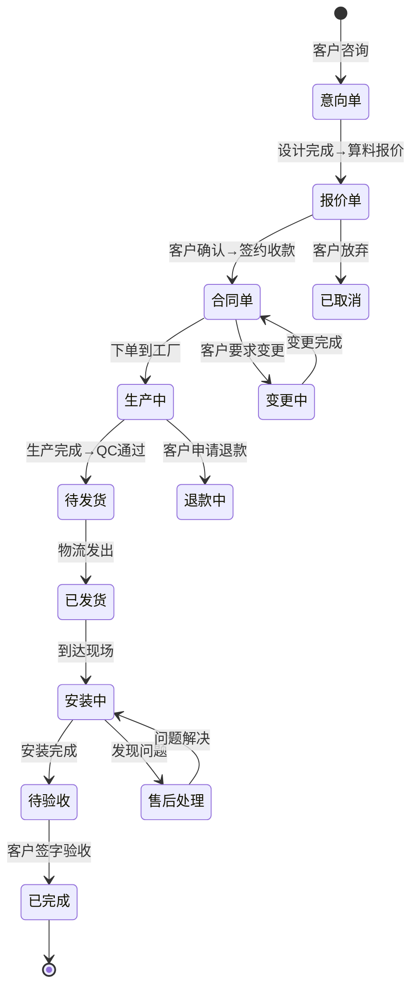
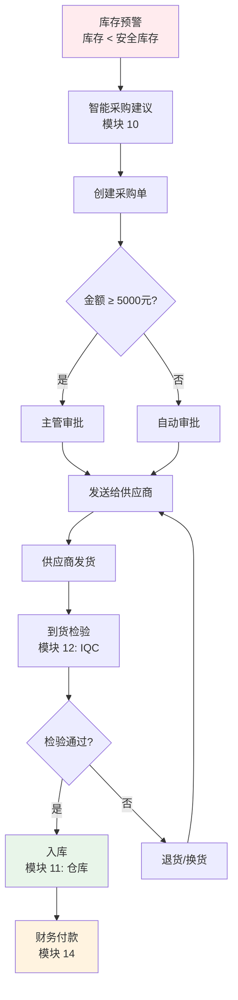
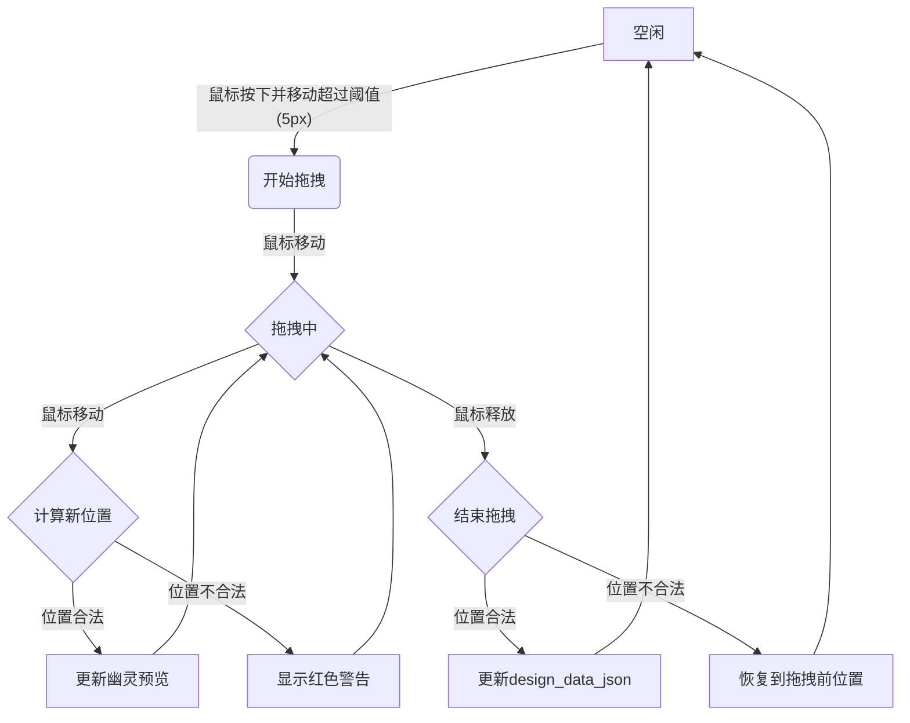

# 《门窗之星》产品需求文档（完整版）

**版本：** V5.5 Complete
**日期：** 2026-03-02
**负责人：** Manus AI
**状态：** 完整自包含，可交付开发

---

## 目录

1.  [修订历史](#1-修订历史)
2.  [产品概述](#2-产品概述)
3.  [数据模型](#3-数据模型)
4.  [画布数据 Schema](#4-画布数据-schema)
5.  [模块一：用户认证与权限](#5-模块一用户认证与权限)
6.  [模块二：首页与订单管理](#6-模块二首页与订单管理)
7.  [模块三：设计门窗（画图核心模块）](#7-模块三设计门窗画图核心模块)
8.  [模块四：型材系列与算料引擎](#8-模块四型材系列与算料引擎)
9.  [模块五：生产管理（排程、BOM、下料）](#9-模块五生产管理排程bom下料)
10. [模块六：采购与供应商管理](#10-模块六采购与供应商管理)
11. [模块七：仓库管理](#11-模块七仓库管理)
12. [模块八：质量管理 (QC)](#12-模块八质量管理-qc)
13. [模块九：客户关系管理 (CRM)](#13-模块九客户关系管理-crm)
14. [模块十：财务管理](#14-模块十财务管理)
15. [模块十一：安装与售后](#15-模块十一安装与售后)
16. [模块十二：营销与展示 (AI/AR/3D)](#16-模块十二营销与展示-aiar3d)
17. [模块十三：数据报表与分析](#17-模块十三数据报表与分析)
18. [模块十四：系统设置](#18-模块十四系统设置)
19. [API 接口定义](#19-api-接口定义)
20. [非功能性需求](#20-非功能性需求)
21. [附录](#21-附录)

---

## 1. 修订历史

| 版本 | 日期 | 修订人 | 修订内容 |
| :--- | :--- | :--- | :--- |
| 1.0-3.0 | 2026-03-01 | Manus AI | 完成基础功能梳理和初步规格定义。 |
| 4.0 | 2026-03-02 | Manus AI | 第一轮深度补齐：修复 36 项短板，包括多租户、核心算法、业务流程等。 |
| 5.0 | 2026-03-02 | Manus AI | 结构性重构与第二轮深度补齐：修复 23 项短板，新增组合窗、权限矩阵、采购/BOM/质量/排程等模块。 |
| 5.0 Complete | 2026-03-02 | Manus AI | **全量合并**：将所有补充文档深度整合为单一自包含文档（4000+ 行），消除碎片化，成为唯一事实来源。 |
| 5.1 | 2026-03-02 | Manus AI | **UX 增强**：补充画图渲染“黄金标准”用户体验章节，定义三位一体交互模型和多层次渲染策略。 |
| 5.2 Complete | 2026-03-02 | Manus AI | **画图模块深度补齐**：新增 Schema 字段联动规则、控制点交互定义、中梃拖拽状态机、2D→3D映射规则、导出打印规格、异常边界处理、撤销粒度、多选批量操作、渲染精确参数、性能量化指标。 |
| 5.3 Complete | 2026-03-02 | Manus AI | **产品战略补充**：新增竞品分析、用户画像、北极星指标、MVP边界定义。**算料引擎增强**：新增 EBNF 语法定义、错误处理机制、安全沙箱规格。**一致性修复**：统一订阅定价为三档、统一技术栈、修复数据模型矛盾。**工程化补充**：新增数据库索引设计、API限流策略、版本控制、压测方案。 |
| 5.5 Complete | 2026-03-02 | Manus AI | **根据 V3 分析报告全面优化**：修复 EBNF 语法不完整（补充三元/比较/逻辑运算符）、统一主键命名规范、统一技术栈为 Konva.js + React 19。新增 3 个端到端业务流程 Mermaid 图、北极星分解指标、WebSocket 事件目录。增强文件上传/OSS规格、下料优化算法伪代码、打印模板引擎规格。统一数据模型声明（补充枚举映射表+转换伪代码）。为 V5.0 新增模块 API 补充完整请求/响应示例。归档 supplements 和过程文件。 |
| 5.5 Complete | 2026-03-02 | Manus AI | **根据 V4 分析报告全面修复**：**治愈结构腐化**（归位错位内容、合并重复章节、统一 API 路径）；**补齐 MVP 关键缺失**（边界校验、尺寸交互、颜色系统、型材切换）；**增强薄弱模块**（仓库/质量/财务管理）；**新增算料引擎调试工具**；**完成文件治理**（归档过程文件、更新版本标注）。 |

---

## 2. 产品概述

《门窗之星》是一款面向门窗行业的 **SaaS 企业运营平台**，旨在通过数字化、一体化的解决方案，打通从营销获客、设计报价、合同签订、生产采购、仓储物流到安装售后的全业务链路。产品以 Web 端为核心，关键环节（如安装、扫码）适配移动端，帮助门窗企业降本增效，实现精细化运营。

### 2.1 核心价值

- **设计生产一体化**：设计即算料，算料即生产。设计图直接驱动 BOM 生成、型材优化和设备对接，消除数据孤岛。
- **全流程覆盖**：超越传统画图算料工具，深入管理采购、库存、生产、质检、财务、客户等核心企业资源。
- **多租户 SaaS**：为不同规模的企业（门店、工厂）提供灵活的订阅计划和数据隔离保障。
- **智能化赋能**：集成 AI 炫图、AR 搭配、3D 渲染等创新功能，提升营销转化率和客户体验。

### 2.2 竞品分析 (V5.3 新增)

| 维度 | **本项目 (门窗之星)** | **画门窗Pro** | **门窗大师** | **酷家乐 (门窗版)** |
| :--- | :--- | :--- | :--- | :--- |
| **产品定位** | 面向中小型门窗厂和门店的一体化 SaaS 平台 | 移动端优先的快速画图、报价、算料工具 | 面向中大型门窗企业的全流程管理软件 (ERP) | 侧重营销和前端设计的 3D 可视化工具 |
| **核心功能** | 画图设计、算料报价、生产管理、CRM、财务 | 画图、报价、算料、效果图、优化、设备对接 | 订单、库存、供应链、生产、财务、销售全流程 | 3D 可视化设计、渲染、VR 体验、自由绘窗 |
| **目标用户** | **主：** 中小型工厂老板/设计师 **次：** 门店销售 | 门店销售、个体户、小型工厂 | 中大型工厂的专业岗位（计划员、采购、财务） | 设计师、门店销售、C 端业主 |
| **定价模式** | SaaS 订阅 (按用户数/功能模块) | 9.9 元试用，按年订阅 | 5000元/套起，项目制/买断制为主 | 免费版 + 会员订阅 (399-999元/年) |
| **优势** | 功能全面，覆盖从设计到生产全链路；SaaS 模式成本低 | 移动端体验好，操作简单，上手快，价格低廉 | 功能深度最强，覆盖企业运营全流程 | 3D 渲染效果最好，营销属性强，品牌知名度高 |
| **劣势** | 功能深度不及"门窗大师"，3D 效果不及"酷家乐" | 生产管理和后端功能较弱 | 价格昂贵，实施周期长，操作复杂 | 生产和算料功能相对较弱，偏向设计端 |

**差异化定位：** 门窗之星的核心竞争力在于"高性价比的一体化"——既不像画门窗Pro那样功能单薄，也不像门窗大师那样昂贵复杂。我们瞄准的是中小型企业数字化转型的市场空白，提供"够用、好用、用得起"的全链路解决方案。

### 2.3 用户画像 (V5.3 新增)

#### 2.3.1 主要用户画像：张老板 (中小型工厂老板)

- **背景：** 45岁，经营一家 30 人的门窗加工厂，自己也懂技术和设计。
- **目标：** 提高生产效率，降低算料错误率，管理好订单和客户，减少对老师傅的依赖。
- **痛点：** 手工算料易出错，订单多时管理混乱，客户需求反复变更，生产进度不透明。
- **期望：** 一套软件能解决画图、算料、报价、下单、生产所有问题，价格实惠，手机上也能随时看报表。

#### 2.3.2 次要用户画像：李销售 (门店销售员)

- **背景：** 28岁，在建材市场开了一家品牌门窗加盟店。
- **目标：** 快速为客户出图、报价，促成签单。
- **痛点：** 手绘图不专业，CAD 太难学，给客户报总价算得慢，无法展示安装后效果。
- **期望：** 能在平板上几分钟就画出客户想要的窗型，自动算出准确价格，最好能有个 3D 效果图给客户看，显得专业。

### 2.4 北极星指标 (V5.3 新增)

> **有效订单创建数 (Number of Valid Orders Created)**

一个"有效订单"必须是通过本软件的画图和算料功能生成，并最终进入"待生产"状态的订单。该指标直接反映了产品的核心价值——打通设计与生产，是衡量用户是否真正使用我们核心功能的关键。

**计算公式：** 每周/每月，状态流转到"待生产"的 `orders` 表记录总数。

### 2.5 MVP 边界定义 (V5.3 新增)

**目标：** 验证核心流程（画图 → 算料 → 报价 → 下单）的闭环，服务好"张老板"这一核心用户画像。

| **包含 (MVP V1.0)** | **排除 (后续版本)** |
| :--- | :--- |
| √ 2D 画图核心（模板+拖拽） | × 复杂组合窗（转角/飘窗 → V1.1） |
| √ 算料引擎（支持基础公式） | × 下料优化算法（→ V1.1） |
| √ 订单管理（创建/查看/改价） | × 完整的订单变更/退款流程（→ V1.1） |
| √ 客户管理（基础信息录入） | × 销售漏斗/跟进记录（→ V1.2） |
| √ 基础的型材/玻璃/五金库 | × 完整的采购/供应商管理（→ V2.0） |
| √ 用户认证与数据隔离 | × 完整的 RBAC 权限矩阵（→ V1.1） |
| √ 基础的系统设置 | × 3D 渲染与 AI 效果图（→ V2.0） |
| | × 生产排程/BOM/质检（→ V2.0） |
| | × 财务管理（→ V2.0） |

### 2.6 订阅计划与功能映射

| 计划 | 价格 | 目标用户 | 用户数上限 | 存储配额 | 核心功能 |
| :--- | :--- | :--- | :--- | :--- | :--- |
| **免费版** | 0元 | 个人、体验用户 | 1 | 100MB | 设计画图、算料报价（限10单/月）、订单管理（限10单/月） |
| **专业版** | ¥399/用户/年 | 门店、小型工厂 | 5 | 5GB | 全部免费版功能（无数据量限制）+ 客户管理 + 3D渲染 + AI效果图（10次/月） |
| **企业版** | ¥999/用户/年 | 中型工厂、连锁门店 | 不限 | 50GB | 全部专业版功能 + 生产管理 + 财务管理 + AI效果图（50次/月） |

### 2.7 技术架构概述

| 层级 | 技术选型 | 选型依据 |
| :--- | :--- | :--- |
| 前端框架 | React 19 + TypeScript + Vite + Tailwind CSS 4 | 与现有代码一致 |
| 状态管理 | Zustand（全局状态）+ useReducer（画布局部状态） | Zustand 轻量且与 React 19 兼容性佳 |
| 2D 画布引擎 | **Konva.js + react-konva** | 场景图架构与 Cell 递归树天然对齐，官方有 Window Frame Designer 示例，AVADA MEDIA 行业验证（详见《画布引擎技术选型分析报告》） |
| 3D 渲染引擎 | Three.js（3D预览/阳光房） | Web 3D 行业标准 |
| 后端框架 | Node.js + NestJS + TypeScript + Prisma (ORM) | NestJS 模块化架构适合多模块 SaaS |
| 数据库 | MySQL 8.0（主库）+ Redis（缓存/队列） | 成熟稳定，生态完善 |
| 对象存储 | 阿里云 OSS / AWS S3 | 图片、设计图、合同文件存储 |
| 搜索引擎 | Elasticsearch（订单、客户、物料全文检索） | V1.1+ 引入 |
| 实时通信 | WebSocket（Socket.io） | 通知推送、生产状态变更 |
| AI 服务 | ControlNet + Stable Diffusion（GPU 服务器 / 云 API） | V1.2+ 引入 |
| 部署 | Docker + Kubernetes，阿里云/腾讯云 | 容器化标准部署 |

> **技术选型决策记录：** 2D 画布引擎经过 Konva.js / Fabric.js / 手写 SVG 三方对比评估（详见《画布引擎技术选型分析报告》），Konva.js 以加权总分 9.0/10 胜出。核心理由：① 场景图架构与 Cell 递归树天然对齐；② 官方维护 Window Frame Designer 示例；③ AVADA MEDIA 行业验证；④ 多层渲染 + 脏区域检测保证性能扩展性。迁移策略采用渐进式：Sprint 1 替换渲染层，Sprint 2 起在 Konva.js 基础上开发新功能。

### 2.8 北极星指标分解体系 (V5.4 新增)

北极星指标（**有效订单创建数**）需要分解为可追踪的先行指标（Leading Indicators），以便团队在日常工作中监控产品健康度。

```
北极星：有效订单创建数
├── 激活指标
│   ├── 周新增注册用户数
│   ├── 注册→1单转化率（目标 ≥40%）
│   └── 首单创建时间（目标 ≤30分钟）
├── 活跃指标
│   ├── 周活跃设计数（至少完成 1 次设计的用户数）
│   ├── 单用户周均设计数（目标 ≥5）
│   └── 算料完成率（设计⇒算料转化率，目标 ≥80%）
├── 质量指标
│   ├── 订单变更率（目标 ≤10%）
│   ├── 设计返工率（因设计错误导致的返工，目标 ≤2%）
│   └── 用户满意度 NPS（目标 ≥40）
└── 商业指标
    ├── 付费转化率（免费⇒付费，目标 ≥5%）
    ├── 月留存率（目标 ≥90%）
    └── ARPU（单用户平均收入，目标 ≥¥30/月）
```

### 2.9 端到端核心业务流程 (V5.4 新增)

以下三个 Mermaid 流程图描述了系统最核心的跨模块业务链路。

#### 2.9.1 流程一：从设计到生产的完整链路


#### 2.9.2 流程二：订单全生命周期



#### 2.9.3 流程三：采购闭环



### 2.10 画图模块数据模型统一声明 (V5.4 新增)

> **重要声明：** 本文档第 4 章定义的 `design_data_json` Schema（扁平数组结构）为前后端数据交换的唯一标准。`docs/画图模块_可执行规格书.md` 中定义的递归树形结构（`WindowUnit` → `Frame` → `Opening` → `childOpenings[]`）为前端渲染层的内部实现结构，不作为 API 契约。两者的映射关系如下：
>
> | PRD 第 4 章 (API 契约) | 可执行规格书 (前端内部) | 映射说明 |
> | :--- | :--- | :--- |
> | `design_data_json.frame` | `WindowUnit.frame` | 一对一映射 |
> | `design_data_json.mullions[]` | `Opening.mullions[]`（递归收集） | 前端保存时将递归树展平为数组 |
> | `design_data_json.sashes[]` | `Opening.sash`（递归收集） | 前端保存时将递归树展平为数组 |
> | `design_data_json.glasses[]` | `Sash.glassPane` + `Opening.glassPane` | 前端保存时将递归树展平为数组 |
> | `sash.openDirection`（10种中文枚举） | `Sash.openingType`（14种英文枚举） | 前端维护双向映射表 |
> | 未定义 | `Hardware` 接口 | V1.1 后端补充五金件字段 |
>
> 前端开发人员应使用可执行规格书的 TypeScript 接口进行编码，并在 API 层（`save`/`load`）实现"递归树 ↔ 扁平数组"的双向转换。
>
> **枚举值双向映射表（openDirection ↔ openingType）：**
>
> | PRD `sash.openDirection` | 规格书 `Sash.openingType` | 说明 |
> | :--- | :--- | :--- |
> | 左开 | `LEFT_CASEMENT` | 左侧铰链，向内/外开启 |
> | 右开 | `RIGHT_CASEMENT` | 右侧铰链，向内/外开启 |
> | 左外开 | `LEFT_CASEMENT_OUT` | 左侧铰链，向外开启 |
> | 右外开 | `RIGHT_CASEMENT_OUT` | 右侧铰链，向外开启 |
> | 上悬 | `TOP_HUNG` | 顶部铰链，向外开启 |
> | 下悬 | `BOTTOM_HUNG` | 底部铰链，向内开启 |
> | 内开内倒 | `TILT_AND_TURN` | 双模式：内开 + 内倒 |
> | 推拉左 | `SLIDING_LEFT` | 向左推拉 |
> | 推拉右 | `SLIDING_RIGHT` | 向右推拉 |
> | 固定 | `FIXED` | 不可开启 |
> | — | `TOP_CASEMENT` | PRD 暂未定义，V1.1 补充 |
> | — | `BOTTOM_CASEMENT` | PRD 暂未定义，V1.1 补充 |
> | — | `PIVOT_HORIZONTAL` | PRD 暂未定义，V1.1 补充 |
> | — | `PIVOT_VERTICAL` | PRD 暂未定义，V1.1 补充 |
>
> **递归树 → 扁平数组转换伪代码：**
>
> ```typescript
> function flattenCellTree(root: Opening): DesignDataJson {
>   const mullions: Mullion[] = [];
>   const sashes: Sash[] = [];
>   const glasses: Glass[] = [];
>
>   function traverse(cell: Opening, depth: number) {
>     if (cell.mullions) {
>       for (const m of cell.mullions) {
>         mullions.push({
>           id: m.id,
>           direction: m.direction,  // 'horizontal' | 'vertical'
>           position: m.position,    // 相对于父Cell的偏移(mm)
>           parentCellId: cell.id
>         });
>       }
>     }
>     if (cell.sash) {
>       sashes.push({
>         id: cell.sash.id,
>         cellId: cell.id,
>         openDirection: mapOpeningTypeToDirection(cell.sash.openingType),
>         handlePosition: cell.sash.handleSide
>       });
>     }
>     if (cell.glassPane) {
>       glasses.push({
>         id: cell.glassPane.id,
>         cellId: cell.id,
>         type: cell.glassPane.glassType,
>         thickness: cell.glassPane.thickness
>       });
>     }
>     if (cell.childOpenings) {
>       for (const child of cell.childOpenings) {
>         traverse(child, depth + 1);
>       }
>     }
>   }
>
>   traverse(root, 0);
>   return { frame: root.frame, mullions, sashes, glasses };
> }
> ```

---

## 3. 数据模型

本节定义系统全部 **40+ 张核心数据表**。所有业务表均包含 `tenant_id` 字段实现多租户行级隔离，并包含 `deleted_at` 字段支持软删除。

### 3.1 多租户隔离方案

采用**共享数据库 + 行级隔离**（Row-Level Security）方案。

**隔离规则：**
1. **中间件层**：所有 API 请求经过 `TenantMiddleware`，从 JWT Token 中提取 `tenant_id`，注入到请求上下文。
2. **ORM 层**：使用全局查询过滤器，自动为所有 SELECT/UPDATE/DELETE 语句附加 `tenant_id` 条件。
3. **INSERT 层**：所有新增记录自动填充当前 `tenant_id`，禁止前端传入。
4. **管理后台**：超级管理员（平台运营方）可跨租户查询，使用独立的管理 API 路径 `/admin/api/`。

### 3.2 `tenant` — 租户表

| 字段名 | 数据类型 | 键 | 可空 | 默认值 | 描述 |
| :--- | :--- | :--- | :--- | :--- | :--- |
| tenant_id | VARCHAR(36) | PK | N | UUID | 租户唯一标识 |
| name | VARCHAR(100) | — | N | — | 企业名称 |
| admin_user_id | VARCHAR(36) | FK→user | N | — | 管理员账号 |
| plan | ENUM('免费版','专业版','企业版') | — | N | '免费版' | 订阅计划 |
| trial_expires_at | DATE | — | Y | NULL | 试用到期日 |
| max_users | INT | — | N | 5 | 最大子账号数 |
| storage_quota_mb | INT | — | N | 1024 | 存储配额 MB |
| created_at | DATETIME | — | N | NOW() | 创建时间 |

### 3.3 `user` — 用户表

| 字段名 | 数据类型 | 键 | 可空 | 默认值 | 描述 |
| :--- | :--- | :--- | :--- | :--- | :--- |
| user_id | VARCHAR(36) | PK | N | UUID | 用户唯一标识 |
| tenant_id | VARCHAR(36) | FK→tenant | N | — | 所属租户 |
| phone | VARCHAR(20) | UNI | N | — | 手机号（登录账号） |
| password_hash | VARCHAR(255) | — | N | — | 密码哈希（bcrypt, salt≥12） |
| nickname | VARCHAR(50) | — | Y | NULL | 昵称 |
| avatar_url | VARCHAR(255) | — | Y | NULL | 头像 URL |
| role_id | VARCHAR(36) | FK→role | N | — | 角色 ID |
| is_admin | BOOLEAN | — | N | FALSE | 是否为租户管理员 |
| status | ENUM('active','disabled') | — | N | 'active' | 账号状态 |
| last_login_at | DATETIME | — | Y | NULL | 最后登录时间 |
| created_at | DATETIME | — | N | NOW() | 创建时间 |
| deleted_at | DATETIME | — | Y | NULL | 软删除时间 |

### 3.4 `role` — 角色表（全局共享）

| 字段名 | 数据类型 | 键 | 可空 | 默认值 | 描述 |
| :--- | :--- | :--- | :--- | :--- | :--- |
| role_id | VARCHAR(36) | PK | N | UUID | 角色唯一标识 |
| name | VARCHAR(50) | UNI | N | — | 角色名称 |
| permissions_json | JSON | — | N | — | 权限配置 JSON |
| description | VARCHAR(200) | — | Y | NULL | 角色描述 |

**预置角色：** 系统管理员、老板/总经理、设计师、业务员、财务、生产主管、仓管、安装工

### 3.5 `customer` — 客户表

| 字段名 | 数据类型 | 键 | 可空 | 默认值 | 描述 |
| :--- | :--- | :--- | :--- | :--- | :--- |
| customer_id | VARCHAR(36) | PK | N | UUID | 客户唯一标识 |
| tenant_id | VARCHAR(36) | FK→tenant | N | — | 所属租户 |
| name | VARCHAR(50) | — | N | — | 客户姓名 |
| phone | VARCHAR(20) | — | Y | NULL | 联系电话 |
| address | VARCHAR(200) | — | Y | NULL | 地址 |
| type | ENUM('deal','potential') | — | N | 'potential' | 客户类型 |
| stage | ENUM('初步接触','意向明确','报价阶段','合同阶段','已成交','已流失') | — | N | '初步接触' | 销售漏斗阶段 |
| salesman_id | VARCHAR(36) | FK→user | Y | NULL | 业务员 |
| discount | DECIMAL(4,2) | — | N | 1.00 | 折扣系数（0.01~1.00） |
| balance | DECIMAL(12,2) | — | N | 0.00 | 预付余额 |
| remark | TEXT | — | Y | NULL | 备注 |
| created_at | DATETIME | — | N | NOW() | 创建时间 |
| deleted_at | DATETIME | — | Y | NULL | 软删除时间 |

### 3.6 `order` — 订单表

| 字段名 | 数据类型 | 键 | 可空 | 默认值 | 描述 |
| :--- | :--- | :--- | :--- | :--- | :--- |
| order_id | VARCHAR(36) | PK | N | UUID | 订单唯一标识 |
| tenant_id | VARCHAR(36) | FK→tenant | N | — | 所属租户 |
| order_number | VARCHAR(20) | UNI | N | — | 订单号（FG+年月日+序号） |
| customer_id | VARCHAR(36) | FK→customer | N | — | 关联客户 |
| status | ENUM('意向单','合同单') | — | N | '意向单' | 订单合同状态 |
| production_status | ENUM('待生产','生产中','已完成','已发货','已安装') | — | N | '待生产' | 生产状态 |
| address | VARCHAR(200) | — | Y | NULL | 安装地址 |
| total_count | INT | — | N | 0 | 门窗总数量 |
| total_area | DECIMAL(10,2) | — | N | 0.00 | 总面积（㎡） |
| total_amount | DECIMAL(12,2) | — | N | 0.00 | 总金额 |
| discount_amount | DECIMAL(12,2) | — | N | 0.00 | 折扣金额 |
| final_amount | DECIMAL(12,2) | — | N | 0.00 | 应付金额 |
| paid_amount | DECIMAL(12,2) | — | N | 0.00 | 已付金额 |
| ordered_at | DATE | — | N | — | 下单日期 |
| created_by | VARCHAR(36) | FK→user | N | — | 创建人 |
| remark | TEXT | — | Y | NULL | 备注 |
| version | INT | — | N | 1 | 乐观锁版本号 |
| created_at | DATETIME | — | N | NOW() | 创建时间 |
| updated_at | DATETIME | — | N | NOW() | 更新时间 |
| deleted_at | DATETIME | — | Y | NULL | 软删除时间 |

### 3.7 `order_item` — 订单明细表（门窗项）

| 字段名 | 数据类型 | 键 | 可空 | 默认值 | 描述 |
| :--- | :--- | :--- | :--- | :--- | :--- |
| item_id | VARCHAR(36) | PK | N | UUID | 明细唯一标识 |
| tenant_id | VARCHAR(36) | FK→tenant | N | — | 所属租户（冗余） |
| order_id | VARCHAR(36) | FK→order | N | — | 关联订单 |
| window_number | VARCHAR(10) | — | N | — | 窗号（如 C1, C2） |
| series_id | VARCHAR(36) | FK→product_series | Y | NULL | 型材系列 |
| width | INT | — | N | 0 | 宽度 mm |
| height | INT | — | N | 0 | 高度 mm |
| area | DECIMAL(10,2) | — | N | 0.00 | 面积 ㎡ |
| quantity | INT | — | N | 1 | 樘数 |
| unit_price | DECIMAL(12,2) | — | N | 0.00 | 单价 |
| amount | DECIMAL(12,2) | — | N | 0.00 | 金额 |
| remark | TEXT | — | Y | NULL | 备注 |
| sort_order | INT | — | N | 0 | 排序序号 |

### 3.8 `window_design` — 门窗设计表

| 字段名 | 数据类型 | 键 | 可空 | 默认值 | 描述 |
| :--- | :--- | :--- | :--- | :--- | :--- |
| design_id | VARCHAR(36) | PK | N | UUID | 设计唯一标识 |
| tenant_id | VARCHAR(36) | FK→tenant | N | — | 所属租户 |
| item_id | VARCHAR(36) | FK→order_item | N | — | 关联订单明细 |
| design_data_json | JSON | — | N | — | 画布设计数据（见第4章） |
| thumbnail_url | VARCHAR(255) | — | Y | NULL | 缩略图 URL |
| version | INT | — | N | 1 | 设计版本号 |
| owner_user_id | VARCHAR(36) | FK→user | N | — | 设计者 |
| created_at | DATETIME | — | N | NOW() | 创建时间 |
| updated_at | DATETIME | — | N | NOW() | 更新时间 |

### 3.9 `design_version` — 设计版本历史表（新增）

| 字段名 | 数据类型 | 键 | 可空 | 默认值 | 描述 |
| :--- | :--- | :--- | :--- | :--- | :--- |
| version_id | VARCHAR(36) | PK | N | UUID | 版本唯一标识 |
| design_id | VARCHAR(36) | FK→window_design | N | — | 关联设计 |
| version_number | INT | — | N | — | 版本号 |
| design_data_json | JSON | — | N | — | 该版本的完整快照 |
| created_by | VARCHAR(36) | FK→user | N | — | 操作人 |
| created_at | DATETIME | — | N | NOW() | 创建时间 |

> **版本管理规则**：每次保存设计时自动创建新版本，保留最近 20 个版本。超出后删除最旧版本。支持版本对比和回滚。

### 3.10 `product_series` — 型材系列表

| 字段名 | 数据类型 | 键 | 可空 | 默认值 | 描述 |
| :--- | :--- | :--- | :--- | :--- | :--- |
| series_id | VARCHAR(36) | PK | N | UUID | 系列唯一标识 |
| tenant_id | VARCHAR(36) | FK→tenant | N | — | 所属租户 |
| folder_id | VARCHAR(36) | FK→series_folder | Y | NULL | 所属目录 |
| name | VARCHAR(100) | — | N | — | 系列名称 |
| thumbnail_url | VARCHAR(255) | — | Y | NULL | 截面图 URL |
| tutorial_url | VARCHAR(255) | — | Y | NULL | 教程视频 URL |
| owner_user_id | VARCHAR(36) | FK→user | N | — | 创建者 |
| sort_order | INT | — | N | 0 | 排序序号 |
| created_at | DATETIME | — | N | NOW() | 创建时间 |
| deleted_at | DATETIME | — | Y | NULL | 软删除时间 |

### 3.11 `series_folder` — 系列目录表

| 字段名 | 数据类型 | 键 | 可空 | 默认值 | 描述 |
| :--- | :--- | :--- | :--- | :--- | :--- |
| folder_id | VARCHAR(36) | PK | N | UUID | 目录唯一标识 |
| tenant_id | VARCHAR(36) | FK→tenant | N | — | 所属租户 |
| parent_id | VARCHAR(36) | FK→self | Y | NULL | 父目录 ID |
| name | VARCHAR(100) | — | N | — | 目录名称 |
| sort_order | INT | — | N | 0 | 排序序号 |
| owner_user_id | VARCHAR(36) | FK→user | N | — | 创建者 |

### 3.12 `calculation_rule` — 算料公式表

| 字段名 | 数据类型 | 键 | 可空 | 默认值 | 描述 |
| :--- | :--- | :--- | :--- | :--- | :--- |
| rule_id | VARCHAR(36) | PK | N | UUID | 公式唯一标识 |
| tenant_id | VARCHAR(36) | FK→tenant | N | — | 所属租户 |
| series_id | VARCHAR(36) | FK→product_series | N | — | 关联系列 |
| tab_type | ENUM('外框','内扇','对开扇','推拉扇','折叠扇','产品报价','成本核算','计件工资','设计规则','打孔设置') | — | N | — | 公式 Tab 类型 |
| formula_json | JSON | — | N | — | 公式配置（见 8.2 节） |
| variables_json | JSON | — | Y | NULL | 自定义变量 |
| created_at | DATETIME | — | N | NOW() | 创建时间 |
| updated_at | DATETIME | — | N | NOW() | 更新时间 |

### 3.13 `material` — 物料表

| 字段名 | 数据类型 | 键 | 可空 | 默认值 | 描述 |
| :--- | :--- | :--- | :--- | :--- | :--- |
| material_id | VARCHAR(36) | PK | N | UUID | 物料唯一标识 |
| tenant_id | VARCHAR(36) | FK→tenant | N | — | 所属租户 |
| code | VARCHAR(50) | — | N | — | 物料编号 |
| name | VARCHAR(100) | — | N | — | 物料名称 |
| category | ENUM('型材','玻璃','五金','配件','其他') | — | N | — | 分类 |
| color | VARCHAR(50) | — | Y | NULL | 颜色 |
| unit | VARCHAR(20) | — | N | — | 计量单位（米/㎡/个/支） |
| calc_method | ENUM('按尺寸','按数量','按面积') | — | N | — | 计算方式 |
| cost_price | DECIMAL(10,2) | — | N | 0.00 | 成本价 |
| markup_rate | DECIMAL(6,2) | — | Y | NULL | 利率 % |
| sell_price | DECIMAL(10,2) | — | N | 0.00 | 报价 |
| bar_length | INT | — | Y | NULL | 标准棒料长度 mm（型材专用） |
| weight_per_meter | DECIMAL(6,3) | — | Y | NULL | 每米重量 kg |
| series_id | VARCHAR(36) | FK→product_series | Y | NULL | 关联系列 |
| owner_user_id | VARCHAR(36) | FK→user | N | — | 创建者 |
| remark | TEXT | — | Y | NULL | 备注 |
| created_at | DATETIME | — | N | NOW() | 创建时间 |
| deleted_at | DATETIME | — | Y | NULL | 软删除时间 |

### 3.14 `color` — 颜色配置表

| 字段名 | 数据类型 | 键 | 可空 | 默认值 | 描述 |
| :--- | :--- | :--- | :--- | :--- | :--- |
| color_id | VARCHAR(36) | PK | N | UUID | 颜色唯一标识 |
| tenant_id | VARCHAR(36) | FK→tenant | N | — | 所属租户 |
| name | VARCHAR(50) | — | N | — | 颜色名称 |
| type | ENUM('solid','woodgrain') | — | N | — | 纯色/木纹 |
| hex_value | VARCHAR(7) | — | Y | NULL | HEX 色值（纯色） |
| texture_url | VARCHAR(255) | — | Y | NULL | 贴图 URL（木纹） |
| sort_order | INT | — | N | 0 | 排序序号 |
| owner_user_id | VARCHAR(36) | FK→user | N | — | 创建者 |

### 3.15 `quotation` — 报价单表

| 字段名 | 数据类型 | 键 | 可空 | 默认值 | 描述 |
| :--- | :--- | :--- | :--- | :--- | :--- |
| quotation_id | VARCHAR(36) | PK | N | UUID | 报价单唯一标识 |
| tenant_id | VARCHAR(36) | FK→tenant | N | — | 所属租户 |
| order_id | VARCHAR(36) | FK→order | N | — | 关联订单 |
| total_amount | DECIMAL(12,2) | — | N | 0.00 | 报价总额 |
| discount_type | ENUM('none','percentage','fixed') | — | N | 'none' | 折扣类型 |
| discount_value | DECIMAL(10,2) | — | N | 0.00 | 折扣值 |
| final_amount | DECIMAL(12,2) | — | N | 0.00 | 折后金额 |
| template_id | VARCHAR(36) | — | Y | NULL | 报价单模板 ID |
| generated_at | DATETIME | — | N | NOW() | 生成时间 |

### 3.16 `quotation_item` — 报价明细表

| 字段名 | 数据类型 | 键 | 可空 | 默认值 | 描述 |
| :--- | :--- | :--- | :--- | :--- | :--- |
| qi_id | VARCHAR(36) | PK | N | UUID | 明细唯一标识 |
| quotation_id | VARCHAR(36) | FK→quotation | N | — | 关联报价单 |
| item_id | VARCHAR(36) | FK→order_item | Y | NULL | 关联门窗明细 |
| material_code | VARCHAR(50) | — | N | — | 物料编号 |
| material_name | VARCHAR(100) | — | N | — | 物料名称 |
| category | VARCHAR(20) | — | N | — | 分类 |
| spec | VARCHAR(50) | — | Y | NULL | 规格 |
| quantity | DECIMAL(10,2) | — | N | 0 | 数量 |
| unit | VARCHAR(20) | — | N | — | 单位 |
| unit_price | DECIMAL(10,2) | — | N | 0.00 | 单价 |
| amount | DECIMAL(12,2) | — | N | 0.00 | 金额 |

### 3.17 `payment` — 收款记录表

| 字段名 | 数据类型 | 键 | 可空 | 默认值 | 描述 |
| :--- | :--- | :--- | :--- | :--- | :--- |
| payment_id | VARCHAR(36) | PK | N | UUID | 收款唯一标识 |
| tenant_id | VARCHAR(36) | FK→tenant | N | — | 所属租户 |
| order_id | VARCHAR(36) | FK→order | N | — | 关联订单 |
| amount | DECIMAL(12,2) | — | N | — | 收款金额 |
| account_id | VARCHAR(36) | FK→payment_account | N | — | 收款账户 |
| paid_at | DATETIME | — | N | — | 收款时间 |
| is_voided | BOOLEAN | — | N | FALSE | 是否已作废 |
| voided_at | DATETIME | — | Y | NULL | 作废时间 |
| operator_id | VARCHAR(36) | FK→user | N | — | 操作人 |
| remark | TEXT | — | Y | NULL | 备注 |
| created_at | DATETIME | — | N | NOW() | 创建时间 |

### 3.18 `payment_account` — 收款账户表

| 字段名 | 数据类型 | 键 | 可空 | 默认值 | 描述 |
| :--- | :--- | :--- | :--- | :--- | :--- |
| account_id | VARCHAR(36) | PK | N | UUID | 账户唯一标识 |
| tenant_id | VARCHAR(36) | FK→tenant | N | — | 所属租户 |
| name | VARCHAR(100) | — | N | — | 账户名称 |
| type | ENUM('银行卡','微信','支付宝','现金','其他') | — | N | — | 账户类型 |
| account_number | VARCHAR(50) | — | Y | NULL | 账号 |
| owner_user_id | VARCHAR(36) | FK→user | N | — | 创建者 |

### 3.19 `expense` — 支出记录表

| 字段名 | 数据类型 | 键 | 可空 | 默认值 | 描述 |
| :--- | :--- | :--- | :--- | :--- | :--- |
| expense_id | VARCHAR(36) | PK | N | UUID | 支出唯一标识 |
| tenant_id | VARCHAR(36) | FK→tenant | N | — | 所属租户 |
| amount | DECIMAL(12,2) | — | N | — | 支出金额 |
| category | VARCHAR(50) | — | Y | NULL | 支出分类 |
| description | TEXT | — | Y | NULL | 描述 |
| expense_date | DATE | — | N | — | 支出日期 |
| operator_id | VARCHAR(36) | FK→user | N | — | 操作人 |
| created_at | DATETIME | — | N | NOW() | 创建时间 |

### 3.20 `refund` — 退款单表（新增）

| 字段名 | 数据类型 | 键 | 可空 | 默认值 | 描述 |
| :--- | :--- | :--- | :--- | :--- | :--- |
| refund_id | VARCHAR(36) | PK | N | UUID | 退款唯一标识 |
| tenant_id | VARCHAR(36) | FK→tenant | N | — | 所属租户 |
| order_id | VARCHAR(36) | FK→order | Y | NULL | 关联订单 |
| amount | DECIMAL(12,2) | — | N | — | 退款金额 |
| reason | TEXT | — | Y | NULL | 退款原因 |
| status | ENUM('待退款','已退款','已关闭') | — | N | '待退款' | 退款状态 |
| requested_by | VARCHAR(36) | FK→user | N | — | 申请人 |
| approved_by | VARCHAR(36) | FK→user | Y | NULL | 审批人 |
| refunded_at | DATETIME | — | Y | NULL | 退款时间 |
| created_at | DATETIME | — | N | NOW() | 创建时间 |

### 3.21 `order_change_log` — 订单变更日志表（新增）

| 字段名 | 数据类型 | 键 | 可空 | 默认值 | 描述 |
| :--- | :--- | :--- | :--- | :--- | :--- |
| change_id | VARCHAR(36) | PK | N | UUID | 变更唯一标识 |
| tenant_id | VARCHAR(36) | FK→tenant | N | — | 所属租户 |
| order_id | VARCHAR(36) | FK→order | N | — | 关联订单 |
| requested_by | VARCHAR(36) | FK→user | N | — | 申请人 |
| approved_by | VARCHAR(36) | FK→user | Y | NULL | 审批人 |
| status | ENUM('待审批','已批准','已驳回') | — | N | '待审批' | 变更状态 |
| changes_json | JSON | — | N | — | 变更内容（旧值→新值） |
| price_difference | DECIMAL(12,2) | — | N | 0.00 | 差价 |
| created_at | DATETIME | — | N | NOW() | 申请时间 |
| approved_at | DATETIME | — | Y | NULL | 审批时间 |

### 3.22 `production_task` — 生产任务表

| 字段名 | 数据类型 | 键 | 可空 | 默认值 | 描述 |
| :--- | :--- | :--- | :--- | :--- | :--- |
| task_id | VARCHAR(36) | PK | N | UUID | 任务唯一标识 |
| tenant_id | VARCHAR(36) | FK→tenant | N | — | 所属租户 |
| order_id | VARCHAR(36) | FK→order | N | — | 关联订单 |
| item_id | VARCHAR(36) | FK→order_item | Y | NULL | 关联门窗明细 |
| status | ENUM('待排产','已排产','生产中','已完成','已发货') | — | N | '待排产' | 生产状态 |
| priority | ENUM('普通','加急','紧急') | — | N | '普通' | 优先级 |
| planned_start | DATE | — | Y | NULL | 计划开始日期 |
| planned_end | DATE | — | Y | NULL | 计划完成日期 |
| actual_start | DATETIME | — | Y | NULL | 实际开始时间 |
| actual_end | DATETIME | — | Y | NULL | 实际完成时间 |
| assigned_to | VARCHAR(36) | FK→user | Y | NULL | 负责人 |
| created_at | DATETIME | — | N | NOW() | 创建时间 |

### 3.23 `production_plan` — 生产计划表（新增）

| 字段名 | 数据类型 | 键 | 可空 | 默认值 | 描述 |
| :--- | :--- | :--- | :--- | :--- | :--- |
| plan_id | VARCHAR(36) | PK | N | UUID | 计划唯一标识 |
| tenant_id | VARCHAR(36) | FK→tenant | N | — | 所属租户 |
| name | VARCHAR(100) | — | N | — | 计划名称 |
| status | ENUM('草稿','已确认','执行中','已完成') | — | N | '草稿' | 计划状态 |
| planned_date | DATE | — | N | — | 计划日期 |
| capacity_json | JSON | — | Y | NULL | 产能配置 |
| created_by | VARCHAR(36) | FK→user | N | — | 创建人 |
| created_at | DATETIME | — | N | NOW() | 创建时间 |

### 3.24 `bom` — 物料清单表（新增）

| 字段名 | 数据类型 | 键 | 可空 | 默认值 | 描述 |
| :--- | :--- | :--- | :--- | :--- | :--- |
| bom_id | VARCHAR(36) | PK | N | UUID | BOM 唯一标识 |
| tenant_id | VARCHAR(36) | FK→tenant | N | — | 所属租户 |
| order_id | VARCHAR(36) | FK→order | N | — | 关联订单 |
| item_id | VARCHAR(36) | FK→order_item | Y | NULL | 关联门窗明细 |
| version | INT | — | N | 1 | BOM 版本号 |
| status | ENUM('草稿','已确认','已变更') | — | N | '草稿' | BOM 状态 |
| generated_at | DATETIME | — | N | NOW() | 生成时间 |

### 3.25 `bom_item` — BOM 明细表（新增）

| 字段名 | 数据类型 | 键 | 可空 | 默认值 | 描述 |
| :--- | :--- | :--- | :--- | :--- | :--- |
| bom_item_id | VARCHAR(36) | PK | N | UUID | 明细唯一标识 |
| bom_id | VARCHAR(36) | FK→bom | N | — | 关联 BOM |
| material_id | VARCHAR(36) | FK→material | N | — | 关联物料 |
| cut_length | INT | — | Y | NULL | 下料长度 mm |
| quantity | DECIMAL(10,2) | — | N | 0 | 数量 |
| unit | VARCHAR(20) | — | N | — | 单位 |
| remark | TEXT | — | Y | NULL | 备注 |

### 3.26 `supplier` — 供应商表（新增）

| 字段名 | 数据类型 | 键 | 可空 | 默认值 | 描述 |
| :--- | :--- | :--- | :--- | :--- | :--- |
| supplier_id | VARCHAR(36) | PK | N | UUID | 供应商唯一标识 |
| tenant_id | VARCHAR(36) | FK→tenant | N | — | 所属租户 |
| name | VARCHAR(100) | — | N | — | 供应商名称 |
| contact_person | VARCHAR(50) | — | Y | NULL | 联系人 |
| phone | VARCHAR(20) | — | Y | NULL | 联系电话 |
| address | VARCHAR(200) | — | Y | NULL | 地址 |
| supply_scope | TEXT | — | Y | NULL | 供货范围 |
| rating | ENUM('A','B','C','D') | — | N | 'C' | 供应商评级 |
| created_at | DATETIME | — | N | NOW() | 创建时间 |
| deleted_at | DATETIME | — | Y | NULL | 软删除时间 |

### 3.27 `purchase_order` — 采购订单表（新增）

| 字段名 | 数据类型 | 键 | 可空 | 默认值 | 描述 |
| :--- | :--- | :--- | :--- | :--- | :--- |
| po_id | VARCHAR(36) | PK | N | UUID | 采购单唯一标识 |
| tenant_id | VARCHAR(36) | FK→tenant | N | — | 所属租户 |
| po_number | VARCHAR(20) | UNI | N | — | 采购单号 |
| supplier_id | VARCHAR(36) | FK→supplier | N | — | 供应商 |
| status | ENUM('草稿','待审批','已审批','已发货','已到货','已入库','已关闭') | — | N | '草稿' | 采购状态 |
| total_amount | DECIMAL(12,2) | — | N | 0.00 | 总金额 |
| expected_date | DATE | — | Y | NULL | 预计到货日期 |
| created_by | VARCHAR(36) | FK→user | N | — | 创建人 |
| approved_by | VARCHAR(36) | FK→user | Y | NULL | 审批人 |
| created_at | DATETIME | — | N | NOW() | 创建时间 |

### 3.28 `purchase_order_item` — 采购明细表（新增）

| 字段名 | 数据类型 | 键 | 可空 | 默认值 | 描述 |
| :--- | :--- | :--- | :--- | :--- | :--- |
| poi_id | VARCHAR(36) | PK | N | UUID | 明细唯一标识 |
| po_id | VARCHAR(36) | FK→purchase_order | N | — | 关联采购单 |
| material_id | VARCHAR(36) | FK→material | N | — | 关联物料 |
| quantity | DECIMAL(10,2) | — | N | 0 | 采购数量 |
| unit_price | DECIMAL(10,2) | — | N | 0.00 | 采购单价 |
| amount | DECIMAL(12,2) | — | N | 0.00 | 金额 |
| received_qty | DECIMAL(10,2) | — | N | 0 | 已收货数量 |

### 3.29 `quality_check` — 质量检验表（新增）

| 字段名 | 数据类型 | 键 | 可空 | 默认值 | 描述 |
| :--- | :--- | :--- | :--- | :--- | :--- |
| check_id | VARCHAR(36) | PK | N | UUID | 检验唯一标识 |
| tenant_id | VARCHAR(36) | FK→tenant | N | — | 所属租户 |
| type | ENUM('IQC','IPQC','FQC') | — | N | — | 检验类型 |
| related_entity_type | VARCHAR(50) | — | N | — | 关联实体类型（purchase_order/production_task） |
| related_entity_id | VARCHAR(36) | — | N | — | 关联实体 ID |
| result | ENUM('合格','不合格','部分合格') | — | N | — | 检验结果 |
| total_qty | DECIMAL(10,2) | — | N | 0 | 检验总数 |
| passed_qty | DECIMAL(10,2) | — | N | 0 | 合格数量 |
| failed_qty | DECIMAL(10,2) | — | N | 0 | 不合格数量 |
| inspector_id | VARCHAR(36) | FK→user | N | — | 检验员 |
| check_items_json | JSON | — | Y | NULL | 检验项目及结果 |
| remark | TEXT | — | Y | NULL | 备注 |
| created_at | DATETIME | — | N | NOW() | 检验时间 |

### 3.30 `warehouse_stock` — 库存表

| 字段名 | 数据类型 | 键 | 可空 | 默认值 | 描述 |
| :--- | :--- | :--- | :--- | :--- | :--- |
| stock_id | VARCHAR(36) | PK | N | UUID | 库存唯一标识 |
| tenant_id | VARCHAR(36) | FK→tenant | N | — | 所属租户 |
| material_id | VARCHAR(36) | FK→material | N | — | 关联物料 |
| stock_type | ENUM('原材料','成品料','余料') | — | N | '原材料' | 库存类型 |
| location | VARCHAR(50) | — | Y | NULL | 仓位号 |
| quantity | DECIMAL(10,2) | — | N | 0 | 库存数量 |
| bar_length | INT | — | Y | NULL | 余料长度 mm（余料专用） |
| alert_threshold | DECIMAL(10,2) | — | Y | NULL | 预警阈值 |
| updated_at | DATETIME | — | N | NOW() | 最后更新时间 |

### 3.31 `warehouse_transaction` — 出入库流水表

| 字段名 | 数据类型 | 键 | 可空 | 默认值 | 描述 |
| :--- | :--- | :--- | :--- | :--- | :--- |
| transaction_id | VARCHAR(36) | PK | N | UUID | 流水唯一标识 |
| tenant_id | VARCHAR(36) | FK→tenant | N | — | 所属租户 |
| stock_id | VARCHAR(36) | FK→warehouse_stock | N | — | 关联库存 |
| type | ENUM('入库','出库','盘点调整') | — | N | — | 操作类型 |
| quantity | DECIMAL(10,2) | — | N | — | 数量（正入负出） |
| reason | VARCHAR(100) | — | Y | NULL | 原因（采购入库/生产领料/退货入库等） |
| related_order_id | VARCHAR(36) | — | Y | NULL | 关联订单 ID |
| related_po_id | VARCHAR(36) | — | Y | NULL | 关联采购单 ID |
| operator_id | VARCHAR(36) | FK→user | N | — | 操作人 |
| created_at | DATETIME | — | N | NOW() | 操作时间 |

### 3.32 `scan_log` — 扫码日志表

| 字段名 | 数据类型 | 键 | 可空 | 默认值 | 描述 |
| :--- | :--- | :--- | :--- | :--- | :--- |
| log_id | VARCHAR(36) | PK | N | UUID | 日志唯一标识 |
| tenant_id | VARCHAR(36) | FK→tenant | N | — | 所属租户 |
| barcode | VARCHAR(50) | — | N | — | 条码内容 |
| action | ENUM('complete','ship') | — | N | — | 扫码动作 |
| order_id | VARCHAR(36) | FK→order | N | — | 关联订单 |
| item_id | VARCHAR(36) | FK→order_item | Y | NULL | 关联门窗明细 |
| worker_id | VARCHAR(36) | FK→user | N | — | 扫码工人 |
| created_at | DATETIME | — | N | NOW() | 扫码时间 |

### 3.33 `piece_wage` — 计件工资表

| 字段名 | 数据类型 | 键 | 可空 | 默认值 | 描述 |
| :--- | :--- | :--- | :--- | :--- | :--- |
| wage_id | VARCHAR(36) | PK | N | UUID | 工资唯一标识 |
| tenant_id | VARCHAR(36) | FK→tenant | N | — | 所属租户 |
| scan_log_id | VARCHAR(36) | FK→scan_log | N | — | 关联扫码日志 |
| worker_id | VARCHAR(36) | FK→user | N | — | 工人 |
| process_name | VARCHAR(50) | — | N | — | 工序/环节名称 |
| quantity | DECIMAL(10,2) | — | N | 1 | 计件数量 |
| unit_price | DECIMAL(10,2) | — | N | 0.00 | 单价 |
| amount | DECIMAL(10,2) | — | N | 0.00 | 金额 |
| created_at | DATETIME | — | N | NOW() | 创建时间 |

### 3.34 `window_template` — 窗型模板表

| 字段名 | 数据类型 | 键 | 可空 | 默认值 | 描述 |
| :--- | :--- | :--- | :--- | :--- | :--- |
| template_id | VARCHAR(36) | PK | N | UUID | 模板唯一标识 |
| tenant_id | VARCHAR(36) | FK→tenant | N | — | 所属租户 |
| name | VARCHAR(100) | — | N | — | 模板名称 |
| series_id | VARCHAR(36) | FK→product_series | Y | NULL | 关联系列 |
| category | VARCHAR(50) | — | Y | NULL | 分类 |
| design_data_json | JSON | — | N | — | 设计数据 |
| thumbnail_url | VARCHAR(255) | — | Y | NULL | 缩略图 URL |
| owner_user_id | VARCHAR(36) | FK→user | N | — | 创建者 |
| created_at | DATETIME | — | N | NOW() | 创建时间 |
| deleted_at | DATETIME | — | Y | NULL | 软删除时间 |

### 3.35 `installation_task` — 安装任务表（新增）

| 字段名 | 数据类型 | 键 | 可空 | 默认值 | 描述 |
| :--- | :--- | :--- | :--- | :--- | :--- |
| task_id | VARCHAR(36) | PK | N | UUID | 任务唯一标识 |
| tenant_id | VARCHAR(36) | FK→tenant | N | — | 所属租户 |
| order_id | VARCHAR(36) | FK→order | N | — | 关联订单 |
| status | ENUM('待排期','待安装','安装中','待验收','已完成') | — | N | '待排期' | 安装状态 |
| scheduled_date | DATE | — | Y | NULL | 预定安装日期 |
| installer_ids_json | JSON | — | Y | NULL | 安装师傅 ID 列表 |
| address | VARCHAR(200) | — | N | — | 安装地址 |
| started_at | DATETIME | — | Y | NULL | 开始安装时间 |
| completed_at | DATETIME | — | Y | NULL | 完成安装时间 |
| acceptance_photo_urls_json | JSON | — | Y | NULL | 验收照片 URL 列表 |
| acceptance_signature_url | VARCHAR(255) | — | Y | NULL | 客户签名图片 URL |
| acceptance_remarks | TEXT | — | Y | NULL | 验收备注 |
| created_at | DATETIME | — | N | NOW() | 创建时间 |

### 3.36 `after_sales_ticket` — 售后工单表（新增）

| 字段名 | 数据类型 | 键 | 可空 | 默认值 | 描述 |
| :--- | :--- | :--- | :--- | :--- | :--- |
| ticket_id | VARCHAR(36) | PK | N | UUID | 工单唯一标识 |
| tenant_id | VARCHAR(36) | FK→tenant | N | — | 所属租户 |
| order_id | VARCHAR(36) | FK→order | N | — | 关联订单 |
| customer_id | VARCHAR(36) | FK→customer | N | — | 关联客户 |
| type | ENUM('维修','保养','咨询','退货') | — | N | — | 工单类型 |
| description | TEXT | — | N | — | 问题描述 |
| photo_urls_json | JSON | — | Y | NULL | 问题照片 URL 列表 |
| status | ENUM('待处理','处理中','待回访','已关闭') | — | N | '待处理' | 工单状态 |
| assigned_to | VARCHAR(36) | FK→user | Y | NULL | 指派给的售后人员 |
| created_at | DATETIME | — | N | NOW() | 创建时间 |
| closed_at | DATETIME | — | Y | NULL | 关闭时间 |

### 3.37 `after_sales_log` — 售后日志表（新增）

| 字段名 | 数据类型 | 键 | 可空 | 默认值 | 描述 |
| :--- | :--- | :--- | :--- | :--- | :--- |
| log_id | VARCHAR(36) | PK | N | UUID | 日志唯一标识 |
| ticket_id | VARCHAR(36) | FK→after_sales_ticket | N | — | 关联工单 |
| operator_id | VARCHAR(36) | FK→user | N | — | 操作人 |
| content | TEXT | — | N | — | 日志内容 |
| created_at | DATETIME | — | N | NOW() | 创建时间 |

### 3.38 `sunroom_design` — 阳光房设计表（新增）

| 字段名 | 数据类型 | 键 | 可空 | 默认值 | 描述 |
| :--- | :--- | :--- | :--- | :--- | :--- |
| sunroom_design_id | VARCHAR(36) | PK | N | UUID | 设计唯一标识 |
| tenant_id | VARCHAR(36) | FK→tenant | N | — | 所属租户 |
| order_id | VARCHAR(36) | FK→order | Y | NULL | 关联订单 |
| name | VARCHAR(100) | — | N | — | 阳光房名称 |
| design_data_json | JSON | — | N | — | 3D 设计数据 |
| thumbnail_url | VARCHAR(255) | — | Y | NULL | 缩略图 URL |
| total_amount | DECIMAL(12,2) | — | Y | NULL | 总报价 |
| owner_user_id | VARCHAR(36) | FK→user | N | — | 所属用户 |
| created_at | DATETIME | — | N | NOW() | 创建时间 |

### 3.39 `notification` — 消息通知表（新增）

| 字段名 | 数据类型 | 键 | 可空 | 默认值 | 描述 |
| :--- | :--- | :--- | :--- | :--- | :--- |
| notification_id | VARCHAR(36) | PK | N | UUID | 消息唯一标识 |
| tenant_id | VARCHAR(36) | FK→tenant | N | — | 所属租户 |
| recipient_id | VARCHAR(36) | FK→user | N | — | 接收者 |
| type | ENUM('ORDER_CONFIRMED','PAYMENT_RECEIVED','TASK_ASSIGNED','STATUS_CHANGED','REFUND_APPROVED','STOCK_ALERT','MENTIONED','SYSTEM_ANNOUNCEMENT') | — | N | — | 消息类型 |
| title | VARCHAR(100) | — | N | — | 消息标题 |
| content | TEXT | — | Y | NULL | 消息正文 |
| is_read | BOOLEAN | — | N | FALSE | 是否已读 |
| related_entity_type | VARCHAR(50) | — | Y | NULL | 关联实体类型 |
| related_entity_id | VARCHAR(36) | — | Y | NULL | 关联实体 ID |
| created_at | DATETIME | — | N | NOW() | 创建时间 |

### 3.40 `audit_log` — 审计日志表（新增）

| 字段名 | 数据类型 | 键 | 可空 | 默认值 | 描述 |
| :--- | :--- | :--- | :--- | :--- | :--- |
| log_id | VARCHAR(36) | PK | N | UUID | 日志唯一标识 |
| tenant_id | VARCHAR(36) | IDX | N | — | 租户 |
| user_id | VARCHAR(36) | FK→user | N | — | 操作人 |
| action | VARCHAR(50) | IDX | N | — | 操作类型：CREATE/UPDATE/DELETE/LOGIN/EXPORT/PRINT |
| entity_type | VARCHAR(50) | IDX | N | — | 实体类型 |
| entity_id | VARCHAR(36) | — | Y | NULL | 实体 ID |
| changes_json | JSON | — | Y | NULL | 变更详情（旧值→新值） |
| ip_address | VARCHAR(45) | — | Y | NULL | 操作 IP |
| user_agent | VARCHAR(255) | — | Y | NULL | 浏览器 UA |
| created_at | DATETIME | IDX | N | NOW() | 操作时间 |

### 3.41 `customer_follow_up` — 客户跟进记录表（新增）

| 字段名 | 数据类型 | 键 | 可空 | 默认值 | 描述 |
| :--- | :--- | :--- | :--- | :--- | :--- |
| follow_up_id | VARCHAR(36) | PK | N | UUID | 记录唯一标识 |
| tenant_id | VARCHAR(36) | FK→tenant | N | — | 所属租户 |
| customer_id | VARCHAR(36) | FK→customer | N | — | 关联客户 |
| salesman_id | VARCHAR(36) | FK→user | N | — | 业务员 |
| content | TEXT | — | N | — | 跟进内容 |
| next_follow_date | DATE | — | Y | NULL | 下次跟进日期 |
| created_at | DATETIME | — | N | NOW() | 创建时间 |


### 3.42 数据库索引设计 (V5.3 新增)

为所有外键、高频查询条件的字段、以及用于排序的字段建立索引。

| 表名 | 建议索引 | 类型 | 说明 |
| :--- | :--- | :--- | :--- |
| `orders` | `(tenant_id, status, created_at)` | 复合索引 | 覆盖订单列表页的主查询场景 |
| `orders` | `(tenant_id, customer_id)` | 复合索引 | 按客户查询订单 |
| `order_items` | `(order_id)` | 普通索引 | 关联查询 |
| `users` | `(tenant_id, phone)` | 唯一索引 | 登录查询，保证租户内手机号唯一 |
| `customers` | `(tenant_id, phone)` | 唯一索引 | 客户查询，保证租户内手机号唯一 |
| `customers` | `(tenant_id, name)` | 普通索引 | 按名称搜索客户 |
| `window_design` | `(order_id)` | 普通索引 | 按订单查询设计图 |
| `production_order` | `(tenant_id, status, planned_start)` | 复合索引 | 生产排程查询 |
| `inventory` | `(tenant_id, material_code)` | 复合索引 | 库存查询 |
| `financial_transaction` | `(tenant_id, type, created_at)` | 复合索引 | 财务报表查询 |
| `audit_log` | `(tenant_id, created_at)` | 复合索引 | 审计日志查询 |

### 3.43 数据模型统一规范 (V5.3 新增)

为确保数据模型的一致性，所有表必须遵循以下规范：

| 规范项 | 统一标准 |
| :--- | :--- |
| **主键** | 所有表的主键字段名采用 `{表名缩写}_id` 格式（如 `tenant_id`、`order_id`、`user_id`），类型为 `VARCHAR(36)`，存储 UUID v4。在 API 响应中统一使用 `id` 作为资源标识符的简写别名 |
| **外键** | 所有外键字段命名为 `table_name_id`，例如 `user_id`、`customer_id` |
| **状态字段** | 统一使用 `status` 作为主状态字段，`sub_status` 作为子状态字段，类型均为 `VARCHAR(50)` |
| **布尔值** | 统一使用 `TINYINT(1)`，`1` 代表 `true`，`0` 代表 `false` |
| **租户 ID** | 所有业务表必须包含 `tenant_id` 字段，`VARCHAR(36)` |
| **软删除** | 所有业务表必须包含 `deleted_at` 字段，`DATETIME`，默认 `NULL` |
| **时间戳** | 所有表必须包含 `created_at` 和 `updated_at` 字段，`DATETIME` |

---

## 4. 画布数据 Schema (design_data_json)

这是整个系统最核心的数据结构。`window_design.design_data_json` 和 `window_template.design_data_json` 共用同一套 Schema。该 JSON 描述了画布上一樘门窗的全部组件信息，前端画布渲染引擎和后端算料引擎均依赖此结构。

### 4.1 顶层结构

```json
{
  "version": "3.0",
  "canvas": { ... },
  "frame": { ... },
  "mullions": [ ... ],
  "sashes": [ ... ],
  "glasses": [ ... ],
  "grilles": [ ... ],
  "fillings": [ ... ],
  "annotations": [ ... ],
  "metadata": { ... },
  "compositeGroup": { ... }
}
```

| 字段 | 类型 | 必填 | 描述 |
| :--- | :--- | :--- | :--- |
| version | string | Y | Schema 版本号 |
| canvas | object | Y | 画布全局设置 |
| frame | object | Y | 外框定义 |
| mullions | array | N | 中梃列表 |
| sashes | array | N | 扇列表（平开扇、推拉扇、折叠扇） |
| glasses | array | N | 玻璃格列表 |
| grilles | array | N | 格条列表 |
| fillings | array | N | 填充物列表（纱窗、百叶、板材等） |
| annotations | array | N | 标注线列表 |
| metadata | object | N | 元数据（颜色、系列等） |
| compositeGroup | object | N | 组合窗定义（V5.0 新增） |

### 4.2 `canvas` — 画布设置

```json
{
  "width": 2400, "height": 1600, "unit": "mm", "view": "outdoor",
  "zoom": 1.0, "showDimensions": true, "showSectionView": true, "showIndoorOutdoor": true
}
```

| 字段 | 类型 | 必填 | 取值范围 | 描述 |
| :--- | :--- | :--- | :--- | :--- |
| width | number | Y | 100~10000 | 总宽 mm |
| height | number | Y | 100~10000 | 总高 mm |
| unit | string | Y | `"mm"` / `"cm"` / `"m"` | 单位，默认 mm |
| view | string | Y | `"outdoor"` / `"indoor"` | 当前视图方向 |
| zoom | number | N | 0.1~10.0 | 缩放比例 |
| showDimensions | boolean | N | — | 是否显示尺寸标注 |
| showSectionView | boolean | N | — | 是否显示截面图 |
| showIndoorOutdoor | boolean | N | — | 是否显示室内/室外标识 |

### 4.3 `frame` — 外框

```json
{
  "id": "frame_001", "type": "rectangle",
  "shape": {
    "type": "rectangle",
    "points": [{"x":0,"y":0},{"x":2400,"y":0},{"x":2400,"y":1600},{"x":0,"y":1600}],
    "arcs": []
  },
  "profileWidth": 60, "profileHeight": 45, "material": "铝合金",
  "regions": [{"regionId":"region_001","bounds":{"x":60,"y":60,"width":2280,"height":1480},"content":"glass"}]
}
```

| 字段 | 类型 | 必填 | 描述 |
| :--- | :--- | :--- | :--- |
| id | string | Y | 外框唯一 ID |
| type | string | Y | 框型模板类型：`rectangle`(矩形)、`arch`(拱形)、`triangle`(三角形)、`trapezoid`(梯形)、`circle`(圆形)、`polygon`(多边形)、`corner`(转角框)、`composite`(组合框) |
| shape.points | array | Y | 顶点坐标列表（顺时针），单位 mm |
| shape.arcs | array | N | 弧线定义（弧形框使用），每项 `{startIdx, endIdx, radius, direction}` |
| profileWidth | number | Y | 型材面宽 mm |
| profileHeight | number | Y | 型材截面高 mm |
| material | string | N | 型材材质 |
| regions | array | Y | 框内区域列表（被中梃分割后的每个区域） |

> **框模板类型统计**：矩形框约30种、弧形/拱形框约10种、三角/梯形/菱形框约10种、组合框约10种、转角框约5种，合计 **60+ 种**。

### 4.4 `mullions[]` — 中梃

```json
{
  "id": "mullion_001", "type": "vertical", "orientation": "vertical",
  "position": 1200, "startRegionId": "region_001",
  "profileWidth": 40, "profileHeight": 45,
  "splitResult": {"leftRegionId":"region_002","rightRegionId":"region_003"}
}
```

| 字段 | 类型 | 必填 | 取值 | 描述 |
| :--- | :--- | :--- | :--- | :--- |
| id | string | Y | — | 中梃唯一 ID |
| type | string | Y | `vertical`/`horizontal`/`cross`/`T`/`custom` | 中梃类型 |
| orientation | string | Y | `vertical`/`horizontal` | 方向 |
| position | number | Y | 单位 mm | 在所属区域内的位置偏移量 |
| startRegionId | string | Y | — | 被分割的原始区域 ID |
| profileWidth | number | Y | — | 型材面宽 mm |
| profileHeight | number | Y | — | 型材截面高 mm |
| splitResult | object | Y | — | 分割后产生的两个新区域 ID |

> **中梃模板统计**：竖向/横向等分（2/3/4等分）、井字/田字/T形/十字分割、不等分变体，合计 **30+ 种**。

### 4.5 `sashes[]` — 扇

```json
{
  "id": "sash_001", "regionId": "region_002", "type": "casement",
  "openDirection": "left", "openMode": "inward", "hingeSide": "left",
  "hasScreen": true, "screenType": "金钢网", "handlePosition": "right",
  "profileWidth": 50, "profileHeight": 45, "glassId": "glass_002"
}
```

| 字段 | 类型 | 必填 | 取值 | 描述 |
| :--- | :--- | :--- | :--- | :--- |
| id | string | Y | — | 扇唯一 ID |
| regionId | string | Y | — | 扇所在的区域 ID |
| type | string | Y | `casement`/`tilt_turn`/`sliding`/`folding`/`top_hung`/`fixed` | 扇类型 |
| openDirection | string | Y | `left`/`right`/`top`/`bottom` | 开启方向 |
| openMode | string | Y | `inward`/`outward` | 开启模式 |
| hingeSide | string | Y | `left`/`right`/`top`/`bottom` | 铰链侧 |
| hasScreen | boolean | N | — | 是否有纱窗 |
| screenType | string | N | — | 纱窗类型 |
| handlePosition | string | N | — | 把手位置 |
| profileWidth | number | Y | — | 扇型材面宽 mm |
| profileHeight | number | Y | — | 扇型材截面高 mm |
| glassId | string | Y | — | 扇内玻璃 ID |

> **平开扇模板**：左开、右开、上悬、对开双扇、三扇/四扇组合、平开+上悬组合等，合计 **30+ 种**。
> **推拉扇模板**：两轨推拉、三轨推拉、W型推拉，合计约 **6 种**。
> **折叠扇模板**：折叠玻扇，合计约 **6 种**。

### 4.6 `glasses[]` — 玻璃格

| 字段 | 类型 | 必填 | 描述 |
| :--- | :--- | :--- | :--- |
| id | string | Y | 玻璃唯一 ID |
| regionId | string | Y | 所在区域 ID |
| parentSashId | string | N | 所属扇 ID（NULL 表示固定玻璃） |
| spec | string | N | 玻璃规格，如"5+12A+5"(双层中空) |
| type | string | N | 玻璃类型：中空、夹胶、钢化、LOW-E 等 |
| color | string | N | 玻璃颜色 HEX 值 |
| frosted | boolean | N | 是否磨砂，默认 false |
| embeddedBlinds | boolean | N | 是否嵌入百叶，默认 false |
| surfaceWeight | number | N | 面重 kg/㎡ |
| rotation | boolean | N | 是否转向，默认 false |
| footHeight | number | N | 吃脚高度 mm |

### 4.7 `grilles[]` — 格条

| 字段 | 类型 | 必填 | 取值 | 描述 |
| :--- | :--- | :--- | :--- | :--- |
| id | string | Y | — | 格条唯一 ID |
| glassId | string | Y | — | 所属玻璃 ID |
| pattern | string | Y | `grid`/`parallel_h`/`parallel_v`/`cross`/`diamond`/`diagonal`/`arc`/`circle`/`custom` | 格条图案类型 |
| rows | number | N | — | 行数（网格类型使用） |
| cols | number | N | — | 列数（网格类型使用） |
| barWidth | number | N | — | 格条宽度 mm |
| style | string | N | `straight`/`curved`/`decorative` | 格条风格 |
| customPaths | array | N | — | 自定义路径（SVG path 格式） |

> **格条模板统计**：直线格条（平行、网格、交叉）、曲线格条（弧形、圆形）、图案格条（菱形、三角、装饰），合计 **40+ 种**。

### 4.8 `fillings[]` — 填充物

| 字段 | 类型 | 必填 | 取值 | 描述 |
| :--- | :--- | :--- | :--- | :--- |
| id | string | Y | — | 填充物唯一 ID |
| regionId | string | Y | — | 所在区域 ID |
| type | string | Y | `screen`/`blind`/`panel`/`image`/`louver`/`custom` | 填充物类型 |
| spec | string | N | — | 规格描述 |
| imageUrl | string | N | — | 图片填充的 URL |

### 4.9 `annotations[]` — 标注

| 字段 | 类型 | 必填 | 取值 | 描述 |
| :--- | :--- | :--- | :--- | :--- |
| id | string | Y | — | 标注唯一 ID |
| type | string | Y | `dimension`/`polyline`/`diagonal`/`arc`/`arrow`/`text`/`vertical_line`/`horizontal_line` | 标注类型（9种） |
| startPoint | object | Y | — | 起点坐标 |
| endPoint | object | N | — | 终点坐标 |
| value | string | N | — | 标注值 |
| unit | string | N | — | 单位 |
| color | string | N | — | 颜色 HEX |
| fontSize | number | N | — | 字号 |
| text | string | N | — | 文字内容（文字标注使用） |

### 4.10 `metadata` — 元数据

```json
{
  "seriesId": "series_001", "seriesName": "110三轨断桥",
  "colorExternal": {"type":"solid","name":"咖啡色","value":"#6F4E37"},
  "colorInternal": {"type":"woodgrain","name":"樱桃木","value":"https://cdn.windoorcraft.com/textures/cherry.jpg"},
  "colorPressLine": {"type":"solid","name":"黑色","value":"#000000"},
  "openingCount": 2, "totalArea": 3.84, "screenshotUnit": "mm"
}
```

### 4.11 `compositeGroup` — 组合窗定义（V5.0 新增）

支持连窗、转角窗、飘窗等组合设计，画布 Schema 升级为"画布 → 组合 → 单窗"三级结构。

```json
{
  "compositeGroup": {
    "id": "cg_001",
    "type": "inline",
    "children": [
      { "windowRef": "self", "position": {"x":0,"y":0}, "size": {"w":1200,"h":1600} },
      { "windowRef": "linked_design_002", "position": {"x":1200,"y":0}, "size": {"w":1200,"h":1600} }
    ],
    "connectors": [
      { "type": "mullion", "position": 1200, "profileWidth": 40, "angle": 180 }
    ]
  }
}
```

| 字段 | 类型 | 描述 |
| :--- | :--- | :--- |
| compositeGroup.id | string | 组合窗唯一 ID |
| compositeGroup.type | string | `inline`(连窗) / `corner`(转角窗) / `bay`(飘窗) |
| children[] | array | 子窗列表，每个子窗引用一个独立的 design_data_json |
| children[].windowRef | string | `"self"` 表示当前文档，其他值为关联的 design_id |
| children[].position | object | 子窗在组合画布中的偏移位置 |
| children[].size | object | 子窗的宽高 |
| connectors[] | array | 连接件列表（拼接中梃或转角件） |
| connectors[].type | string | `mullion`(拼接中梃) / `corner_piece`(转角件) |
| connectors[].angle | number | 连接角度（180=直线连窗，90=直角转角，135=飘窗） |

### 4.12 完整示例：三扇平开窗


### 4.13 Schema 字段联动规则 

| 字段 A | 联动字段 B | 联动规则 | 示例 |
| :--- | :--- | :--- | :--- |
| `sash.type` | `sash.openDirection` | `tilt_turn` (内开内倒) 的 `openDirection` 必须为 `left` 或 `right`。 | - |
| `sash.openDirection` | `sash.hingeSide` | `left` 开扇的 `hingeSide` 必须为 `left`。 | - |
| `mullion.position` | - | 相对于其 `startRegionId` 的左上角坐标。 | - |
| `compositeGroup.children` | `compositeGroup.connectors` | `children` 数组中每两个相邻的窗体，都必须在 `connectors` 中有一个对应的连接件。 | 2个子窗，1个连接件；3个子窗，2个连接件。 |
| `frame.type` | `frame.shape.arcs` | 只有当 `type` 为 `arch` 或其他弧形相关的框型时，`arcs` 数组才能有内容。 | - |
| **ID 生成策略** | - | 所有 `id` 字段（`frame_001` 等）均由前端生成，采用 `[类型]_[UUIDv4的前8位]` 格式。 | `sash_a1b2c3d4` |

```json
{
  "version": "3.0",
  "canvas": {"width":2400,"height":1600,"unit":"mm","view":"outdoor","zoom":1.0,"showDimensions":true,"showSectionView":true,"showIndoorOutdoor":true},
  "frame": {
    "id":"frame_001","type":"rectangle",
    "shape":{"type":"rectangle","points":[{"x":0,"y":0},{"x":2400,"y":0},{"x":2400,"y":1600},{"x":0,"y":1600}],"arcs":[]},
    "profileWidth":60,"profileHeight":45,
    "regions":[{"regionId":"region_001","bounds":{"x":60,"y":60,"width":2280,"height":1480},"content":"glass"}]
  },
  "mullions": [
    {"id":"mullion_001","type":"vertical","orientation":"vertical","position":614.2,"startRegionId":"region_001","profileWidth":40,"profileHeight":45,"splitResult":{"leftRegionId":"region_002","rightRegionId":"region_temp1"}},
    {"id":"mullion_002","type":"vertical","orientation":"vertical","position":1785.8,"startRegionId":"region_temp1","profileWidth":40,"profileHeight":45,"splitResult":{"leftRegionId":"region_003","rightRegionId":"region_004"}}
  ],
  "sashes": [
    {"id":"sash_001","regionId":"region_002","type":"casement","openDirection":"left","openMode":"inward","hingeSide":"left","hasScreen":true,"screenType":"黑色金钢网","handlePosition":"right","profileWidth":50,"profileHeight":45,"glassId":"glass_002"},
    {"id":"sash_002","regionId":"region_004","type":"casement","openDirection":"right","openMode":"inward","hingeSide":"right","hasScreen":true,"screenType":"黑色金钢网","handlePosition":"left","profileWidth":50,"profileHeight":45,"glassId":"glass_003"}
  ],
  "glasses": [
    {"id":"glass_001","regionId":"region_003","parentSashId":null,"spec":"5+12A+5","type":"中空玻璃","color":"#B8D4E8","frosted":false,"embeddedBlinds":false,"surfaceWeight":25,"rotation":false,"footHeight":0},
    {"id":"glass_002","regionId":"region_002","parentSashId":"sash_001","spec":"5+12A+5","type":"中空玻璃","color":"#B8D4E8","frosted":false},
    {"id":"glass_003","regionId":"region_004","parentSashId":"sash_002","spec":"5+12A+5","type":"中空玻璃","color":"#B8D4E8","frosted":false}
  ],
  "grilles": [], "fillings": [],
  "annotations": [
    {"id":"anno_001","type":"dimension","startPoint":{"x":0,"y":1700},"endPoint":{"x":2400,"y":1700},"value":"2400","unit":"mm","color":"#FF0000"},
    {"id":"anno_002","type":"dimension","startPoint":{"x":-100,"y":0},"endPoint":{"x":-100,"y":1600},"value":"1600","unit":"mm","color":"#FF0000"}
  ],
  "metadata": {"seriesId":"series_001","seriesName":"108平开系列","colorExternal":{"type":"solid","name":"深灰","value":"#4A4A4A"},"colorInternal":{"type":"solid","name":"白色","value":"#FFFFFF"},"openingCount":2,"totalArea":3.84,"screenshotUnit":"mm"}
}
```

---

## 5. 模块一：用户认证与权限

### 5.1 登录页

| 项目 | 规格 |
| :--- | :--- |
| URL | `/login` |
| 登录方式 | 手机号 + 密码；微信扫码 |
| 字段 | 手机号（11位，必填，正则 `^1[3-9]\d{9}$`）、密码（6~20位，必填） |
| 校验 | 手机号格式校验；密码错误提示"手机号或密码错误"；连续5次错误锁定15分钟 |
| 成功后 | 跳转首页 `/home`；写入 JWT Token 到 Cookie/LocalStorage |

### 5.2 完整 RBAC 权限矩阵（V5.0 增强）

| 功能模块 | 超级管理员 | 管理员 | 设计师 | 车间主管 | 财务 | 业务员 | 安装工 | 子账号 |
| :--- | :--- | :--- | :--- | :--- | :--- | :--- | :--- | :--- |
| 订单管理（CRUD） | ✅全部 | ✅全部 | ✅自己的 | ❌查看 | ❌查看 | ✅自己的 | ❌ | 受限 |
| 设计门窗 | ✅ | ✅ | ✅ | ❌ | ❌ | ✅ | ❌ | 受限 |
| 型材系列管理 | ✅ | ✅ | ✅查看 | ❌ | ❌ | ❌ | ❌ | 受限 |
| 客户管理 | ✅ | ✅ | ❌ | ❌ | ❌ | ✅自己的 | ❌ | 受限 |
| 财务管理 | ✅ | ✅ | ❌ | ❌ | ✅ | ❌查看 | ❌ | ❌ |
| 车间管理 | ✅ | ✅ | ❌ | ✅ | ❌ | ❌ | ❌ | ❌ |
| 仓库管理 | ✅ | ✅ | ❌ | ✅ | ❌ | ❌ | ❌ | ❌ |
| 采购管理 | ✅ | ✅ | ❌ | ❌ | ✅审批 | ❌ | ❌ | ❌ |
| 质量管理 | ✅ | ✅ | ❌ | ✅ | ❌ | ❌ | ❌ | ❌ |
| 安装管理 | ✅ | ✅ | ❌ | ❌ | ❌ | ❌ | ✅自己的 | ❌ |
| 报表中心 | ✅ | ✅ | ❌ | ❌查看 | ✅财务报表 | ❌ | ❌ | ❌ |
| 系统设置 | ✅ | ✅ | ❌ | ❌ | ❌ | ❌ | ❌ | ❌ |
| 账号管理 | ✅ | ✅ | ❌ | ❌ | ❌ | ❌ | ❌ | ❌ |
| 数据导出 | ✅ | ✅ | ❌ | ❌ | ✅ | ❌ | ❌ | ❌ |

> **权限规则说明**：
> - "受限"表示由管理员在创建子账号时逐项配置。
> - "自己的"表示仅能操作自己创建或被分配的数据。
> - 超级管理员为 SaaS 平台运营方角色，可跨租户操作。
> - 子账号由管理员创建，通过 `parent_user_id` 关联，不能访问系统设置和账号管理。


---

## 6. 模块二：首页与订单管理

### 6.1 首页 (`/home`)

**页面结构：**

```
┌─────────────────────────────────────────────────┐
│ Logo                    小程序 | 教程 | 👤头像    │  ← 顶部导航栏
├─────────────────────────────────────────────────┤
│  ┌──────┐ ┌──────┐ ┌──────┐ ┌──────┐           │
│  │设计   │ │订单   │ │型材   │ │个人   │ ← 通用   │
│  │门窗   │ │管理   │ │系列   │ │中心   │           │
│  └──────┘ └──────┘ └──────┘ └──────┘           │
│  ┌──────┐ ┌──────┐ ┌──────┐ ┌──────┐           │
│  │炫图   │ │阳光房 │ │拍照   │ │窗型   │ ← 门店   │
│  │      │ │      │ │搭配   │ │图库   │           │
│  └──────┘ └──────┘ └──────┘ └──────┘           │
│  ┌──────┐ ┌──────┐ ┌──────┐ ┌──────┐           │
│  │客户   │ │财务   │ │车间   │ │仓库   │ ← 工厂   │
│  │管理   │ │管理   │ │管理   │ │管理   │           │
│  └──────┘ └──────┘ └──────┘ └──────┘           │
│  ┌──────┐ ┌──────┐ ┌──────┐                    │
│  │计件   │ │扫码   │ │设备   │                    │
│  │工资   │ │跟踪   │ │对接   │                    │
│  └──────┘ └──────┘ └──────┘                    │
├─────────────────────────────────────────────────┤
│ 最近订单列表（按下单日期倒序）                      │
│ ┌───────────────────────────────────────────┐   │
│ │ ⚠ 2026-03-01 FG2026030101 陈总 佛山       │   │
│ │   意向单  11樘/54.92㎡/31055.00元          │   │
│ │   尾款 31055.00元                          │   │
│ │   [+新增] [打印] [详情] [操作▼]            │   │
│ └───────────────────────────────────────────┘   │
└─────────────────────────────────────────────────┘
```

**最近订单列表字段：**

| 字段 | 数据来源 | 显示规则 |
| :--- | :--- | :--- |
| 警告图标 | 计算字段 | 尾款 > 0 时显示黄色三角感叹号 |
| 日期 | `order.ordered_at` | 格式 `yyyy-MM-dd` |
| 订单号 | `order.order_number` | 如 `FG2026030101` |
| 客户名 | `customer.name` | 如"陈总" |
| 地址 | `customer.address` | 如"佛山" |
| 订单类型 | `order.status` | 蓝色标签"意向单" / 绿色标签"合同单" |
| 统计 | 计算字段 | `{total_count}樘/{total_area}㎡/{total_amount}元` |
| 尾款 | `total_amount - paid_amount` | 红色高亮显示 |

**操作按钮行为：**

| 按钮 | 行为 | 跳转 |
| :--- | :--- | :--- |
| +新增 | 在该订单下新增一樘门窗 | `/draw?contract_id={order_id}&drawType=2` |
| 打印 | 打印该订单的图纸和报价 | 弹出打印预览 |
| 详情 | 查看订单详情 | `/orders/group-detail/{order_id}?contract_type=1` |
| 操作▼ | 展开下拉菜单 | — |

**操作下拉菜单：**

| 选项 | 行为 | 条件 |
| :--- | :--- | :--- |
| 转正式单 | `order.status` 从 `意向单` 改为 `合同单` | 仅意向单可见 |
| 转意向单 | `order.status` 从 `合同单` 改为 `意向单` | 仅合同单可见 |
| 优化 | 触发算料优化计算 | — |
| 克隆 | 复制整个订单（含所有明细和设计数据） | — |
| 删除 | 软删除订单 | 二次确认弹窗"确定删除此订单？" |

### 6.2 订单管理页 (`/orders`)

**顶部统计栏：**

| 统计项 | 计算方式 |
| :--- | :--- |
| 订单总数 | `COUNT(*)` |
| 总面积 | `SUM(total_area)` |
| 总金额 | `SUM(total_amount)` |
| 已收款 | `SUM(paid_amount)` |
| 尾款 | `SUM(total_amount - paid_amount)` |

**Tab 筛选：** 全部 | 意向单（`status='意向单'`） | 正式订单（`status='合同单'`）

**筛选面板（右侧滑出）：**

| 筛选字段 | 类型 | 选项/规则 |
| :--- | :--- | :--- |
| 按下单时间 | 快捷选择 | 月 / 今年 / 去年 |
| 自定义时间 | 日期范围 | 起止日期选择器 |
| 按合同内容 | 文本输入 | 模糊匹配订单号、备注 |
| 客户 | 文本输入 | 模糊匹配客户名称 |
| 确认状态 | 单选 | 全部 / 已确认 / 未确认 |
| 合同状态 | 单选 | 全部 / 意向单 / 合同单 |
| 按订单内容 | 文本输入 | 模糊匹配窗号、系列名 |
| 排序 | 下拉 | 下单时间倒序（默认）/ 金额倒序 / 面积倒序 |

**操作栏按钮：** 新增 | 筛选 | 打印 | 导出（Excel） | 导入优化

### 6.3 订单详情页 (`/orders/group-detail/{id}`)

**合同头部信息区：**

| 字段 | 类型 | 可编辑 | 校验规则 |
| :--- | :--- | :--- | :--- |
| 合同号 | String | 否（自动生成） | 可复制到剪贴板 |
| 客户 | String + 电话 | 是（选择/新建客户） | — |
| 地址 | String | 是 | 最大200字符 |
| 型材重量 | Number | 否（自动计算） | 单位 kg，保留2位小数 |
| 玻璃重量 | Number | 否（自动计算） | 单位 kg，保留2位小数 |
| 总樘数 | Integer | 否（自动汇总） | — |
| 总面积 | Number | 否（自动汇总） | 单位 ㎡，保留2位小数 |
| 总金额 | Number | 否（自动汇总） | 单位 元，保留2位小数 |
| 已收款 | Number | 否（自动汇总） | 单位 元 |
| 未支付 | Number | 否（计算字段） | = 总金额 - 已收款，红色显示 |
| 下单日期 | Date | 是 | 格式 `yyyy-MM-dd` |
| 创建者 | String | 否 | 显示创建人昵称 |
| 合同状态 | Enum | 是（通过操作切换） | 意向单 / 合同单 |
| 备注 | Text | 是 | 最大500字符 |

**报价信息面板（展开/收起）：**

| 列 | 类型 | 可编辑 | 说明 |
| :--- | :--- | :--- | :--- |
| 报价项 | String | 是 | 项目名称 |
| 单价 | Number | 是 | 元 |
| 数量 | Number | 是 | 默认 1 |
| 折扣 | Number | 是 | 默认 1.00 |
| 金额 | Number | 否 | = 单价 × 数量 × 折扣 |
| 备注 | String | 是 | — |
| 操作 | Button | — | 编辑 / 删除 |

> **业务规则**：第一行"基础价格"为系统自动生成行，金额 = 订单下所有门窗金额之和，**不可修改、不可删除**。用户可通过"添加报价"按钮新增额外报价项（如安装费、运输费、优惠折扣等）。

**报价折扣体系（V5.0 新增）：**

| 折扣类型 | 规则 | 优先级 |
| :--- | :--- | :--- |
| 客户等级折扣 | 根据 `customer.discount` 字段自动应用 | 1（最高） |
| 整单折扣 | 在报价面板中手动输入整单折扣系数 | 2 |
| 阶梯报价 | 面积 > X ㎡ 时自动触发阶梯单价 | 3 |
| 促销活动 | 管理员在系统设置中配置的限时折扣 | 4 |

> **折扣叠加规则**：最终价格 = 基础价格 × MIN(客户折扣, 促销折扣) × 整单折扣。阶梯报价直接影响基础单价，不与其他折扣叠加。

**门窗明细卡片区：**

```
┌─────────────────────────────────────────────────┐
│ FG2026030101-1    [编辑] [打印] [详情] [更多▼] [▼]│
├──────────────────┬──────────────────────────────┤
│                  │ 窗号: C1        樘数: 1樘     │
│  [门窗图纸缩略图] │ 系列: 110三轨断桥             │
│  [截面图]         │ 位置:           颜色:         │
│                  │ 面积: 3.84㎡    重量: 0.00    │
│  [炫图] 按钮     │ 金额: 0.00      备注:         │
│  工地实拍图区域   │ 配件颜色: ■ #D4D1D9           │
│  [新增] 按钮     │                              │
└──────────────────┴──────────────────────────────┘
```

**订单变更/补单流程（V5.0 新增）：**

| 步骤 | 操作 | 系统行为 |
| :--- | :--- | :--- |
| 1 | 在订单详情页点击"变更订单" | 创建变更单（`order_change`），记录原始快照 |
| 2 | 修改门窗明细（增/删/改） | 实时计算差价 = 新总价 - 原总价 |
| 3 | 提交变更 | 若差价 > 0，生成补款通知；若差价 < 0，生成退款申请 |
| 4 | 审批（管理员） | 审批通过后，原订单数据更新为变更后数据 |
| 5 | 同步生产 | 若已进入生产，自动通知车间主管重新排程 |

**退款/退货流程（V5.0 新增）：**

| 步骤 | 操作 | 系统行为 |
| :--- | :--- | :--- |
| 1 | 在订单详情页点击"申请退款" | 创建退款单（`refund_order`），状态为"待审批" |
| 2 | 填写退款原因和金额 | 退款金额 ≤ 已收款金额 |
| 3 | 管理员审批 | 审批通过后，退款单状态变为"已批准" |
| 4 | 财务执行退款 | 创建负数 `payment` 记录，冲销原收款 |
| 5 | 完成 | 退款单状态变为"已完成"，订单金额自动调整 |


---

## 7. 模块三：设计门窗（画图核心模块）

### 7.1 页面布局

URL: `/draw?contract_id={order_id}&order_id={item_id}&drawType=2&isScript=0`

```
┌────────────────────────────────────────────────────────────────┐
│ [保存] [撤销] [恢复] [删除] [清除] [渲染▼] [打印]  面积:3.84㎡  │ ← 顶部工具栏
├────┬───────────────────────────────────────┬───────────────────┤
│    │                                       │ [订单][颜色][图纸]│ ← 右侧面板Tab
│ 框 │                                       │                   │
│ 中 │                                       │ 总宽: 2400.00 mm  │
│ 扇 │          画 布 区 域                   │ 总高: 1600.00 mm  │
│ 推 │                                       │ 窗号: C1          │
│ 格 │     (Canvas 2D/WebGL 渲染)            │ 樽数: 1           │
│ 填 │                                       │ 单价:             │
│ 标 │                                       │ 纱网:             │
│ 他 │                                       │ 外色:             │
│    │                                       │ 内色:             │
│    │  室外 ──────────── 室内                │ 玻璃:             │
│    │  [截面图]                              │ 五金:             │
│ ⚙  │                                       │ 位置:             │
├────┴───────────────────────────────────────┴───────────────────┤
│                        状态栏                                   │
└────────────────────────────────────────────────────────────────┘
```

### 7.2 顶部工具栏

| 按钮 | 快捷键 | 行为 |
| :--- | :--- | :--- |
| 保存 | Ctrl+S | 保存当前设计到 `window_design` 表 |
| 撤销 | Ctrl+Z | 撤销上一步操作（操作栈最大50步） |
| 恢复 | Ctrl+Y | 恢复撤销的操作 |
| 删除 | Delete | 删除当前选中的组件 |
| 清除 | — | 清除画布上所有组件（二次确认） |
| 渲染▼ | — | 下拉菜单：3D渲染 / 炫图 / 下载截图 |
| 打印 | Ctrl+P | 打印当前图纸 |

**渲染下拉菜单：**

| 选项 | 行为 |
| :--- | :--- |
| 3D渲染 | 跳转3D渲染页面，展示门窗的3D立体效果 |
| 炫图 | 跳转炫图AI渲染，将门窗合成到室内场景 |
| 下载截图 | 将当前画布导出为PNG图片下载 |

### 7.3 左侧工具箱（8个Tab）

#### Tab 1：框工具 (快捷键 F)

**3个子Tab：** 选择工具（指针）| 矩形框（约50种）| 异形框（约15种）

**矩形框模板分类（约50种）：**

| 分类 | 数量 | 示例 |
| :--- | :--- | :--- |
| 基础矩形 | 1 | 单框矩形 |
| 竖向等分 | 5 | 竖向2/3/4/5等分、不等分 |
| 横向等分 | 5 | 横向2/3/4/5等分、不等分 |
| 弧形顶 | 8 | 半圆弧顶、拱形、各种弧度 |
| 三角/梯形 | 6 | 三角形、梯形、菱形、多边形 |
| 组合框 | 15 | 弧顶+矩形、三角顶+矩形、各种拼接 |
| 转角框 | 5 | L形转角、弧形转角 |
| 拼框 | 5 | 多框拼接 |

**交互流程：** 点击框模板图标 → 鼠标变为十字光标 → 点击画布空白区域 → 在点击位置放置外框（默认尺寸2400×1600mm）→ 自动生成一个 region，填充默认玻璃 → 右侧面板自动切换到"订单"Tab，可修改总宽/总高。

#### Tab 2：中梃工具 (快捷键 V)

**2个子Tab：** 矩形中梃（约28种）| 异形中梃

**中梃模板分类（约30种）：**

| 分类 | 数量 | 说明 |
| :--- | :--- | :--- |
| 竖向/横向单条 | 2 | 基础分割 |
| 等分（2/3/4） | 6 | 竖向和横向各3种 |
| 井字/田字 | 4 | 一横一竖、两横两竖及变体 |
| T形/倒T形 | 2 | T形分割 |
| 十字 | 2 | 十字分割及变体 |
| 不等分 | 4 | 左宽右窄、上宽下窄等 |
| 复杂组合 | 8 | 多种组合分割方式 |

**交互流程：** 点击中梃模板图标 → 鼠标变为中梃预览 → 点击画布上的玻璃区域（region）→ 在该区域内添加中梃 → 中梃将该区域分割为两个新区域 → 新区域自动填充默认玻璃 → 中梃位置默认为区域中心，可通过属性面板调整。

#### Tab 3：平开扇工具 (快捷键 S)

**2个子Tab：** 平开扇（约25种）| 内开内倒（约5种）

**平开扇模板分类（约30种）：**

| 分类 | 数量 | 说明 |
| :--- | :--- | :--- |
| 单扇 | 3 | 左开、右开、上悬 |
| 对开双扇 | 3 | 对开及变体 |
| 三扇组合 | 4 | 左+固+右、各种组合 |
| 四扇组合 | 4 | 四扇各种组合 |
| 平开+上悬 | 4 | 组合方式 |
| 竖向组合 | 4 | 上下组合 |
| 多扇组合 | 6 | 5扇以上组合 |
| 特殊 | 2 | 斜开扇等 |

**交互流程：** 点击扇模板图标 → 鼠标变为扇预览 → 点击画布上的玻璃区域 → 在该区域添加扇 → 扇自动适配区域尺寸 → 画布上显示扇的开启方向标记（交叉线=平开，虚线=上悬）→ 把手自动渲染在扇的对侧。

#### Tab 4：推拉/折叠工具 (快捷键 D)

**3个子Tab：** 推拉门（约2种）| W型推拉（约4种）| 折叠玻扇（约6种）

#### Tab 5：格条工具

**3个子Tab：** 竖格条 | 横格条 | 网格

**格条模板分类（约40种）：** 平行横/竖格条(4)、井字/交叉格条(4)、田字/多格组合(4)、菱形/斜线格条(4)、弧形/圆形格条(4)、三角/梯形格条(4)、拱形/异形格条(4)、复杂图案格条(4)、多格平行/交叉(4)、装饰格条(4)。

**交互流程：** 点击格条模板 → 鼠标变为格条预览 → 点击画布上的玻璃区域 → 在该玻璃上叠加格条 → 格条不分割区域，仅作为装饰层渲染。

#### Tab 6：填充物工具

**3个子Tab：** 编辑 | 网格 | 图层

**填充物类型（约8种）：** 纱窗（网格图案）、百叶窗（横线图案）、板材（方形）、图片（图片图标）、其他（箭头图标）。

**交互流程：** 点击填充物模板 → 鼠标变为填充物预览 → 点击画布上的玻璃区域 → 将该区域的玻璃替换为填充物。

#### Tab 7：标线工具

**3个子Tab：** 标注线 | 尺寸线 | 箭头

**标线工具（9种）：** 线段标注、折线标注、对角线标注、圆弧标注、箭头标注、文字标注（T图标）、垂直标注线、水平标注线、橡皮擦。

#### Tab 8：其他工具

**3个子Tab：** 网格 | 叠加 | 分割

**其他工具（6种）：** 网格（显示/隐藏画布网格）、复制、分割（手动分割区域）、尺寸（精确尺寸输入）、对齐、分布（组件均匀分布）。

### 7.4 右侧面板

#### 7.4.1 订单 Tab

| 字段 | 类型 | 默认值 | 校验规则 | 说明 |
| :--- | :--- | :--- | :--- | :--- |
| 总宽 | Number + 标线按钮 | 2400.00 | 100~10000 mm | 外框总宽 |
| 总高 | Number + 标线按钮 | 1600.00 | 100~10000 mm | 外框总高 |
| 窗号 | Text | C1 | 最大10字符 | 窗号编码 |
| 樽数 | Number | 1 | 1~999 | 该窗型数量 |
| 单价 | Number | — | ≥0 | 单价 元/㎡ |
| 纱网 | Text | — | 最大50字符 | 纱网规格 |
| 外色 | Text | — | 最大50字符 | 外框颜色名称 |
| 内色 | Text | — | 最大50字符 | 内框颜色名称 |
| 玻璃 | Text | — | 最大100字符 | 玻璃规格描述 |
| 五金 | Text | — | 最大50字符 | 五金品牌 |
| 位置 | Text | — | 最大100字符 | 安装位置 |
| 备注 | Textarea | — | 最大500字符 | 备注 |
| 编辑洞口 | Button | — | — | 编辑洞口尺寸 |
| 磨砂 | Switch | OFF | — | 全局磨砂开关 |
| 标线 | Switch | ON | — | 是否显示尺寸标注线 |
| 截图单位 | Dropdown | 毫米 | 毫米/厘米/米 | 截图时使用的单位 |

#### 7.4.2 属性 Tab（组件属性面板）

属性面板根据当前选中的组件类型动态切换内容。

**选中玻璃时：**

| 字段 | 类型 | 默认值 | 说明 |
| :--- | :--- | :--- | :--- |
| 磨砂 | Switch | OFF | 该玻璃是否磨砂 |
| 玻璃颜色 | Color Picker | 蓝色 | 玻璃颜色 |
| 嵌入百叶 | Radio(是/否) | 否 | 是否嵌入百叶 |
| 玻璃规格 | Dropdown | — | 如"5+12A+5" |
| 面重 | Number | 0 | kg/㎡ |
| 转向 | Radio(是/否) | 是 | 是否转向 |
| 吃脚高度 | Number | 0 | mm |

**选中状态视觉反馈：** 玻璃选中 → 变为绿色高亮；右上角出现操作图标；左上角出现红色十字（取消选中/删除）。

> **核心交互理念**：选中的是"区域"，而不是"型材"。通过单击玻璃区域选中组件，然后在右侧属性面板修改参数。画布上的任何操作（拖拽、修改尺寸）都会实时更新渲染效果和尺寸标注。

#### 7.4.3 颜色 Tab

**2个子Tab：** 全选（颜色应用到所有框架和扇）| 压线颜色（单独设置压线颜色）

**颜色类型切换：** 纯色 / 木纹（Radio 按钮）

**纯色色板（约20+种预置）：** 黑色(#000000)、铝原色(#C0C0C0)、蓝色(#0000FF)、绿色(#008000)、MATT BLACK(#28282B)、香槟(#F7E7CE)、金属灰(#808080)、白色(#FFFFFF)、深咖(#3C1414)、深灰(#4A4A4A)、灰色(#808080)、咖啡色(#6F4E37)、玫瑰金(#B76E79)、米白(#F5F5DC)、金色(#FFD700)、棕黄(#CC7722)。

**木纹色板（约8种预置）：** 巴西柚木、白松木、横纹紫檀、红橡、金丝楠、沙比利、水曲柳、樱桃木。

**操作按钮：** 新增（添加自定义颜色）| 管理（管理颜色库）

#### 7.4.4 图纸 Tab

显示图纸模板库（与窗型图库共享数据），以网格形式展示预制窗型缩略图。点击图纸模板 → 将该模板的 `design_data_json` 加载到当前画布。"换一批"按钮 → 刷新显示另一批模板。

#### 7.4.5 报价 Tab

点击后弹出报价弹窗，展示当前门窗的算料报价结果。

| 区域 | 内容 |
| :--- | :--- |
| 顶部 | 门窗图纸缩略图 + 基本信息（系列、尺寸、面积） |
| 型材清单 | 表格：编号、名称、规格、数量、单位、单价、金额 |
| 玻璃清单 | 表格：规格、面积、数量、单价、金额 |
| 五金清单 | 表格：名称、数量、单价、金额 |
| 配件清单 | 表格：名称、数量、单价、金额 |
| 底部汇总 | 总金额（红色大字） |

### 7.5 画布渲染规则

#### 7.5.1 外框渲染

| 属性 | 渲染效果 |
| :--- | :--- |
| 框体 | 深灰色3D立体效果，有光影渐变 |
| 四角 | 45度斜切角效果（模拟型材切割） |
| 颜色 | 根据颜色Tab设置渲染对应颜色/木纹 |

#### 7.5.2 玻璃渲染

| 状态 | 渲染效果 |
| :--- | :--- |
| 默认 | 浅蓝色半透明填充 `#B8D4E8` opacity 0.3 |
| 选中 | 绿色高亮 `#00FF00` opacity 0.5 |
| 磨砂 | 白色半透明 + 磨砂纹理 |

#### 7.5.3 扇渲染

| 元素 | 渲染效果 |
| :--- | :--- |
| 扇框 | 与外框同色，但型材面宽更窄 |
| 开启标记 | 交叉对角线（平开扇）/ 虚线（上悬扇） |
| 把手 | 扁平把手图标，位于铰链对侧 |
| 纱窗 | 网格图案叠加在扇内 |

#### 7.5.4 尺寸标注渲染

| 元素 | 渲染效果 |
| :--- | :--- |
| 标注线 | 红色 `#FF0000`，1px 实线 |
| 标注值 | 红色文字，14px，居中于标注线 |
| 总宽标注 | 画布底部，水平方向 |
| 总高标注 | 画布左侧，垂直方向 |
| 分格标注 | 各区域宽度/高度，自动计算 |

#### 7.5.5 底部信息栏

| 元素 | 位置 | 内容 |
| :--- | :--- | :--- |
| 室外标识 | 左侧 | "室外"文字 |
| 室内标识 | 右侧 | "室内"文字 |
| 分隔线 | 中间 | 红色矩形框 |
| 截面图 | 分隔线两侧 | 型材截面示意图 |

### 7.6 画布业务约束规则（V5.0 新增）

| 约束类型 | 规则 | 违反时行为 |
| :--- | :--- | :--- |
| 最小尺寸 | 外框最小 300×300mm | 输入时红色边框提示，阻止保存 |
| 最大尺寸 | 外框最大 10000×10000mm | 同上 |
| 最小分格 | 单格最小 100×100mm | 中梃拖拽时自动吸附到最小值 |
| 扇最大面积 | 单扇面积 ≤ 3.5㎡（安全限制） | 黄色警告提示，允许保存但标记 |
| 玻璃最大面积 | 单块玻璃 ≤ 6㎡ | 黄色警告提示 |
| 组件上限 | 单画布最多 200 个组件 | 达到上限后禁止添加新组件 |

### 7.7 3D 渲染页面

URL: 从画图页面点击"渲染 → 3D渲染"进入

| 功能 | 说明 |
| :--- | :--- |
| 旋转 | 鼠标左键拖拽旋转3D模型 |
| 缩放 | 鼠标滚轮缩放 |
| 纯色切换 | 切换框架颜色（20+种纯色） |
| 木纹切换 | 切换框架木纹（23种木纹贴图） |
| 爆炸视图 | 将门窗各组件分离展示（框、扇、玻璃、五金分开） |

**3D木纹贴图列表（23种）：** 纯白、瓷泳灰、瓷泳金、红花梨、肌肤黑、金橡、水晶红、香槟、柚木、原木、尊贵白、巴西柚木、白松木、横纹紫檀、红橡、金丝楠、沙比利、水曲柳、樱桃木、黑胡桃、红木、白橡、深胡桃。

### 7.8 设计版本管理（V5.0 新增）

| 功能 | 说明 |
| :--- | :--- |
| 自动保存 | 每次保存自动创建版本快照（`design_data_json` 保留最近 10 个版本） |
| 版本列表 | 在订单详情页可查看设计的历史版本列表 |
| 版本对比 | 选择两个版本，高亮显示差异（新增/删除/修改的组件） |
| 版本回滚 | 点击"恢复此版本"将设计数据回滚到指定版本 |

### 7.9 快捷键汇总

### 7.10 画图渲染“黄金标准”用户体验（V5.1 新增）

### 7.11 微观交互定义 

#### 7.11.1 控制点交互 (Control Points)

选中组件后，其边框上会出现控制点，用于精确修改尺寸和形状。

| 组件 | 控制点数量与位置 | 拖动行为 |
| :--- | :--- | :--- |
| **外框/扇/玻璃区域** | 8个（4个角 + 4条边的中点） | **角控制点**：默认进行等比缩放。按住 `Shift` 键拖动则进行自由变形。 **边控制点**：向垂直于边的方向拖动，只改变宽度或高度。 |
| **中梃** | 2个（起点和终点） | 拖动端点可以改变中梃的长度和角度（对于自定义中梃）。对于水平/垂直中梃，整体拖动改变 `position`。 |
| **弧线** | 3个（起点、终点、弧顶控制点） | 拖动起点/终点改变弧线范围，拖动弧顶控制点改变半径。 |

#### 7.11.2 中梃拖拽状态机



| 状态 | 描述 |
| :--- | :--- |
| **开始拖拽** | 原始中梃变为半透明，创建一个"幽灵"预览元素跟随鼠标。 |
| **拖拽中** | 实时计算"幽灵"预览的新位置，并进行画布业务约束检查（如最小分格尺寸）。 |
| **结束拖拽** | 如果最终位置合法，则更新 `mullion.position`，并递归更新所有受影响的区域、扇、玻璃的尺寸和位置。创建一个新的撤销/恢复历史记录。 |

### 7.12 2D 到 3D 映射规则 

### 7.13 导出与打印规格 

#### 7.13.1 导出格式

| 格式 | 目标用户 | 规格与要求 |
| :--- | :--- | :--- |
| **PNG** | 销售、客户 | 300 DPI 高分辨率，支持透明背景选项，默认包含尺寸标注。 |
| **PDF** | 客户、工厂 | A4 页面，包含标准化打印模板（见 7.13.2），矢量格式，文本可复制。 |
| **DXF** | 工厂 (CNC) | AutoCAD 2007 兼容格式。图层分离：外框、中梃、扇、玻璃、尺寸标注应在不同图层。 |
| **SVG** | 开发者、设计 | 矢量格式，保留图层和对象 ID，便于二次开发或导入其他设计软件。 |

#### 7.13.2 打印模板

打印（或导出为PDF）时，必须套用标准化模板，模板包含以下区域：

```
┌──────────────────────────────────────────────────┐
│ [公司Logo]          **门窗加工单**         [二维码] │
├──────────────────────────────────────────────────┤
│ 客户: 张三    订单号: PO20260302-001   日期: 2026-03-02 │
├──────────────────────────────────────────────────┤
│                       (门窗图纸)                     │
│                                                  │
├──────────────────────────────────────────────────┤
│ 型材清单 | 玻璃清单 | 五金清单                      │
├──────────────────────────────────────────────────┤
│ 备注: ...                                        │
└──────────────────────────────────────────────────┘
```

#### 7.13.3 批量操作

在订单详情页，提供"批量导出"按钮，允许用户勾选该订单下的多个窗型，并选择一种格式（PNG/PDF/DXF）进行批量导出，打包为一个 ZIP 文件下载。

### 7.14 异常与边界情况处理 

| 场景 | 系统行为 | 用户提示 |
| :--- | :--- | :--- |
| **加载损坏的 JSON** | 捕获解析错误，画布显示为空白状态。 | 弹窗提示：“图纸数据加载失败，文件可能已损坏或格式不兼容。” |
| **网络断开** | 禁用所有需要与服务器通信的按钮（如保存、加载模板）。允许本地操作。 | 顶部出现黄色横幅提示：“网络连接已断开，部分功能受限。已自动保存到本地草稿。” |
| **并发编辑** | 后端通过版本号或时间戳实现乐观锁。保存时若发现版本冲突，则拒绝本次保存。 | 弹窗提示：“其他人已修改此图纸，请刷新页面查看最新版本，您的修改将丢失。” |
| **浏览器标签页关闭** | 监听 `beforeunload` 事件，如果画布有未保存的修改，则弹出浏览器原生确认框。 | “您有未保存的修改，确定要离开吗？” |
| **权限不足** | 用户尝试执行其角色无权访问的操作（如删除一个已锁定的设计）。 | 按钮置灰，或点击后弹窗提示：“您没有执行此操作的权限。” |

### 7.15 状态管理细节 

### 7.16 渲染精确参数与性能指标 

#### 7.16.1 渲染精确参数

| 元素 | 参数 | 默认值 | 备注 |
| :--- | :--- | :--- | :--- |
| **选中框** | 边框颜色 | `#007AFF` (蓝色) | - |
| | 边框样式 | 2px 实线 | - |
| **控制点** | 填充颜色 | `#FFFFFF` (白色) | - |
| | 边框 | 1px `#007AFF` | - |
| | 尺寸 | 8x8 px | - |
| **吸附对齐线** | 颜色 | `#FF3B30` (红色) | - |
| | 样式 | 1px 虚线 | - |
| **幽灵预览** | 透明度 | 0.5 | - |
| **3D光源** | 环境光强度 | 0.6 | - |
| | 平行光强度 | 0.8 | - |
| | 平行光位置 | `(-5, 10, 7.5)` | 模拟从左上方照射 |
| **3D阴影** | 类型 | `PCFSoftShadowMap` | 柔和阴影 |

#### 7.16.2 性能量化指标

| 场景 | 指标 | 目标值 | 测试条件 |
| :--- | :--- | :--- | :--- |
| **画布加载** | 首次内容绘制 (FCP) | < 1.5s | 加载一个包含50个组件的中等复杂窗型 |
| **拖拽交互** | 帧率 (FPS) | > 45 FPS | 在包含200个组件的复杂画布上拖动中梃 |
| **缩放/平移** | 帧率 (FPS) | > 50 FPS | - |
| **导出PNG** | 耗时 | < 2s | 导出 3000x3000 px 的 PNG 图片 |
| **内存占用** | - | < 500 MB | 打开一个包含500个组件的超复杂画布 |

#### 7.15.1 撤销/恢复粒度

以下每项操作均被视为**一步**，并会创建一个历史快照：

- 从工具箱添加任何一个新组件（框、中梃、扇）。
- 删除任何一个组件。
- 完成一次完整的拖拽操作（从鼠标按下到释放）。
- 在右侧属性面板修改**任何一个字段并失焦**（或按 Enter）。
- 切换颜色、应用模板等。

#### 7.15.2 多选与批量操作

- **框选**：在画布空白处按下并拖动鼠标，可以画出一个选择框，框内的所有组件被选中。
- **点选**：按住 `Ctrl` (或 `Cmd`) 键，可以逐个点选或取消选择多个组件。
- **批量操作**：多选后，可以进行批量删除。如果选中的是同类型组件（如多个玻璃），右侧属性面板会显示它们的共同属性，修改后可批量应用。

| 2D Schema 字段 | 3D 模型属性 | 映射规则 |
| :--- | :--- | :--- |
| `frame.profileWidth` / `profileHeight` | `THREE.ExtrudeGeometry` | 将型材的2D截面（一个带厚度的矩形）沿 `frame.shape` 的路径进行拉伸，形成3D框体。 |
| `glass.spec` | `THREE.MeshStandardMaterial.thickness` | 根据玻璃规格（如"5+12A+5"）计算总厚度，并渲染为有厚度的透明材质。 |
| `metadata.colorExternal` / `colorInternal` | `THREE.MeshStandardMaterial.color` / `.map` | 如果是纯色，直接设置 `color`。如果是木纹，则加载对应的木纹图片作为 `map`（纹理贴图）。 |
| `sash.openDirection` / `hingeSide` | 枢轴点 (Pivot Point) | 将扇的枢轴点设置在其 `hingeSide` 对应的边缘，用于模拟开启动画。 |
| 光源 | - | 默认在场景中添加一个环境光（`AmbientLight`）和一个平行光（`DirectionalLight`），模拟柔和的自然光照效果。 |
| 材质 | - | 型材使用 `MeshStandardMaterial` 并设置较高的 `metalness` 和 `roughness` 以模拟金属质感。玻璃设置较低的 `opacity` 和较高的 `transmission` 以模拟透明效果。 |

| 快捷键 | 功能 |
| :--- | :--- |
| F | 切换到框工具 |
| V | 切换到中梃工具 |
| S | 切换到平开扇工具 |
| D | 切换到推拉/折叠工具 |
| P | 切换到平移工具 |
| Ctrl+S | 保存 |
| Ctrl+Z | 撤销 |
| Ctrl+Y | 恢复 |
| Delete | 删除选中组件 |
| Alt+滚轮 | 缩放画布 |


---

## 8. 模块四：型材系列与算料引擎

### 8.1 型材系列管理页 (`/product-manage/index`)

```
┌──────────────────────────────────────────────────────┐
│                [材料管理] 搜索框 [新增]                │ ← 操作栏
├──────────┬───────────────────────────────────────────┤
│ 窗型目录  │  ┌──────┐ ┌──────┐ ┌──────┐ ┌──────┐    │
│ ┌──────┐ │  │108平开│ │110平开│ │大小框 │ │侧压平 │    │
│ │教程   │ │  │系列   │ │系列   │ │桳系列 │ │移气密 │    │
│ │模板 ● │ │  │[截面图]│ │[截面图]│ │[截面图]│ │[截面图]│    │
│ │门窗出图│ │  └──────┘ └──────┘ └──────┘ └──────┘    │
│ │门窗算料│ │                                           │
│ │回收站  │ │                                           │
│ └──────┘ │                                           │
└──────────┴───────────────────────────────────────────┘
```

**左侧目录树：** 树形文件夹结构，支持无限层级。顶部"编辑"按钮 → 进入编辑模式（新增/重命名/删除/拖拽排序）。底部"回收站" → 已删除的系列。预置目录：教程、模板、门窗出图(不算料)、门窗算料版。

### 8.2 系列公式编辑页 (`/product-manage/product-script/{id}/1`)

```
┌──────────────────────────────────────────────────────────┐
│ 型材系列 / 108平开系列                                     │
│ [测试公式] [撤销] [恢复] [删除] [清除] [导入图库] [导入窗型] │
├────┬─────────────────────────────┬───────────────────────┤
│ 画 │      画布区域                │ [订单] [颜色]          │
│ 图 │   （与设计门窗相同）          │ 属性面板               │
│ 工 │                             │                       │
│ 具 │                             │                       │
│ 栏 │                             │                       │
├────┴─────────────────────────────┴───────────────────────┤
│ [自定义变量] [系统可用变量]                                  │
├──────────────────────────────────────────────────────────┤
│ 外框公式 | 内扇公式 | 对开扇公式 | 推拉扇公式 | 折叠扇公式   │
│ 产品报价 | 成本核算 | 计件工资 | 设计规则 | 打孔设置          │
├──────────────────────────────────────────────────────────┤
│ ▶ 型材    公式编辑区域...                                  │
│ ▶ 玻璃                                                    │
│ ▶ 配件                                                    │
│ ▶ 计算结果                                                 │
└──────────────────────────────────────────────────────────┘
```

**10种公式Tab：**

| Tab | 用途 | 分组 |
| :--- | :--- | :--- |
| 外框公式 | 外框型材的下料尺寸和数量计算 | 型材/玻璃/配件/计算结果 |
| 内扇公式 | 内开扇型材的下料尺寸和数量计算 | 同上 |
| 对开扇公式 | 对开扇型材计算 | 同上 |
| 推拉扇公式 | 推拉扇型材计算 | 同上 |
| 折叠扇公式 | 折叠扇型材计算 | 同上 |
| 产品报价 | 报价计算公式 | — |
| 成本核算 | 成本计算公式 | — |
| 计件工资 | 工人计件工资计算 | — |
| 设计规则 | 门窗设计约束规则（最大尺寸、最小间距等） | — |
| 打孔设置 | 型材打孔位置计算（CNC设备对接） | — |

### 8.3 WindoorFormula DSL 规格（V5.0 新增）

这是算料公式引擎的核心语言定义，支持用户自定义公式来计算型材下料尺寸、玻璃面积、配件数量和报价。

#### 8.3.1 数据类型

| 类型 | 说明 | 示例 |
| :--- | :--- | :--- |
| Number | 浮点数，精度 DECIMAL(10,2) | `2400.00` |
| String | 字符串，用双引号包裹 | `"荣耀120"` |
| Boolean | 布尔值 | `true` / `false` |
| List | 数组 | `[1, 2, 3]` |

#### 8.3.2 系统变量（30+）

| 变量名 | 含义 | 单位 | 来源 |
| :--- | :--- | :--- | :--- |
| W | 外框总宽 | mm | canvas.width |
| H | 外框总高 | mm | canvas.height |
| FW | 外框型材面宽 | mm | frame.profileWidth |
| FH | 外框型材截面高 | mm | frame.profileHeight |
| SW | 扇型材面宽 | mm | sash.profileWidth |
| SH | 扇型材截面高 | mm | sash.profileHeight |
| MW | 中梃型材面宽 | mm | mullion.profileWidth |
| MH | 中梃型材截面高 | mm | mullion.profileHeight |
| GW | 玻璃宽 | mm | 计算值 |
| GH | 玻璃高 | mm | 计算值 |
| N | 扇数量 | 个 | 计算值 |
| AREA | 面积 | ㎡ | W×H/1000000 |
| REGION_W | 当前区域宽 | mm | region.bounds.width |
| REGION_H | 当前区域高 | mm | region.bounds.height |
| SASH_COUNT | 扇总数 | 个 | sashes.length |
| MULLION_COUNT | 中梃总数 | 个 | mullions.length |
| HAS_SCREEN | 是否有纱窗 | bool | sash.hasScreen |
| OPEN_DIR | 开启方向 | string | sash.openDirection |

#### 8.3.3 运算符

| 运算符 | 说明 | 示例 |
| :--- | :--- | :--- |
| `+` `-` `*` `/` | 四则运算 | `W - FW * 2` |
| `%` | 取模 | `W % 100` |
| `>` `<` `>=` `<=` `==` `!=` | 比较 | `W > 2000` |
| `&&` `\|\|` `!` | 逻辑 | `W > 1000 && H > 800` |
| `? :` | 三元条件 | `N > 2 ? SW * 2 : SW` |

#### 8.3.4 内置函数（12个）

| 函数 | 说明 | 示例 |
| :--- | :--- | :--- |
| `ROUND(x, n)` | 四舍五入到n位小数 | `ROUND(W/3, 2)` |
| `CEIL(x)` | 向上取整 | `CEIL(W/6000)` |
| `FLOOR(x)` | 向下取整 | `FLOOR(H/100)` |
| `MAX(a, b)` | 取最大值 | `MAX(W, H)` |
| `MIN(a, b)` | 取最小值 | `MIN(W, 3000)` |
| `ABS(x)` | 取绝对值 | `ABS(W - H)` |
| `IF(cond, a, b)` | 条件判断 | `IF(N>2, 3, 2)` |
| `SUM(list)` | 求和 | `SUM([100, 200])` |
| `COUNT(list)` | 计数 | `COUNT(sashes)` |
| `LOOKUP(key, table)` | 查表 | `LOOKUP("五金", material_table)` |
| `SQRT(x)` | 平方根 | `SQRT(W*W + H*H)` |
| `PI()` | 圆周率 | `PI() * R * R` |

#### 8.3.5 公式 JSON 结构

```json
{
  "formulaId": "f_001",
  "name": "外框上横料",
  "category": "型材",
  "materialCode": "001",
  "expression": "W - FW * 2 + 10",
  "unit": "mm",
  "quantity": "2",
  "conditions": "true",
  "description": "外框上下横料下料长度"
}
```

#### 8.3.6 EBNF 语法定义 (V5.3 新增)

```ebnf
(* WindoorFormula DSL 完整语法定义 *)

formula_set       ::= "{" { string_literal ":" expression } "," "}"

(* 表达式优先级：三元 < 逻辑OR < 逻辑AND < 比较 < 加减 < 乘除 < 一元 < 原子 *)
expression        ::= ternary_expr
ternary_expr      ::= or_expr [ "?" expression ":" expression ]
or_expr           ::= and_expr { "||" and_expr }
and_expr          ::= comparison_expr { "&&" comparison_expr }
comparison_expr   ::= additive_expr { ( ">" | "<" | ">=" | "<=" | "==" | "!=" ) additive_expr }
additive_expr     ::= multiplicative_expr { ( "+" | "-" ) multiplicative_expr }
multiplicative_expr ::= unary_expr { ( "*" | "/" | "%" ) unary_expr }
unary_expr        ::= [ "!" | "-" ] primary_expr
primary_expr      ::= number_literal
                    | string_literal
                    | boolean_literal
                    | list_literal
                    | function_call
                    | variable
                    | "(" expression ")"

function_call     ::= identifier "(" [ expression { "," expression } ] ")"
variable          ::= identifier { "." identifier }
list_literal      ::= "[" [ expression { "," expression } ] "]"
boolean_literal   ::= "true" | "false"

identifier        ::= ( letter | "_" ) { letter | digit | "_" }
string_literal    ::= '"' { any_character_except_quote } '"'
number_literal    ::= [ "-" ] ( "0" | ( digit_1_9 { digit } ) ) [ "." digit { digit } ]

letter            ::= "a".."z" | "A".."Z"
digit             ::= "0".."9"
digit_1_9         ::= "1".."9"
```

> **说明：** 该 EBNF 完整覆盖了 8.3.3 节定义的所有运算符（四则、取模、比较、逻辑、三元）和 8.3.1 节定义的所有数据类型（Number、String、Boolean、List）。运算符优先级从低到高为：三元 → 逻辑OR → 逻辑AND → 比较 → 加减 → 乘除取模 → 一元取反/取负。

#### 8.3.7 错误处理机制 (V5.3 新增)

引擎在解析和执行过程中，必须能够识别并抛出具有明确错误码和信息的异常。前端应根据错误码显示友好的提示。

| 错误码 | 类型 | 描述 | 前端提示示例 |
| :--- | :--- | :--- | :--- |
| 1001 | `SyntaxError` | 括号不匹配、缺少操作符等语法错误 | "公式语法错误，请检查括号或运算符" |
| 1002 | `SyntaxError` | 非法的函数名称 | "函数 'ABC' 不存在" |
| 2001 | `ReferenceError` | 引用了不存在的变量 | "变量 'window.height_extra' 不存在" |
| 2002 | `TypeError` | 函数参数数量或类型不匹配 | "函数 'MAX' 需要至少一个参数" |
| 2003 | `TypeError` | 对非数字类型执行了数学运算 | "无法对文本 'abc' 进行数学计算" |
| 3001 | `EvaluationError` | 除以零 | "计算错误：不能除以零" |
| 3002 | `EvaluationError` | 递归深度超限（防止死循环） | "公式循环引用，无法计算" |

#### 8.3.8 安全沙箱与性能 (V5.3 新增)

所有公式必须在严格的 JavaScript 沙箱环境中执行，与主线程隔离：

- **禁用全局对象：** `window`, `document`, `fetch` 等全部禁止访问，只暴露白名单中的数学函数 (`Math.sin`, `Math.cos` 等) 和自定义的系统变量。
- **严禁危险操作：** 禁止访问 `eval`, `new Function()`, `setTimeout`, `setInterval`。
- **后台执行：** 使用 Web Worker 在后台线程执行计算，避免阻塞 UI。
- **超时限制：** 单个公式的执行时间不得超过 **50ms**。超时后抛出错误码 `3003 TimeoutError`。
- **结果缓存：** 对于相同的输入（窗户尺寸、型材等），公式计算结果应被缓存 (memoization)，避免重复计算。

#### 8.3.9 执行流程

1. **解析阶段**：将 `expression` 字符串解析为 AST（抽象语法树），如遇语法错误则抛出 `1001`/`1002` 错误码
2. **绑定阶段**：将系统变量和自定义变量绑定到当前 `design_data_json` 的实际值，如引用不存在的变量则抛出 `2001` 错误码
3. **求值阶段**：在安全沙箱中遍历 AST 计算结果，如遇运行时错误则抛出 `3001`/`3002`/`3003` 错误码
4. **校验阶段**：检查结果是否在合理范围内（如下料长度 > 0 且 ≤ 支长）
5. **输出阶段**：生成型材清单、玻璃清单、配件清单

### 8.4 材料管理页 (`/product-manage/sub-bar`)

**材料表格字段：**

| 列名 | 类型 | 可编辑 | 说明 |
| :--- | :--- | :--- | :--- |
| 编号 | String | 是 | 如"001" |
| 名称 | String | 是 | 如"荣耀120" |
| 颜色 | String | 是 | 如"金属灰" |
| 单位 | String | 是 | 米/平方米/个/支 |
| 计算方式 | Enum | 是 | 按尺寸/按数量/按面积 |
| 成本 | Number | 是 | 如 300.00 |
| 利率 | Percentage | 是 | 如 132.67% |
| 报价 | Number | 是 | 如 698.00 |
| 类别 | String | 是 | 如"平开窗" |
| 备注 | String | 是 | — |

---

## 9. 模块五：生产管理（排程、BOM、下料）（V5.0 新增）

### 9.1 生产排程

**甘特图排程视图 (`/production/schedule`)：**

| 功能 | 说明 |
| :--- | :--- |
| 甘特图 | X轴为时间（天/周），Y轴为订单/工序，色块表示任务时段 |
| 产能负荷 | 底部柱状图显示每日产能利用率（绿色<80%，黄色80-100%，红色>100%） |
| 拖拽排程 | 拖拽甘特图色块调整任务时间和顺序 |
| 自动排程 | 点击"自动排程"按钮，系统根据交期和产能自动分配 |
| 冲突检测 | 产能超载时红色高亮，提示"该日产能已超载 120%，建议调整" |

**排程规则：**

| 规则 | 说明 |
| :--- | :--- |
| 优先级 | 交期紧急 > 合同金额大 > 先下单先生产 |
| 工序依赖 | 下料 → 加工 → 组装 → 检验 → 包装，严格顺序 |
| 产能约束 | 每条产线每日产能上限可在系统设置中配置 |

### 9.2 BOM 物料清单

**BOM 自动生成规则：** 订单确认后，系统根据 `design_data_json` + 算料公式自动生成 BOM。

| BOM 字段 | 说明 |
| :--- | :--- |
| BOM 编号 | 自动生成，格式 `BOM-{order_number}-{序号}` |
| 物料编号 | 关联 `material.code` |
| 物料名称 | 关联 `material.name` |
| 需求数量 | 算料公式计算结果 |
| 已领料 | 从仓库领料记录汇总 |
| 待领料 | = 需求数量 - 已领料 |
| 版本号 | BOM 版本，订单变更时自动递增 |

### 9.3 下料优化

**一维下料优化算法：**

| 项目 | 规格 |
| :--- | :--- |
| 输入 | 标准支长（如 6000mm）、所需下料尺寸列表、锯缝宽度（默认 5mm） |
| 输出 | 最优切割方案（每根原料的切割排列）、材料利用率、余料列表 |
| 约束 | 余料 ≥ 最小可用长度（默认 200mm）才记录为余料 |
| 算法 | BFD（Best Fit Decreasing）+ 列生成法 |
| 目标 | 最大化材料利用率（目标 ≥ 90%） |

**BFD + 余料复用算法伪代码（V5.4 新增）：**

```python
def cutting_optimize(demands: List[CutItem], stock_length: int, kerf: int = 5,
                     remnants: List[Remnant] = []) -> CuttingPlan:
    """
    一维下料优化算法（BFD + 余料优先复用）
    
    Args:
        demands:      所需下料尺寸列表 [{length, qty, label}]
        stock_length: 标准原料长度 (mm)
        kerf:         锯缝宽度 (mm)
        remnants:     余料库已有余料 [{id, length}]
    
    Returns:
        CuttingPlan: {切割方案[], 利用率, 余料列表, 废料列表}
    """
    MIN_REMNANT = 200  # 最小可用余料长度 (mm)
    
    # Step 1: 展开需求并按长度降序排列 (Decreasing)
    pieces = []
    for d in demands:
        pieces.extend([d.length] * d.qty)
    pieces.sort(reverse=True)
    
    # Step 2: 初始化可用原料（余料优先）
    bars = []  # [{source: 'remnant'|'new', total_length, remaining, cuts: []}]
    for r in sorted(remnants, key=lambda x: x.length):  # 余料按长度升序
        bars.append({
            'source': 'remnant', 'id': r.id,
            'total_length': r.length, 'remaining': r.length, 'cuts': []
        })
    
    # Step 3: BFD 贪心分配
    for piece in pieces:
        best_bar = None
        best_waste = float('inf')
        
        # 优先在已有原料中找 Best Fit
        for bar in bars:
            waste = bar['remaining'] - piece - kerf
            if waste >= 0 and waste < best_waste:
                best_bar = bar
                best_waste = waste
        
        if best_bar is None:
            # 新开一根原料
            best_bar = {
                'source': 'new', 'id': None,
                'total_length': stock_length, 'remaining': stock_length, 'cuts': []
            }
            bars.append(best_bar)
        
        best_bar['cuts'].append(piece)
        best_bar['remaining'] -= (piece + kerf)
    
    # Step 4: 统计结果
    plan = CuttingPlan()
    for bar in bars:
        if not bar['cuts']:  # 未使用的余料跳过
            continue
        used = sum(bar['cuts']) + kerf * len(bar['cuts'])
        utilization = used / bar['total_length'] * 100
        plan.add_bar(bar, utilization)
        
        if bar['remaining'] >= MIN_REMNANT:
            plan.new_remnants.append(bar['remaining'])
        elif bar['remaining'] > 0:
            plan.waste.append(bar['remaining'])
    
    return plan
```

**算法复杂度：** O(n·m)，其中 n = 截取段总数，m = 原料根数。100 樘门窗场景下 n ≈ 2000，m ≈ 200，计算时间 < 1 秒。

**下料优化结果展示：**

```
原料 #1 (6000mm): [2380mm] + [2380mm] + [1200mm] → 利用率 99.3%
原料 #2 (6000mm): [1800mm] + [1800mm] + [1200mm] + [1150mm] → 利用率 99.2%
原料 #3 (6000mm): [2380mm] + [余料 3615mm]  → 利用率 39.8%
───────────────────────────────────────────────
总计: 3根原料, 平均利用率 79.4%, 余料 1根(3615mm)
```

### 9.4 下料优化增强规格 (V5.4 新增)

#### 9.4.1 余料管理与复用

| 规则 | 说明 |
| :--- | :--- |
| 余料入库 | 下料完成后，余料 ≥ 最小可用长度（200mm）自动录入余料库，生成余料编号 |
| 余料优先 | 下料算法先匹配余料库中的已有余料，再使用新原料 |
| 余料老化 | 余料库存超过 90 天的余料标记为“建议处理”，提醒仓库管理员 |
| 余料报废 | 余料长度 < 200mm 自动记录为废料，计入损耗统计 |

#### 9.4.2 多材质并行下料

同一订单可能涉及多种型材（框型材、扇型材、中梃型材、压条等），算法必须按材质分组并行计算：

```
输入: {
  框型材_60系列: [{length: 2380, qty: 4}, {length: 1200, qty: 2}],
  扇型材_60系列: [{length: 1800, qty: 4}, {length: 900, qty: 2}],
  中梃_60系列:   [{length: 1150, qty: 2}],
  压条:           [{length: 2380, qty: 8}, {length: 1200, qty: 4}]
}
输出: 每种材质独立的下料方案 + 汇总报告
```

#### 9.4.3 下料可视化交互

| 功能 | 说明 |
| :--- | :--- |
| 水平条形图 | 每根原料显示为一个水平条，内部分段着色显示各截取段，余料部分用斜线填充 |
| 颜色编码 | 不同订单/窗户的截取段用不同颜色区分，悬停显示详细信息 |
| 手动调整 | 允许操作员手动拖拽调整截取段顺序（优先级低于算法结果） |
| 导出打印 | 支持导出下料清单 PDF，包含条形图 + 明细表，可直接交给车间工人 |
| 统计概览 | 总原料数、总利用率、总余料数、总废料数、成本估算（原料单价 × 数量） |

---

## 10. 模块六：采购与供应商管理（V5.0 新增）

### 10.1 供应商管理 (`/api/v1/procurement/suppliers`)

| 字段 | 类型 | 说明 |
| :--- | :--- | :--- |
| 供应商名称 | String | 公司名称 |
| 联系人 | String | 联系人姓名 |
| 联系电话 | String | 电话号码 |
| 地址 | String | 公司地址 |
| 供应品类 | Multi-Select | 型材/玻璃/五金/配件 |
| 评级 | Enum | A/B/C/D（根据交期、质量、价格综合评分） |
| 合作状态 | Enum | 合作中/暂停/黑名单 |

### 10.2 采购流程

| 步骤 | 操作 | 系统行为 |
| :--- | :--- | :--- |
| 1 | 系统根据 BOM 和库存自动生成采购建议 | 需求量 = BOM需求 - 现有库存 - 在途库存 |
| 2 | 采购员确认并创建采购单 | 采购单状态为"待审批" |
| 3 | 管理员/财务审批 | 金额 > 阈值（可配置）需要审批 |
| 4 | 审批通过后发送给供应商 | 支持导出 PDF 采购单 |
| 5 | 供应商发货 | 采购员更新到货状态 |
| 6 | 入库验收 | 关联仓库入库流程和 IQC 检验 |

### 10.3 智能采购建议

系统根据以下数据自动生成采购建议：
- **BOM 需求**：已确认订单的物料需求汇总
- **安全库存**：物料的 `alert_threshold` 预警阈值
- **在途库存**：已下单未到货的采购量
- **历史消耗**：过去 30 天的平均日消耗量
- **供应商交期**：供应商的平均交货周期

---

## 11. 模块七：仓库管理

### 11.1 仓库管理页 (`/manage/wareHouse/stockStatus`)

**左侧导航（5个子模块）：**

| 子模块 | URL | 说明 |
| :--- | :--- | :--- |
| 材料管理 | `/stockStatus` | 库存查看与管理 |
| 领料出库 | `/outbound` | 领料出库记录 |
| 操作流水 | `/transactions` | 出入库流水日志 |
| 余料管理 | `/surplus` | 余料管理 |
| 仓库设置 | `/settings` | 仓库基础设置 |

#### 11.1.1 材料管理子页

**顶部Tab分类（5个）：** 型材 | 玻璃 | 五金 | 配件 | 其他

**材料列表表格：**

| 列名 | 类型 | 说明 |
| :--- | :--- | :--- |
| 编号 | String | 物料编号 |
| 名称 | String | 物料名称 |
| 颜色 | String | 颜色 |
| 仓位号 | String | 仓库位置 |
| 单位 | String | 计量单位 |
| 成本 | Number | 成本价 |
| 报价 | Number | 报价 |
| 支长(mm) | Number | 每支长度 |
| 米重 | Number | 每米重量 |
| 支重 | Number | 每支重量 |
| 数量 | Number | 库存数量 |
| 计算方式 | Enum | 按尺寸/按数量/按面积 |
| 余料 | String | 余料信息 |
| 上机 | Enum | 是/否 |
| 目录 | String | 所属分类 |
| 操作 | Buttons | 克隆、编辑、删除 |

**操作栏：** 原材料/成品料切换 | 材料查询 | 库存警报 | 添加 | 导入/导出

---

## 12. 模块八：质量管理 (QC)（V5.0 新增）

### 12.1 三级检验体系

| 检验类型 | 全称 | 触发时机 | 检验内容 |
| :--- | :--- | :--- | :--- |
| IQC | 来料检验 | 采购物料入库时 | 型材直线度、壁厚、表面质量；玻璃尺寸、外观 |
| IPQC | 过程检验 | 生产关键工序完成时 | 下料尺寸精度、组角强度、焊接质量 |
| FQC | 成品检验 | 成品入库/发货前 | 外观、尺寸、开启顺畅度、密封性、五金功能 |

### 12.2 质量检验单

| 字段 | 类型 | 说明 |
| :--- | :--- | :--- |
| 检验单号 | String | 自动生成 `QC-{类型}-{日期}-{序号}` |
| 检验类型 | Enum | IQC / IPQC / FQC |
| 关联单据 | String | 采购单号 / 生产任务号 / 订单号 |
| 检验项目 | Array | 检验项列表（项目名、标准值、实测值、结果） |
| 检验结果 | Enum | 合格 / 不合格 / 让步接收 |
| 检验员 | FK→user | 检验人员 |
| 检验时间 | DateTime | 检验时间 |
| 不合格处理 | Enum | 返工 / 报废 / 退货 / 让步接收 |
| 备注 | Text | 备注说明 |

### 12.3 质量追溯

通过订单号或条码，可追溯该产品的完整质量链路：原材料批次 → IQC 检验记录 → 生产过程 IPQC 记录 → 成品 FQC 记录 → 安装验收记录。


---

## 13. 模块九：客户关系管理 (CRM)

### 13.1 客户管理页 (`/manage/customer/index`)

**顶部Tab：** 全部 | 成交客户（`type='deal'`） | 潜在客户（`type='potential'`）

**客户列表字段：**

| 列名 | 类型 | 说明 |
| :--- | :--- | :--- |
| 客户名称 | String | 客户姓名 |
| 电话 | String | 联系电话 |
| 地址 | String | 地址 |
| 类型 | Enum | 成交客户 / 潜在客户 |
| 折扣 | Number | 客户专属折扣系数 |
| 业务员 | String | 负责的业务员 |
| 累计订单 | Number | 历史订单总数 |
| 累计金额 | Number | 历史订单总金额 |
| 创建时间 | DateTime | 客户创建时间 |
| 操作 | Buttons | 编辑、删除、查看详情 |

**操作栏：** 搜索框 | 新增 | 导入 | 导出

### 13.2 客户详情页

| 区域 | 内容 |
| :--- | :--- |
| 基本信息 | 姓名、电话、地址、类型、折扣、业务员、备注 |
| 订单列表 | 该客户的所有历史订单（按时间倒序） |
| 收款记录 | 该客户的所有收款/退款记录 |
| 跟进记录（V5.0 新增） | 业务员的跟进记录时间线 |

### 13.3 客户跟进记录（V5.0 新增）

| 功能 | 说明 |
| :--- | :--- |
| 新增跟进 | 填写跟进内容、设置下次跟进日期 |
| 跟进时间线 | 按时间倒序显示所有跟进记录 |
| 跟进提醒 | 到达下次跟进日期时，系统自动推送提醒给业务员 |
| 跟进统计 | 统计业务员的跟进频次和转化率 |

### 13.4 销售漏斗（V5.0 新增）

```
┌─────────────────────────────────────────────┐
│           潜在客户 (120)                      │
│       ┌─────────────────────────┐            │
│       │    意向客户 (85)         │            │
│       │   ┌─────────────────┐   │            │
│       │   │  报价客户 (52)   │   │            │
│       │   │  ┌───────────┐  │   │            │
│       │   │  │ 成交 (31) │  │   │            │
│       │   │  └───────────┘  │   │            │
│       │   └─────────────────┘   │            │
│       └─────────────────────────┘            │
└─────────────────────────────────────────────┘
转化率: 潜在→意向 70.8% | 意向→报价 61.2% | 报价→成交 59.6%
```

---

## 14. 模块十：财务管理

### 14.1 财务管理页 (`/manage/finance/index`)

**左侧导航（4个子模块）：**

| 子模块 | URL | 说明 |
| :--- | :--- | :--- |
| 财务概览 | `/overview` | 收支汇总和趋势图 |
| 收款管理 | `/payments` | 收款记录列表 |
| 支出管理 | `/expenses` | 支出记录列表 |
| 发票管理 | `/invoices` | 发票记录（V5.0 新增） |

#### 14.1.1 财务概览

**顶部统计卡片（4个）：**

| 卡片 | 数值 | 颜色 |
| :--- | :--- | :--- |
| 总金额 | `SUM(total_amount)` | 蓝色 |
| 已收款 | `SUM(paid_amount)` | 绿色 |
| 未收款 | `SUM(total_amount - paid_amount)` | 红色 |
| 总支出 | `SUM(expenses)` | 橙色 |

**月度收支趋势图：** 折线图，X轴为月份，Y轴为金额，双线（收入线+支出线）。

**筛选条件：** 时间范围（快捷：本月/本季/本年/自定义）| 客户 | 业务员

#### 14.1.2 收款管理

**收款记录表格：**

| 列名 | 类型 | 说明 |
| :--- | :--- | :--- |
| 收款日期 | Date | 收款日期 |
| 订单号 | String | 关联订单号 |
| 客户 | String | 客户名称 |
| 收款金额 | Number | 本次收款金额 |
| 收款方式 | Enum | 现金/转账/微信/支付宝/刷卡/其他 |
| 收款人 | String | 操作人 |
| 备注 | String | 备注 |
| 状态 | Enum | 有效/已作废 |
| 操作 | Buttons | 编辑/作废/打印收据 |

**新增收款弹窗字段：**

| 字段 | 类型 | 必填 | 校验规则 |
| :--- | :--- | :--- | :--- |
| 关联订单 | Select | 是 | 从订单列表选择 |
| 收款金额 | Number | 是 | > 0 且 ≤ 订单未收款金额 |
| 收款方式 | Select | 是 | 6种方式 |
| 收款日期 | Date | 是 | 默认今天 |
| 备注 | Text | 否 | 最大200字符 |

#### 14.1.3 支出管理

**支出记录表格字段：** 支出日期、支出类型（采购/运输/安装/工资/房租/水电/其他）、金额、收款方、备注、操作。

---

## 15. 模块十一：安装与售后（V5.0 新增）

### 15.1 安装管理 (`/installation`)

#### 15.1.1 安装日历视图

| 功能 | 说明 |
| :--- | :--- |
| 月历视图 | 每个日期格子显示当天的安装任务数量和状态色块 |
| 周历视图 | 按周展示，每行一个安装工，色块表示任务时段 |
| 列表视图 | 传统列表形式，支持筛选和排序 |
| 新建任务 | 选择订单 → 选择安装工 → 选择日期时间 → 填写地址和备注 |

#### 15.1.2 安装任务单

| 字段 | 类型 | 说明 |
| :--- | :--- | :--- |
| 任务编号 | String | 自动生成 `INST-{日期}-{序号}` |
| 关联订单 | FK→order | 关联的订单 |
| 安装工 | FK→user | 分配的安装工 |
| 计划日期 | Date | 计划安装日期 |
| 计划时段 | Enum | 上午/下午/全天 |
| 安装地址 | String | 安装地址 |
| 状态 | Enum | 待安装/安装中/已完成/异常 |
| 客户签名 | Image | 客户验收签名（手写签名板） |
| 完工照片 | Array<Image> | 安装完成后的现场照片 |
| 备注 | Text | 备注 |

#### 15.1.3 移动端安装工操作

安装工通过手机端操作：

| 步骤 | 操作 | 系统行为 |
| :--- | :--- | :--- |
| 1 | 查看今日任务列表 | 按时间排序显示待安装任务 |
| 2 | 点击"开始安装" | 任务状态变为"安装中"，记录开始时间 |
| 3 | 拍照上传完工照片 | 至少上传 1 张完工照片 |
| 4 | 客户在手机上手写签名 | 签名保存为图片 |
| 5 | 点击"完成安装" | 任务状态变为"已完成"，记录结束时间 |

### 15.2 售后服务 (`/after-sales`)

#### 15.2.1 售后工单

| 字段 | 类型 | 说明 |
| :--- | :--- | :--- |
| 工单编号 | String | 自动生成 `AS-{日期}-{序号}` |
| 关联订单 | FK→order | 关联的原始订单 |
| 客户 | FK→customer | 报修客户 |
| 问题类型 | Enum | 玻璃破损/五金故障/密封问题/变形/其他 |
| 问题描述 | Text | 详细描述 |
| 现场照片 | Array<Image> | 问题照片 |
| 优先级 | Enum | 紧急/高/中/低 |
| 状态 | Enum | 待处理/处理中/待验收/已关闭 |
| 处理人 | FK→user | 分配的处理人员 |
| 处理结果 | Text | 处理说明 |
| 费用 | Number | 售后费用（保修期内为0） |

#### 15.2.2 售后工单 Kanban 视图

```
┌──────────┬──────────┬──────────┬──────────┐
│ 待处理(5) │ 处理中(3)│ 待验收(2)│ 已关闭(28)│
├──────────┼──────────┼──────────┼──────────┤
│ [工单卡片]│ [工单卡片]│ [工单卡片]│ [工单卡片]│
│ [工单卡片]│ [工单卡片]│ [工单卡片]│          │
│ [工单卡片]│ [工单卡片]│          │          │
│ ...      │          │          │          │
└──────────┴──────────┴──────────┴──────────┘
```

支持拖拽工单卡片在列之间移动，自动更新状态。

---

## 16. 模块十二：营销与展示 (AI/AR/3D)

### 16.1 AI 炫图 (`/ai-render`)

**功能定义：** 将门窗设计图通过 AI 合成到室内/室外场景中，生成逼真的效果图，用于客户展示和营销。

**技术方案：** 基于 ControlNet + Stable Diffusion 的图像生成。

| 步骤 | 操作 | 系统行为 |
| :--- | :--- | :--- |
| 1 | 从门窗设计页点击"炫图" | 获取当前门窗的截图作为 ControlNet 输入 |
| 2 | 选择场景模板 | 提供 20+ 种室内/室外场景模板 |
| 3 | 调整参数 | 风格（现代/欧式/中式）、光照（日间/夜间）、季节 |
| 4 | 点击"生成" | 调用 AI 接口生成效果图（预计 10-30 秒） |
| 5 | 预览和下载 | 支持下载高清图、分享到微信 |

**用量限制：**

| 套餐 | 每月免费额度 | 超出后单价 |
| :--- | :--- | :--- |
| 基础版 | 10 张 | 2 元/张 |
| 专业版 | 50 张 | 1.5 元/张 |
| 企业版 | 200 张 | 1 元/张 |

### 16.2 阳光房 3D 设计 (`/sunroom`)

**功能定义：** 提供阳光房的 3D 可视化设计工具，支持从模板快速创建和自由绘制两种模式。

**技术方案：** 基于 Three.js 的 WebGL 3D 渲染引擎。

**两种设计模式：**

| 模式 | 说明 |
| :--- | :--- |
| 模板模式 | 从预置的 15+ 种阳光房模板中选择，修改尺寸和材质 |
| 自由绘制 | 在 3D 空间中自由绘制阳光房结构（立柱、横梁、顶面、玻璃面） |

**阳光房模板类型（15+种）：**

| 类型 | 数量 | 说明 |
| :--- | :--- | :--- |
| 人字顶 | 3 | 标准人字顶、不对称人字顶、多脊人字顶 |
| 平顶 | 2 | 标准平顶、带排水坡度平顶 |
| 弧形顶 | 3 | 半圆弧顶、椭圆弧顶、多段弧顶 |
| 斜顶 | 2 | 单斜面、双斜面 |
| 组合顶 | 3 | 人字+平顶、弧形+平顶等 |
| 异形 | 2 | 多边形、不规则形状 |

**3D 操作：** 旋转（左键拖拽）、平移（右键拖拽）、缩放（滚轮）、选中组件（单击）、修改材质和颜色（右侧面板）。

### 16.3 AR 拍照搭配 (`/ar-preview`)

**功能定义：** 通过手机摄像头实时预览门窗安装在实际墙面上的效果。

**技术方案：** 基于 WebXR API 的增强现实。

| 步骤 | 操作 |
| :--- | :--- |
| 1 | 打开 AR 模式，授权摄像头 |
| 2 | 对准墙面，系统自动检测平面 |
| 3 | 在检测到的平面上放置门窗 3D 模型 |
| 4 | 双指缩放调整门窗大小 |
| 5 | 拖拽调整门窗位置 |
| 6 | 点击拍照保存效果图 |

**设备要求：** iOS 15+ (Safari) / Android 9+ (Chrome)，需要 ARCore/ARKit 支持。

### 16.4 设备对接 (`/device-integration`)（V5.0 新增）

**功能定义：** 将门窗设计数据导出为 CNC 数控设备可识别的加工文件。

**支持的输出格式：**

| 格式 | 用途 | 说明 |
| :--- | :--- | :--- |
| G-code | CNC 切割机 | 型材下料切割指令 |
| DXF | CAD 软件 | 二维图纸导出 |
| CSV | 通用 | 下料清单数据 |
| 自定义协议 | 特定设备 | 支持自定义数据格式模板 |

### 16.5 窗型图库 (`/window-gallery`)

**功能定义：** 预制窗型模板库，用户可以从图库中选择模板快速创建设计。

| 功能 | 说明 |
| :--- | :--- |
| 浏览 | 网格布局展示窗型缩略图，支持按系列/类型筛选 |
| 搜索 | 按名称、系列、类型搜索 |
| 使用 | 点击模板 → 加载到画布 |
| 收藏 | 收藏常用模板 |
| 上传 | 将当前设计保存为模板到图库 |
| 分享 | 分享模板到公共图库（需审核） |


---

## 17. 模块十三：数据报表与分析（V5.0 新增）

### 17.1 报表中心 (`/reports`)

**四大维度报表：**

| 维度 | 报表名称 | 核心指标 |
| :--- | :--- | :--- |
| 销售 | 销售趋势报表 | 订单量、成交额、客单价、转化率、同比/环比 |
| 销售 | 业务员业绩报表 | 各业务员的订单量、成交额、回款率排名 |
| 销售 | 客户分析报表 | 客户等级分布、复购率、客户生命周期价值 |
| 生产 | 生产效率报表 | 产能利用率、工序耗时、良品率、返工率 |
| 生产 | 下料利用率报表 | 材料利用率、余料率、废料率 |
| 采购 | 采购分析报表 | 采购额趋势、供应商占比、采购周期 |
| 财务 | 利润分析报表 | 毛利率、净利率、成本构成（材料/人工/管理） |
| 财务 | 应收账款报表 | 账龄分析（30天内/30-60天/60-90天/90天以上） |

### 17.2 自定义仪表盘

| 功能 | 说明 |
| :--- | :--- |
| 拖拽布局 | 从报表组件库中拖拽图表到仪表盘 |
| 组件类型 | 数字卡片、折线图、柱状图、饼图、表格、排行榜 |
| 数据源 | 选择报表维度和指标 |
| 时间范围 | 全局时间筛选器，影响所有组件 |
| 保存/分享 | 保存个人仪表盘，或分享给团队成员 |
| 定时推送 | 设置每日/每周自动推送报表摘要到微信/邮箱 |

### 17.3 数据导出

| 导出格式 | 说明 |
| :--- | :--- |
| Excel (.xlsx) | 支持所有报表数据导出 |
| PDF | 报表图表导出为 PDF |
| 图片 | 单个图表导出为 PNG |

---

## 18. 模块十四：系统设置

### 18.1 系统设置页 (`/manage/setting/index`)

**设置分组：**

| 分组 | 设置项 | 说明 |
| :--- | :--- | :--- |
| 基础设置 | 公司名称、Logo、联系方式 | 显示在打印模板和报价单上 |
| 基础设置 | 默认单位（mm/cm/m） | 全局默认计量单位 |
| 基础设置 | 小数位数（0/1/2） | 金额和面积的小数精度 |
| 订单设置 | 订单号前缀 | 默认"FG"，可自定义 |
| 订单设置 | 订单号规则 | 前缀+日期+序号 |
| 打印设置 | 打印模板选择 | 图纸模板、报价单模板、送货单模板 |
| 打印设置 | 打印纸张大小 | A4/A3/自定义 |
| 打印设置 | 打印内容选项 | 是否打印价格/是否打印截面图/是否打印条码 |
| 生产设置 | 产线数量和产能 | 每条产线的日产能上限 |
| 生产设置 | 工序定义 | 自定义生产工序列表和顺序 |
| 仓库设置 | 库存预警阈值 | 全局默认预警阈值 |
| 仓库设置 | 仓位编码规则 | 仓位编号格式 |
| 采购设置 | 审批阈值 | 超过该金额需要审批 |
| 通知设置 | 通知渠道 | 站内信/微信/短信 |
| 通知设置 | 通知事件 | 勾选需要通知的事件类型 |

### 18.2 账号管理 (`/manage/setting/accounts`)

| 功能 | 说明 |
| :--- | :--- |
| 子账号列表 | 显示所有子账号（昵称、手机号、角色、状态） |
| 新增子账号 | 手机号 + 密码 + 昵称 + 角色 |
| 编辑子账号 | 修改昵称、角色、权限 |
| 禁用/启用 | 禁用后该账号无法登录 |
| 删除 | 软删除子账号 |

### 18.3 打印模板编辑器（V5.0 新增，V5.4 增强）

#### 18.3.1 模板类型与用途

| 模板类型 | 用途 | 默认纸张 | 关键内容 |
| :--- | :--- | :--- | :--- |
| 图纸模板 | 生产加工依据 | A4 | 门窗图纸 + 尺寸标注 + 型材明细 + 五金明细 |
| 报价单模板 | 客户报价 | A4 | 公司信息 + 门窗图纸 + 价格明细 + 合计 |
| 送货单模板 | 物流配送 | A4 | 收货人信息 + 货物清单 + 签收栏 |
| 收据模板 | 财务凭证 | A5 | 付款信息 + 金额大小写 + 编号 |
| 标签模板 | 产品标识 | 自定义 | 订单号条码 + 窗型 + 尺寸 + 客户名 |
| 下料单模板 | 车间下料 | A4 | 下料图 + 型材明细 + 角度 + 数量 |

#### 18.3.2 模板引擎技术方案

| 项目 | 规格 |
| :--- | :--- |
| 渲染引擎 | 服务端基于 Puppeteer 将 HTML 模板渲染为 PDF |
| 模板格式 | HTML + CSS + Handlebars 变量语法 |
| 存储 | 模板 JSON 存储在数据库，包含布局、样式、变量绑定 |
| 编辑器 | 前端可视化拖拽编辑器（基于 GrapesJS 或自研） |

#### 18.3.3 变量体系

**基础变量：**

| 变量名 | 说明 | 示例值 |
| :--- | :--- | :--- |
| `{{公司名称}}` | 租户公司名 | 张三门窗店 |
| `{{公司Logo}}` | 公司 Logo 图片 | `` 标签 |
| `{{订单号}}` | 订单编号 | FG20260301001 |
| `{{客户名称}}` | 客户姓名 | 李四 |
| `{{客户电话}}` | 客户手机号 | 138****8888 |
| `{{客户地址}}` | 安装地址 | 广州市天河区... |
| `{{创建日期}}` | 订单创建时间 | 2026-03-01 |
| `{{交付日期}}` | 预计交付时间 | 2026-03-15 |
| `{{总价}}` | 订单总金额 | ¥12,800.00 |
| `{{已付款}}` | 已收款金额 | ¥6,400.00 |
| `{{待付款}}` | 未收款金额 | ¥6,400.00 |

**循环变量（用于明细表）：**

```handlebars
{{#each 门窗明细}}
  窗号: {{this.序号}} | 窗型: {{this.窗型名称}} | 尺寸: {{this.宽}}×{{this.高}}mm
  图纸: {{this.图纸图片}}  ← 自动截取画布渲染图
  型材: {{this.型材明细}} | 玻璃: {{this.玻璃明细}} | 五金: {{this.五金明细}}
  单价: {{this.单价}} | 数量: {{this.数量}} | 小计: {{this.小计}}
{{/each}}
```

#### 18.3.4 编辑器布局系统

| 功能 | 说明 |
| :--- | :--- |
| 拖拽组件 | 文本框、图片框、表格、分割线、二维码/条码、变量插槽 |
| 网格对齐 | 8px 网格吸附，确保元素对齐 |
| 分区布局 | 页眉、页脚、内容区域三分区，页眉页脚每页重复 |
| 多页支持 | 明细超过一页时自动分页，页眉页脚自动重复 |
| 实时预览 | 右侧面板实时显示打印效果，支持填充样例数据 |
| 导入/导出 | 支持导入/导出模板 JSON 文件，便于租户间共享 |
| 系统预设 | 提供 6 套默认模板（每种类型一套），用户可基于预设修改 |

### 18.4 通知系统（V5.0 新增）

**通知渠道：**

| 渠道 | 技术方案 | 说明 |
| :--- | :--- | :--- |
| 站内信 | WebSocket 实时推送 | 右上角铃铛图标，红色未读数角标 |
| 微信推送 | 微信模板消息 API | 需要用户关注公众号并绑定账号 |
| 短信 | 短信 API | 仅用于重要通知（如订单状态变更） |

**通知事件类型：**

| 事件 | 接收角色 | 默认渠道 |
| :--- | :--- | :--- |
| 新订单创建 | 管理员 | 站内信 |
| 订单状态变更 | 创建者、管理员 | 站内信 + 微信 |
| 收款到账 | 财务、管理员 | 站内信 |
| 库存预警 | 仓库管理员 | 站内信 + 微信 |
| 安装任务分配 | 安装工 | 站内信 + 微信 |
| 售后工单创建 | 管理员 | 站内信 + 微信 |
| 采购审批请求 | 审批人 | 站内信 + 微信 |
| 生产任务完成 | 车间主管 | 站内信 |
| 客户跟进提醒 | 业务员 | 站内信 + 微信 |

### 18.5 WebSocket 事件目录 (V5.4 新增)

客户端通过 Socket.io 建立长连接，服务端通过以下事件向客户端推送实时数据。

**连接约定：**

```
URL: wss://{domain}/ws
认证: 连接时在 handshake 中携带 JWT Token
心跳: 客户端每 30s 发送 ping，服务端响应 pong
重连: 断线后指数退避重连，最大间隔 30s，最多重试 10 次
房间: 每个租户自动加入 tenant:{tenantId} 房间
```

**服务端→客户端事件：**

| 事件名 | 触发场景 | Payload 示例 | 前端响应 |
| :--- | :--- | :--- | :--- |
| `notification:new` | 新通知产生 | `{id, type, title, body, createdAt}` | 铃铛角标 +1，弹出 toast |
| `order:status_changed` | 订单状态变更 | `{orderId, oldStatus, newStatus, operator}` | 刷新订单列表/详情页 |
| `production:progress` | 生产进度更新 | `{orderId, taskId, progress, stage}` | 更新甘特图进度条 |
| `inventory:alert` | 库存预警 | `{materialId, name, current, safetyStock}` | 弹出预警模态框 |
| `design:saved` | 设计保存成功（他人） | `{designId, savedBy, savedAt}` | 提示“他人已保存，是否刷新” |
| `approval:pending` | 新审批待处理 | `{type, id, applicant, amount}` | 审批待办角标 +1 |
| `afterSale:assigned` | 售后工单分配 | `{ticketId, customerName, issue}` | 刷新售后 Kanban |

**客户端→服务端事件：**

| 事件名 | 场景 | Payload |
| :--- | :--- | :--- |
| `notification:read` | 标记通知已读 | `{notificationId}` |
| `notification:read_all` | 全部标记已读 | `{}` |
| `design:lock` | 请求锁定设计方案 | `{designId}` |
| `design:unlock` | 释放设计方案锁 | `{designId}` |

---

## 19. API 接口定义

### 19.0 全局约定

| 项目 | 规范 |
| :--- | :--- |
| 基础路径 | `/api/v1/` |
| 认证方式 | Bearer Token（JWT），通过 `Authorization` Header 传递 |
| 数据格式 | JSON（`Content-Type: application/json`） |
| 分页参数 | `page`（页码，默认1）、`pageSize`（每页条数，默认20，最大100） |
| 排序参数 | `sort`（排序字段）、`order`（`asc`/`desc`） |
| 时间格式 | ISO 8601（`2026-03-01T10:00:00Z`） |
| 错误响应 | `{"code": 400, "message": "错误描述", "details": {...}}` |

**统一响应格式：**

```json
{
  "code": 200,
  "message": "success",
  "data": { ... },
  "pagination": {
    "total": 156,
    "page": 1,
    "pageSize": 20,
    "totalPages": 8
  }
}
```

**HTTP 状态码约定：**

| 状态码 | 含义 | 使用场景 |
| :--- | :--- | :--- |
| 200 | 成功 | GET/PUT/DELETE 成功 |
| 201 | 创建成功 | POST 创建资源成功 |
| 400 | 请求参数错误 | 参数校验失败 |
| 401 | 未认证 | Token 缺失或过期 |
| 403 | 无权限 | 角色权限不足 |
| 404 | 资源不存在 | ID 不存在或已删除 |
| 409 | 冲突 | 并发修改冲突 |
| 429 | 请求过于频繁 | 触发限流 |
| 500 | 服务器内部错误 | 未预期的异常 |

**API 限流策略 (V5.3 新增)：**

采用令牌桶算法 (Token Bucket)，按租户级别限流。触发限流时返回 `429 Too Many Requests`，响应头包含 `Retry-After` 字段。

| 订阅计划 | 速率限制 | 突发容量 | 说明 |
| :--- | :--- | :--- | :--- |
| 免费版 | 60 次/分钟 | 10 | 基础体验 |
| 专业版 | 300 次/分钟 | 50 | 单门店日常使用 |
| 企业版 | 1000 次/分钟 | 200 | 多用户并发场景 |

特殊接口限流：
- `POST /api/v1/auth/login`：同一 IP 最多 10 次/分钟（防暴力破解）
- `POST /api/v1/designs/*/ai-render`：按订阅计划的 AI 用量配额限制
- `POST /api/v1/files/upload`：单文件上限 20MB，每小时最多 100 次

**API 版本控制 (V5.3 新增)：**

采用 URL 路径版本控制方式（`/api/v1/`、`/api/v2/`）。版本升级规则：

- **向后兼容的变更**（新增字段、新增接口）不升版本号，直接在当前版本上扩展。
- **不兼容的变更**（删除字段、修改响应结构）必须升级版本号。
- 旧版本 API 至少保留 **6 个月**，期间通过响应头 `Sunset: <date>` 告知客户端废弃时间。

### 19.1 认证接口

#### POST `/api/v1/auth/login`

**请求：**
```json
{
  "phone": "13800138000",
  "password": "123456"
}
```

**响应：**
```json
{
  "code": 200,
  "data": {
    "token": "eyJhbGciOiJIUzI1NiIs...",
    "refreshToken": "eyJhbGciOiJIUzI1NiIs...",
    "expiresIn": 7200,
    "user": {
      "id": "u_001",
      "phone": "13800138000",
      "nickname": "张三",
      "role": "admin",
      "tenantId": "t_001",
      "permissions": ["order:read", "order:write", "design:read", "design:write"]
    }
  }
}
```

#### POST `/api/v1/auth/refresh`

刷新 Token。请求体：`{"refreshToken": "..."}` → 返回新的 token 和 refreshToken。

#### POST `/api/v1/auth/logout`

退出登录，服务端使 Token 失效。

### 19.2 租户接口

#### GET `/api/v1/tenants/current`

获取当前租户信息。

#### PUT `/api/v1/tenants/current`

更新当前租户信息（公司名称、Logo等）。

### 19.3 订单接口

#### GET `/api/v1/orders`

**查询参数：**

| 参数 | 类型 | 必填 | 说明 |
| :--- | :--- | :--- | :--- |
| page | int | 否 | 页码，默认1 |
| pageSize | int | 否 | 每页条数，默认20 |
| status | string | 否 | 筛选状态：intention/contract |
| customerId | string | 否 | 筛选客户 |
| keyword | string | 否 | 关键字搜索（订单号、客户名、备注） |
| startDate | date | 否 | 起始日期 |
| endDate | date | 否 | 结束日期 |
| sort | string | 否 | 排序字段（默认 orderedAt） |
| order | string | 否 | asc/desc（默认 desc） |

**响应：**
```json
{
  "code": 200,
  "data": {
    "list": [
      {
        "id": "ord_001",
        "orderNumber": "FG2026030101",
        "status": "intention",
        "customerId": "cust_001",
        "customerName": "陈总",
        "address": "佛山",
        "totalCount": 11,
        "totalArea": 54.92,
        "totalAmount": 31055.00,
        "paidAmount": 0.00,
        "unpaidAmount": 31055.00,
        "orderedAt": "2026-03-01",
        "createdBy": "张三",
        "remark": ""
      }
    ]
  },
  "pagination": {"total": 156, "page": 1, "pageSize": 20, "totalPages": 8}
}
```

#### POST `/api/v1/orders`

**请求：**
```json
{
  "customerId": "cust_001",
  "address": "佛山",
  "status": "intention",
  "remark": "新订单",
  "orderedAt": "2026-03-01"
}
```

#### GET `/api/v1/orders/{id}`

返回订单详情，包含门窗明细列表和报价信息。

#### PUT `/api/v1/orders/{id}`

更新订单信息。

#### DELETE `/api/v1/orders/{id}`

软删除订单（设置 `is_deleted = true`）。

#### PUT `/api/v1/orders/{id}/status`

**请求：** `{"status": "contract"}`

#### POST `/api/v1/orders/{id}/clone`

克隆订单（含所有门窗设计和报价项）。

#### POST `/api/v1/orders/{id}/change`（V5.0 新增）

创建订单变更单。

#### POST `/api/v1/orders/{id}/refund`（V5.0 新增）

创建退款申请。

### 19.4 门窗设计接口

#### GET `/api/v1/orders/{orderId}/designs`

获取订单下所有门窗设计列表。

#### GET `/api/v1/designs/{id}`

**响应：**
```json
{
  "code": 200,
  "data": {
    "id": "des_001",
    "orderId": "ord_001",
    "windowNumber": "C1",
    "seriesId": "ser_001",
    "seriesName": "110三轨断桥",
    "width": 2400,
    "height": 1600,
    "area": 3.84,
    "quantity": 1,
    "unitPrice": 0,
    "amount": 0,
    "designDataJson": { "...完整Schema..." },
    "thumbnailUrl": "https://cdn.windoorcraft.com/designs/des_001.png",
    "createdAt": "2026-03-01T10:00:00Z",
    "updatedAt": "2026-03-01T10:30:00Z"
  }
}
```

#### POST `/api/v1/orders/{orderId}/designs`

**请求：**
```json
{
  "windowNumber": "C2",
  "seriesId": "ser_001",
  "width": 1800,
  "height": 1200,
  "quantity": 1,
  "designDataJson": { "...完整Schema..." }
}
```

#### PUT `/api/v1/designs/{id}`

更新门窗设计（包括 designDataJson）。

#### DELETE `/api/v1/designs/{id}`

删除门窗设计。

#### POST `/api/v1/designs/{id}/screenshot`

生成并保存门窗截图。

#### GET `/api/v1/designs/{id}/versions`（V5.0 新增）

获取设计的历史版本列表。

#### POST `/api/v1/designs/{id}/versions/{versionId}/restore`（V5.0 新增）

恢复到指定版本。

### 19.5 报价接口

#### GET `/api/v1/designs/{id}/quotation`

获取单樘门窗的算料报价。

**响应：**
```json
{
  "code": 200,
  "data": {
    "designId": "des_001",
    "profiles": [
      {"code": "001", "name": "荣耀120", "spec": "6000mm", "quantity": 2, "unit": "支", "unitPrice": 698.00, "amount": 1396.00}
    ],
    "glasses": [
      {"spec": "5+12A+5", "area": 3.2, "quantity": 1, "unitPrice": 120.00, "amount": 384.00}
    ],
    "hardware": [],
    "accessories": [],
    "totalAmount": 2580.00
  }
}
```

#### GET `/api/v1/orders/{id}/quotation`

获取整个订单的汇总报价。

#### POST `/api/v1/orders/{id}/quotation-items`

新增额外报价项（如安装费、运输费）。

### 19.6 客户接口

#### GET `/api/v1/customers`

| 参数 | 类型 | 说明 |
| :--- | :--- | :--- |
| page | int | 页码 |
| pageSize | int | 每页条数 |
| type | string | all/deal/potential |
| keyword | string | 搜索关键字 |

#### POST `/api/v1/customers`

```json
{
  "name": "陈总",
  "phone": "13800138000",
  "address": "佛山",
  "type": "deal",
  "salesmanId": "u_001",
  "discount": 1.0,
  "remark": ""
}
```

#### PUT `/api/v1/customers/{id}`

#### DELETE `/api/v1/customers/{id}`

#### GET `/api/v1/customers/{id}/follow-ups`（V5.0 新增）

获取客户跟进记录列表。

#### POST `/api/v1/customers/{id}/follow-ups`（V5.0 新增）

新增跟进记录。

### 19.7 型材系列接口

#### GET `/api/v1/series`

获取型材系列列表。

#### GET `/api/v1/series/{id}`

获取系列详情，包含公式配置。

#### POST `/api/v1/series`

创建新系列。

#### PUT `/api/v1/series/{id}`

更新系列信息。

#### POST `/api/v1/series/{id}/clone`

克隆系列。

#### GET `/api/v1/series/{id}/formulas`

获取系列的所有公式配置。

#### PUT `/api/v1/series/{id}/formulas`

更新系列公式。

#### POST `/api/v1/series/{id}/test-formula`

**请求：** `{"designDataJson": {...}}`
**响应：** 返回公式计算结果（型材清单、玻璃清单、配件清单）。

### 19.8 材料接口

#### GET `/api/v1/materials`

| 参数 | 类型 | 说明 |
| :--- | :--- | :--- |
| seriesId | string | 按系列筛选 |
| category | string | 分类 |
| keyword | string | 搜索 |

#### POST `/api/v1/materials`

#### PUT `/api/v1/materials/{id}`

#### DELETE `/api/v1/materials/{id}`

#### POST `/api/v1/materials/import`

Excel 批量导入（`multipart/form-data`）。

#### GET `/api/v1/materials/export`

Excel 导出。

### 19.9 财务接口

#### GET `/api/v1/finance/overview`

| 参数 | 类型 | 说明 |
| :--- | :--- | :--- |
| startDate | date | 起始日期 |
| endDate | date | 结束日期 |

**响应：**
```json
{
  "code": 200,
  "data": {
    "totalAmount": 1500000.00,
    "paidAmount": 1200000.00,
    "unpaidAmount": 300000.00,
    "expenseAmount": 800000.00,
    "monthlyTrend": [
      {"month": "2026-01", "amount": 120000.00},
      {"month": "2026-02", "amount": 150000.00}
    ]
  }
}
```

#### GET `/api/v1/finance/payments`

收款明细列表。

#### POST `/api/v1/finance/payments`

新增收款记录。

#### PUT `/api/v1/finance/payments/{id}/void`

作废收款记录。

#### GET `/api/v1/finance/expenses`

支出明细列表。

#### POST `/api/v1/finance/expenses`

新增支出记录。

### 19.10 车间管理接口

#### GET `/api/v1/workshop/orders`

| 参数 | 类型 | 说明 |
| :--- | :--- | :--- |
| status | string | intention/contract/producing/completed/shipped |
| keyword | string | 搜索 |
| startDate | date | 起始日期 |
| endDate | date | 结束日期 |

#### PUT `/api/v1/workshop/orders/{id}/status`

更新生产状态。

### 19.11 仓库管理接口

#### GET `/api/v1/warehouse/stocks`

| 参数 | 类型 | 说明 |
| :--- | :--- | :--- |
| category | string | profile/glass/hardware/accessory/other |
| type | string | raw/finished |
| keyword | string | 搜索 |
| alert | boolean | 仅显示低库存 |

#### POST `/api/v1/warehouse/stocks`

新增物料。

#### PUT `/api/v1/warehouse/stocks/{id}`

更新物料信息。

#### POST `/api/v1/warehouse/outbound`

领料出库。

```json
{
  "items": [
    {"stockId": "stk_001", "quantity": 10, "orderId": "ord_001", "remark": "生产领料"}
  ]
}
```

#### GET `/api/v1/warehouse/transactions`

出入库流水查询。

### 19.12 扫码接口

#### POST `/api/v1/scan`

```json
{
  "barcode": "FG2026030101-C1",
  "action": "complete",
  "workerId": "u_002"
}
```

**响应：**
```json
{
  "code": 200,
  "data": {
    "scanLogId": "scan_001",
    "orderId": "ord_001",
    "designId": "des_001",
    "previousStatus": "producing",
    "newStatus": "completed",
    "pieceWage": {"amount": 15.00, "workerName": "李四"}
  }
}
```

### 19.13 窗型模板接口

#### GET `/api/v1/templates`

| 参数 | 类型 | 说明 |
| :--- | :--- | :--- |
| seriesId | string | 按系列筛选 |
| category | string | 分类 |
| keyword | string | 搜索 |
| page | int | 页码 |
| pageSize | int | 每页条数 |

#### POST `/api/v1/templates`

```json
{
  "name": "三扇平开窗",
  "seriesId": "ser_001",
  "category": "平开窗",
  "designDataJson": { "..." },
  "thumbnailUrl": "..."
}
```

#### DELETE `/api/v1/templates/{id}`

### 19.14 颜色配置接口

#### GET `/api/v1/colors`

| 参数 | 类型 | 说明 |
| :--- | :--- | :--- |
| type | string | solid/woodgrain |

#### POST `/api/v1/colors`

```json
{
  "name": "自定义蓝",
  "type": "solid",
  "hexValue": "#3366FF",
  "textureUrl": null
}
```

#### DELETE `/api/v1/colors/{id}`

### 19.15 系统设置接口

#### GET `/api/v1/settings`

获取系统设置。

#### PUT `/api/v1/settings`

更新系统设置。

### 19.16 用户管理接口

#### GET `/api/v1/users`

获取子账号列表。

#### POST `/api/v1/users`

```json
{
  "phone": "13900139000",
  "password": "123456",
  "nickname": "李四",
  "role": "designer"
}
```

#### PUT `/api/v1/users/{id}`

#### DELETE `/api/v1/users/{id}`

### 19.17 文件上传接口（V5.0 新增，V5.4 增强）

**存储架构：** 所有文件存储在阿里云 OSS，通过 CDN 加速分发。小文件（≤10MB）走服务端中转，大文件（>10MB）走客户端 OSS 直传。

**文件类型白名单：**

| 类型 | 允许扩展名 | 最大大小 |
| :--- | :--- | :--- |
| 图片 | `.jpg`, `.jpeg`, `.png`, `.webp`, `.svg` | 10MB |
| 文档 | `.pdf`, `.doc`, `.docx`, `.xls`, `.xlsx` | 20MB |
| 设计文件 | `.json`（设计方案）, `.dxf` | 50MB |
| 模板 | `.json`（窗型模板） | 5MB |

服务端对所有上传文件执行：① 扩展名白名单检查；② MIME 类型验证（读取文件头魔数，不信任 Content-Type）；③ 文件大小检查；④ 病毒扫描（ClamAV）。

#### 方案一：服务端中转上传（≤10MB）

**POST** `/api/v1/files/upload`（`multipart/form-data`）

| 参数 | 类型 | 必填 | 说明 |
| :--- | :--- | :--- | :--- |
| file | File | 是 | 文件（最大 10MB） |
| type | string | 是 | 文件类型：`image` / `document` / `template` / `design` |
| entityType | string | 否 | 关联实体类型（`order` / `customer` / `design`） |
| entityId | string | 否 | 关联实体 ID |

**响应：**
```json
{
  "code": 201,
  "data": {
    "fileId": "file_001",
    "url": "https://cdn.windoorcraft.com/uploads/tenant_001/2026/03/file_001.png",
    "thumbnailUrl": "https://cdn.windoorcraft.com/uploads/tenant_001/2026/03/file_001_thumb.png",
    "fileName": "photo.png",
    "fileSize": 1024000,
    "mimeType": "image/png"
  }
}
```

> **OSS 存储路径规范：** `/{tenantId}/{YYYY}/{MM}/{fileId}.{ext}`，按租户和月份分目录，便于生命周期管理和成本核算。

#### 方案二：OSS 直传（>10MB 大文件）

**步骤 1：** 获取上传凭证

**POST** `/api/v1/files/presign`

```json
// 请求
{"fileName": "design_export.dxf", "fileSize": 15000000, "type": "design"}
// 响应
{
  "code": 200,
  "data": {
    "uploadUrl": "https://oss-bucket.oss-cn-hangzhou.aliyuncs.com/...",
    "fileId": "file_002",
    "headers": {"Content-Type": "application/octet-stream", "x-oss-callback": "..."},
    "expiresIn": 3600
  }
}
```

**步骤 2：** 客户端直接 PUT 到 OSS `uploadUrl`

**步骤 3：** OSS 回调服务端确认，服务端写入数据库记录

**前端上传组件规格：** 拖拽上传 + 点击上传，显示进度条和百分比，支持取消上传，上传完成后显示缩略图预览。

### 19.18 批量操作接口（V5.0 新增）

#### POST `/api/v1/batch`

通用批量操作接口。

```json
{
  "entity": "orders",
  "action": "delete",
  "ids": ["ord_001", "ord_002", "ord_003"]
}
```

**支持的批量操作：**

| entity | action | 说明 |
| :--- | :--- | :--- |
| orders | delete | 批量删除订单 |
| orders | export | 批量导出订单 |
| designs | delete | 批量删除设计 |
| customers | delete | 批量删除客户 |
| materials | delete | 批量删除材料 |
| materials | import | 批量导入材料 |

### 19.19 通知接口（V5.0 新增）

#### GET `/api/v1/notifications`

获取通知列表。

| 参数 | 类型 | 说明 |
| :--- | :--- | :--- |
| read | boolean | 是否已读筛选 |
| type | string | 通知类型筛选 |

#### PUT `/api/v1/notifications/{id}/read`

标记通知为已读。

#### PUT `/api/v1/notifications/read-all`

标记所有通知为已读。

#### WebSocket `/ws/notifications`

实时通知推送。连接后自动推送新通知。

```json
{
  "type": "notification",
  "data": {
    "id": "notif_001",
    "title": "新订单创建",
    "content": "客户陈总创建了新订单 FG2026030101",
    "createdAt": "2026-03-01T10:00:00Z",
    "link": "/orders/group-detail/ord_001"
  }
}
```

### 19.20 采购接口（V5.0 新增）

#### GET `/api/v1/procurement/suggestions`

获取智能采购建议。

**响应示例：**
```json
{
  "code": 200,
  "data": [
    {
      "materialId": "mat_001",
      "materialName": "60系列框型材",
      "currentStock": 50,
      "safetyStock": 100,
      "suggestedQty": 200,
      "reason": "库存低于安全线，且未来7天有3笔订单需求",
      "estimatedCost": 12000.00,
      "recommendedSupplier": { "id": "sup_001", "name": "南海铝业" }
    }
  ]
}
```

#### POST `/api/v1/procurement/orders`

创建采购单。

**请求示例：**
```json
{
  "supplierId": "sup_001",
  "items": [
    { "materialId": "mat_001", "qty": 200, "unitPrice": 60.00, "unit": "根" },
    { "materialId": "mat_005", "qty": 100, "unitPrice": 45.00, "unit": "根" }
  ],
  "expectedDeliveryDate": "2026-03-15",
  "remark": "紧急采购，请加急发货"
}
```

**响应示例：**
```json
{
  "code": 200,
  "data": {
    "id": "po_20260302001",
    "status": "pending_approval",
    "totalAmount": 16500.00,
    "createdAt": "2026-03-02T10:30:00Z"
  }
}
```

#### PUT `/api/v1/procurement/orders/{id}/approve`

审批采购单。

**请求示例：**
```json
{
  "action": "approve",
  "comment": "同意采购，价格合理"
}
```

#### GET `/api/v1/procurement/suppliers`

获取供应商列表。支持分页、排序、筛选。

**参数：** `page`, `pageSize`, `keyword`, `rating`（A/B/C/D）

**响应示例：**
```json
{
  "code": 200,
  "data": {
    "list": [
      {
        "id": "sup_001",
        "name": "南海铝业",
        "contact": "张经理",
        "phone": "13800138001",
        "rating": "A",
        "materials": ["框型材", "扁型材", "中梃"],
        "avgDeliveryDays": 3
      }
    ],
    "total": 15,
    "page": 1,
    "pageSize": 20
  }
}
```

#### POST `/api/v1/procurement/suppliers`

新增供应商。

**请求示例：**
```json
{
  "name": "南海铝业",
  "contact": "张经理",
  "phone": "13800138001",
  "address": "广东省佛山市南海区",
  "materials": ["mat_001", "mat_005"],
  "bankAccount": "6222021234567890123"
}
```

### 19.21 质量管理接口（V5.0 新增）

#### POST `/api/v1/qc/inspections`

创建质量检验单。

**请求示例：**
```json
{
  "type": "IQC",
  "relatedId": "po_20260302001",
  "items": [
    {
      "materialId": "mat_001",
      "checkItem": "壁厚",
      "standard": "1.4mm ± 0.05mm",
      "actualValue": "1.42mm",
      "result": "pass"
    },
    {
      "materialId": "mat_001",
      "checkItem": "表面氧化膜",
      "standard": "≥ 10μm",
      "actualValue": "12μm",
      "result": "pass"
    }
  ],
  "overallResult": "pass",
  "inspector": "李工"
}
```

#### GET `/api/v1/qc/inspections`

获取检验单列表。

**参数：** `page`, `pageSize`, `type`（IQC/IPQC/FQC）, `result`（pass/fail）, `startDate`, `endDate`

#### GET `/api/v1/qc/trace/{orderId}`

获取订单的完整质量追溯链。

**响应示例：**
```json
{
  "code": 200,
  "data": {
    "orderId": "ORD20260301001",
    "traceChain": [
      { "stage": "IQC", "date": "2026-03-02", "result": "pass", "inspector": "李工" },
      { "stage": "IPQC", "date": "2026-03-05", "result": "pass", "inspector": "王工" },
      { "stage": "FQC", "date": "2026-03-08", "result": "pass", "inspector": "赵工" }
    ],
    "qualityScore": 98
  }
}
```

### 19.22 安装售后接口（V5.0 新增）

#### GET `/api/v1/installations`

获取安装任务列表。

**参数：** `page`, `pageSize`, `status`（pending/in_progress/completed）, `installerId`, `startDate`, `endDate`

#### POST `/api/v1/installations`

创建安装任务。

**请求示例：**
```json
{
  "orderId": "ORD20260301001",
  "installerId": "user_installer_01",
  "scheduledDate": "2026-03-10",
  "scheduledTime": "09:00-12:00",
  "address": "广州市天河区某小区3栋501",
  "contactName": "王先生",
  "contactPhone": "13800138000",
  "remark": "客户要求上午安装"
}
```

#### PUT `/api/v1/installations/{id}/start`

开始安装。安装工人到达现场后调用。

**请求示例：**
```json
{
  "startPhoto": "https://oss.example.com/install/start_001.jpg",
  "gpsLocation": { "lat": 23.1291, "lng": 113.2644 }
}
```

#### PUT `/api/v1/installations/{id}/complete`

完成安装（含客户签名和完工照片）。

**请求示例：**
```json
{
  "completionPhotos": [
    "https://oss.example.com/install/done_001.jpg",
    "https://oss.example.com/install/done_002.jpg"
  ],
  "customerSignature": "https://oss.example.com/install/sign_001.png",
  "customerRating": 5,
  "customerComment": "安装师傅很专业，清理很干净"
}
```

#### GET `/api/v1/after-sales`

获取售后工单列表。

**参数：** `page`, `pageSize`, `status`（open/processing/resolved/closed）, `type`（repair/replace/complaint）, `priority`（low/medium/high/urgent）

#### POST `/api/v1/after-sales`

创建售后工单。

**请求示例：**
```json
{
  "orderId": "ORD20260301001",
  "type": "repair",
  "priority": "high",
  "description": "客户反映推拉窗滑动不顺畅，有卡顿感",
  "photos": ["https://oss.example.com/aftersales/issue_001.jpg"],
  "customerPhone": "13800138000"
}
```

#### PUT `/api/v1/after-sales/{id}/status`

更新工单状态。

**请求示例：**
```json
{
  "status": "resolved",
  "resolution": "更换滑轮组件，调整轨道间距",
  "cost": 150.00,
  "costType": "warranty",
  "completionPhotos": ["https://oss.example.com/aftersales/fix_001.jpg"]
}
```

### 19.23 报表接口（V5.0 新增）

#### GET `/api/v1/reports/{reportType}`

获取报表数据。

| reportType | 说明 |
| :--- | :--- |
| sales-trend | 销售趋势 |
| sales-ranking | 业务员业绩排名 |
| customer-analysis | 客户分析 |
| production-efficiency | 生产效率 |
| material-utilization | 材料利用率 |
| profit-analysis | 利润分析 |
| receivable-aging | 应收账款账龄 |

**通用参数：** `startDate`、`endDate`、`groupBy`（day/week/month/quarter/year）


---

## 20. 非功能性需求

### 20.1 性能要求

| 指标 | 目标值 | 测量方式 |
| :--- | :--- | :--- |
| 页面首屏加载 | ≤ 2 秒 | Lighthouse Performance Score ≥ 80 |
| API 响应时间 | P95 ≤ 500ms | 服务端日志统计 |
| 画布渲染帧率 | ≥ 30 FPS | 100个组件场景下测试 |
| 算料计算时间 | ≤ 3 秒 | 单樘门窗完整算料 |
| 下料优化计算 | ≤ 10 秒 | 100 樘门窗的下料优化 |
| 3D 渲染加载 | ≤ 5 秒 | Three.js 场景初始化 |
| AI 炫图生成 | ≤ 30 秒 | 单张效果图生成 |

### 20.2 并发与容量

| 指标 | 目标值 | 推导依据 |
| :--- | :--- | :--- |
| 同时在线用户 | 500 | 目标 1000 企业 × 平均 0.5 在线率 |
| API QPS | 200 | 500 用户 × 平均 0.4 请求/秒 |
| 数据库连接池 | 50 | QPS 200 × 平均查询 250ms |
| WebSocket 连接 | 500 | 每个在线用户一个长连接 |
| 文件存储 | 500 GB/年 | 1000 企业 × 500 MB/企业/年 |

### 20.3 可用性

| 指标 | 目标值 |
| :--- | :--- |
| SLA | 99.9%（月度不可用时间 ≤ 43 分钟） |
| RTO（恢复时间目标） | ≤ 30 分钟 |
| RPO（恢复点目标） | ≤ 5 分钟（数据库 binlog 实时备份） |
| 数据库备份 | 每日全量备份 + 实时 binlog 备份 |
| 灾备 | 跨可用区部署，主从自动切换 |

### 20.4 安全要求

| 项目 | 要求 |
| :--- | :--- |
| 传输加密 | 全站 HTTPS（TLS 1.2+） |
| 密码存储 | bcrypt 哈希（cost factor ≥ 12） |
| SQL 注入 | ORM 参数化查询，禁止拼接 SQL |
| XSS 防护 | 输入转义 + CSP Header |
| CSRF 防护 | SameSite Cookie + CSRF Token |
| 数据隔离 | 多租户强制隔离（中间件层 + ORM 层双重校验） |
| 敏感数据 | 手机号脱敏显示（138****8000）；密码不可逆 |
| 审计日志 | 所有增删改操作记录到 `audit_log` 表 |
| 文件上传 | 文件类型白名单 + 大小限制（10MB）+ 病毒扫描 |

### 20.5 监控与告警

| 层级 | 工具 | 监控内容 |
| :--- | :--- | :--- |
| 基础设施 | Prometheus + Grafana | CPU、内存、磁盘、网络 |
| 应用层 | Prometheus + 自定义 Metrics | API 响应时间、错误率、QPS |
| 前端 | Sentry | JS 错误、页面性能、用户行为 |
| 业务层 | 自定义仪表盘 | 订单量、活跃用户、算料调用次数 |
| 数据库 | 慢查询日志 + PMM | 慢查询、连接数、锁等待 |

**告警规则：**

| 告警条件 | 级别 | 通知方式 |
| :--- | :--- | :--- |
| API 错误率 > 5% | P1 | 短信 + 企业微信 |
| API P95 > 2s | P2 | 企业微信 |
| CPU > 80% 持续 5 分钟 | P2 | 企业微信 |
| 磁盘使用率 > 90% | P1 | 短信 + 企业微信 |
| 数据库连接数 > 80% | P2 | 企业微信 |
| 服务不可用 | P0 | 电话 + 短信 + 企业微信 |

### 20.6 兼容性

| 平台 | 最低版本 |
| :--- | :--- |
| Chrome | 90+ |
| Edge | 90+ |
| Safari | 15+ |
| Firefox | 90+ |
| 微信内置浏览器 | 最新版 |
| iOS Safari | 15+ |
| Android Chrome | 90+ |

### 20.7 国际化预留

| 项目 | 方案 |
| :--- | :--- |
| 文案管理 | 所有界面文案通过 i18n key 引用，不硬编码中文 |
| 日期格式 | 根据 locale 自动切换（yyyy-MM-dd / MM/dd/yyyy） |
| 数字格式 | 根据 locale 自动切换千分位和小数点符号 |
| 货币 | 支持配置货币符号和汇率 |
| RTL | 预留 RTL 布局支持（阿拉伯语等） |
| 首批语言 | 简体中文（默认）、英文（V2.0） |

### 20.8 异常状态处理（V5.0 新增）

| 异常场景 | 处理方式 |
| :--- | :--- |
| 网络断开 | 顶部显示红色横幅"网络连接已断开，正在重连..."，自动重试 3 次，间隔 5/10/30 秒 |
| 网络恢复 | 绿色横幅"网络已恢复"，3 秒后自动消失 |
| 并发冲突 | 弹窗提示"该数据已被其他用户修改，是否刷新？"，提供"刷新"和"强制覆盖"选项 |
| 权限不足 | 页面显示"您没有权限访问此页面"，提供"返回首页"按钮 |
| Token 过期 | 自动尝试 refresh token；若 refresh 也过期，跳转登录页 |
| 服务器错误 | 弹窗提示"服务器繁忙，请稍后重试"，提供"重试"按钮 |
| 请求超时 | 弹窗提示"请求超时，请检查网络后重试" |

### 20.9 空状态设计（V5.0 新增）

| 页面 | 空状态文案 | 操作引导 |
| :--- | :--- | :--- |
| 订单列表 | "还没有订单，开始创建第一个订单吧" | [新建订单] 按钮 |
| 客户列表 | "还没有客户，添加您的第一个客户" | [新增客户] 按钮 |
| 设计列表 | "该订单还没有门窗设计" | [开始设计] 按钮 |
| 搜索结果 | "没有找到匹配的结果，试试其他关键词" | — |
| 报表 | "暂无数据，数据将在有业务发生后自动生成" | — |

### 20.10 加载状态设计（V5.0 新增）

| 场景 | 加载方式 |
| :--- | :--- |
| 页面初始加载 | 骨架屏（Skeleton），模拟页面布局的灰色占位块 |
| 列表加载 | 骨架屏行（3-5行灰色条纹） |
| 按钮操作 | 按钮变为 Loading 状态（旋转图标 + 禁用），防止重复提交 |
| 画布加载 | 中心旋转 Logo + "加载中..." 文字 |
| 文件上传 | 进度条 + 百分比 |
| AI 生成 | 进度条 + 预估剩余时间 |

### 20.11 离线与弱网处理（V5.0 新增）

| 功能 | 离线策略 |
| :--- | :--- |
| 画布编辑 | 支持离线编辑，数据暂存 IndexedDB，联网后自动同步 |
| 订单浏览 | 缓存最近 50 条订单数据，离线可查看 |
| 图片资源 | Service Worker 缓存常用图片（颜色贴图、图标等） |
| 表单提交 | 离线时暂存提交队列，联网后按顺序提交 |

### 20.12 数据迁移方案（V5.0 新增）

| 数据类型 | 导入方式 | 模板 |
| :--- | :--- | :--- |
| 客户数据 | Excel 批量导入 | 提供标准模板（姓名、电话、地址、类型） |
| 材料数据 | Excel 批量导入 | 提供标准模板（编号、名称、规格、单价） |
| 历史订单 | Excel 批量导入 | 提供标准模板（订单号、客户、金额、日期） |
| 型材系列 | JSON 导入 | 导出/导入系列配置和公式 |

### 20.13 压测方案 (V5.3 新增)

在每次重大版本发布前，必须执行压力测试，确保系统在目标负载下稳定运行。

**测试工具：** k6 (Grafana Labs) 或 Apache JMeter

**测试场景：**

| 场景 | 描述 | 目标 |
| :--- | :--- | :--- |
| **基线测试** | 单用户顺序执行全部核心流程（登录→创建订单→画图→算料→保存） | 建立性能基线 |
| **并发测试** | 50 个虚拟用户同时执行核心流程 | API P95 响应时间 < 500ms |
| **峰值测试** | 200 个虚拟用户同时操作，模拟业务高峰期 | 系统不崩溃，错误率 < 1% |
| **持久测试** | 20 个虚拟用户持续运行 4 小时 | 无内存泄漏，响应时间无明显退化 |
| **算料专项** | 50 个用户同时触发算料（复杂窗型，∕20个组件） | 算料完成时间 < 3s |

**通过标准：** 所有场景均达标后方可发布。如未达标，必须先优化再重测。

---

## 21. 附录

### 21.1 订单状态机

**订单双状态字段协同规则（V5.0 明确）：**

`order.status`（合同状态）和 `order.production_status`（生产状态）是两个独立的状态字段，协同管理订单的完整生命周期。

**合同状态（`order.status`）流转：**

| 当前状态 | 目标状态 | 触发条件 | 操作者 |
| :--- | :--- | :--- | :--- |
| 意向单 | 合同单 | 点击"转正式单" | 管理员/业务员 |
| 合同单 | 意向单 | 点击"转意向单" | 管理员/业务员 |

**生产状态（`order.production_status`）流转：**

| 当前状态 | 目标状态 | 触发条件 | 操作者 |
| :--- | :--- | :--- | :--- |
| 待生产 | 生产中 | 开始生产（手动/扫码） | 管理员/车间主管 |
| 生产中 | 已完成 | 完成扫码 | 车间工人 |
| 已完成 | 已发货 | 发货扫码 | 车间工人 |
| 已发货 | 已安装 | 安装完成确认 | 安装工 |
| 已安装 | 已验收 | 客户验收签名 | 客户 |
| 已完成 | 生产中 | 管理员回退 | 管理员 |
| 已发货 | 已完成 | 管理员回退 | 管理员 |

> **约束**：只有 `status = '合同单'` 的订单才能进入生产流程。

### 21.2 面积计算公式

```
面积(㎡) = 外框总宽(mm) × 外框总高(mm) ÷ 1,000,000
```

> **特殊形状面积计算：**
> - 三角形：底 × 高 ÷ 2 ÷ 1,000,000
> - 拱形：矩形面积 + 弧形面积
> - 圆形：π × r² ÷ 1,000,000
> - 梯形：(上底 + 下底) × 高 ÷ 2 ÷ 1,000,000

### 21.3 报价计算公式

```
单樘报价 = Σ(型材单价 × 型材数量) + Σ(玻璃单价 × 玻璃面积) + Σ(五金单价 × 五金数量) + Σ(配件单价 × 配件数量)

订单总报价 = Σ(单樘报价 × 樽数) + 额外报价项

最终价格 = 订单总报价 × MIN(客户折扣, 促销折扣) × 整单折扣
```

### 21.4 订单号生成规则

```
格式：{前缀} + 年月日 + 两位序号
示例：FG2026030101
规则：
  - 前缀默认 "FG"，可在系统设置中自定义
  - 年月日 "20260301" 取自下单日期
  - 序号 "01" 当天第N个订单，从01开始递增
  - 序号按天重置
  - 最大99（超过后扩展为3位）
```

### 21.5 条码编码规则

```
格式：订单号 + "-" + 窗号
示例：FG2026030101-C1
用途：车间扫码跟踪、安装跟踪
```

### 21.6 新手引导流程（V5.0 新增）

| 步骤 | 引导内容 | 触发条件 |
| :--- | :--- | :--- |
| 1 | 欢迎页：产品介绍和核心功能概览 | 首次登录 |
| 2 | 创建第一个订单（高亮"新建订单"按钮） | 订单数 = 0 |
| 3 | 设计第一樘门窗（引导进入画图页面） | 设计数 = 0 |
| 4 | 工具箱介绍（逐个高亮左侧8个Tab） | 首次进入画图 |
| 5 | 完成第一个设计并保存 | — |
| 6 | 查看报价结果 | — |
| 7 | 引导完成，提示"更多功能请查看帮助中心" | — |

### 21.7 SaaS 订阅计划与功能映射（V5.3 修订）

> **注意：** 此表为第 2.6 节订阅计划的详细功能映射。定价以第 2.6 节为准。

| 功能 | 免费版 (0元) | 专业版 (¥399/用户/年) | 企业版 (¥999/用户/年) |
| :--- | :--- | :--- | :--- |
| 用户数上限 | 1 | 5 | 不限 |
| 存储配额 | 100MB | 5GB | 50GB |
| 订单数量 | 10 个/月 | 不限 | 不限 |
| 型材系列 | 2 | 不限 | 不限 |
| 画图设计 | ✅ | ✅ | ✅ |
| 算料报价 | ✅ | ✅ | ✅ |
| 客户管理 | ❌ | ✅ | ✅ |
| 3D 渲染 | ❌ | ✅ | ✅ |
| AI 效果图 | ❌ | 10 次/月 | 50 次/月 |
| 财务管理 | ❌ | ❌ | ✅ |
| 生产管理 | ❌ | ❌ | ✅ |
| 采购/仓库 | ❌ | ❌ | ✅ |
| 质量管理 | ❌ | ❌ | ✅ |
| 安装售后 | ❌ | ❌ | ✅ |
| 阳光房 3D | ❌ | ❌ | ✅ |
| AR 预览 | ❌ | ❌ | ✅ |
| 设备对接 | ❌ | ❌ | ✅ |
| 报表中心 | 基础报表 | 全部报表 | 全部报表 + 自定义 |
| 数据导出 | ❌ | Excel + PDF | 全格式 |
| 技术支持 | 社区 | 工单 | 专属客服 |

### 21.8 术语表

| 术语 | 英文 | 定义 |
| :--- | :--- | :--- |
| 外框 | Frame | 门窗的最外层框架结构 |
| 中梃 | Mullion | 将外框内部空间分割为多个区域的横向或纵向型材 |
| 扇 | Sash | 可开启的门窗组件，包含扇框和玻璃 |
| 平开扇 | Casement | 通过铰链向内或向外开启的扇 |
| 推拉扇 | Sliding | 沿轨道水平滑动的扇 |
| 折叠扇 | Folding | 可折叠开启的扇 |
| 上悬扇 | Top-hung | 顶部铰链，底部向外推开的扇 |
| 内开内倒 | Tilt & Turn | 既可内开也可内倒的扇 |
| 格条 | Grille/Glazing Bar | 玻璃上的装饰性分割条 |
| 压线 | Glazing Bead | 固定玻璃的型材条 |
| 型材 | Profile | 铝合金/塑钢等材料的截面型材 |
| 算料 | Material Calculation | 根据门窗设计计算所需材料的过程 |
| 下料 | Cutting | 将标准长度型材切割为所需尺寸的过程 |
| BOM | Bill of Materials | 物料清单 |
| 樽数 | Quantity | 同一设计的门窗数量 |
| 洞口 | Opening | 墙体上预留的门窗安装孔 |
| 面宽 | Face Width | 型材正面可见的宽度 |
| 截面高 | Section Height | 型材截面的深度/厚度 |
| 吃脚高度 | Foot Height | 玻璃嵌入框槽的深度 |

---

**文档版本：V5.4 Complete**
**最后更新：2026-03-02**
**状态：完整自包含，可交付开发**
**总章节：21 章（画图模块含 16 个子章节）**
**总模块：14 个功能模块**
**总数据表：41 张**
**总 API：23 组**


### 3.44 画布数据与数据模型映射规则 (V5.4 新增)

为实现画布设计数据的持久化存储、关系查询和后端算料，`design_data_json` (画布 Schema) 与关系型数据表之间需建立明确的双向映射和转换规则。

**核心原则**：画布的 `design_data_json` 是前端渲染和交互的“唯一事实来源”，而数据库中的范式化表结构是后端业务逻辑、数据分析和持久化的“唯一事实来源”。二者通过 API 层的转换服务进行同步。

#### 3.44.1 映射关系总览

| 画布 JSON 对象 (design_data_json) | 数据库核心表 | 映射关系说明 |
| :--- | :--- | :--- |
| `canvas` (根对象) | `window_design` | 存储设计的元数据，如整体宽高、名称、所属订单等。`design_data_json` 完整存储于 `window_design.design_data_json` 字段，作为快照和历史记录。 |
| `canvas.items[]` (数组) | `window_item` | 每个 `item` 代表一个独立的窗/门单元（如单开窗、固定玻璃），映射为 `window_item` 表的一行记录。 |
| `item.profiles[]` (型材数组) | `item_profile` | 窗/门单元中的每一根型材（上、下、左、右、中梃）映射为 `item_profile` 表的一行记录。 |
| `item.glass` (玻璃对象) | `item_glass` | 窗/门单元中的玻璃信息映射为 `item_glass` 表的一行记录。 |
| `item.hardware[]` (五金数组) | `item_hardware` | 窗/门单元中的每个五金件映射为 `item_hardware` 表的一行记录。 |
| `item.sub_components[]` (附加件数组) | `item_sub_component` | 压线、盖板、防水胶等附加件映射为 `item_sub_component` 表的一行记录。 |

#### 3.44.2 转换伪代码

**1. 从 `design_data_json` 到数据库 (保存/更新设计时)**

```typescript
// Pseudocode: Service to convert and save design data from JSON to DB
async function saveDesignFromJSON(designId: string, jsonData: DesignDataJSON): Promise<void> {
  // 1. Start a database transaction
  await db.transaction(async (tx) => {
    // 2. Update the main design record, storing the full JSON as a snapshot
    await tx.window_design.update({
      where: { design_id: designId },
      data: {
        name: jsonData.canvas.name,
        width: jsonData.canvas.width,
        height: jsonData.canvas.height,
        design_data_json: jsonData, // Store the complete JSON
        // ... other metadata
      },
    });

    // 3. Clear existing normalized data for this design to ensure idempotency
    await tx.window_item.deleteMany({ where: { design_id: designId } });
    // (Also delete from item_profile, item_glass, item_hardware, etc.)

    // 4. Iterate through canvas items and insert into normalized tables
    for (const item of jsonData.canvas.items) {
      const createdItem = await tx.window_item.create({
        data: {
          item_id: item.id, // Use ID from JSON
          design_id: designId,
          type: item.type, // 'casement_window', 'fixed_glass', etc.
          width: item.width,
          height: item.height,
          // ... other item properties
        },
      });

      // 5. Insert profiles, glass, hardware for each item
      for (const profile of item.profiles) {
        await tx.item_profile.create({ data: { ...profile, item_id: createdItem.item_id } });
      }
      if (item.glass) {
        await tx.item_glass.create({ data: { ...item.glass, item_id: createdItem.item_id } });
      }
      for (const hw of item.hardware) {
        await tx.item_hardware.create({ data: { ...hw, item_id: createdItem.item_id } });
      }
    }
  });
}
```

**2. 从数据库到 `design_data_json` (加载设计到画布时)**

```typescript
// Pseudocode: Service to load and reconstruct design JSON from DB
async function loadDesignToJSON(designId: string): Promise<DesignDataJSON> {
  // 1. Fetch the main design record, which contains the JSON snapshot
  const design = await db.window_design.findUnique({ where: { design_id: designId } });

  // 2. **Golden Rule**: Always prefer the stored JSON snapshot if it exists.
  // This ensures that what the user last saved is exactly what they see.
  // The normalized data is for backend use (reporting, analytics, etc.).
  if (design && design.design_data_json) {
    return design.design_data_json as DesignDataJSON;
  }

  // 3. (Fallback/Reconstruction Logic - if snapshot is missing or corrupted)
  // This logic is more complex and should be avoided in the primary workflow.
  const itemsFromDb = await db.window_item.findMany({ where: { design_id: designId } });
  const reconstructedItems = [];

  for (const item of itemsFromDb) {
    const profiles = await db.item_profile.findMany({ where: { item_id: item.item_id } });
    const glass = await db.item_glass.findUnique({ where: { item_id: item.item_id } });
    const hardware = await db.item_hardware.findMany({ where: { item_id: item.item_id } });

    reconstructedItems.push({
      id: item.item_id,
      type: item.type,
      ...item,
      profiles,
      glass,
      hardware,
    });
  }

  return {
    canvas: {
      name: design.name,
      width: design.width,
      height: design.height,
      items: reconstructedItems,
    },
  };
}
```

### 9.3 下料优化

**一维下料优化算法：**

| 项目 | 规格 |
| :--- | :--- |
| 输入 | 标准支长（如 6000mm）、所需下料尺寸列表、锯缝宽度（默认 5mm） |
| 输出 | 最优切割方案（每根原料的切割排列）、材料利用率、余料列表 |
| 约束 | 余料 ≥ 最小可用长度（默认 200mm）才记录为余料 |
| 算法 | BFD（Best Fit Decreasing）+ 余料优先复用 |
| 目标 | 最大化材料利用率（目标 ≥ 95%） |

**BFD + 余料复用算法伪代码 (V5.4 新增):**

```python
from typing import List, Dict, Tuple

# --- 数据结构定义 ---

@dataclass
class CutRequest:
    material_code: str  # 物料编码
    length: int         # 需要的长度
    quantity: int       # 需要的数量

@dataclass
class StockMaterial:
    material_code: str
    length: int
    source: str # 'new_stock' or 'remnant'
    source_id: str # 原料ID或余料ID

@dataclass
class CutSolution:
    cuts: List[int]     # 在这根原料上切割的长度列表
    remaining_length: int # 剩余长度

@dataclass
class CuttingPlan:
    material_code: str
    solutions: Dict[str, CutSolution] # Key: source_id
    utilization_rate: float
    new_remnants: List[StockMaterial]
    unfulfilled_cuts: List[CutRequest]

def cutting_stock_optimization(
    requests: List[CutRequest],
    stock_length: int,
    available_remnants: List[StockMaterial],
    kerf_width: int = 5, # 锯缝宽度
    min_remnant_size: int = 200 # 最小可复用余料尺寸
) -> CuttingPlan:
    """
    一维下料优化算法 (BFD + 余料优先复用)
    核心思路：
    1. 将所有待切尺寸（考虑锯缝）按从大到小排序。
    2. 优先从现有余料中寻找最佳匹配（Best Fit）。
    3. 如果余料不满足，再从新的标准原料中切割。
    4. 记录每根原料的切割方案和新产生的余料。
    """

    # 1. 展开所有请求并加上锯缝宽度
    demands = []
    for req in requests:
        demands.extend([req.length + kerf_width] * req.quantity)
    
    # 2. BFD 核心：按长度降序排序
    demands.sort(reverse=True)

    # 3. 初始化原料箱（bins），优先使用余料
    bins: List[StockMaterial] = sorted(available_remnants, key=lambda r: r.length)
    solutions: Dict[str, CutSolution] = {}
    used_stock_count = 0
    total_stock_length = sum(r.length for r in available_remnants)

    # 4. 遍历每一个待切尺寸
    for demand in demands:
        placed = False
        best_fit_bin_index = -1
        min_remaining = float('inf')

        # 4.1 优先在现有 bins (余料+已开的新料) 中寻找最佳匹配
        for i, bin_material in enumerate(bins):
            remaining = bin_material.length - demand
            if remaining >= 0 and remaining < min_remaining:
                min_remaining = remaining
                best_fit_bin_index = i
        
        # 4.2 如果在现有 bins 中找到位置
        if best_fit_bin_index != -1:
            bin_to_cut = bins[best_fit_bin_index]
            bin_to_cut.length -= demand
            solutions.setdefault(bin_to_cut.source_id, CutSolution(cuts=[], remaining_length=0)).cuts.append(demand - kerf_width)
            placed = True
        
        # 4.3 如果现有 bins 都不够用，则开启一根新原料
        if not placed:
            if stock_length < demand:
                # TODO: 处理无法满足的请求
                continue # 跳过这个无法满足的尺寸

            used_stock_count += 1
            total_stock_length += stock_length
            new_bin_id = f"new_stock_{used_stock_count}"
            new_bin = StockMaterial(
                material_code=requests[0].material_code, 
                length=stock_length - demand, 
                source='new_stock', 
                source_id=new_bin_id
            )
            bins.append(new_bin)
            solutions[new_bin_id] = CutSolution(cuts=[demand - kerf_width], remaining_length=0)

    # 5. 后处理：计算利用率和新余料
    new_remnants = []
    total_used_length = sum(d for d in demands)

    for bin_material in bins:
        solutions[bin_material.source_id].remaining_length = bin_material.length
        if bin_material.length >= min_remnant_size:
            new_remnants.append(StockMaterial(
                material_code=bin_material.material_code,
                length=bin_material.length,
                source='remnant',
                source_id=f"rem_{bin_material.source_id}" # 生成新余料ID
            ))

    utilization_rate = (total_used_length / total_stock_length) if total_stock_length > 0 else 0

    return CuttingPlan(
        material_code=requests[0].material_code,
        solutions=solutions,
        utilization_rate=utilization_rate,
        new_remnants=new_remnants,
        unfulfilled_cuts=[] # TODO
    )

```

### 19.24 供应商管理 API (V5.4 新增)

#### POST /api/v1/suppliers
- **说明**: 创建一个新的供应商。
- **请求体**: `Supplier` 对象 (不含 `supplier_id`, `created_at`, `updated_at`)
- **响应**: `201 Created`, 返回完整的 `Supplier` 对象。

#### GET /api/v1/suppliers
- **说明**: 获取供应商列表，支持分页、筛选和排序。
- **查询参数**: `page`, `pageSize`, `sort`, `order`, `name` (模糊查询), `level`
- **响应**: `200 OK`, 返回供应商对象数组和分页信息。

#### GET /api/v1/suppliers/{id}
- **说明**: 获取单个供应商的详细信息。
- **响应**: `200 OK`, 返回完整的 `Supplier` 对象。

#### PUT /api/v1/suppliers/{id}
- **说明**: 更新一个供应商的信息。
- **请求体**: `Supplier` 对象的部分或全部字段。
- **响应**: `200 OK`, 返回更新后的 `Supplier` 对象。

#### DELETE /api/v1/suppliers/{id}
- **说明**: 删除一个供应商（软删除）。
- **响应**: `204 No Content`。

### 19.25 采购订单 API (V5.4 新增)

#### POST /api/v1/purchase-orders
- **说明**: 创建一个新的采购订单。
- **请求体**: 包含 `supplier_id`, `expected_delivery_date`, 和 `items` (采购项数组) 的对象。
- **请求示例**:
```json
{
  "supplier_id": "supp-uuid-001",
  "expected_delivery_date": "2026-04-15",
  "remarks": "请尽快发货",
  "items": [
    {
      "material_code": "AL-6063-T5-001",
      "quantity": 100,
      "unit_price": 25.5
    },
    {
      "material_code": "HW-HANDLE-002",
      "quantity": 200,
      "unit_price": 15
    }
  ]
}
```
- **响应**: `201 Created`, 返回完整的采购订单对象。

#### GET /api/v1/purchase-orders
- **说明**: 获取采购订单列表。
- **响应**: `200 OK`, 返回采购订单对象数组。

#### GET /api/v1/purchase-orders/{id}
- **说明**: 获取单个采购订单详情。
- **响应**: `200 OK`, 返回包含 `items` 详情的完整采购订单对象。

#### PUT /api/v1/purchase-orders/{id}/status
- **说明**: 更新采购订单状态 (例如：待审核 -> 已批准, 已批准 -> 已入库)。
- **请求体**: `{"status": "approved", "approver_id": "user-uuid-002"}`
- **响应**: `200 OK`。

### 19.26 质量检验 API (V5.4 新增)

#### POST /api/v1/qc-inspections
- **说明**: 创建一个质量检验记录。
- **请求体**: 包含 `order_id`, `item_id`, `inspector_id`, `result` 等信息的对象。
- **请求示例**:
```json
{
  "inspection_type": "final_product",
  "reference_id": "order-item-uuid-007", // 关联的订单项ID
  "inspector_id": "user-uuid-005",
  "result": "passed",
  "metrics": {
    "width_diff_mm": 0.5,
    "height_diff_mm": -0.2,
    "surface_scratches": 0
  },
  "remarks": "尺寸轻微偏差，在允许范围内。"
}
```
- **响应**: `201 Created`, 返回完整的检验记录对象。

#### GET /api/v1/qc-inspections
- **说明**: 查询质检记录列表。
- **查询参数**: `order_id`, `inspector_id`, `result`, `startDate`, `endDate`
- **响应**: `200 OK`, 返回质检记录数组。

### 19.27 报表配置 API (V5.4 新增)

#### POST /api/v1/report-configs
- **说明**: 创建一个自定义报表配置。
- **响应**: `201 Created`。

#### GET /api/v1/report-configs
- **说明**: 获取用户保存的报表配置列表。
- **响应**: `200 OK`。

#### GET /api/v1/report-configs/{id}
- **说明**: 获取单个报表配置。
- **响应**: `200 OK`。

#### PUT /api/v1/report-configs/{id}
- **说明**: 更新报表配置。
- **响应**: `200 OK`。

#### DELETE /api/v1/report-configs/{id}
- **说明**: 删除报表配置。
- **响应**: `204 No Content`。

### 19.28 其他核心 CRUD API (V5.4 新增)

为保证文档完整性，以下为其他核心表的标准 CRUD API，其结构与 `suppliers` API 类似，不再赘述请求/响应细节。

| 资源路径 | 对应数据表 | 说明 |
| :--- | :--- | :--- |
| `/api/v1/materials` | `material` | 物料主数据管理 |
| `/api/v1/inventory` | `inventory` | 库存记录管理（仅限手动调整，自动出入库由其他业务触发） |
| `/api/v1/production-orders` | `production_order` | 生产工单管理 |
| `/api/v1/financial-transactions` | `financial_transaction` | 财务流水管理（手动记账） |


### 7.17 MVP 关键缺失项补充 (V5.5 新增)

本章节旨在根据 V4 分析报告，补充当前 MVP 版本在画布交互和核心业务逻辑上的关键缺失，以确保产品在核心功能上的完整性和健壮性。

#### 7.17.1 边界条件与异常校验增强

在现有 7.6 节的基础上，增加以下校验规则，覆盖更多复杂和边缘场景。

| 约束类型 | 规则 | 违反时行为 | 补充说明 |
| :--- | :--- | :--- | :--- |
| **组合窗约束** | 组合窗的子窗之间必须完全邻接，不允许重叠或存在间隙。 | 保存时校验，若不通过则高亮显示问题区域，并提示“子窗未对齐，请检查组合”。 | - |
| | 转角窗的连接角度必须在 30° 到 170° 之间。 | 在属性面板输入角度时实时校验，超出范围则输入框变红。 | - |
| **型材兼容性** | 切换门窗系列时，系统必须校验新系列是否包含当前设计中所有组件（框、扇、中梃）的兼容型材。 | 切换系列时触发校验。若不兼容，弹窗提示：“新系列缺少兼容型材，无法切换。是否强制切换并替换为默认型材？” | 强制切换后，不兼容的组件将被替换为新系列的默认型材，可能导致设计变更。 |
| **五金承重** | 单扇玻璃面积超过 2.5㎡ 时，必须选用重型承重铰链。 | 在选择五金或修改扇尺寸时触发校验。若不满足，高亮五金选择框，并提示“玻璃面积过大，请选用重型五金”。 | - |
| **尺寸修改联动** | 当修改总宽/总高时，内部分格的尺寸按比例缩放。用户也可选择固定某一分格的尺寸，其余分格按比例缩放。 | 提供“锁定尺寸”的 toggle 按钮在每个分格的属性中。 | 默认按比例缩放。 |

#### 7.17.2 尺寸修改交互细化

细化通过属性面板精确修改尺寸的交互流程。

1.  **选中组件**：单击画布中的任意组件（外框、中梃、扇、玻璃区域）。
2.  **激活属性面板**：右侧属性面板自动更新，显示该组件的详细尺寸信息（如宽度、高度、位置）。
3.  **精确输入**：用户可以直接在输入框中键入精确数值。输入框支持 `+`、`-` 运算符进行快速计算，例如输入 `1200+50` 后按回车，系统将自动计算为 `1250`。
4.  **实时预览**：当输入框聚焦时，画布上的对应尺寸标注会高亮。数值改变后，画布会实时（或在失焦/按回车后）更新渲染，展示修改后的效果。
5.  **锁定宽高比**：在总宽和总高输入框之间增加一个“锁定”图标。锁定后，修改其中一个值，另一个值将按当前宽高比自动计算并更新。

#### 7.17.3 颜色系统与方案管理

建立更系统化的颜色管理机制，支持颜色方案的保存和一键应用。

**颜色方案 (Color Scheme):**

-   用户可以将当前的一组颜色选择（如外框颜色、内框颜色、压线颜色）保存为一个“颜色方案”。
-   在“颜色”Tab下增加一个“我的方案”子Tab，用于存储和管理用户自定义的颜色方案。
-   每个方案以缩略图形式展示，显示主色和辅助色。

**一键应用:**

-   点击任一颜色方案，即可将该方案中的所有颜色设置一键应用到当前画布的所有组件上。
-   系统提供若干预设方案，如“经典黑白灰”、“现代简约”、“新中式”等。

**型材与颜色联动:**

-   在“材料管理”模块中，可以为每种型材指定其可选的颜色范围（一个颜色库的子集）。
-   在画图时，当用户选择了某个系列的型材后，颜色选择器中只显示该型材支持的颜色，避免选择到无法生产的颜色组合。

#### 7.17.4 型材系列切换规则

明确定义用户在设计过程中切换整个门窗产品系列时的系统行为。

**切换入口:**

-   在右侧面板“订单”Tab的“系列”字段旁边，增加一个“切换”按钮。

**切换流程:**

1.  **触发切换**：用户点击“切换”按钮，弹出系列选择对话框。
2.  **选择新系列**：用户从列表中选择一个新的产品系列。
3.  **兼容性检查**：系统在后台执行 7.17.1 中定义的型材兼容性检查。
4.  **处理不兼容**：
    -   **完全兼容**：直接进入下一步。
    -   **部分或完全不兼容**：弹窗提示用户：“警告：新系列与当前设计存在不兼容的型材。继续切换将导致部分组件被重置为默认样式。是否继续？”
5.  **应用切换**：
    -   用户确认后，系统将 `metadata.seriesId` 更新为新系列的 ID。
    -   遍历画布中的所有型材组件（外框、中梃、扇），将其 `profileWidth`, `profileHeight` 等参数更新为新系列中对应型材的默认值。
    -   重新执行算料和渲染流程。
6.  **创建新版本**：为避免意外修改，每次系列切换成功后，系统应自动创建一个设计快照（版本），方便用户回滚。


#### 11.1.2 仓库管理交互与业务规则增强 (V5.5 新增)

为提升仓库管理的精细度和易用性，对现有功能进行以下增强。

**1. 仓位管理 (Location Management):**

-   **可视化仓位图**: 在“仓库设置”中，允许管理员上传仓库平面图，并通过拖拽方式在图上划分和命名仓位（如 A-01-01）。
-   **物料绑定仓位**: 每种物料（特别是型材和玻璃）必须绑定一个或多个仓位。入库时，必须指定存入的仓位。
-   **按仓位盘点**: “库存盘点”功能支持按仓位进行，生成该仓位的应有库存与实际库存对比表，方便快速定位差异。

**2. 出入库流程细化:**

-   **领料出库 (Outbound for Production):**
    -   **创建领料单**: 车间主管根据生产任务创建领料单，领料单包含所需物料、数量和关联的生产任务号。
    -   **仓库备货**: 仓库管理员接收领料单，根据单据备货。系统可推荐最优拣货路径。
    -   **扫码出库**: 仓库管理员使用扫码枪扫描物料条码和领料单条码，确认出库。库存实时扣减。
-   **采购入库 (Inbound from Purchase):**
    -   **关联采购单**: 创建入库单时，必须关联一个已审批的采购订单。
    -   **IQC 联动**: 入库时，系统自动触发 IQC（来料检验）流程。只有检验合格的物料才能正式入库并增加库存。
    -   **打印物料标签**: 入库完成后，系统提供打印物料标签的功能，标签上包含物料名称、规格、入库日期、批次号和唯一条码。

**3. 库存盘点 (Inventory Counting):**

-   **创建盘点任务**: 管理员可以创建周期性或一次性的盘点任务，指定盘点范围（全库、按分类、按仓位）。
-   **移动端盘点**: 盘点员通过手机 App，扫描仓位码，然后逐一扫描该仓位下的物料条码并输入实际数量。
-   **生成盘点报告**: 盘点结束后，系统自动生成盘盈盘亏报告，详细列出差异物料、数量和金额。
-   **库存校准**: 盘点报告经财务或主管审批后，可以一键校准系统库存，并生成相应的出入库调整记录。

**4. 余料管理增强:**

-   **余料自动入库**: 在“下料优化”模块中，切割完成后产生的符合最小长度的余料，系统应提供一个“一键转入余料库”的按钮。
-   **余料标签**: 转入余料库时，为每根余料生成唯一标签，包含长度、材质、原始订单号等信息。
-   **余料优先使用**: 在下料计算时，算法强制优先消耗余料库中合适的余料，然后再开新料。
-   **余料分析报表**: 提供余料产生率、使用率、呆滞时间等分析报表，帮助优化切割策略。


### 12.4 质量管理交互与业务规则增强 (V5.5 新增)

为实现更主动、更闭环的质量控制，对现有功能进行以下增强。

**1. 检验标准库 (Inspection Standards Library):**

-   **标准化检验项**: 在“系统设置”中，建立标准检验项库。管理员可以预定义不同物料类别（如 60 系列型材、5+12A+5 中空玻璃）的检验标准，包括检验项目、标准值、允许公差、测量工具等。
-   **自动带出标准**: 在创建 IQC、IPQC 或 FQC 检验单时，当选择了关联的物料或产品后，系统自动从标准库中带出对应的检验项目和标准，无需检验员手动填写，确保了标准的统一性。

**2. 不合格品处理流程 (Non-conformance Management):**

-   **创建不合格品报告 (NCR)**: 当检验结果为“不合格”时，系统强制要求检验员创建一个 NCR，详细记录不合格情况、数量、批次，并上传图片证据。
-   **处理方案指派**: NCR 创建后，系统根据预设规则（如 IQC 问题通知采购部，IPQC 问题通知生产部）自动将报告推送给相关负责人。
-   **处理与关闭**: 负责人需在 NCR 中填写原因分析、纠正措施和预防措施。处理完成后，由质量部门验证效果，并关闭 NCR。整个流程形成闭环。

**3. 质量数据分析与预警:**

-   **供应商质量评分**: 系统根据历史 IQC 的合格率、批次稳定性等数据，自动为每个供应商计算质量评分，并在采购建议中作为参考。
-   **工序能力指数 (Cpk) 分析**: 针对 IPQC 中的关键尺寸检验项，系统定期计算 Cpk，分析工序的稳定性和能力。当 Cpk 低于预警值（如 1.33）时，自动向生产主管发出预警。
-   **质量成本报告**: 自动统计因返工、报废、退货等质量问题产生的直接成本，生成月度质量成本报告，帮助管理层量化质量问题带来的损失。

**4. 移动端检验 (Mobile Inspection):**

-   **检验任务推送**: 检验任务（IQC, IPQC, FQC）可以直接推送到检验员的手机 App。
-   **扫码开始检验**: 检验员扫描采购单或生产任务单上的条码，系统自动加载对应的检验单和检验标准。
-   **现场数据录入**: 检验员直接在手机上录入实测值、拍照上传、选择检验结果。数据实时同步到系统，无需纸质记录和二次录入。


#### 14.1.4 财务管理交互与业务规则增强 (V5.5 新增)

为加强财务模块的严谨性和自动化能力，对现有功能进行以下增强。

**1. 应收应付管理 (Accounts Receivable & Payable):**

-   **应收账款账龄分析**: 在“财务概览”中，增加应收账款账龄分析图（柱状图），按“30天内”、“31-60天”、“61-90天”、“90天以上”四个区间展示未收款金额的分布。
-   **自动催款提醒**: 系统可配置自动催款规则。例如，对于超过约定付款期 30 天的订单，自动向负责的业务员发送站内信和微信提醒，要求跟进。
-   **应付账款管理**: 新增“应付管理”模块，用于记录对供应商的采购欠款。采购入库时，系统自动生成应付记录。付款后，财务人员在此模块进行核销。

**2. 发票管理 (Invoice Management):**

-   **开票与收票**: 支持记录“销项发票”（开给客户）和“进项发票”（从供应商收到）两种类型。
-   **关联订单/采购**: 每张发票都必须关联一个或多个订单/采购单。系统支持合并开票或分批开票。
-   **发票状态跟踪**: 发票状态包括“待开具”、“已开具”、“已邮寄”、“已签收”等，方便跟踪发票流转。
-   **价税分离**: 所有金额字段（订单额、采购额、收付款）都增加“税率”和“税额”字段，系统支持价税分离计算，为财务核算提供准确数据。

**3. 成本核算 (Cost Accounting):**

-   **订单成本归集**: 订单完成后，系统自动归集该订单的所有直接成本，包括：
    -   **材料成本**: 根据 BOM 和物料单价计算。
    -   **人工成本**: 可配置按工时或按件计费，与生产任务关联。
    -   **制造费用**: 可按工时或材料成本的一定比例分摊。
-   **订单利润分析**: 在订单详情页，增加“成本与利润”Tab，清晰展示该订单的收入、总成本、毛利和毛利率，帮助管理者评估每个订单的盈利能力。

**4. 对账功能 (Reconciliation):**

-   **与客户对账**: 可按客户和时间范围，生成对账单，包含期间所有订单、收款、退款记录，支持导出 PDF 或 Excel 发送给客户。
-   **与供应商对账**: 可按供应商和时间范围，生成对账单，包含期间所有采购、付款、退货记录。


### 8.5 算料引擎调试工具 (V5.5 新增)

为方便实施人员和开发者排查复杂的算料公式问题，提供一个可视化的算料引擎调试工具。

**入口**: 在“型材系列”配置页面的公式编辑区，增加一个“调试”按钮。

**界面布局:**

```
┌──────────────────────────┬──────────────────────────────┐
│ 左侧：输入与配置         │ 右侧：输出与追踪             │
├──────────────────────────┼──────────────────────────────┤
│ 1. 选择测试用设计 (JSON) │ a. 最终算料结果 (清单)       │
│ 2. 输入自定义变量        │ b. 公式执行轨迹 (Trace)      │
│ 3. 选择要追踪的公式      │ c. 变量值快照                │
│ [执行算料] 按钮          │ d. 性能分析                  │
└──────────────────────────┴──────────────────────────────┘
```

**功能详解:**

1.  **测试设计输入**: 提供一个文本框，可以直接粘贴 `design_data_json` 作为算料的输入。同时支持从最近的 10 个订单中选择一个真实设计作为测试用例。

2.  **自定义变量注入**: 允许用户手动覆盖公式中使用的系统变量或自定义变量的值。例如，可以临时将 `W` (总宽) 修改为一个特定的边界值来测试公式表现。

3.  **公式执行轨迹 (Step-by-Step Trace):**
    -   用户可以选择一个或多个特定公式进行追踪。
    -   点击“执行算料”后，右侧的“执行轨迹”区域会以树状结构或时序列表的形式，展示该公式的完整计算过程。
    -   **示例**: 对于公式 `(W - FW * 2) * Q`，轨迹会显示：
        -   `FW * 2` = `60 * 2` = `120`
        -   `W - 120` = `2400 - 120` = `2280`
        -   `2280 * Q` = `2280 * 2` = `4560` (最终结果)

4.  **变量值快照**: 在执行过程的每一步，用户都可以查看当前所有相关变量的值，方便理解上下文。

5.  **性能分析**: 显示整个算料过程的总耗时，以及最耗时的 Top 5 公式列表，帮助定位性能瓶颈。

6.  **错误模拟**: 支持模拟各种运行时错误（如除以零、引用不存在的变量），以测试引擎的错误处理和提示是否符合预期。
