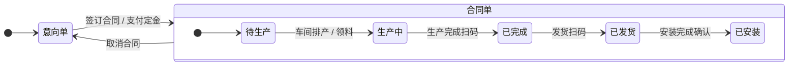

# P1 补充章节：数据模型不一致修正

> 本文档为 PRD_V3.md 的补充章节，覆盖 P1 级缺失项（P1-09, P1-10, P1-13）。P1-11 和 P1-12 已在 P0 补充章节中定义。

---

## S14. 主键类型统一规范

### S14.1 问题

PRD 中存在 API 定义返回整数 ID（如 1001），但数据模型层所有主键均为 `VARCHAR(36)` UUID 的冲突。

### S14.2 统一规范

为保证系统扩展性、安全性和数据唯一性，现统一规范如下：

1.  **全局唯一标识符 (UUID)**：系统中所有实体的主键（`*_id` 字段）**必须**使用 `VARCHAR(36)` 类型，并存储 UUID v4 值。
2.  **API 接口一致性**：所有 API 的请求和响应中，涉及实体 ID 的字段，**必须**使用 UUID 字符串格式。严禁在 API 层面暴露自增整数 ID。
3.  **前端处理**：前端获取到的所有 ID 均为字符串，无需进行类型转换。
4.  **数据库生成**：主键 UUID 建议在应用层（后端代码）生成，而非依赖数据库的 `UUID()` 函数，以便在写入数据库前获得 ID。

### S14.3 需修正的 API 示例

所有 `GET /api/.../{id}` 类型的接口，路径参数 `{id}` 必须为 UUID 字符串。所有返回的 JSON 对象中，`id` 或 `*_id` 字段必须为 UUID 字符串。

**修正前 (错误示例):**
`GET /api/orders/1001`

**修正后 (正确示例):**
`GET /api/orders/d290f1ee-6c54-4b01-90e6-d701748f0851`

---

## S15. 订单双状态字段协同规则

### S15.1 问题

`order` 表中的 `status` (订单状态) 和 `production_status` (生产状态) 两个字段职责不清，状态转换关系不明，容易导致业务逻辑混乱。

### S15.2 字段职责定义

-   **`status` (订单合同状态)**：主要面向**销售和财务**，标记订单的合同性质和收款阶段。是订单的顶层状态。
-   **`production_status` (订单生产状态)**：主要面向**生产和仓管**，标记订单在工厂内部的流转状态。是 `status` 为 '合同单' 后的子状态。

### S15.3 状态机关联图

### S15.4 状态联动规则

| `status` | `production_status` (允许的值) | 联动规则 |
| :--- | :--- | :--- |
| **意向单** | `待生产` (默认值，无实际意义) | - `production_status` 在此阶段被锁定，对用户不可见。 - 订单可自由编辑和删除。 |
| **合同单** | `待生产` `生产中` `已完成` `已发货` `已安装` | - 当 `status` 从"意向单"变为"合同单"时，`production_status` 变为可流转状态，起始值为"待生产"。 - `production_status` 的流转由车间管理、扫码、安装等模块驱动。 - `production_status` 变为"已安装"后，可触发订单最终收款和关闭。 |

### S15.5 数据模型修正

为支持安装流程，`order.production_status` 的 ENUM 类型需扩展：

**修正前:**
`ENUM('待生产','生产中','已完成','已发货')`

**修正后:**
`ENUM('待生产','生产中','已完成','已发货','已安装')`

---

## S16. 通知/消息系统

### S16.1 业务目标

在多角色、多部门协作的流程中，为用户提供关键事件的实时消息提醒，确保信息流转顺畅，提升协作效率。

### S16.2 新增数据表

#### `notification` — 消息通知表

| 字段名 | 数据类型 | 键 | 可空 | 描述 |
| :--- | :--- | :--- | :--- | :--- |
| notification_id | VARCHAR(36) | PK | N | 消息唯一标识 |
| tenant_id | VARCHAR(36) | IDX | N | 所属租户 |
| recipient_id | VARCHAR(36) | FK→user | N | 接收者用户 ID |
| type | ENUM(...) | — | N | 消息类型（见下文） |
| title | VARCHAR(100) | — | N | 消息标题 |
| content | TEXT | — | Y | 消息正文 |
| is_read | BOOLEAN | — | N | `FALSE` | 是否已读 |
| related_entity_type | VARCHAR(50) | — | Y | 关联实体类型（order, task等） |
| related_entity_id | VARCHAR(36) | — | Y | 关联实体 ID |
| created_at | DATETIME | — | N | `NOW()` | 创建时间 |

### S16.3 消息类型 (`type`)

| 类型值 | 标题示例 | 触发场景 |
| :--- | :--- | :--- |
| `ORDER_CONFIRMED` | 订单 {order_number} 已确认 | 订单从"意向单"变为"合同单" |
| `PAYMENT_RECEIVED` | 您收到一笔新的收款 | 财务确认一笔收款 |
| `TASK_ASSIGNED` | 您有一个新的生产/安装任务 | 任务被指派给某个员工 |
| `STATUS_CHANGED` | 订单 {order_number} 状态已更新 | 生产/安装状态发生变化 |
| `REFUND_APPROVED` | 您的退款申请已批准 | 财务批准了退款单 |
| `STOCK_ALERT` | 物料 {material_name} 库存预警 | 物料库存低于预警阈值 |
| `MENTIONED` | {user_name} 在订单 {order_number} 中提到了你 | 在订单备注或日志中 @ 其他用户 |
| `SYSTEM_ANNOUNCEMENT`| 系统公告 | 平台发布新功能或维护通知 |

### S16.4 推送机制

1.  **数据库存储**：所有通知均在 `notification` 表中记录，作为消息中心的数据源。
2.  **实时推送 (WebSocket)**：
    -   用户登录后，前端与后端建立一个持久化的 WebSocket 连接。
    -   当后端触发一个通知事件时，除了写入数据库，还会通过 WebSocket 将消息实时推送给在线的接收者。
    -   前端收到消息后，在界面右上角显示一个带数字角标的铃铛图标，并可弹出 Toast 提示。
3.  **消息中心**：
    -   点击铃铛图标，拉出消息中心面板，分页展示历史通知列表。
    -   点击某条通知，将其标记为已读，并跳转到关联的实体页面（如订单详情页）。
    -   提供"全部标记为已读"功能。
