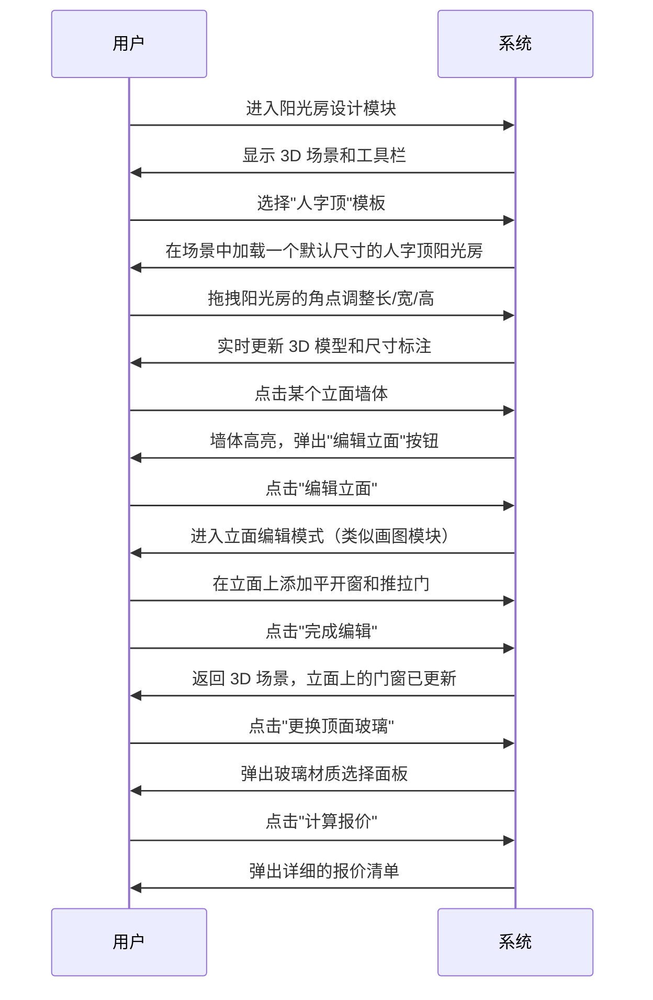

# P1 补充章节：空洞模块详细定义

> 本文档为 PRD_V3.md 的补充章节，覆盖 P1 级缺失项（P1-05 至 P1-08）。

---

## S10. 模块十：炫图（AI 渲染）规格书

### S10.1 业务目标

将用户设计的门窗图纸，通过 AI 技术快速合成到真实的室内外场景中，生成逼真的效果图，帮助门店销售人员向客户展示门窗安装后的实际效果，提升签单转化率。

### S10.2 功能规格

#### S10.2.1 用户流程

```mermaid
graph TD
    A[入口：订单详情页/画图页点击"炫图"] --> B[进入炫图页面];
    B --> C[左侧显示当前门窗设计图];
    C --> D[右侧显示场景模板库];
    D --> E{选择场景模板};
    E --> F[场景图加载到中央画布];
    F --> G[门窗自动放置在场景的窗户位置];
    G --> H[用户可拖拽、缩放、旋转门窗];
    H --> I[右侧面板提供高级调整选项];
    I --> J[点击"开始生成"];
    J --> K[显示生成进度条和预估时间];
    K --> L{生成成功?};
    L -- 是 --> M[展示效果图，提供下载/分享];
    L -- 否 --> N[提示"生成失败，请稍后重试"];
```

#### S10.2.2 场景模板库

- **来源**：系统预置 + 用户上传。
- **系统预置分类**：客厅、卧室、厨房、卫生间、阳台、别墅外立面、办公楼外墙等，每个分类下提供不少于 20 张高质量场景图。
- **用户上传**：用户可上传自己的房型图或实拍照片作为背景。

#### S10.2.3 智能识别与放置

- 当用户选择系统预置模板时，系统应能**自动识别**场景图中的窗户区域（通过预先标注的 Mask）。
- 将用户设计的门窗自动放置到该区域，并根据透视关系进行初步的大小和角度调整。

#### S10.2.4 高级调整选项

| 调整项 | 控件 | 说明 |
|---|---|---|
| 光照方向 | 角度选择器 | 调整光线照射方向，影响门窗投影 |
| 环境光强度 | 滑块 | 调整整体环境光亮度 |
| 投影强度 | 滑块 | 调整门窗在墙面和地面上的投影深浅 |
| 颜色融合 | 滑块 | 调整门窗颜色与环境色的融合度，使其更自然 |

### S10.3 技术方案建议

- **AI 模型**：采用 **ControlNet + Stable Diffusion** 的技术栈。
    - **ControlNet 模型**：使用 `Canny` 或 `MLSD` 模型提取门窗设计的边缘线条作为控制条件。
    - **Stable Diffusion 模型**：使用 `inpainting` 模型，结合场景图、门窗线条、用户输入的正向/负向提示词，重新绘制窗户区域。
- **服务部署**：自建 GPU 服务器或调用第三方云服务（如阿里云/腾讯云的 Stable Diffusion API）。
- **成本控制**：
    - **用量限制**：不同订阅计划（试用/门店版/工厂版）的用户每月可免费生成的图片数量不同（如 10/100/500 张）。超出部分按次收费。
    - **队列系统**：后端使用任务队列（如 Redis + Celery/BullMQ）处理生成请求，避免并发过高导致服务器崩溃。

### S10.4 新增 API

#### POST `/api/ai/render`

- **请求体**：
```json
{
  "designId": "...",
  "sceneImageUrl": "...",
  "windowPosition": { "x", "y", "width", "height", "rotation" },
  "lighting": { "angle", "intensity" },
  "prompt": "现代简约客厅，白天，自然光"
}
```
- **响应**：
```json
{
  "taskId": "..." // 异步任务ID
}
```

#### GET `/api/ai/render/status/{taskId}`

- **响应**：
```json
{
  "status": "processing" / "completed" / "failed",
  "progress": 80, // 进度百分比
  "resultImageUrl": "..." // 生成成功后的图片URL
}
```

---

## S11. 模块十一：阳光房 3D 设计规格书

### S11.1 业务目标

提供一个独立的、可视化的 3D 阳光房设计工具，支持用户自由搭建阳光房结构、配置立面门窗和顶面玻璃，并能自动计算报价。该模块是高价值的独立付费功能。

### S11.2 功能规格

#### S11.2.1 设计模式

- **模板模式**：提供多种预设的阳光房模板（如人字顶、斜顶、弧形顶），用户选择模板后在三维场景中修改尺寸。
- **自由绘制模式**：用户在 2D 平面视图中绘制阳光房的平面轮廓线，系统自动生成 3D 墙体。

#### S11.2.2 核心交互



#### S11.2.3 组件库

- **结构型材**：阳光房专用立柱、横梁、主梁、次梁等。
- **顶面系统**：夹胶玻璃、中空玻璃、德高瓦、遮阳系统（蜂巢帘）。
- **立面系统**：可直接嵌入在画图模块中设计的门窗。
- **配件**：落水系统、装饰线条、通风系统。

### S11.3 技术方案建议

- **3D 引擎**：推荐使用 **Three.js** 或 **Babylon.js**，它们是成熟的 WebGL 框架，社区活跃，文档齐全。
- **数据结构**：为阳光房定义独立的 `sunroom_design_data_json`，其结构比门窗的 `design_data_json` 更复杂，需要包含三维坐标、拓扑关系、相机视角等信息。
- **性能优化**：对于复杂的阳光房模型，使用 LOD（Level of Detail）技术，在远距离时显示简化模型，以保证渲染流畅性。

### S11.4 新增数据表

#### `sunroom_design` — 阳光房设计表

| 字段名 | 数据类型 | 键 | 可空 | 描述 |
|---|---|---|---|---|
| sunroom_design_id | VARCHAR(36) | PK | N | 设计唯一标识 |
| order_id | VARCHAR(36) | FK→order | Y | 关联订单 |
| name | VARCHAR(100) | — | N | 阳光房名称 |
| design_data_json | JSON | — | N | 阳光房 3D 设计数据 |
| thumbnail_url | VARCHAR(255) | — | Y | 缩略图 URL |
| total_amount | DECIMAL(12,2) | — | Y | 总报价 |
| owner_user_id | VARCHAR(36) | FK→user | N | 所属用户 |
| tenant_id | VARCHAR(36) | — | N | 所属租户 |

---

## S12. 模块十二：拍照搭配（AR）规格书

### S12.1 业务目标

利用手机的摄像头，将用户设计的虚拟门窗模型以 1:1 的比例叠加到真实的室内外环境中，让客户在购买前就能直观地看到门窗安装后的实际效果，解决“效果不搭”的顾虑。

### S12.2 功能规格

#### S12.2.1 用户流程（移动端）

1. **入口**：在移动端浏览器中打开一个门窗设计，点击"AR 预览"按钮。
2. **权限请求**：系统请求访问摄像头和运动传感器权限。
3. **环境扫描**：用户需水平移动手机，扫描地面或墙面，以便系统识别平面。
4. **平面识别**：系统在识别到的平面上显示一个网格或光圈，提示用户可以放置物体。
5. **放置门窗**：用户点击屏幕上的识别平面，门窗模型以 1:1 的尺寸出现在该位置。
6. **调整位置**：用户可通过单指拖拽移动门窗，双指捏合缩放（微调），双指旋转调整角度。
7. **拍照分享**：用户调整好位置后，可以点击拍照按钮，将 AR 场景与摄像头画面合成为一张照片，并进行保存或分享。

### S12.3 技术方案建议

- **AR 框架**：
    - **iOS**：使用 **ARKit**。
    - **Android**：使用 **ARCore**。
    - **Web 端**：使用 **WebXR API**。这是首选方案，因为它无需安装 App，可以直接在移动端浏览器（Chrome, Safari）中运行。
- **3D 模型**：需要将 `design_data_json` 实时转换为轻量化的 3D 模型格式（如 **glTF/GLB**），以便在 AR 环境中高效渲染。
- **平面检测**：利用 WebXR 的 `hit-test` 功能来实现平面检测和物体放置。
- **光照估计**：利用 WebXR 的光照估计（Light Estimation）API，获取真实环境的光照强度和颜色，应用到 3D 模型上，使其渲染效果更真实。

### S12.4 挑战与应对

- **尺寸精度**：AR 尺寸的准确性依赖于设备的传感器精度。需在界面上提示用户“尺寸仅供参考”。
- **浏览器兼容性**：WebXR 的支持度在不同手机和浏览器上存在差异。需建立详细的兼容性列表，并在不支持的设备上优雅降级（如提示用户更换浏览器或设备）。

---

## S13. 模块十五：设备对接规格书

### S13.1 业务目标

将软件计算出的型材下料优化方案，直接输出为 CNC（数控）切割机可识别的指令文件，实现从设计到生产的自动化，减少人工输入错误，提升生产效率。

### S13.2 功能规格

#### S13.2.1 对接流程

1. **设备管理**：在系统设置中增加"设备管理"页面，用于添加和配置工厂的 CNC 设备信息。
2. **导出指令**：在"下料优化结果页"，提供"导出 CNC 指令"按钮。
3. **格式选择**：点击按钮后，弹出对话框让用户选择要导出的设备型号。
4. **文件生成**：系统根据所选设备的协议，将切割方案（每根棒料的切割长度、角度、数量）转换为特定格式的指令文件（如 G-code, DXF, 或其他厂商特定格式）。
5. **文件下载**：生成的指令文件直接下载到本地，用户通过 U 盘或其他方式传输给 CNC 设备。

#### S13.2.2 设备配置

在"设备管理"页面，添加一台新设备需要配置以下信息：

| 配置项 | 类型 | 说明 |
|---|---|---|
| 设备名称 | Text | 如“一号切割机” |
| 设备品牌/型号 | Dropdown | 选择支持的品牌型号 |
| 通信协议/文件格式 | Dropdown | 选择该型号对应的文件格式（如 G-code, DXF） |
| IP 地址（可选） | Text | 如果支持网络传输，填写设备 IP 地址 |
| 自定义参数 | JSON Editor | 针对特定设备的一些高级参数配置 |

### S13.3 支持的协议与格式

系统需要支持主流 CNC 切割机厂商的文件格式。初期目标支持以下几种：

- **G-code**：通用的数控加工语言，适用于多种设备。
- **DXF (Drawing Exchange Format)**：AutoCAD 的标准格式，包含几何信息，通用性强。
- **厂商特定格式**：与国内主流门窗设备厂商（如金工、德佳、天辰等）合作，获取其私有文件格式规范并进行适配。

### S13.4 技术实现

- **格式转换器**：为每种支持的文件格式开发一个独立的“转换器”模块。
- **输入**：下料优化结果的 JSON 数据。
- **输出**：对应格式的文本文件或二进制文件。
- **模板引擎**：对于基于文本的格式（如 G-code），可以使用模板引擎（如 EJS, Handlebars）来生成文件内容。
- **几何库**：对于需要生成几何图形的格式（如 DXF），需要使用专门的几何库来创建点、线、圆弧等实体。
