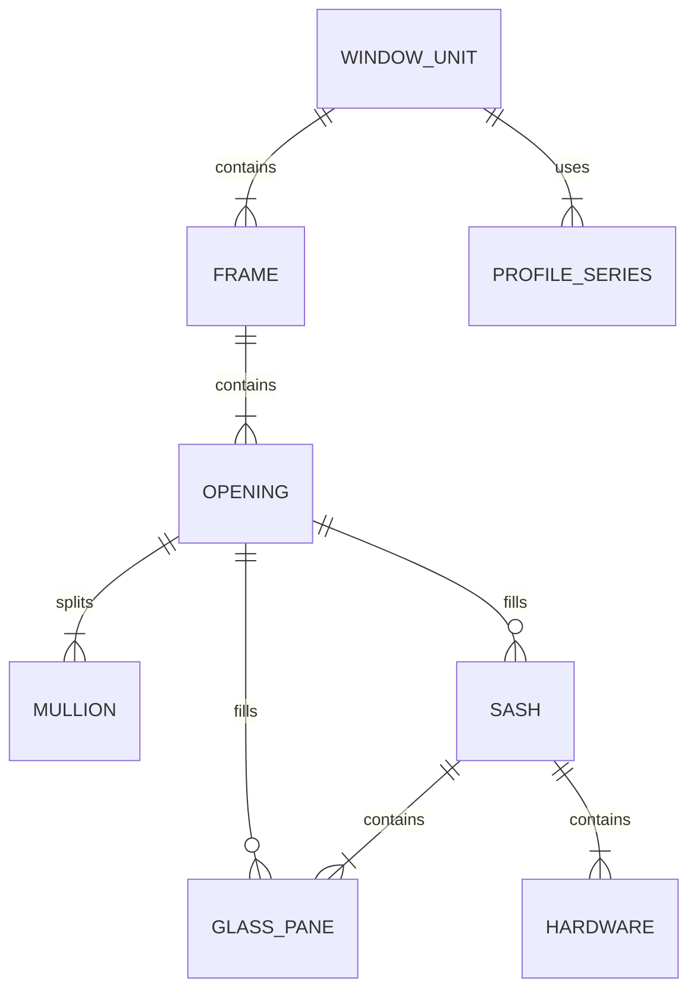

# 画图模块 - 可执行规格书

**版本: 2.0**

**作者: Manus AI**

**日期: 2026年3月1日**

---

## 1. 产品目标与核心原则

本文档旨在为 **WindoorDesigner** 的核心功能——**画图模块**，提供一份详尽、清晰、可直接用于开发的执行规格。它将取代现有文档中宏观、模糊的部分，成为画图模块后续所有开发、重构和测试的唯一依据。

### 1.1. 产品目标

画图模块的最终目标是成为一款**行业领先**的门窗设计工具，它必须满足以下三个核心要求：

1.  **极简易用**: 实现“一横一竖画门窗”的理念，让没有任何CAD基础的门店销售人员也能在5分钟内上手，快速完成方案设计与报价 [1]。
2.  **功能专业**: 覆盖门窗设计中的绝大多数场景，包括各类常规窗、异形窗、转角窗、组合窗的设计，并支持详细的参数配置。
3.  **数据精准**: 输出的2D图纸、3D模型和BOM数据必须100%准确，能够直接用于工厂生产，杜绝因设计软件问题导致的生产错误。

### 1.2. 核心原则

为达成以上目标，画图模块的开发必须遵循以下核心原则：

| 原则 | 描述 |
| :--- | :--- |
| **数据驱动渲染** | 所有的渲染（2D/3D）都必须由统一的、结构化的JSON数据模型驱动。**严禁**在渲染层出现任何独立的、临时的计算逻辑。改变数据模型是改变渲染结果的唯一途径。 |
| **参数化设计** | 所有的计算（如型材长度、玻璃尺寸）都必须基于预设的“型材系列”参数。**严禁**在代码中硬编码任何尺寸或公式。 |
| **交互原子化** | 用户的每一个操作（如拖拽、点击）都应被分解为最基础的原子操作，并对应到对数据模型的增、删、改操作上。 |
| **实时校验** | 在用户交互的每一步，系统都应进行实时的数据校验（如尺寸限制、组件冲突），并提供即时的、明确的视觉反馈。 |
| **性能优先** | 即使处理复杂窗型，画布操作也必须保持流畅。所有耗时操作（如复杂计算、网络请求）都必须异步执行，不得阻塞UI线程。 |

---

## 2. 数据模型 (Data Model) - v2.0

为满足专业级功能需求，现有的数据模型 (`types.ts`) 需要进行重构和扩展。新的数据模型将更精细地描述门窗的每一个物理属性，并为后续的算料、报价和生产管理打下坚实基础。

### 2.1. 核心对象关系图



### 2.2. 对象详细定义 (TypeScript)

#### **顶层对象: `WindowUnit`**

```typescript
export interface WindowUnit {
  id: string; // 唯一标识
  name: string; // 窗口名称，如 "客厅大窗"
  width: number; // 外框总宽度 (mm)
  height: number; // 外框总高度 (mm)
  profileSeriesId: string; // 使用的型材系列ID
  frame: Frame; // 包含的框架对象

  // 画布位置与状态
  posX: number;
  posY: number;
  selected: boolean;
}
```

#### **框架: `Frame`**

```typescript
export interface Frame {
  id: string;
  shape: 'rectangle' | 'arc_top' | 'triangle' | 'polygon'; // 形状
  points: Point[]; // 定义轮廓的点集
  profileWidth: number; // 框型材宽度 (从系列中继承，但可覆盖)
  openings: Opening[]; // 内部的顶层分格
}
```

#### **分格/洞口: `Opening`**

这是模型的核心，代表一个可以被填充或再次分割的区域。

```typescript
export interface Opening {
  id: string;
  rect: Rect; // 相对于父级Frame或Opening的位置和尺寸
  mullions: Mullion[]; // 分割此Opening的中梃/横档
  childOpenings: Opening[]; // 被中梃分割后产生的子Opening
  
  // 填充物 (sash和glassPane是互斥的，一个Opening要么填充扇，要么直接填充玻璃)
  sash: Sash | null;
  glassPane: GlassPane | null;
}
```

#### **中梃/横档: `Mullion`**

```typescript
export interface Mullion {
  id: string;
  type: 'vertical' | 'horizontal'; // 类型
  position: number; // 相对于父Opening的位置 (x或y)
  profileWidth: number; // 中梃型材宽度
  isArc: boolean; // 是否为弧形
  arcHeight?: number; // 弧高
}
```

#### **扇: `Sash` (重大重构)**

扇本身是一个小窗，包含自己的框架和玻璃。

```typescript
export type SashOpeningType = 
  | 'fixed' 
  | 'casement_inward_left' | 'casement_inward_right' 
  | 'casement_outward_left' | 'casement_outward_right'
  | 'tilt_inward' // 内倒
  | 'tilt_and_turn_inward_left' | 'tilt_and_turn_inward_right' // 内开内倒
  | 'awning_outward' // 外开上悬
  | 'hopper_inward' // 内开下悬
  | 'sliding_left' | 'sliding_right' // 推拉
  | 'folding_left' | 'folding_right'; // 折叠

export interface Sash {
  id: string;
  openingType: SashOpeningType; // 开启方式
  rect: Rect; // 在父Opening中的位置和尺寸
  profileWidth: number; // 扇型材宽度
  glassPane: GlassPane; // 扇内填充的玻璃
  hardware: Hardware[]; // 关联的五金件
  hasFlyScreen: boolean; // 是否带纱窗
}
```

#### **玻璃: `GlassPane`**

```typescript
export interface GlassPane {
  id: string;
  type: 'single' | 'double_glazed' | 'triple_glazed' | 'laminated'; // 类型
  thickness: number; // 总厚度，如 5+12A+5 = 22mm
  fillGas: 'air' | 'argon'; // 填充气体
}
```

#### **五金: `Hardware`**

```typescript
export interface Hardware {
  id: string;
  type: 'handle' | 'hinge' | 'lock_point' | 'friction_stay'; // 类型
  model: string; // 型号，如 "Hopo-053"
  position: Point; // 在扇上的安装位置
}
```

#### **型材系列: `ProfileSeries` (重大扩展)**

这是参数化设计的核心，定义了一套门窗系统的所有计算规则和默认值。

```typescript
export interface ProfileSection { // 型材截面
  svgPath: string; // 描述截面形状的SVG路径
  width: number;
  height: number;
}

export interface ProfileSeries {
  id: string;
  name: string; // 如 "断桥70系列"
  
  // 默认型材宽度
  frameProfileWidth: number;
  sashProfileWidth: number;
  mullionProfileWidth: number;

  // 截面定义 (可选)
  frameProfileSection?: ProfileSection;
  sashProfileSection?: ProfileSection;
  mullionProfileSection?: ProfileSection;

  // 计算公式/规则
  formulas: {
    // 型材切割长度计算公式 (示例)
    frame_vertical: 'H - 2 * overlap';
    sash_horizontal: 'W - 2 * sashProfileWidth - gap';
    // 玻璃尺寸计算公式
    glass_width: 'sash.rect.width - 2 * sashProfileWidth - glass_gap';
  };

  // 默认颜色
  defaultColor: string; // 如 '#333333'
}
```

---

## 3. 核心交互逻辑 (Interaction Logic)

用户的每一个操作都必须被精确定义，并映射到对数据模型的原子化修改。以下是画图模块必须支持的核心交互逻辑。

### 3.1. 视图操作

| 交互 | 鼠标 | 触摸 | 快捷键 | 状态变更 |
| :--- | :--- | :--- | :--- | :--- |
| **缩放** | `Ctrl` + 滚轮 | 双指捏合 | `Ctrl` + `+` / `-` | `EditorState.zoom` |
| **平移** | 按住中键/空格拖拽 | 双指拖拽 | `H` (切换到手型工具) | `EditorState.panX`, `EditorState.panY` |
| **框选缩放** | `Z` + 拖拽 | - | `Z` | - |
| **恢复默认视图** | 双击中键 | - | `Ctrl` + `0` | `zoom=1`, `panX=0`, `panY=0` |

### 3.2. 绘制与编辑

#### **3.2.1. 创建新窗 (P0)**

1.  **用户操作**: 激活“绘制外框”工具，在画布上按下鼠标左键并拖拽。
2.  **系统反馈**:
    *   实时显示一个虚线矩形框，并动态显示宽高尺寸标注。
    *   如果开启网格吸附，矩形的右下角会吸附到网格点。
3.  **数据模型变更**: 鼠标释放时，创建一个新的 `WindowUnit` 对象，并添加到 `EditorState.windows` 数组中。`WindowUnit.width` 和 `WindowUnit.height` 由拖拽的矩形决定。同时，自动创建一个顶级的 `Frame` 和一个充满 `Frame` 的 `Opening`。

#### **3.2.2. 添加中梃/横档 (P0)**

1.  **用户操作**: 激活“添加中梃”或“添加横档”工具，鼠标悬停在一个 `Opening` 区域内。
2.  **系统反馈**:
    *   光标变为对应的工具图标。
    *   在 `Opening` 内部显示一条随鼠标移动的虚线，作为中梃/横档的预览。
    *   实时显示该虚线到 `Opening` 两边的距离标注。
3.  **数据模型变更**: 点击鼠标左键时，在目标 `Opening` 的 `mullions` 数组中添加一个 `Mullion` 对象，并记录其 `position`。同时，根据 `Mullion` 的位置和宽度，将原 `Opening` 的 `childOpenings` 数组更新为两个新的 `Opening` 对象，并精确计算它们的 `rect`。

#### **3.2.3. 添加扇 (P0)**

1.  **用户操作**: 从左侧组件面板选择一种扇类型（如“内开内倒”），然后点击画布上一个未被分割的 `Opening`。
2.  **系统反馈**:
    *   鼠标悬停在可填充的 `Opening` 上时，该 `Opening` 区域高亮显示。
    *   点击后，在 `Opening` 内部渲染出对应扇类型的2D图例（如平开扇的开启方向线）。
3.  **数据模型变更**: 在目标 `Opening` 的 `sash` 属性中创建一个 `Sash` 对象，其 `openingType` 由用户选择决定，`rect` 继承自 `Opening`。

#### **3.2.4. 拖拽修改尺寸 (P1)**

1.  **用户操作**: 用“选择”工具点击窗户外框的边或角点，然后拖拽。
2.  **系统反馈**: 整个窗户的虚线外框随鼠标拖拽而变化，内部所有元素按比例缩放。
3.  **数据模型变更**: 这是一个“牵一发而动全身”的操作。释放鼠标时，更新 `WindowUnit` 的 `width` 和 `height`。然后，**必须递归地、按比例地**更新所有子孙 `Opening`、`Mullion`、`Sash` 的 `rect` 和 `position`。

#### **3.2.5. 拖拽移动中梃 (P1)**

1.  **用户操作**: 用“选择”工具点击一个中梃/横档，然后拖拽。
2.  **系统反馈**: 中梃/横档随鼠标移动，两侧的子 `Opening` 实时调整大小。
3.  **数据模型变更**: 释放鼠标时，更新该 `Mullion` 的 `position` 属性。然后，重新计算受其影响的两个相邻 `childOpenings` 的 `rect`。

### 3.3. 选择与删除

| 交互 | 操作 | 系统反馈 | 数据模型变更 |
| :--- | :--- | :--- | :--- |
| **选择** | 用“选择”工具单击任一元素（外框、中梃、扇）。 | 元素高亮，右侧属性面板显示其参数。 | `EditorState.selectedElementId` |
| **多选** | 按住 `Shift` 键单击多个元素。 | - | - |
| **删除** | 选中元素后按 `Delete` 键。 | 元素从画布消失。 | 从对应数组中移除该对象。 |
| **框选** | 用“选择”工具在画布上拖拽出一个矩形。 | 矩形内的所有元素被选中。 | - |

### 3.4. 属性编辑

用户在右侧属性面板修改任何参数（如 `WindowUnit.width`），都必须触发对数据模型的即时更新，并重新渲染画布。属性面板的输入框应支持输入数学表达式（如 `2400/2+50`）并自动计算结果。

### 3.5. 边界条件与约束规则

以下规则在用户进行任何交互操作时必须被实时检查和执行，违反规则时应阻止操作并给出视觉反馈（如红色高亮、toast提示）。

| 约束 | 规则描述 | 触发场景 |
| :--- | :--- | :--- |
| **最小分格尺寸** | 任何 `Opening` 的宽度和高度都不得小于 **100mm**。 | 添加中梃、拖拽中梃、修改整体尺寸时。 |
| **中梃最小间距** | 两根平行中梃之间的净距不得小于 **100mm**。 | 添加中梃、拖拽中梃时。 |
| **中梃边距** | 中梃到父 `Opening` 边缘的净距不得小于 **100mm**。 | 添加中梃、拖拽中梃时。 |
| **窗户最小尺寸** | `WindowUnit` 的宽度不得小于 **200mm**，高度不得小于 **200mm**。 | 绘制外框、修改整体尺寸时。 |
| **窗户最大尺寸** | `WindowUnit` 的宽度不得超过 **6000mm**，高度不得超过 **4000mm**。 | 绘制外框、修改整体尺寸时。 |
| **扇填充互斥** | 一个 `Opening` 不能同时拥有 `sash` 和 `childOpenings`。已被分割的 `Opening` 不能添加扇，已有扇的 `Opening` 不能添加中梃。 | 添加扇、添加中梃时。 |
| **推拉窗轨道约束** | 推拉扇只能存在于同一层级的相邻 `Opening` 中，且推拉方向必须一致或互补（左推+右推）。 | 添加推拉扇时。 |

### 3.6. 2D渲染图例规范

每种扇类型在2D视图中都有其标准的工程图例表示法。以下是每种扇类型的精确渲染规则。

#### 平开扇（内开/外开）

平开扇使用**实线三角形**表示开启方向。三角形的底边位于铰链侧（合页安装侧），顶点指向开启侧的中心。

对于 `casement_inward_left`（左侧铰链，内开）：从左上角画线到右边中点，再从右边中点画线到左下角。铰链侧（左边）绘制两个小圆点，分别位于高度的25%和75%处。

对于 `casement_outward_left`（左侧铰链，外开）：图例与内开相同，但三角形线条改为**虚线**，以区分内开和外开。

#### 内开内倒扇

内开内倒扇需要同时绘制两组图例：一组表示平开方向（实线三角形），一组表示内倒方向（从底边两角到顶边中点的虚线三角形）。两组图例叠加显示。

#### 推拉扇

推拉扇使用**虚线箭头**表示推拉方向。箭头位于扇的水平中心线上，长度为扇宽度的40%。箭头方向指向推拉方向。颜色使用蓝色（`#3182ce`）以区别于平开扇的红色。

#### 上悬/下悬扇

上悬扇的三角形底边在顶部（铰链在上），顶点指向底边中点。下悬扇的三角形底边在底部（铰链在下），顶点指向顶边中点。

#### 固定扇

固定扇不绘制开启方向线，仅显示玻璃的对角交叉线（X形），表示不可开启。

---

## 4. 功能清单与优先级 (Feature Checklist)

基于对竞品、行业标准和现有代码的全面分析，以下是画图模块需要实现的功能清单，按优先级分为P0、P1、P2三级。

### P0: 核心基础功能 (MVP)

这些是构成一个可用画图工具的最基本功能，必须最优先实现。

| ID | 功能点 | 用户故事 (As a user, I want to...) | 验收标准 (Acceptance Criteria) |
| :--- | :--- | :--- | :--- |
| **DF-01** | **绘制矩形外框** | ...通过拖拽快速创建一个任意尺寸的矩形窗户。 | 可以在画布上拖拽绘制矩形，生成一个包含默认单分格的窗户。 |
| **DF-02** | **添加垂直/水平中梃** | ...通过点击在窗户内添加垂直或水平的中梃来分割区域。 | 可以将一个分格(Opening)精确地分割成两个子分格。 |
| **DF-03** | **添加扇** | ...在任何一个分格内填充一个指定开启方式的扇。 | 可以为任何未被分割的Opening指定扇类型，并在2D/3D中正确显示。 |
| **DF-04** | **修改整体尺寸** | ...在属性面板修改窗户的整体宽度和高度。 | 修改宽高后，内部所有中梃、扇等元素按比例自动缩放。 |
| **DF-05** | **拖拽移动中梃** | ...直接在画布上拖拽中梃来改变分格的大小。 | 拖拽中梃时，相邻的两个子分格尺寸实时变化。 |
| **DF-06** | **删除组件** | ...删除不再需要的中梃或扇。 | 选中中梃或扇后按Delete键可将其移除。删除中梃时，其分割的两个子分格会合并。 |
| **DF-07** | **支持核心扇类型** | ...设计最常用的窗型，包括固定、内外平开、内开内倒、推拉。 | 数据模型和UI必须支持 `fixed`, `casement_inward`, `casement_outward`, `tilt_and_turn`, `sliding`。 |
| **DF-08** | **撤销/重做** | ...撤销或重做我的每一步操作。 | 所有对数据模型的修改操作都可以被撤销和重做。 |
| **DF-09** | **2D/3D视图切换** | ...在2D绘图和3D预览之间无缝切换。 | 2D图的任何修改都能实时反映在3D模型上。 |

### P1: 重要功能

这些功能对于提升软件的实用性和专业度至关重要。

| ID | 功能点 | 用户故事 | 验收标准 |
| :--- | :--- | :--- | :--- |
| **DF-10** | **支持更多扇类型** | ...设计上悬窗、下悬窗、折叠窗等。 | 数据模型和UI支持 `awning`, `hopper`, `folding` 等开启方式。 |
| **DF-11** | **绘制圆弧窗** | ...绘制顶部为圆弧的窗户。 | Frame.shape支持'arc_top'，可以在2D/3D中正确渲染。 |
| **DF-12** | **型材系列选择** | ...为窗户选择不同的型材系列（如60/70/85）。 | 切换型材系列后，所有框、扇、中梃的宽度和3D模型厚度都会自动更新。 |
| **DF-13** | **五金件配置** | ...为扇选择不同的执手和铰链样式。 | 可以在属性面板为Sash添加Hardware，并在3D视图中显示。 |
| **DF-14** | **玻璃配置** | ...为玻璃选择类型（中空/夹胶）和厚度。 | 可以在属性面板配置GlassPane，并在算料和3D模型中体现。 |
| **DF-15** | **尺寸/重量校验** | ...在我设计出不合理的窗户时得到警告。 | 当扇尺寸或重量超出规范时（见附录），在UI上给出明确提示。 |
| **DF-16** | **方案导入/导出** | ...将我的设计保存为文件，或打开之前的文件。 | 支持将WindowUnit对象导出为JSON文件，并能从JSON文件导入。 |

### P2: 进阶功能

这些功能可以作为产品的差异化竞争优势。

| ID | 功能点 | 用户故事 | 验收标准 |
| :--- | :--- | :--- | :--- |
| **DF-17** | **绘制转角窗** | ...设计L型或U型的转角窗。 | 支持创建多个Frame并定义它们之间的转角关系。 |
| **DF-18** | **绘制多边形异形窗** | ...绘制任意形状的多边形窗户。 | Frame.shape支持'polygon'，用户可以自定义Frame的points。 |
| **DF-19** | **CAD图纸导出** | ...将我的设计导出为DXF或DWG文件。 | 可以生成与2D视图一致的CAD文件。 |
| **DF-20** | **PDF报表导出** | ...生成包含大样图、3D图和物料清单的PDF报表。 | 一键生成专业、美观的PDF文档。 |

---

## 5. 附录

### 附录A: 尺寸与重量校验规则

为保证设计的合理性和安全性，软件必须内置以下校验规则，并在用户违反规则时给出实时警告。

| 校验项 | 规则 | 依据 |
| :--- | :--- | :--- |
| **最小开启扇宽度** | 不应小于 500mm | GB/T 7106-2008 [2] |
| **推荐开启扇宽度** | 500mm - 700mm | 行业实践 [3] |
| **推荐开启扇高度** | 900mm - 1400mm | 行业实践 [3] |
| **外开上悬窗重量** | 开启扇重量不应超过 50kg | 行业规范 [4] |
| **通风面积 (住宅)** | 通风开口有效面积 ≥ 房间地面面积的 1/20 | GB50352-2019 [3] |
| **通风面积 (厨房)** | 通风开口有效面积 ≥ 房间地面面积的 1/10，且不小于0.6㎡ | GB50352-2019 [3] |

*注：扇重量需要根据型材、玻璃的密度和体积进行估算。*

### 附录B: 2D渲染风格指南

所有2D渲染都必须遵循统一的“工业蓝图”美学风格，以确保专业性和一致性。

| 元素 | 颜色 | 线宽 | 样式 |
| :--- | :--- | :--- | :--- |
| **外框/中梃** | `#4a5568` | 1.5px | 实线，内部填充45度斜线图案 |
| **玻璃** | `rgba(173, 216, 230, 0.22)` | 0.5px | 半透明填充，带对角交叉线 |
| **平开扇开启线** | `#e53e3e` | 1.8px | 实线三角 |
| **推拉扇开启线** | `#3182ce` | 1.8px | 虚线箭头 |
| **尺寸标注** | `#f59e0b` | 0.8px | 橙色，JetBrains Mono字体 |
| **选中高亮** | `#f59e0b` | 2.5px | 橙色，带辉光效果 |

### 附录C: 当前代码 vs 规格书差距分析

以下是当前代码实现与本规格书要求之间的关键差距，按重要性排序。这些差距是后续开发工作的优先事项。

| 差距项 | 当前状态 | 规格书要求 | 影响范围 |
| :--- | :--- | :--- | :--- |
| **修改宽高后内部结构不联动** | 修改 `width`/`height` 后，内部 Opening/Mullion/Sash 的 rect 不会重新计算。 | DF-04 要求必须递归按比例更新。 | 核心功能缺失 |
| **无法交互式绘制外框** | 只能通过预设模板创建窗户。 | DF-01 要求拖拽绘制矩形。 | 核心功能缺失 |
| **无法交互式添加中梃** | 工具类型已定义但无交互逻辑。 | DF-02 要求点击添加中梃。 | 核心功能缺失 |
| **无法交互式添加扇** | 工具类型已定义但无交互逻辑。 | DF-03 要求点击添加扇。 | 核心功能缺失 |
| **中梃不可拖拽** | 函数已实现但未绑定事件。 | DF-05 要求拖拽移动中梃。 | 核心功能缺失 |
| **缺少删除功能** | 无法删除单个中梃或扇。 | DF-06 要求支持删除。 | 核心功能缺失 |
| **扇类型不完整** | 只有 6 种基础类型，缺少内开内倒、外开等。 | DF-07 要求支持 12+ 种扇类型。 | 核心功能缺失 |
| **无边界校验** | 无任何尺寸限制和冲突检测。 | 3.5节要求实时校验。 | 可用性问题 |
| **mullionWidth 硬编码** | CanvasRenderer 中硬编码为 70。 | 必须从 ProfileSeries 获取。 | 数据精确性 |
| **3D模型深度硬编码** | frameDepth=70, sashDepth=50 硬编码。 | 必须从型材系列数据获取。 | 数据精确性 |
| **状态管理用 useState** | 复杂编辑器用 useState 管理。 | 建议迁移到 zustand。 | 性能和可维护性 |

---

## 6. 参考资料

[1] WindoorCraft. (n.d.). *WindoorCraft Official Website*. Retrieved from https://windowcc.com/

[2] 中华人民共和国国家标准. (2008). *GB/T 7106-2008 建筑外门窗气密、水密、抗风压性能分级及检测方法*.

[3] 轩尼斯门窗. (2024, December 27). *门窗知识 | 开启扇尺寸有讲究，读懂这些选窗更无忧*. 知乎专栏. Retrieved from https://zhuanlan.zhihu.com/p/12903610833

[4] 同济大学出版社. (n.d.). *民用建筑外窗应用技术规程*. Retrieved from https://zjw.sh.gov.cn/cmsres/6d/6d198277bb364e98957a475220a6a503/adc14207c18fc2f09e9e4e9d035fc6db.pdf

[5] 门窗CC. (n.d.). *门窗设计软件-门窗软件-门窗设计就用门窗cc*. Retrieved from http://official.menccc.com/index.html

[6] WindoorDesigner Project. (2026). *PRD_产品功能需求文档.md*.

[7] WindoorDesigner Project. (2026). *画图模块业务逻辑.md*.

[8] WindoorDesigner Project. (2026). *CHANGELOG.md*.
